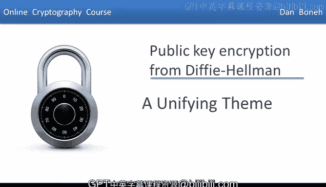
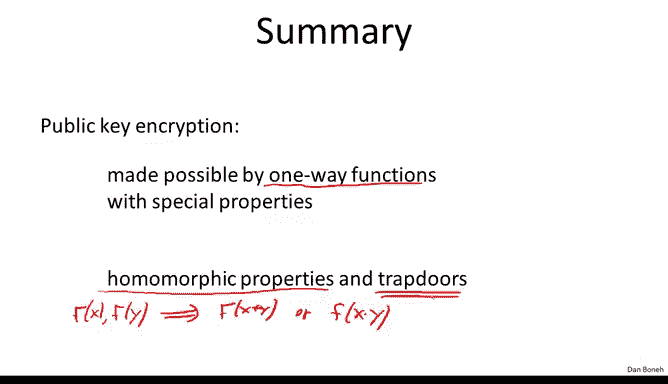

# 斯坦福大学《密码学｜Cryptography 1》中英字幕 - P65：65_06_01_统一主题.zh_en - GPT中英字幕课程资源 - BV1Rf421o79E

This week we saw two families of public key encryption systems。

 One family was built from trapor functions in particular RSA。

 and the other family was built from the DP Heman protocol。 In this last segment。

 I want to show you that both families in fact， follow from a more general principle。

The unifying theme is what's called a one- way function。 So what is a one- way function。

 Well we've already seen this concept briefly before。

 but basically a function from one set to another， say from x to y is said to be one way if in fact there's an efficient algorithm that allows us to evaluate the function F so anyone can evaluate the function F at any point of their choice however inverting the function F should be difficult That's what makes the function one way So what do I mean by that Well you can think of the function F as a function again mapping the set X to the set Y but it so happens in many points in X could actually be mapped into a single point in Y。

Now when I say that the function is difficult to invert。

 what I mean is that when I give you some point inside of y and I ask you。

 find me a preimage of this point， you won't be able to point to any of these as a pre image。

 in other words， no efficient algorithm can find any point that is the inverse of the given point Y。

Now， the way we say that more precisely is that we say that for all efficient algorithm A。

 if I choose a random x in the sets capital x， and now I'm going to give F of x to algorithm a。

And then what I'm going to ask algorithm A to do is basically produce a pre image of the point F of x。

 Well， what does it mean that a produced a pre image of the point F of x。

 It means that if I apply the function F to the output of a。What I should get back is， well， F of x。

Let's think through this one more time， so I choose a random point x in capital x。

 And now I give algorithm A F of x。 I'm going to give algorithm A this point here。

And now a is going to produce some point。 So let's pretend that a produces this point over here。

 And now I want to say that if I apply the function F to this point here that a produced the probability that I get the same point that I started with is negligible。

 In other words， the probability that algorithm A was able to produce one of these three points。Is。

 in fact， negligible。 All it could do is produce some other point that maps into something other than F of x。

 Okay， so again， all this is trying to do is just capture the fact that given F of x。

 it's hard to find some pre image of F of x。So here are some easy examples of functions that are not one way。

 for example the identity function f of x is equal to x is trivially not one way。

 because given f of x， I can easily come up with an inverse of F of x namely x。😊，Similarly。

 the functioner maps everything to0 is also not one way， so in a picture。

 let's say the functioner maps everything to zero simply looks as follows。

 it takes all its points and maps them all to a single point。

Well， this function is not one way because if I give you this point in the image。

 it's trivial to find a pre image， namely just pick any point in capital x。

 and there will be a pre image of zero， and so F of x equals to0 is also not a one way function。

And by the way， I didn't want to do it here， but if I define one way functions more formally。

 then it turns out that proving that one way functions exist will have also proven that p is not equal to NP。

 so since we can't today prove that p is equal to NP。

 basically we can't prove that one way functions exist and we just have to assume that they do。

So let's look at our first example of a one way function， or at least or presume one way function。

 And so we're going to build it from a pseudorandom generator。

 So suppose I have a function F from x to Y， that is a secure pseudorandom generator。

 So the output of F is much larger than the input。 Remember。

 a pseudorandom generator takes a small seed and expands it into a much larger output。😊。

And for example， you can imagine， you know this pseudo randomum generator maybe is built using the deterministic counter mode out of AS。

Well， it's fairly easy to see that if in fact， F is a secure pseudoranum generator， then F is。

 in fact， a oneway function。 So our first example of a one way function is directly built from a pseudoranum generator。

 This is actually kind of a trivial proof。 So let's prove the contra positivesitive。

 So suppose I have an efficient algorithm that inverts F。 so I'm proving a contrapositive。

 S F is not one way Then a is an efficient algorithm that inverts F。

 And now I need to build an algorithm B that breaks the pseudoranum generator。 Okay。

 so I'm proving again， contrapositive。😊，Okay so how do I break the pseudoran generator Well。

 all we do is the following。 So algorithm B is given some y in the set Y。

 and what is's going to do is the following。 It's going to try and run algorithm A on the input Y and now well。

 if y is the output of the pseudoran generator then algorithm A will output the seed enabling element in x with non-mgligable probability So what we'll do is we'll apply the pseudoran generator again to the output of algorithm A As I said if y was the output of the generator then a of a will have output the C because it inverted the pseudoran generator So if we apply the pseudoran generator again to the output of a what we should get back is basically the y that we started with so if this condition holds。

 we're going say we're going to output 0。And if condition doesn't hold， we're going to output one。

Otherwise。That's it。 That's a distinguisher against the pseudo random generator。

 So if our distinguisher is given a y that is the output of the pseudoran generator。

 then with non negligible probability， our distinguisher B will output 0。 However。

 if our distinguisher B is given a truly random string。 Well。

 a truly random string doesn't have any seed that causes the generator to output that string。

And therefore our distinguisher will output one with again with also very high probability and again。

 I hope that's clear basically if we look at the set of all possible outputs， namely' the set Y。

 very few of those outputs happen to be the output of the pseudoran generator。

 So if we're just given an output Y over here， say that's not the output of the pseudoran generator。

 then when we run algorithm A on it， it can't possibly produce a seed that will output this point star because there is no set seed。

😊。

And as a result， since most points actually are not in the image of the pseudo random generator。

 most points will not have a seed that maps the generator to them。 and as a result。

 when we're given a random point in y， a truly uniform point in Y。

 our distinguisher B will output1 with very high probability。 However。

 if we are given a pseudoran output of the generator。

 then algorithm A will output the corresponding seed when we apply the generator to that seed will get the initial output Y。

 and therefore will output 0 with non negligible probability so if a was able to invert F。

 then B is able to break the generator and since the generator secure。

 algorithm A can't invert f and in particular， no efficient algorithm can invert F and therefore f is a one- way function。

Excellent so this is a long discussion of kind of a minor point。

 but all I wanted to show you is that in fact a pseudo random generator directly gives us a one way function。

 Unfortunately this one-way function has no special properties and what that means is it's actually difficult to use it for key exchange or for public encryption in some sense。

 the best key exchange we can do with this as far as we know is Merel puzzles。

So now let's look at our second example。 The second example is what I'm going to call the discrete log one way function。

 So let's fix a group acycl group of order n， the group G。

 and let G be some generator of the group capital G。 So again。

 I remind you that all that means is that if I look at all powers of G then I basically span the entire group capital G and now let's define the following function that the function goes from z n to G and is defined basically as the exponiiation to the power of x。

 so this maps any element between 0 and n minus1 to an element of the group capital G simply by raising g little g to the appropriate power。

 And it's kind of obvious that if the discrete log problem and the group capital G is hard。

 then in fact， f is one way。 In fact， the one wayness of f is the discrete log assumption So if discrete log is hard F is one way。

 Now the interesting thing about this one way function is it's got some interesting properties。

 in particular， if I give you f of x and f of y， I claim that it's very easy to compute F of x plus y even though。

Have no idea what X or Y R。 All we given is just F of x and F of Y。 Nevertheless。

 we can compute F of x plus Y。 Let me ask you， how would you do that。Well。

 just by rules of exponunciation， basically f of x plus y is simply f of x times f of y。 and again。

 this is all done inside the group G。😊，If you're not convinced。

 simply recall that f of x plus y is g to the x plus y， which is simply g to the x times g to the y。

 which is exactly what we have here。And this simple property。

 this simple fact that the function has this additive property。

 if you think about it is exactly what enables key exchange and public key encryption。

So this additional property of the one way function is what enabled all of public e cryptography。

So let's look at our next example， The next example is the RSA one- way function so here we're going to choose two prime p and  Q we're going to sit n to be p times  Q。

 then we're going to choose some E that's relatively prime to p of n and then we define the function simply it's a function from z and star to z and star simply as f of x equals x to the E so raising x to the power of E and again we say that this function is one way simply under the RSA assumption again the RSA assumption is the assumption that this function as one way Now the interesting thing about this function is that it has properties similar to the one that we saw in the previous slide namely that given f of x and f of y now we can compute f of x times y as opposed to f of x plus y so we say that this function has a multiplicative property as opposed to the additive property on the previous slide but more importantly this is kind of not the most interesting thing about this function the really exciting thing about this function is and in fact has a trapor and other words there's a secret key that all of a sudden allows us to invert this function even though without this。

The function is one way as far as we know。And this property。

 I'll say the fact that it has a trap door again enabled all of public e cryptography。

 I'll say that this trap door also makes the RSA function especially well suited for digital signatures and week 7 we're going to see that both the RSA function and the discrete log functions let us construct digital signatures but the RSA function because it has a trapor makes it very。

 very easy to construct digital signatures from it and so in fact most digital signatures out there in the world。

 in fact rely on the RSA function just because it's so simple to build digital signatures from it so again we see that this one-way function with the special properties it has a multiplicative property and a trapor essentially again enables all of public e cryptto so to summarize the reason we're able to build public e cryptography namely the reason we're able to do key exchange and public key encryption and so on is because we are able to construct one-way functions that have very very special properties in particular they have these properties sometimes called homomorphic properties namely the given f of x and f of Y we can construct。

F of x plus y or F of x times y， and some functions like RSA even have trap doors。

 which let us build digital signatures very， very easily。

But the main thing I wanted to show you is that the magic of public key crypto is basically made possible because of these one way functions with their special properties。

So that's the end of this module and then in week  seven we'll start with digital signatures。

