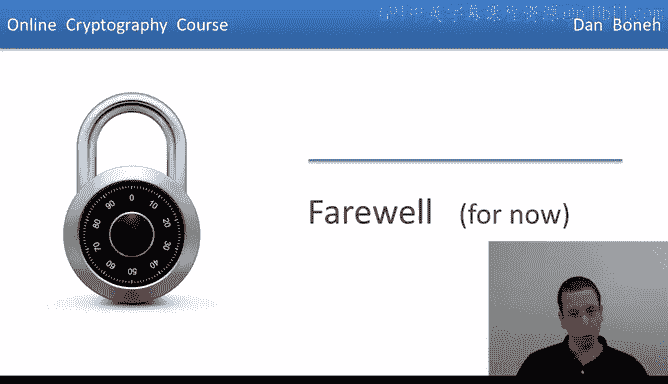
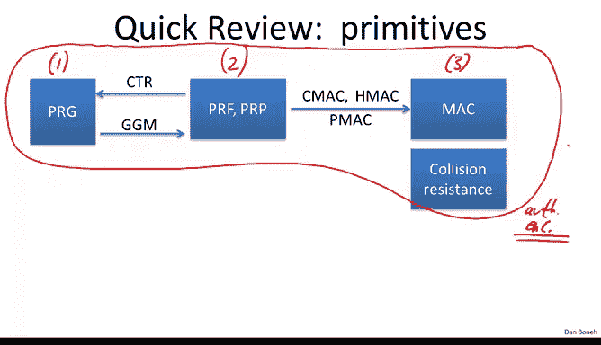
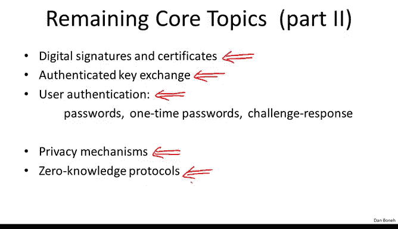
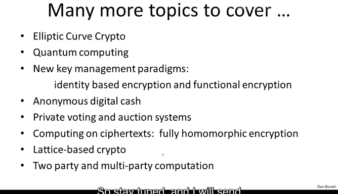

# 斯坦福大学《密码学｜Cryptography 1》中英字幕 - P66：66_06_02_暂别寄语.zh_en - GPT中英字幕课程资源 - BV1Rf421o79E

This brings us to the end of the six weeks course。 I had a lot of fun teaching this course。

 and I hope you enjoyed it too。 I really love this material。

 and I always enjoy teaching it Before we say our farewells。

 let's do a quick review of the topics that we discussed and see what's left to cover。😊。

So here's a brief diagram of the primitives that we discussed in the class if you remember in week one we started off by discussing a pseudo randomum generators and stream ciphers in week two we talked about block ciphers and we said that the right way to think about block ciphers is as pseudoran permutations and pseudo random functions。

We said that using counterm， we can convert a block cipher into our PRG。

 and we said that using the GGM construction， we can construct block ciphers from pseudoar random generators。

Then in week three we talked about data integrity in particular。

 we talked about Macs and we looked at various constructions of Macs from pseudoudarraana functions like the CMMAC。

 the HMac， the PMac Cons and so on， we also discuss collision resistance and we said that collision resistance can be used for data integrity where one has access to read only memory。

 basically you would hash the data using a collision resistance hash function write the hash into read only memory。

 and then later when you want to verify authenticity of your data。

 you just compare its hash to whatever is written and read only memory。

Then in week four we talked about how to combine integrity and confidentiality in particular we kind of talked about how to combine encryption and maxs to build what we call authenticated encryption and I told you that really in practice the only form of symmetric encryption that you are allowed to use is authenticated encryption basically encryption that's only secure against eavdropping attacks is not generally secure you must always also guard against tampering and as a result you should only be using authenticated encryption modes to do symmetric encryption。

So that was the end of week four， and then for weeks five and six we switched topics and talked about key exchange in public encryption。

 in particular in week five we talked about trapor functions and the Dy Heman protocol。

 we did the mathematics that are necessary to explain how those things work and then in week six we talked about how public key encryption can be built from trapor functions and the Dy Heman protocol。

I want to emphasize that the key exchange protocols that we saw in week five are only secure against eavesdropping and should never be used in practice in fact in week eight we're going to see authenticated key exchange protocols and those are the ones that are actually used in the wild for example in SSL and other protocols like that。

 but the ones that we saw in week five should never actually be deployed in the real world the only reason we looked at those simple key exchange mechanisms was as motivation for trapor functions and Dy humanman groups。

Now as you know there are four more weeks to the full crypto course which we're going to do at a later time in week seven we're going to talk about digital signatures and how to authenticate data in a way that anyone can verify that the data is authentic。

 then we're going to talk about authenticate a key exchanges， as I said。

 then we're going to talk about user authentication， how to manage passwords one-time passwords。

 challenge response protocols， then we'll talk about various privacy mechanisms。

 how to authenticate yourself without revealing where you are。

 how to assign in a way that doesn't reveal who you are and so on and so forth。

 and then as part of the building blocks for some of these mechanisms actually we'll talk about zero knowledge protocols。

 which is kind of a general purpose tool that's used very widely in cryptography。

But I should say that crypto goes way beyond these core topics and in fact there are many。

 many more topics that I would love to tell you about if there was enough time。

 so I made kind of a short list here and this is even an exhaustive list。

 there are many other things that I would like to tell you about and so if there's enough demand I might even run an advanced crypto class which is usually what I do for our graduate students which would cover these more advanced topics but that would actually take place sometimes next year so stay tuned and I will send announcements on when that's coming。

So my final words of course remember my main message from this class in that crypto is a tremendous tool。

 but you should always be careful when you use it， if you implement crypto incorrectly。

 the system will work perfectly fine it will be no way to tell that anything is wrong except when an attacker tries to attack the system it might be easily breakable and so crypto is one of these things where a little bit of knowledge is quite dangerousjur it's quite important to make sure you get the implementation correctly and one way to do that is to make sure that always other people review your code and your designs to find any bugs in the crypto implementation or maybe even more general bugs in the system design and finally leave you with the parting words that you should never ever invent your own ciphers or your own modes and you should never even implement your own ciphers or your own modes。

 try to stick to the standards as much as possible。

 try to stick the standard implementations of those algorithms as much as possible and if you have to deviate from that then just make sure there's sufficient third-partly review of what you've done。

Okay， so I will say my farewell here and let me say that the final exam will be made available on week seven。

 basically a week after the week six lectures become public。

 the final exam will cover material from all six weeks and it'll pretty much be the same format as the problem sets。

I hope everybody will do well on the exam and we will send certificates once all the coursework is complete and I hope to see you at the next iteration of this course whenever that's made available so farewell and as always please submit your comments and suggestions on the forum I read all of your posts and they're very very helpful in improving the course hope to see you in the fall。

