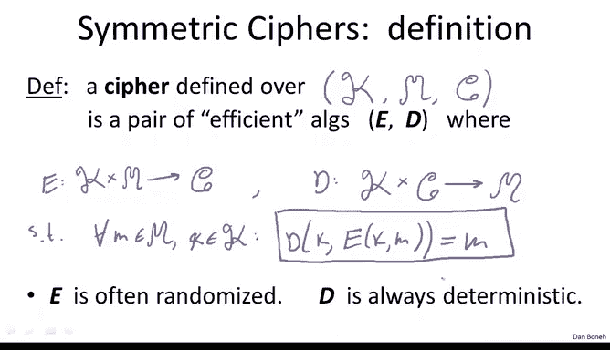
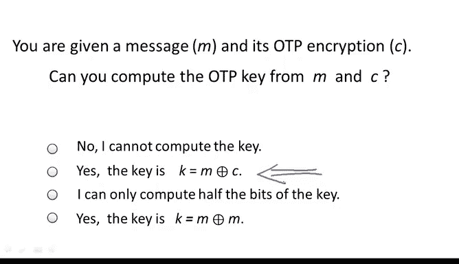
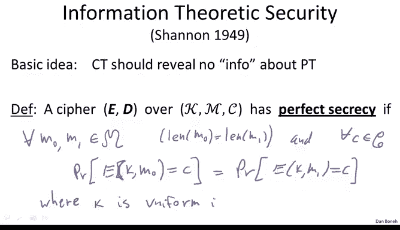
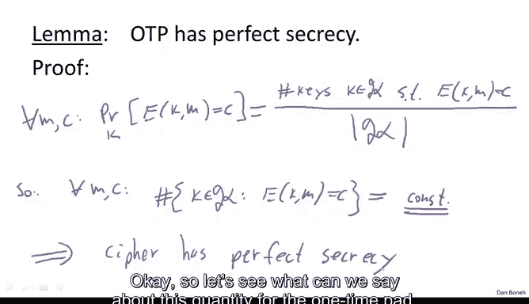

# 斯坦福大学《密码学｜Cryptography 1》中英字幕 - P6：06_01_01_信息论安全与一次性密码本.zh_en - GPT中英字幕课程资源 - BV1Rf421o79E

Now that we've seen a few examples of historic ciphers， all of which are badly broken。

 We're going to switch gears and talk about ciphers that are much better designed。

 But before we do that， I want to first of all， define more precisely what a cipher is。

So first of all， a cipher is actually remember a cipher is made up of two algorithms。

 there's an encryption algorithm and a decryption algorithm， but in fact。

 a cipher is defined over a triple， so there's the set of all possible keys which I'm going to denote by script K this sometimes I'll call as the key space。

 the set of all possible keys， theres a set of all possible messages and the set of all possible cipherts so this triple in some sense defines the environment over which the cipher is defined。

😊，And then the Cypher itself is a pair of efficient algorithms， E and D is the encryption algorithm。

 D is the decryption algorithm， of course E takes keys and messages and outputs cipher texts。😊。

And the decryption algorithm takes keys in ciphertexs。And outputs messages。

And the only requirement is that these algorithms are consistent。

 they satisfy what's called a correctness property。

 so for every message in the message space and every key in the key space it had better be the case that if I encrypt the message with the keyK and then I decrypt using the same keyK I had better get back the original message that I started with so this equation here is what's called the consistency equation and every cipher has to satisfied in order to be a cipher otherwise it's not possible to decrypt。

One thing I wanted to point out is that I put the word efficient here in quotes。

 and the reason I do that is because efficient means different things to different people if you're more inclined towards theory。

 efficient means runs in polynomial time， so algorithms E and D have to run in polynomial time in the size of their inputs。

If you're more practically inclined efficient means runs within a certain time period。

 so for example， algorithm E might be required to take under a minute to encrypt a gigabyte of data either way。

 the word efficient kind of captures both notions and you can interpret it in your head whichever way you like。

 I'm just going to keep referring to it as efficient and put quotes in it as I said if you're theory inclined think of it as polynomial time and otherwise think of it as concrete time constraints Another comment I want to make is that in fact algorithm E。

Is often a randomized algorithm。 What that means is that as you're encrypting messages。

 algorithm E is going to generate random bits for itself。

 and it's going to use those random bits to actually encrypt the messages that are given to it。

 On the other hand， the decryption algorithm is always deterministic。 In other words。

 given the key and the ciphertext output is always the same。

 doesn't depend on any randomness that's used by the algorithm。

Okay， so now that way understand what a cipher is better。

 I want to kind of show you the first example of a secure cipher。 It's called the one time pad。

It was designed by Verome back at the beginning of the 20th century before I actually explain what the cipher is。

 let's just state it in the terminology that we've just seen。

 so the message space for the verome cipher for the one time pad is the same as the Cyphertex space。

 which is just the set of all nbit binary strings。So this just means all sequences of bits of 01 characters。

The key space is basically the same as the message space， which is again。

 simply the set of all n bit binary strings。So a key in the one time pad is simply a random bit string。

 So it's a random sequence of bits。😊，That's as long as the message to be encrypted。

 as long as the message。Okay， now that we specified kind of what the cipher is defined over。

 we can actually specify how the cipher works。 and it's actually really simple。

 So essentially the cipher text， which is the result of encrypting a message with a particular key。😊。

Is simply the X or of the two， simply K X or M。 So see a quick example of this。

 Remember that X or this plus with a circle， X or means addition modular 2。

So if I take a particular message， say0，1，1，0，1，1，1， and I take a particular key， say 1，0，1，1，0，01。

When I compute the encryption of the message using this key。

 all I do is I compute the Xor of these two strings。 In other words。

 I do addition modular2 bit by bit。 So I get 11，0，1，1，1，0。 That's the cipher textex。

 And then how do I decrypt， I basically kind of do the same thing。

 So to decrypt a ciphert using a particular key。 what I do is I xor the key and the ciphertex again。

 And so all we have to verify is that it satisfies the consistency requirements。

 And I'm going to do this slowly once。 And then from now on。

 I'm gonna assume this is all simple to you。 So we're gonna make we're gonna have to make sure that if I decrypt a ciphertex that was encrypted using a particular key。

 I had better get。Back the message M。 So what happens here。 Well， let's see。

 So if I look at the encryption of K and M， this is just K， X or M by definition。

 What's the encryption of K X or M using K， That's just K， X or K， X or M。

And so since I said that x or is addition modular2， addition is associative。

 so this is the same as k X or K X or M， which is simply as you know Kx or k is just 0 and0 x or anything is simply M okay so this actually shows that the one time pad is in fact a cipher。

 but it doesn't say anything about the security of the cipher。

And we'll talk about security of the cipher in just a minute。 First of all。

 let me quickly ask you a question just to make sure we're all in sync。

 Suppose you're given a message。 M is the encryption of that message using the one time pad。

 So all you're given is the message and the cipher text。

My question to you is given this pair M and C， can you actually figure out the one time pad key that was used in the creation of C from M。

 So I hope all of you realize that in fact， given the message in the Cyphertex it's very easy to recover what the key is in particular the key is simply M X or C and we'll see that if it's not immediately obvious to you we'll see why that's the case a little later in the lecture。

Okay， allright， so the one time pad is really cool from a performance point of view。

 All you're doing is you exing the key in the message。 So it's a super。

 super fast cipher for encrypting and encrypting very long message。 Unfortunately。

 it's very difficult to use in practice。 The reason it's difficult to use is the keys are essentially as long as the message。

 So if Alice and Bob want to communicate securely。 So， you know。

 Alice wants to send a message and to Bob。 before she begins even sending the first bit of the message。

 she has to transmit a key to Bob。 That's as long as that message。 Well。

 if she has a way to transmit a secure key to Bob， that's as long as the message。

 she might as well use that same mechanism to also transmits the message itself。

 So the fact that the key， it's as long as the message is quite problematic and makes the one time pad very difficult to use in practice。

 although we'll see that the idea behind the one time pad is actually quite useful。

 and we'll see that a little bit later。 But for now I want to focus a little bit on security。

 So the obvious questions are。😊。

You know why is the one time pad secure， Why is it a good cipher then to answer that question the first thing we have to answer is what is a secure cipher to begin with what is it what makes a cipher secure Okay so to study security of ciphers。

 we have to talk a little bit about information theory and in fact the first person to study security of cipher's rigorously is a very famous you know the father of information theory Claude Shannon and he published a famous paper back in 1949 where he analyzes the security of the One time pad。

😊。

So the idea behind Shannon's definition of security is the following basically if all you get to see is the ciphertext。

 then you should learn absolutely nothing about the plain text。 In other words。

 the Cyphert should reveal no information about the plain text and you see why it took someone who invented information theory to come up with this notion because you had to formalize formally explain what does information about the plain text actually mean so that's what Shannon did and so let me show you Shannon's definition I'll write it out slowly first。

😊，So what San said is you know suppose we have a cipher ED that's defined over a triple KM and C just as before。

 So KM and C defined a key space， the message space and the ciphertex space。

 and we say that the ciphert sorry we say that the cipher has perfect secrecy if the following condition holds it so happens that for every two messages M0 and M1 in the message space。

For every two messages， the only requirement I'm going to put on these messages is they have the same length。

Yeah， so we're we'll see why this requirement is necessary in just a minute。

And for every ciphertext in the Cyphertex space。Okay。

 so for every pair of method messages and for every Cyphertex。

 it had better be the case that if I ask， what is the probability that encrypting M0 with K。Oops。

 encryptrypting m0 with k gave C。Okay， so how likely is it？If we pick a random key。

 how likely is it going encrypt M0， we get C， that probability should be the same as when we encrypt M1。

so the probability of encrypting M1 and getting C is exactly the same as the probability of encrypting M0 and getting C。

 And this is， as I said， where the key， the distribution is over the distribution of the key。

 So the key is uniform in the key space。 So K is uniform in K and I'm often going to write Karrow with a little R above it to denote the fact that k is a random variable that's uniformly sampled in the key space K。

😊。

Okay， this is the main part of Shannon's definition。

And let's think a little bit about what this definition actually says。

 So what does it mean that these two probabilities are the same。 Well。

 what it says is that if I an attacker， if I'm an attacker and I intercept a particular Cyphert C。

Then in reality， the ciphertex， the probability that the ciphertex is the encryption of m0 is exactly the same as the probability that is the encryption of M1。

 because those probabilitybabilities are equal。 So if all I have is the Cyphertex C that's all I've intercepted。

 I have no idea whether the ciphertex came from M0 or the Cyphert came from M1 because again。

 the probability of getting C is equally likely whether M0 is being encrypted or M1 is being encrypted。

😊，So here we have the definition stated again， and I will just want to write these properties again more precisely。

 So let's write this again。 So what this definition means is that if I'm given a particular ciphertt。

 I can't tell where it came from。 I can't tell if if the message that was encrypted。

Is either M0 or M1。 And， in fact， this property is true for all messages， for all these M0。

 for all M 0 and M1。 So not only can an act if C came from M 0 or M1。

 I can't tell if it came from M2 or M3 or M4 M M5， because all of them are equally likely to produce the ciphertext C。

So what this means really， is that if you're encrypting messages with a one time pad， then in fact。

 the most powerful adversary， I don't really care how smart you are， the most powerful adversary。

Can learn nothing about the plain text。 Learns nothing about the plain text。

From the Cyphertext。So I to say it in one more way， basically what this proves is that thereops。

 there's no ciphertex only attack on a cipher that has perfect secrecy。Now。

 Cypherts only attacks actually aren't the only attacks possible。😊，And in fact。

 other attacks may be possible， but other attacks。Maybe be possible。O。

Now that we understand what perfect secrecy means， the question is can we build cphers that actually have perfect secrecy and it turns out we don't have to live very far。

 but one time pad in fact has perfect secrecy。😊，So I want to prove to you。

 this is Shannon's first results。 and I want to prove this fact to you。 It's a very simple proof。

 So let's go ahead and look at it and just do it。 So we need to kind of interpret。What does it mean。

 what is this probability that E K of M0 is equal to C？

So it's actually not that hard to see that for every message in every ciphertext。

 the probability that the encryption of M under a key K， the probability that that's equal to C。

 the probability of a random choice of key by definition。All that is is basically the number of keys。

K in script K。Such that， well。If I encrypt n with K， I get C。

 So I literally count a number of such keys and I divide by the total number of keys。

 right That's what it means that if I choose a random key， that key maps M to C。

 right So it's basically the number of keys that map M to C divided by the total number of keys。

 This is this probability。😊，So now suppose that， suppose that we had a cipher search for all messages and all cipher text。

 it so happens that if I look at this number， the number of K K and K such that E K M is equal to C。

 In other words， I'm looking at the number of keys that map M to C。

 Supp this this number happens to be a constant。 So say it happens to be 2。

3 or 10 or 15 it just happens to be an absolute constant。If that's the case。

 then by definition for all N0 and M1 and for all C。

This probability has to be the same because the denominator is the same， the numerator is the same。

 it this is constant， and therefore this probability is always the same for all M and C。

 and so if this property is true， then the cipher has to have the cipher has perfect secrecy。Okay。

 so let's see what can we say about this quantity for the one time pad？

So the question to you is if I have a message in a ciphertext。

 how many one time pad keys are there that map this message M to the Cypherex C， in other words。

 how many keys are there such that M X or K is equal to C。😊，So I hope you've all answered one。

 and let's see why that's the case for the one time pad。

 if we have that the encryption of K of M under K is equal to C。That basically， well， by definition。

 that implies that K X or M is equal to C， but that also simply says that K has to be equal to M X or C。

Yes， I just x or both sides by M， and I get that K must equal to M X or C。Okay。

 so what that says is that for the one time pad， In fact， the number of keys in K shows that E K M。

Is equal to C。 that simply is one， and this holds for all messages and cpher textex。And so again。

 by what we said before， this says that the one time pad has a perfect secrecy。Perfect secrecy。

 And that completes the proof of this of this trivial， very， very simple， very， very simple lemma。

 Now， the funny thing is that even though this lemma is so simple to prove， in fact。

 it proves a pretty powerful statement again， this basically says for the one time pad。

 there is no ciphertext only attack。So unlike the substitution cipher or the Vigenre cipher or the rotor machines。

 all those could be broken by Cyphertext only attack。

 we've just proved that for the one time pad that's simply impossible given the ciphert。

 you simply learn nothing about the plain text。However， as we'll see。

 this is not the end of the story。 I mean， are we done， I mean， basically。

 we're done with a course now because we have a way。

To encrypt so that an attacker can't recover anything about our message so maybe we're done with a course。

 but in fact as we'll see there are other attacks and in fact the one- time pad is actually not such a secure cipher and in fact there are other attacks that are possible and we'll see that shortly。

So I emphasize again， the fact that it has perfect secrecy does not mean that the one time pad is a secure cipher to use。

Okay but as we said， the problem with the one- time pad is that the secret key key is really long。

 So if you had a way of communicating the secret key over to the other side。

 you might as well use that exact same method to also communicate the message to the other side。

 in which case you wouldn't need a cipher to begin with so the problem again is the one time pad has really long keys And so the obvious question is are there other ciphers that have perfect secrecy and possibly have much。

 much shorter keys。 Well， so the bad news is a Shannon after proving that the one time pad has perfect secrecy prove another theorem that says that if。

 in fact a cipher has perfect secrecy， the number of keys in a cipher must be at least the number of messages that the cipher can handle so in particular。

 what this means is if I have perfect secrecy。😊，Then necessarily the number of keys。

 or rather the length of my key must be greater than the length of the message。So in fact。

 since the one time pad satisfies this with equality。

 the one time pad is an optimal cipher that has perfect secrecy。 Okay， so basically。

 what this shows is that this is an interesting notion。 The one time pad is an interesting cipher。

 but in fact， in reality， it's actually quite hard to use。😊。

Tart use in practice again because of these long keys。And so this notion of perfect secrecy。

 even though it's quite interesting， basically says that it doesn't really tell us that practical ciphers are going to be secure and we're going to see。

 but as we said， the idea behind the one time pad is quite good and we're going to see in the next lecture how to make that into a practical system。

😊。

