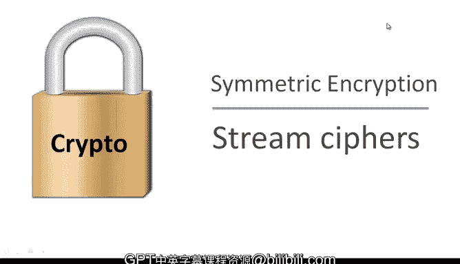
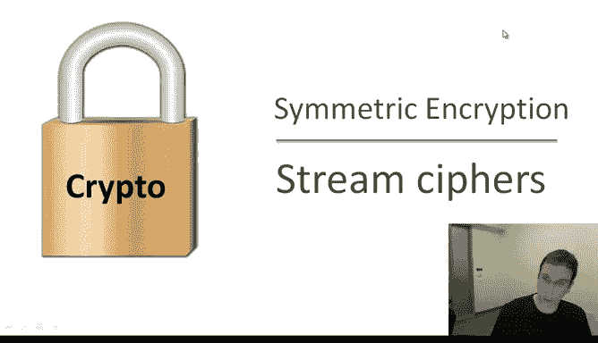
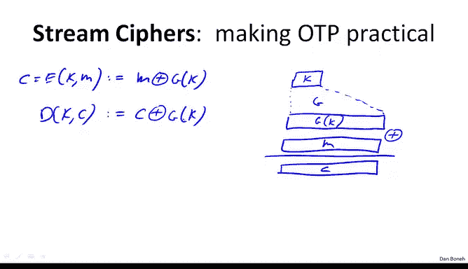
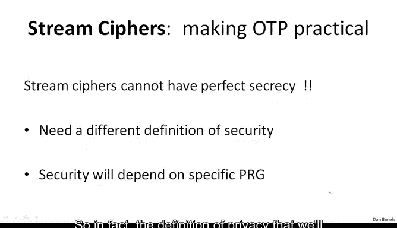
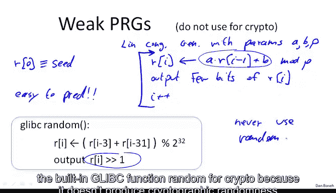
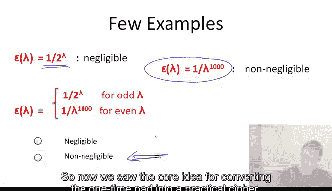

# 斯坦福大学《密码学｜Cryptography 1》中英字幕 - P7：07_01_02_流密码与伪随机数生成器.zh_en - GPT中英字幕课程资源 - BV1Rf421o79E

Now that we know about the onetime pad， let's talk about making the one time pad more practical using something called a stream cipher。

 But before we do that， let's do a quick review of where we were。

 So let me just remind you that a cipher is defined over a triple of sets called a key space。

 a message space and a cipherex space。 And a cipher is a pair of efficient algorithms called E and D E stands for encryption and D stands for decryption and the only property that we need to satisfy is that decryption is the opposite of encryption。

 In other words， if I encrypt a message M using a particular key。 and I decry using the same key。

 I get back the original message。 Last time we looked at a couple of weak ciphers like the substitution cipher and the visiona cipher。

 we showed that all of them can be easily broken。 So you should never， ever ever use the ciphers。

 those were just for historical reference。 And then we looked at our first example of a good cipher namely the one time pad。

 Let me just remind you how the one time pad is defined basically the message space is。

of all n bit strings， the cipher textex is a set of all nbit strings and similarly the key is the set of all n bit strings and the way we encrypt is by a simple Xor to encrypt a message we just Xor the message in the key that gives us the ciphertex and then to decrypt the cipher textex we just do this Xor again and it's easy to show by properties of Xor that in fact encryption is the opposite of encryption and then we talked about this lelemma。

 in fact， we proved it that says that the one-time pad has perfect secrecy which means that if you're just an eavesdroppperper and you just get to see a single ciphertex you're not going to be able to deduce any information about the encrypted plain text unfortunately。

 we also said that Xnon proved the dilemma we call it the bad newslemma that basically says that any cipher that has perfect secrecy must have really long keys。

 in other words， the key length must be at least as long as the length of the message which means that the cipher is not particularly useful because if two parties have a way to agree on really long keys that are。

As long as the message they in some sense might as well use that mechanism to already transmit the message itself so in this lecture we're going to take the idea of the one time pad and try to make it into a practical encryption scheme。

So this is called what's called a stream cipher。 So the idea in a stream cipher is rather than using a totally random key。

 we're actually going to use a pseudoran key And to explain how that works。

 I need to define what is a pseudo random generator， a PRG。 So a PRG。

 really all it is is just a function。I'll call it G for generator that takes a seed。

 So I'm going to use 01 to the S to denote all strings of length S。 So this will call the seed space。

 So it takes an S bit see and maps it into a much larger string。

 which will denote by01 to the N and the property is that n must be much much larger than S。

 So in other words， we take a seed that might be maybe only 128 B。 and we expand it into a much。

 much larger output string。 that could be gigabytes long。

 That's what the pseudo random generator does。 And of course， the goal is that first of all。

 the generator is efficiently computable。 So the function G。

 there should be some sort of an efficient algorithm that computes it。

So efficiently computable by a deterministic algorithm。

 It's important to understand that the function G itself has no more randomness in it。

 It's totally deterministic。 The only thing that's random here is the random seed that's given as input to the function G。

 and the other property， of course， is that the output should look random。 And the question is。

 what does it mean to look random and that's something that we define later on in the lecture。 Okay。

 so suppose we have such a generator。 how do we use that to build a stream cipher。 Well。

 the idea is that we're going to use the seed as our key。

 So our short seed is going to be the secret key。 And then we're going to use the generator to basically expand the seed into a much。

 much larger random looking sequence or pseudo random sequence as it's known。

 So this would be G of K。 And then we are going to exhort just like in the one time pad we're going to exhor the pseudo random sequence with the message and that's going to give us。

Thecipherex。Or if we want to write this in math， we'll write C equals the encryption of the message M with a key K。

 which is simply defined as M X or G of K， and then when we want to decrypt。

 basically we do exactly the same thing， it's basically the cpherex X or G of K。

 just like in the one time pad， except that instead of xoring with K。

 we Xor with the alpha of the generator applied the K。

So the first question to ask is why is this secure so basically you we only have one notion of security so far。

 which we called perfect secrecy and so let's just quickly ask can a stream cipher have perfect secrecy。

 remember in the stream cipher， the key is much much shorter than the message。

And so nevertheless， can it have perfect secrecy？So I hope everybody said the answer is no。

 the key is much shorter than the message and we said that in a perfectly secure cipher。

 the key must be as long as the message， and therefore it's not possible that stream cipher actually has perfect secrecy。

So the question is then， well， why is it secure？First of all。

 we would need a different definition of security to argue that stream Cyypherface is secure。

 and in particular， the security property is going to depend on the specific generator that we used。

 So in fact， a definition of privacy that will need to argue security of stream ciyphers will see in the next lecture。

 But for now， let me show you one particular property that a generator must have a minimal property needed for security。

 This property is called unpredictability。

So let's just suppose for one second that， in fact， a stream cipher is predictable。

 So what does that mean， Both the PRG is predictable。

What that means is essentially that there is some I such that if I give you the first I bits of the output。

This notation bar one to I means look at the first eye bits of the output of the function。Okay。

 so I give you the first eye bits of the stream。 There is some sort of an algorithm。

 There's an efficient algorithm that will compute the rest of the stream。 Okay。

 so given the first I bits， you can compute the remainder of the bits。

 I claim that if this is the case， then the stream cipher would not be secure。 So let's see why。

 Well， suppose an attacker actually intercept a particular cipherex。 That's call it C。

if this is the case， then in fact， we have a problem because suppose that just by some prior knowledge。

 the attacker actually knows that the initial part of the message happens to be some known value。

 for example， you know that in the mail protocol SMTP。

 the standard send mail protocol using an internet。

 you know that every message starts with a word from colon。Well。

 that would be a prefix that the adversary knows that the message must begin with from colon。

 What it could do is it could exhort the ciphertex。With the words from colon。

 with the little prefix of the message that it actually knows。

 And what I would give it is a prefix of。OfThe pseudoran sequence。

 And I would learn as a result of this， it would learn a prefix of the pseudorandom sequence。

But then we know that once it has a freex of the pseudo random sequence。

 it can predict the remainder of the pseudo random sequence and that would allow it to then predict the rest of the messaging。

Okay， so for example， if the pseudoran generator was predictable given five bits of the pad。

 then every email encrypted using the stream cipher would be decrypttable because， again。

 the attacker knows the prefix of the message from which he deduces a prefix of the pad。

 which then allows him to compute the rest of the pad。

 which then allows him to recover the entire plain text。Okay。

 so this is an example that shows that in fact， if a GPPG is predictable。

 then already there are security problems because a small prefix would reveal the entire message。

As it turns out， even if I could just predict 1 bit of the outputs， even if given， you know。

 the first I bits， I can predict the next bit， the I plus first bit。 alreadyread。

 this is a problem because that would say that given again。

 the first couple of letters in the message I can predict。

 I can decrypt essentially and recover the next bit of the message or the next letter of the message and so on。

So this predictability property shows that， you know， our。

 if we use a PR G thats that's going to be used in a stream signpher， it had better be unpredictable。

 So what does it mean that a PRG is unpredictable。 So let's define more precisely what it means for a PR G to be unpredictable。

 Well， first， we'll define more precisely what it means for a PR G to be predictable。

 So we say that G is predictable if there exist an efficient algorithm。Let's call it A。

And there is some position。 There's a position I between one and n -1。

 such that if we look at a probability over a random key， probability， if I generate a random key。

remember this notation means choose a random key from the set K。

 so this arrow with R just means choose a random key from the set K。

 basically if I give this algorithm a prefix of the output。

So I give it the first I bit of the output， the probability that it's able to predict the next bit of the output。

This probability is greater than half plus epsilon。For some non negligible。For some non negligible。

Epsilon and non negligible， for example， would be epsilon。

 which is greater than one over 2 to the 30，1 over a billion， for example。

 we would consider non negligible。 So these terms negligible and non negligible will come back at the end of the lecture and define them more precisely。

But for now， let's just stick an intuitive notion of what non negligible mean。

 and so this is what it means for an algorithm for a generator to be predictable。

 Basically there is some algorithm that is able to predict the i plus first bit。

 even the initial prefix and then we say that an algorithm that a PRG is unpredictable， if in fact。

 well， if it doesn't satisfy the property that we just defined， in other words it is not predictable。

 but what does it mean more precisely for it not to be predictable， it means that in fact。

 for all positions for all I， there's no efficient adversary。

 no efficientffient algorithm A that can predict the i plus first bits with non-neligible probability epsilon。

Okay， and this has to be true for all I。 So no matter which prefix I give you。

 you're not going to be able to predict the next bit that follows the prefix。Okay。

 so let's look at some examples， here's a silly silly example。

 supposeupp I give you a generator and I ask you is it predictable well this generator happens to have the property that if I exor all the bits of the output。

 I always happen to get one。Okay， so I ex all the bits， bit number one， Xor bit number  two。

 exor bit number 3。 If I ex all those bits， I happen to get one。 The question is。

 is that a predictable generator。And again， I hope everybody answered， yes， that essentially。

 given the first n minus1 Bs of the output。I can predict the n bit because it would just be the bits that's needed to make the Xor of all the bits be1。

 In other words， if I give you all but one of the bits of the generator。

 you can actually predict the last bit of the generator。

Now that we've seen that PRGs have to be unpredictable。

 I just want to mention a couple of weak PR used。 This should never ever be used for crypto。

 This is a very common mistake。 and I just want to make sure none of you guys make this mistake。

 So a very common PRG that should actually never be used for crypto is called a linear congregential generator。

 So let me explain what a linear congential generator is basically it has parameters。

It has three parameters。 I'll call them A， B and P A And B are just integers， and P is a prime。

 And the generator defined as follows。 essentially， I'll say R 0 is the see of the generator。

And then the way you generate randomness is basically you set you iteratively run through the following steps。

 you compute a times R of I minus-1 plus B module P。

 Then you output a few bits of the current state output。Few bits of our eye。

Then of course you increment I and you iterate this again and again and again Okay so you can see how this generator proceeds。

 it starts with with a particular seed at every step there is this linear transformation that's being applied to the seed。

And then you output a few bits of the current state。

 and then you do that again and again and again and again。 Unfortunately。

 even though this generator has good statistical properties in the sense that for example。

 the number of zeros it outputs is likely going to be similar to the number of ones and so on。

 It has。 you can actually argue all sorts of nice statistical properties about this。 Nevertheless。

 it is a very easy generator to predict。And in fact， should never ever be used。 In fact。

 just given a few outputs， a few output samples， it's easy to predict the remainder of the sequence。

 And as a result， as generators should never ever be used。

Another example is a random number generator that's very closely related to the linear conential generator。

 This is a random number generator implemented in Glib C。

 very common library that you can see I've just wrote down the definition here you can see that it basically outputs a few bits at every iteration and it just does the simple linear transformation at every step again。

 this is a very easy generator to predict and should never ever be used for crypto And so kind of the lesson I want to just emphasize here is never ever use。

Never use the function， the built in Glib C function random for crypto because it doesn't produce cryptographic randomness in the sense that it's easy to predict。

 And in fact， systems like Kbo's version 4 have used random and have been bitten by that。

 So please don't make that mistake yourself。

We'll talk about how to do secure random number generation actually in the next lecture。

Before we conclude this lecture， I just want to give a little bit more detail about these concepts of negligible and negligible values。

 so different communities in crypto actually define these concepts differently for practitioners。

 basically these the terms negligible and non negligible。

Are just particular scalrs that are used in the definition。 So for example。

 a practitioner would say that if a value is more than1 over a billion，1 over 2 to the 30。

 we say that the value is non negligible。 The reason the reason that's so。

 is because if you happen to use a key， for example， for encrypting a gigabyte of data。

 a gigabyte of data is about 2 to the 30 maybe even2 to the 32 Bs。

Then an event that happens with probability1 over 22 to the 30 will likely happen after about a gigabyte of data。

 so since a gigabyte of data is within reason for a particular key， this event is likely to happen。

 therefore one over two to the 30 is not negligible on the other hand will say that one over two to the 80 which is much。

 much， much smaller is an event an event that happens with this probability is an event that's actually not going to happen over the life of the key and therefore will say that that's a negligible event。

As it turns out， these practical definitions of negligible and non- negligible are quite problematic and we'll see examples of why they're problematic later on。

 So in fact， in the more rigorous theory of cryptography。

 the definition of negligible and non negligible are somewhat different and in fact。

 when we talk about the probability of events we don't talk about these probabilities as scalrs。

 but rather we talk about them as functions of a security parameter。

 So let me explain what that means So these functions。

A essentially are functions that map that outputs positive real values so or non negative real values that are supposedly probabilities。

 but theyre functions that act on non-ne integers。 Okay so what does it mean for a function to be non- negligible。

 what it means is that the function is bigger than some polynomial infinitely often， In other words。

 for many for infinitely many values， the function is bigger than some one over polynomial so I wrote the exact definition here。

 and we'll see an example in just a minute。Okay， so if something is bigger。

 is often bigger than one over polynomial， we'll say that it's not negligible， however。

 if something is smaller than all polynomials， then we'll say that it's negligible。

 So what this says here is basically for any degree polynomial for allD， there exists。

Some lower bound lambda D， such for all lambda bigger than this lambda D。

 the function is smaller than one over the polynomial。 Okay。

 so all this says is that the function is negligible If it's less than all polynomial fractions。

 In other words， it's less than one over lambda D for sufficiently large lambda。

So let's look at some examples and we'll see applications of these negligible and non negligible concepts later on。

 but I just wanted to make it clear that this is how you would rigorously find these concepts。

 basically either smaller than one over poly or bigger than one over polyly， one would be negligible。

 the other would be non negligent。Let's look at some examples so for example。

 a function that drops exponentially in lambda clearly would be negligible because for any constant D。

 there is a sufficiently large lambda such that one over2 to the lambda is less than one over lambda to the D so this is clearly less than all polynomials。

However， the function say one over lambda to 1000 right， this is a function that grows very， very。

 very slowly。 Its barely ever moves。 this function nevertheless。

 this function is non negligible because if I set D to B 10000。

 then clearly this function is bigger than one over lambda to the 10000。

 and so this function is bigger than some polynomial fraction。😊。

Now let's look at a confusing example， just to be tricky。

 what do you think if I suppose I have a function that for land odd land that happens to be exponentially small。

 for even land that happens to be polynomly small， is this a negligible or non negligible function？

Well， by our definition， this would be a net non negligible function。 And the intuition is。

 if a function happens to be only polynomly small very often， that actually means that。This event。

 an event that happens with this probability is already too large to be used in a real crypto system。

Okay， so the main points to remember here are that these terms basically correspond to less than polynomial or more than polynomial。

But throughout the course， we're mostly used negligible to mean less than than an exponential and non negligible to mean less than one over a polynomial。

 So now we saw the core idea for converting the one time pad into a practical cipher and name a stream cipher。

 And then in the next lecture， we're gonna to see how to actually argue that the stream cipher is actually secure。

 that's going to require a new definition of security Since perfect secrecy is not good enough here。

 and we will see that in the next lecture。

