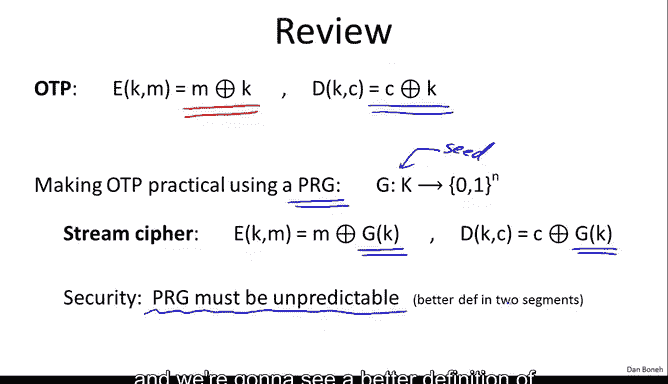
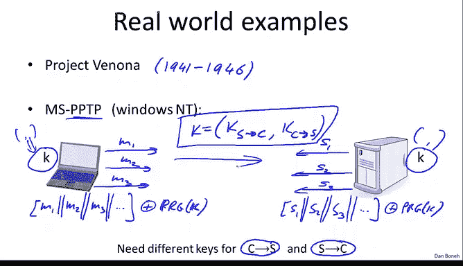
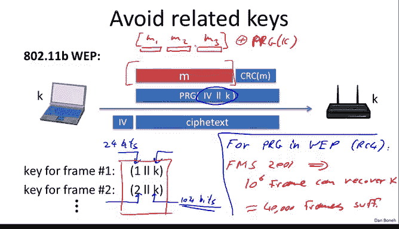
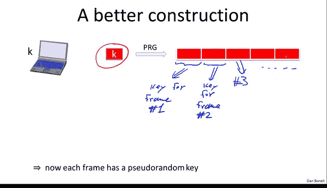

# 斯坦福大学《密码学｜Cryptography 1》中英字幕 - P8：08_01_01_对流密码和一次性密码本的攻击.zh_en - GPT中英字幕课程资源 - BV1Rf421o79E

In this segment， we're gonna to look at attacks on the one-time pad and some things you need to be careful with when you use the stream cipher。

 But before we do that， let's do a quick review of where we were。

 So recall that the onetime pad encrypts messages by xoring the message and a secret key where the secret key is as long as the message Similarlyly decryption is done by similarly xoring the cipher text and the same secret key When the key is uniform in random we proved that the one-time pad has this information theoretic security that Shannon called perfect secrecy a problem was。

 of course， the keys are as long as the message So the onetime pad is very difficult to use。

 We then talked about a way to make the onetime pad practical by using a pseudoran generator that expands a short seed into a much larger message and the way a stream cipher worked essentially using a pseudoran generator was in the same way as the onetime pad basically but rather than using a truly random pad we used the pseudoran pad that's expanded to be as long as the message from the short key that's given as input to the generator。

We said now that security no longer relies on perfect secrecy because stream cypherrus cannot be perfectly secure。

 instead security relies on properties of the pseudo randomum generator and we said that the pseudo randomum generator essentially needs to be unpredictable。

 but in fact it turns out that definition is a little bit hard to work with。

 and we're going to see a better definition of security for PRGs in about two segments。

But in this segment， we're going to talk about attacks on the one time pad and the first attack I want to talk about is what's called the two time pad attack Okay so remember that the one time pad is called one time pad because the pad can only be used to encrypt a single message。

 I want to show you that if the same pad is used to encrypt more than one message then security goes out the window and basically an eavesdpper can completely decrypt encrypted messages。

 So let's look at an example。 So here we have two messages M1 and M2 that are encrypted using the same pad。

So the resulting Cyphertext C1 and C2， again， basically are encryptions of these messages and1 and M2。

 but both are encrypted using the same pad。 Now， suppose an eavesdroppper intercepts C1 and C2 and he obtains he basically has both C1 and C2。

 The natural thing for the eavesdropper to do is actually compute the Xor of C1 and C2 and what does he get when he computes this Xor。

So I hope everybody sees that basically once you XO C1 and C2 the pads cancel out and essentially what comes out of this is the Xor of the plain text messages and it turns out that English basically has enough redundancy such that if I give you the Xor of two plain text messages you can actually recover those two messages completely more importantly for us since these messages are encoded using ASI In fact。

 ASI encodings has enough redundancy such that given the Xor of two ASI encoded messages you can recover the original messages back so essentially given these Xors。

 you can recover both messages So the thing to remember here is if you ever use the same pad to encrypt multiple messages an attacker who intercepts the resulting cipher text can basically recover the original plain text without too much work So the stream cpher key or the onetime pad key should never。

 ever， ever， ever be used more than once。

So let's look at some examples where this comes up in practice。

 it's a very common mistake to use a stream cipher key or a one- time pad key more than once。

 and let me show you some example where this comes up so you know to avoid these mistakes when you build your own systems。

The first example is a historic example at the beginning of the 1940s where the Russians actually used a onetime pad to encrypt various messages。

 Unfortunately， the pads that they were using were generated by a human by throwing dice and so you the human would throw these dice and write down the results of these throws and collected throws would then form the pads that were used for encryption Now because it was kind of laborious for them to generate these pads。

 it seemed wasteful to use the pad to encrypt just one message so they ended up using these pads to encrypt multiple messages and US intelligence was actually able to intercept these twotime pads。

 these cpherts that were encrypted using the same pad applied to different messages and it turns out over a period of several years they were able to decrypt something like 3000 plain texts just by intercepting these dipherts the project is called project Vanona it's actually a fascinating story of crypt analysis just because the two-time pad is insecure。

More importantly， I want to talk about more recent examples that come up in networking protocols。

 So let me give you an example from Windows andt in a protocol called the point to point transfer protocol。

 This is a protocol for client wishing to communicate securely with a server the client and the server both share a secret key here and they both send messages to one another So here we'll denote the messages from the client by M1 So the client sends a message。

 the server response， the client sends a message， the server response。

 the client sends a message the server response and so on and so forth。

 Now the way PPTP works is basically the entire interaction from the client to the server is considered as one stream In other words。

 what happens is the messages M1 and M2 and M3 are kind of viewed as one long stream here。

 these two parallel lines means concatetnation So essentially we're concatenating all the messages from the client to the server into one long stream。

And all that stream is encrypted using the stream cipher with keyK。So that's perfectly fine。

 I mean there's nothing wrong with that， these messages are encrypted or treated as one long stream and they're all encrypted using the same key。

The problem is same thing is happening also on the server side， in other words。

 all the messages from the server are also treated as one long stream。

 so here they're all concateated together。And encrypted using unfortunately the same pseudorandom seed。

 in other words， using the same stream cpher key。So basically what's happening here is you see in effect that the two- time pad is taking place where the set of messages from the client is encrypted using the same one time pad as the set of messages from the server。

 The lesson here is that you should never use the same key to encrypt traffic in both directions in fact what you need to do is to have one key for interaction between the client and the server and one key for interaction between the server and the client。

 The way I like to write this is really that the shared key key really is a pair of keys。

 one key is used to encrypt messages from server to client and one key is used to encrypt messages from client to server So these are two separate keys that are used and both sides of course know this key so both sides have this pair of keys。

Okay and they can both encrypt so one is used to encrypt messages in one direction and the other is used to encrypt messages in the other direction。

 So another important example of the two time pad comes up in wi-fi communication in particular in the 80211 B protocol。

 So all of you I'm sure know that80211 contains an encryption layer and the original encryption layer was called web and web fortunately for us it's actually a very badly designed protocol so that I can always use it as an example of how not to do things。

 There are many， many mistakes inside of web and here I want to use it as an example of how the two time pad came about So let me explain how web works。

 So in web as a client and an access point， here's the client here's the access point。

 they both share a secret key K。

And then when they want to transmit a message to one another。

 say these are frames that they transmit to one another。

 let's say the client wants to send a frame containing the plain text M to the access point。

 what he would do is he first of all he appends some sort of a checkum to this plain text。

 the checkum is not important at this point， what is important is that then this concatetnation gets encrypted using a stream cipher where the stream cipher key is this concatenation of a value IV and a long-term key K。

So this IV is a 24 bit string。This IV is a 24 bit string and you can imagine that it starts from zero and perhaps it just it's a counter that counts increments by one every packet。

 The reason they did this is the designers of web realized that in a streamcipher the key is only supposed to be used to encrypt one message and so they said。

 well let's go ahead and change the key after every frame and the way they change the key essentially was by preending this IV to it and you notice if IV changes on every packet so it increments by one on every packet and the IV then is sent in the clear along with the ciphertex so the recipient knows the key K he knows what the IV is he can redderve the PRG of IV concatenated K and then the ciphertext to recover the original message M。

Now the problem with this of course， is the IV is only 24 bits long。

 which means that there are only two to the 24 possible IVs。

 which means that after 16 million frames are transmitted。

 essentially the IV has to cycle and once it cycles after 16 million frames essentially we get a two time pad the same IV would be used to encrypt two different messages the key K never changes it's a longterm key and as a result the same key namely IV concatenated K would be used to encrypt two different frames and the attacker can then figure out plain text of both frames so that's one problem and the worst problem is in fact that on many 802-11 cards if you power cyclee the card。

 the IV will reset back to zero and as a result every time you powercycl the card essentially you' will be encrypting the next payload using zero concatenated K so after every power cycle you'll be using the zero concatenated K key to encrypt many。

 many， many times the same packet。So you see how in web the same pad could be used to encrypt many different messages as soon as the IV is repeated。

 There's nothing to prevent the IV from repeating after a powercycl or from repeating after every 16 million frames。

 which isn't that many frames in a busy network So while we're talking about web I want to mention one more mistake that was done in web this is a pretty significant mistake and let's see how we might design it better。

 So you notice that the designers of web basically wanted to use a different key for every packet。

 so every frame is encrypted using a different key this concatenation of IV and K unfortunately they didn't randomize the keys and the keys are actually if you look at the key for frame number one well it'll be this concatenation of one andK that would just feel is 24 bits then the key for frame number two is the concatenation of 2 and the key for frame number3 the concatenation of 3 and K So the keys are very closely related to one another and I should probably mention also that these keys themselves can be 100。

4 bits so that the resulting PRG key is actually 104 plus 24 bits which is 128 bits。

 Unfortunately these keys are very much related to one another。 these are not random keys。

 you notice they all have the same suffix of 104 bits and it turns out a pseudoran generator used in web is not designed to be secure when you use related keys that are so closely related In other words。

 the majority of these keys are basically the same and in fact for the PRG that's used in web。

That PROG is called RRC4。 We'll talk about that more in the next segment。

 It turns out there's an attack that was discovered by Florra。

 Manton and Shamir back in 2001 that shows that after about 10 to the6 of after about a million frames。

You can recover the secret key， can recover。so this is kind of a disastrous attack that says essentially all you have to do is listen to about a million frames。

 these frames basically as we said， they're all generated from a very common seed。

 namely 104 bits of these seeds are all the same the fact that you've used such close to related keys is enough to actually recover the original key and it turns out even after the 2001 attack。

 better attacks have come out to show that these related keys are very much disastrous and in fact。

 these days something like 40，000 frames。Are sufficient。

And so that within a matter of minutes you can actually recover the secret key in any web network。

 so Web provides no security at all， for two reasons， first of all， it can result in a two time pad。

 but more significantly because these keys are so closely related。

 it's actually possible to recover the key by watching just a few cphertexts。And by the way。

 we'll see that when we do a security analysis of these types of constructions in a few segments。

 we'll start talking about how to analyze these types of constructions。

 we'll see that when we have related keys like this in fact our security analysis will fail。

 we won't be able to get the proof to go through。So one could ask what should the designers of web should have done instead。

 well one approach is to basically treat the frames。

 you know M1 M2 M3 each one is a separate frame transmitted from the client to the server。

 they could have treated them as one long stream and then Xor them essentially using the pseudo random generator as one long stream so the first segment of the pad would have been used to encrypt M1 the second segment of the pad would have used to encrypt M2。

 the third segment of the pad would have been used to encrypt M3 and so on and so forth。

 so they basically would never have had to change the key because the entire interaction is viewed as one long stream。

But they chose to have a different key for every frame。

 so if you want to do that a better way to do that is rather than slightly modifying this IV that just slightly modifies the prefix of the key of the PRG key。

 a better way to do that is to use a PRG again so essentially what you could do is you would take your long- termm key。

And then feed that directly through a PRG。 So now we get a long stream of bits that look essentially randomem。

 and then the initial segment could be used。 The first segment could be used as the key or frame number one。

And then the second segment would be used as the key for a key frame number two。

And so on and so forth。 The third segment would be used doing encryptpt frame number three and so on and so forth。

 Okay， so the nice thing about this is now essentially by doing this， each frame has a pseudoran key。

 these keys now have no relation to one another。 They look like random keys。 And as a result。

 if the PRG is secure for random Cs。 It would also be secure on these inputs。

Because these keys essentially look as though they're independent of one another we'll see how to do this analysis formally once we talk about these types of constructions Since this two-time pattern attack comes up so often in practice it's such a common mistake I want to give one more example where it comes up so you know how to avoid it and the last example I want to give is in the context of this encryption So imagine we have a certain file and maybe the file begins with you know the words to Bob and then the contents of the file follows。

When this is stored on disk， of course the file is going to get， so here we have our disk here。

 the file is going to get broken into blocks。And each block will be， you know。

 when we actually store this on， on disk， you know， things will be encrypted。 And， you know。

 So maybe two Bob will go into the first block。 and then the rest of the content will go into the remaining blocks。

 But， of course， this is all encrypted。 So I'll kind of。

Use these lines here to denote the fact that this is encrypted in an attacker looking at the disc has no idea what the contents of the message is。

But now supposed that at a later time， user goes ahead and modifies basically you know fires up the editor and modifies the files。

 so now instead of saying to Bob it says to Eve and nothing else changes in the file that's the only change that was made when the user then saves this modified file to disk basically is going to reencrypt it again。

And so the same thing is going to happen， the file is going to get broken into blocks。

 you know now the file is going to say to Eve and everything of course is going to be encrypted so again I'll put these lines here。

Now， an attacker looking at the disk， taking a snapshot of the disk before the edit and then looking again at the disk after the edit。

 what he will see is that the only thing that changed is this little segment here。

That's now different。 Everything else looks exactly the same。 So the attacker。

 even though he doesn't know what actually happened to the file was in the file or what changed。

 he knows exactly the location where the edit took place。

 And so the fact that the one- time pad or a stream cipher encrypts one bit at a time means that if one change takes place。

 then it's very easy to tell where that change occurred。

 that leaks information that the attacker shouldn't actually learn。 ideally。

 you'd like to say that even if the file changed just a little bit。

 entire contents of the file should change or maybe at least the entire contents of the blocks should change here you can see that the attacker even knows within the block where the change was actually made。

 Okay so in fact， because of this， it's usually a bad idea to use stream ciphers for this encryption and essentially this is another example of a two- time pad attack because the same pad is used to encrypt two different messages。

They happen to be very similar， but nevertheless， these are two different messages and the attacker can learn what the change was。

 and in fact he might be able to even learn what the actual changed words were as a result of this。

Okay， so the lesson here is generally we need to do something different for this encryption。

 we'll talk about what to do for this encryption on a later segment。

 but essentially the one time pad is generally not a good idea for encrypting blocks on disk。

So just again to summarize the two- time pad attack we saw that you're supposed。

 I hope I've convinced you that you're never， ever。

 ever supposed to use a streamcipher key more than once。

 even though there are natural settings where that might happen。

 you have to take care and make sure that you're not using the same key more than once So for network traffic typically what you're supposed to do is every session would have its own key within the session。

 the message from the client to the server look as one complete stream it would be encrypted using one key the message from the server to the client would be treated as one stream and encrypted using a different key。

And then for this encryption， typically you would not use a stream cipher because as changes are made to the file。

 you would be leaking information about the contents of the file。

Okay so that concludes our brief discussion with the two time pad next attack I want to mention is a fact that the one time pad and stream cphers in general provide no integrity at all all they do is they try to provide confidentiality when the key is only used once they provide no integrity at all。

 but even worse than that it's actually very easy to modify ciphert and have known effects on the corresponding plain text so let me explain what I mean by that。

This property， by the way， is called malleability and we'll see what I mean by that in just a second。

 So imagine we have some message M that gets encrypted So here it gets encrypted using a stream cipher and the cipherex。

 of course， is then going to be M X orK。Now an attacker intercepts the Cyphertext。

 well that doesn't tell him what the plane text is， but what he can do is now beyond eavdropping。

 he can actually become an active attacker and modify the ciphertext。

 so when I say modify the ciphert let's suppose that he exs the ciphertext with a certain value P。

 what's called this the perturbation P。Well， the resulting cphertext then becomes M X or K， X or P。

 So now let me ask you when we decrypt the Cyphertext， what is it going to decrypt to？Well。

 I hope everybody sees a manipulating Xors。 Basically， the decryption becomes M X or P。

 So you notice that by Xoring with this pad P， the attacker was able to have a very specific effect on the resulting plain text。

 so summarize this basically， you can modify the cphert， these modifications are undetected。

 But even worse they're undetected， they have a very specific impact on the resulting plain text。

 namely whatever you Xor the cphertex with is going to have that exact effect on the plain text。

 So to see where this can be dangerous。 Let's look at a particular example。

 Supp the user sends an email that starts from the words from Bob。

And the attacker basically gets to justcept the corresponding Cyphertext。 Well。

 he doesn't know what the Cyphert is， but let's just forsake of it。

 Let's pretend that he actually knows that this message is actually from Bob。

What he wants to do is he wants to modify the ciphertext so that the plain text would now look like it came from somebody else。

 say he wants to make it look like this message actually came from Alice。

 All he has is the Cyphertext。Well， what he can do is he can exhorate with a certain set of three characters。

 we'll see what those three characters are in just a second。

 such that the resulting Cyphertext is actually an encryption of the message from Eve。

And so that now when the user decrypts that， all of a sudden， he'll see， hey。

 this message is from Eve， he'll think this message is from Eve， not from Bob。

 and that might cause the wrong thing to take place。So here， the attacker。

 even though he himself could not have created a ciphertext that says from Eve by modifying an existing Cyphertext。

 all of a sudden he was able to make the ciphertext that he could not have done without intercepting at least one ciphertext。

 So again， by intercepting one cphertext， he was able to change it。

 So now it looks like it's from Eve rather than from Bob。 So just to be specific。

 let's look at what these three characters need to be。 So let's look at the word Bob。😊。

And I'm going to write it in ASCI， so Bob and ASCI corresponds to 42 hex，6 F hex and 62 hex。

 so little B is encoded to 62， little O' is encoded to 6 F。The word Eve is encoded as 45 hex。

 76 hex and 65 hex。Now， when I exhort these two words。

 I'm literally going to exhort them as bit strings。 So Bob X or Eve。

 it's not difficult to see that what I get is the three characters，0，7。19 and 0，7。 So really。

 what these three characters here are going to be。Are simply 0，7，19 and 0，7。

 and by excering these three characters at the right positions into the Cyphertext。

 the attacker was able to change the Cyphertext to look like it came from Eve rather than from Bob。

So this is an example where having a predictable impact on the ciphertext can actually cause quite a bit of problems and this is this property called malleability and we say that the onetime pad is malleable because it's very easy to compute on cphertexts and make prescribed changes to the corresponding plain text so to prevent all this。

 I'm going to do that actually in two or three lectures and we're going to basically show how to add integrity to encryption mechanisms in general。

 but right now I want you to remember that the one-time pad by itself has no integrity and is completely insecure against attackers that actually modify the ciphertext。

