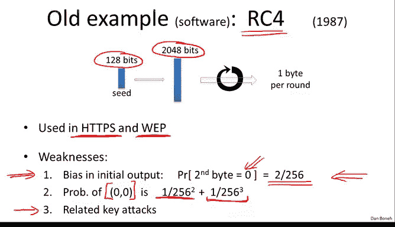
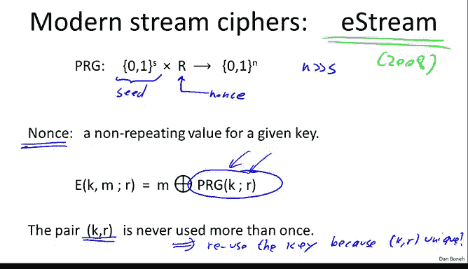
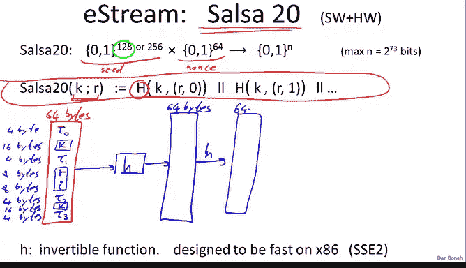
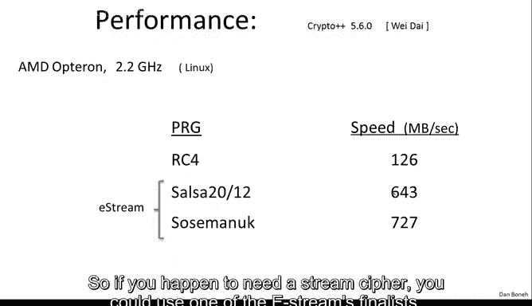

# 斯坦福大学《密码学｜Cryptography 1》中英字幕 - P9：09_01_01_现实世界中的流密码.zh_en - GPT中英字幕课程资源 - BV1Rf421o79E

In this segment， I want to give a few examples of stream cipherers that are used in practice。

I'm going to start with that two old examples that are actually are not supposed to be used in new systems。

 but nevertheless they're still fairly widely used。

 and so I just want to mention the names so that you're familiar with these concepts。

 The first streamtypher I want to talk about is called RRC4 design back in 1987 and I'm only going to give you the high level description of it and then we'll talk about some weaknesses of RRC4 and leave it at that。

 So RRC4 takes a variable sized seed here I just gave us an example where it would take 128 Bs as the seed size which would then be used as the key for the streamtypher The first thing it does is it expands the 128 B secret key into 2048 B。

 which are going to be used as the internal state for the generator and then once it's done this expansion。

 it basically executes a very simple loop where every iteration of this loop outputs one by of output So essentially you can run the generator for as long as you want and generate one by at a time。

Now RRC4 is actually， as I said， fairly popular。 It's used in the HttPS protocol quite commonly actually。

 these days， for example， Google uses RC4 and its HttPS and it's also used in web as we discussed in the last segment but of course in web it's used incorrectly and it's completely insecure the way it's used inside of web。

 So over the years some weaknesses have been found in RRC4 and as a result it's recommended a new project actually not use RRC4 but rather use a more modern pseudo random generator is as we'll discuss towards the end of the segment。

 So let me just mention two of the weaknesses So the first one is it's kind of bizarre basically if you look at the second byte of the app of RRC4。

 It turns out the second byte is slightly biased。 if RRC4 was completely random。

 the probability that the second byte happens to be equal to0 would be exactly one over 256 there are 256 possible bytes the probability that the zero should be1 over 256 It so happens that for RRC4。

Probability is actually two over 256， which means that if you use the RC4 outputs to encrypt a message。

 the second byte is likely to not be encrypted at all。 In other words。

 it' will be xor with0 with twice the probability that it's supposed to So over 256 instead of one over 256 and by the way I should say that there's nothing special about the second byte it turns out the first and the third bytes are also biased and in fact it's now recommended that if you're going to use RC4 what you should do is ignore basically the first 256 bytes of the output and just start using the output of the generator starting from by 257。

 The first couple of bytes turned out to be biased so you just ignore them。

The second attack that was discovered is that in fact， if you look at a very long output of RC4。

 it so happens that you're more likely to get the sequence 00 In other words。

 you're more likely to get 16 Bs2 Bte of 00 then you should again if RRC4 was completely random。

 the probability of seeing 00 would be exactly one over 256 squared。

 It turns out RC4 is a little biased and the bias is1 over 256 cubed。

 It turns out this bias actually starts after several gigabytes of data are produced by RRC4 but nevertheless this is something that can be used to predict a generator and definitely it can be used to distinguish the output of the generator from truly random sequence。

 Basically the fact that 00 appears more often than it should gives a distinguisher。

And then in the last segment， we talked about related key attacks that were used to attack web that basically say that if one uses keys that are closely related to one another。

 then it's actually possible to recover the root key。

So these are the weaknesses that are known about RRC4 and as a result it's recommended that new systems actually not use RRC4 and instead use a modern pseudoranum generator second example I want to give you is a badly broken stream cipher that's used for encrypting DVD movies when you buy a DVD in the store the actual movie is encrypted using a stream cipher called the content scramblingling system CSS CSS turns out to be a badly broken streamcipher and we can very easily break it and I want to show you how the attack algorithm works We're doing it so that you can see an example of an attack algorithm but in fact there are many systems out there that basically use this attack to decry encrypted DVDs。

So the CSS streamcipher is based on something that hardware designers like。

 it's designed to be a hardware streamcipher that's supposed to be easy to implement in hardware and is based on a mechanism called a linear feedback shift register。

 so a linear feedback shift register is basically a register。

That consists of cells where each cell contains one bit。

And then basically what happens is there are these taps into certain cells， not all the cells。

 certain positions are called taps。And then these taps feed into an Xor。

 and then in every clock cycle， the shift register shifts to the left， the last bit falls off。

 and then the first bit becomes the result of this XO。

So you can see that this is a very simple mechanism to implement and hardware it takes very few transistors。

 just a shift right， the last bit falls off and the first bit just becomes the Xor of the previous bits。

 So the seed for this LFSR basically is the initial state。Of the LFSR， initial this state of LFSR。

And it's the basis of a number of dream siphers So here are some examples。

 So as I said DVD encryption uses two LSRrs I'll show you how that works in just a second GSM encryption these are algorithms called a51 and a52 that uses three LSRrs Bluetooth encryption is an algorithm called E0 these are all stream ciphers and that uses four LSRrs turns out all of these are badly broken and actually really should not be trusted for encrypting traffic but they're all implemented in hardware so it's a little difficult now to change what the hardware does but the simplest of these CSS actually has acute attack on it So let me show you how the attack works So let's describe how CSS actually works So the key for CSS is5 bytes namely 40 bit5 times8 it's 40 bits The reason they had to limit themselves to only 40 bits is that DVD encryption was designed in a time where US export regulations only allowed for export of crypto algorithms where the key was only 40 bits so the designers of。

we're already limited to very， very short keys， just 40 bit keys。So their design works as follows。

 basically CSS uses two LFSRs， one is a 17 bit LFSR， in other words the register contains 17 bits。

 and the other one is a 25 bit LFSR， it's a little bit longer， 25 bit LFSR。

And the way these LSRs are seated is as follows， so the key for the encryption basically looks as follows you start off with a one and you can catate to it the first two bytes of the key。

First， two Bs。But the key。And that's the initial state of the LSR。

 And then the second LSR basically is initialized the same way。 One concatenated the last。

Three bys of the key。3 Bs of key and that's loaded into the initial state of the LSR。

 you can see that the first two bytes is 16 Bs plus leading one， that's 17 bits overall。

 whereas the second LR is 24 B plus one， which is 25 B。

 And you notice we used all five bits of the key。 So then these LSRrs are basically run for 8 cycles。

 So they generate 8 bits of output。And then they go through this adder that does basically addition modular 256。

Yeah， so this is an addition box Moo 256。 There's one more technical thing that happens。 In fact。

 what's actually also added is the carry from the previous block， but that is not so important。

 That's a detail。 That's not so relevant。Okay， so every block。

 you notice we're doing addition module 256。 So we're ignoring the carry。

 but the carry is basically added either at0 or 1 to the addition of the next block Okay。

 and then basically this output 1 byte。Upper。Okay， and this byte is then， of course， used。

 its exor with the appropriate byte of the movie that's being encrypted。 Okay。

 so it's a very simple stream sipher。 It takes very little hardware to implement。 It'll run fast。

 even on very cheap hardware。 and it will encrypt movies。 So it turns out this is easy to break。

In time， roughly2 to the 17。And roughly two to the 17 time， let me show you how。

So suppose you intercept a movie， so here we have an encrypted movie that you want to decrypt。

 so let's say that this is all encrypted so you have no idea what's inside of here。

However， it so happens that just because DVD encryption is using MPpeG files。

 it so happens that you know a prefix of the plain text， let's just say maybe this is 20 bytes。Well。

 we know that if you exhort these two things together， so in other words you do the XO here。

 what you'll get is the initial segment of the PRG。

 so you'll get the first 20 bytes of the output of CSS， the output of this PRG。Okay。

 so now here's what we're going to do， so we have the first 20 bytes of the output。

And now we do the following， we try all two to the 17 possible values of the first LFSR。Okay。

 so two to the 17 possible values。 So for each value。

 so for each of these two to the 17 initial values of the LFSR。

 we're going to run the LFSR for 20 bytes。 Okay， so we'll generate 20 bytes of outputs。

From this first LR， assuming for each one of the two to the 17 possible settings。Now， remember。

 we have the full output of the CSS system， so what we can do is we can take this output that we have。

😊，and subtract it from the 20 bytes that we got from the first LFSR， and if in fact。

 our guess for the initial state of the first LSR is correct。

 what we should get is the first 20 byte output of the second LSR。Because that's by definition。

 what the output of the CSS system is。Now， it turns out that looking at a 20 by sequence。

 it's very easy to tell whether this 20 by sequence came from a 25 bit LSR or not。 If it didn't。

 then we know that our guess for the 17 B LSR was incorrect。

 And then we move on to the next guest for the 17 B LSR and the next guest and so on and so forth。

Until eventually we hit the right initial state for the 17 bit LSR and then we'll actually get。

 we'll see that the 20 bytes that we get as the candidate output for the 25 bit LSR is in fact a possible output for a 25 bit LSR and then not only will we have learned the incorrect initial state for the 17 bit LSR。

 we will have also learned the correct initial state of the 25 bit LSR and then we can predict the remaining output of CSS and of course using that we can then decrypt the rest of the movie。

 we can actually recover。The remaining plain text， Okay， this is things that we talked about before。

So I said this a little quick， but hopefully it was clear we are also going to be doing a homework exercise on this type of Dream ciphers and you'll kind of get the point of how these attack algorithms work。

And I should mention that there are many open source systems now that actually use this method to decrypt CSS encrypted data。

Okay， so now that we've seen two weak examples， let's move on to better examples and in particular the better pseudoran generators come from what's called the estreamream project。

 this is a project that concluded in 2008。And they qualified basically five different stream ciphers。

 But here I want to present just one。 So， first of all。

 the parameters for these stream ciphers are a little different from what we're used to。

 So these stream ciphers， as normal， they have a seed。But in addition。

 they also have what's called a nonce。 and we'll see what the noance is used for in just a minute。

 So they take two inputs， a seed and a nonce。We'll see what the noise is used for in just a second and then of course the produce a very large output so and here is much much。

 much bigger than S。Now， when I say non， what I mean is a value that's never going to repeat as long as the key is fixed。

 and I'll explain that in more detail in just a second。

 but for now just think of it as a unique value that never repeats as long as the key is the same。

And so， of course， once you have this PRG， you would encrypt， you get a stream cipher just as before。

 except now， as we see， the PRG takes as input， both the key and the nonce。

 and the property of the nonce is that the pair。K comma R。 So the key comma。

 the nunce is never never repeats。 It's never used more than once。

 So the bottom line is that you can reuse the key。Reuse the key。

Because the nunce makes the pair unique because。K and R are only used once。 I'll say they're unique。

Okay， so this nu is kind of a Q trick that saves us the trouble of moving to a new key every time。

Okay so the particular example from the E stream that I want to show you is called salsa 20。

 It's a streamcipher that's designed for both software implementations and hardware implementations。

 It's kind of interesting you realize that some stream sipherers are designed for software like RC4。

 everything it does is designed to make software implementation run fast where some other stream ciphers are designed for hardware like CSS using an LFSR that's particular designed to make hardware implementations very cheap Salsa。

 the nice thing about that is that it's designed so that it's both easy to implement it in hardware and its software implementation is also very fast。

So let me explain how salsa works while salsa takes either 128 or 256 bit keys。

 I'll only explain the 128 bit version of salsa， so this is the seed。

And then it also takes a ounce just as before， which happens to be 64 bits。

 and then it'll generate a large output Now how does it actually work while the function itself is defined as follows。

Basically， given the key and the nuuns。It will generate a very long， well。

 a long pseudo random sequence as long as necessary。

 and it'll do it by using this function that I'll denote by H。 just function H takes three inputs。

 basically the key， well， the seed K， the nonnce R。

 and then a counter an increments from step to step。 So it goes from 0123。

4 as long as we need it to be。 Okay， so basically by evaluating this H on this Kr but using this increment encounter。

 we can get a sequence that's as long as we want。 So all I have to do is describe how this function H works。

 let me do that here for you。 The way it works is as follows。

 well we start off by expanding the state into something quite large， which is 64 by long。

 and we do it as follows。 basically we stick a constant at the beginning。 So there's tau 0。

 These are 4 bytes。 It's a 4 byte constant。 So the spec first also basically gives you the value for tau 0。

 Then we put k in， which is 16 bytes。Then we put another constant， again， this is four bytes。

And as I said， the spec basically specifies what this fixed constant is， then we put the nonce。

 which is8 bytes。Then we put the index， this is theer is 0，1，2，3，4， which is another8 bytes。

 Then we put another constant T 2， which is another four bytes。Then we put the key again。

This is another 16 bytes。And then finally， we put the third constant T 3。

 which is another four bytes。Okay， so as I said， if you sum these up， you see that you get 64 bytes。

 so basically we've expanded the key and the nodes in the counter into 64 bytes。

 basically the key is repeated twice， I guess。And then what we do is we apply a function。

 I'll call this function little H。Okay， so we apply this function， little H。

 and this is a function that's one to one。 So it maps 64 bys to 64 bys。

It's a completely invertible function。 Okay， so this function H。I as I say。

 it's an invertible function。 So given the input， you can get the output and given the output。

 you can go back to the input and it's designed specifically。

 So it's a easy to implement in hardware and B on an X 86。

 It's extremely easy to implement because X86 has this SSE2 instruction sets which supports all the operations you need to do for this function H's very。

 very fast as a result also as a very fast streamcipher And then it does this basically again and again。

 So it implies this function H again， it gets another 64 bytes and so on and so forth。

 basically it does this 10 times。

Okay， so the whole thing here I'll say repeats 10 times。 So basically apply。H 10 times。

And then by itself， this is actually not quite random。

 it's not going to look random because like we said H is completely invertible。

 so given this final output， it's very easy to just invert H and go back to the original input and then test that the input has the right structure。

So you do one more thing， which is to basically exhor the inputs and the final outputs。Actually。

 so it's not an exc， it's actually an addition， so you do an addition word by word。

 so there are 64 bytes， you do a word by word addition。

 four bytes at a time and finally you get the 64 byte output， that's it。That's the whole。

Suderran generator。 So that's the whole function， little H。 And as I explained。

 this whole construction here is the function big H。

 And then you evaluate big H by incrementing the counter I from 0，12，3 onwards。

 and that will give you a pseudoran sequence that's as long as you need it to be。

And basically there are no significant attacks on this。

 this has security that's very close to2 to the 128。

 we'll see what that means more precisely later on， but it's a very fast streamcipher。

 both in hardware and in software， and as far as we can tell seems to be unpredictable as required for a streamcipher。

So I should say that the Estreamam project actually has five stream ciphers like this I only chose salsa because I think it's the most elegant but I can give you some performance numbers here so you can see these are performance numbers on a 2。

2 gigahertz X86 type machine and you can see that RRC4 actually is the slowest because essentially well it doesn't really take advantage of the hardware it only does by operations and so there's a lot of wasted cycles that aren't being used but the estream candidates。

 both salsa and another candidate called Soamanook I should say these are estream finalists。

 these are actually stream ciphers that are approved by the e stream project you can see that they achieve a significant rates。

 this is 643 megabytes per second on this architecture more than enough for a movie and these are actually quite impressive rates and so now you've seen examples of two oldSt ciphers that shouldn't be used including attacks on those stream ciphers you've seen what the modern stream ciphers look like with this nons and you see the performance numbers for these modern streams。

So if you happen to need a stream cipher， you could use one of the EStreams finalists。

 in particular you could use something like salelsa。

