# 计算机科学导论：L1.1：比特、字节与二进制：0和1的世界 🔢

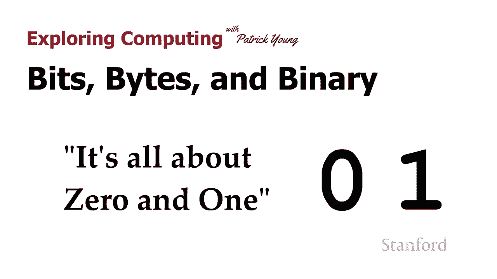

在本节课中，我们将要学习计算机如何表示和处理信息的基础。一切数字信息，从你看到的文字到播放的视频，其根源都归结为最简单的两种状态：0和1。我们将探讨为什么计算机使用二进制系统，以及比特和字节这两个核心概念。

## 计算机使用二进制系统

计算机使用二进制数字系统。让我们看看二进制数字是什么样子。我们将从比较十进制数字开始，这是我们习惯的数字系统。

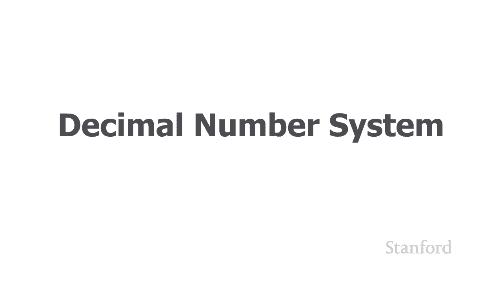

在十进制数字系统中，有10个不同的数字：0到9。所有你习惯看到的数字都由这10个不同的数字组成。

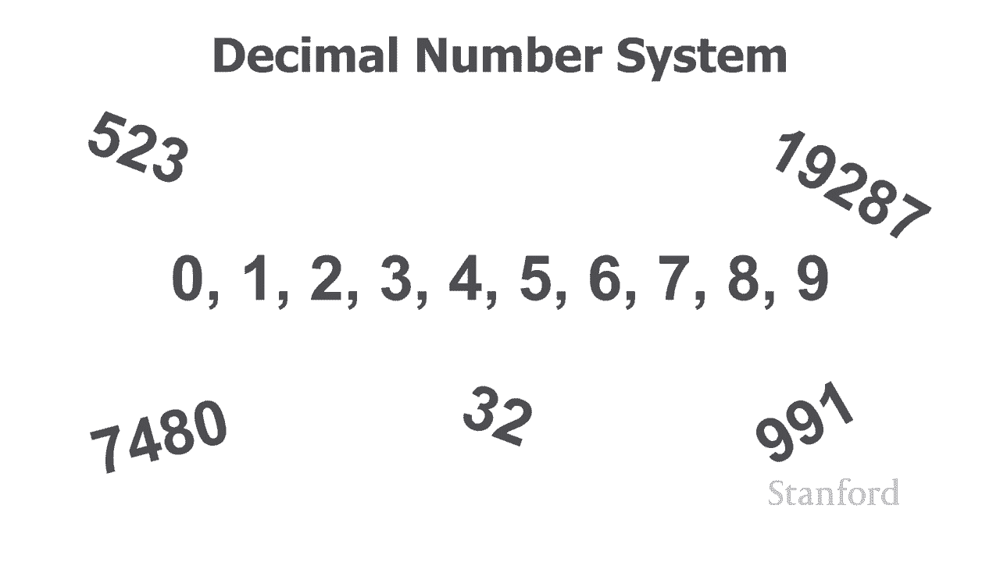

我们有时也将这个数字系统称为 **基数为10** 的系统。

## 二进制系统：只有0和1

相比之下，计算机使用二进制数字系统。在二进制数字系统中，只有两个数字：0和1。

以下是一些使用二进制数字系统可以构成的不同类型数字的例子：
*   101
*   1101
*   100101

我们将在另一个视频中详细探讨这些数字如何工作以及它们的含义。但现在，只需认识到二进制数字系统中的所有数字仅由两个数字0和1组成。

正因为只有两个数字，我们有时将使用这个数字系统的数字称为 **基数为2** 的数字。

## 为什么计算机使用二进制？

接下来，我们来看看为什么计算机使用二进制数字系统。

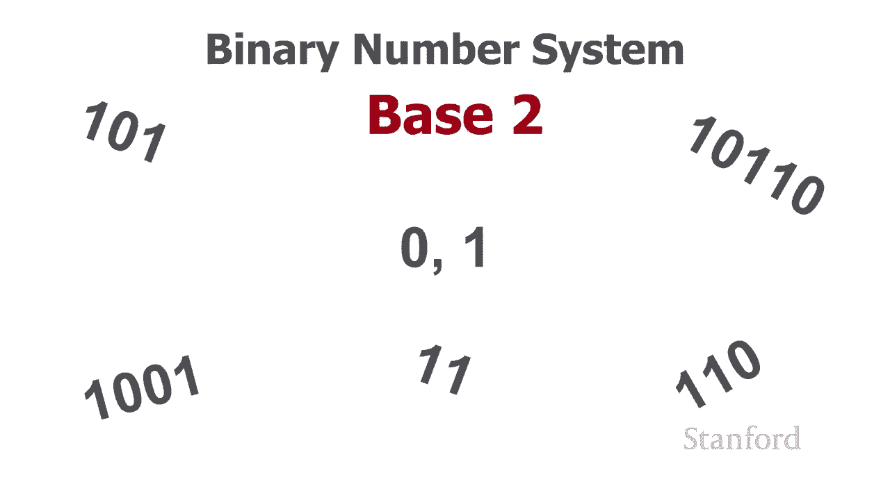

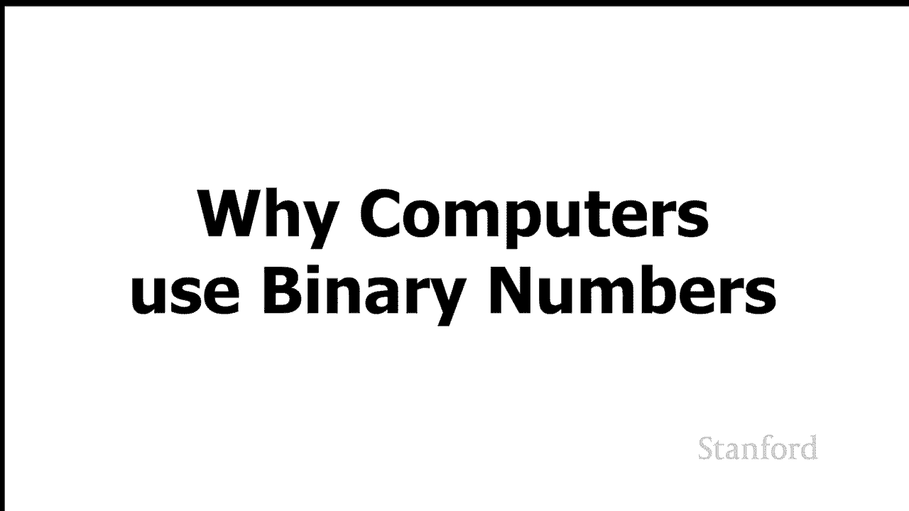

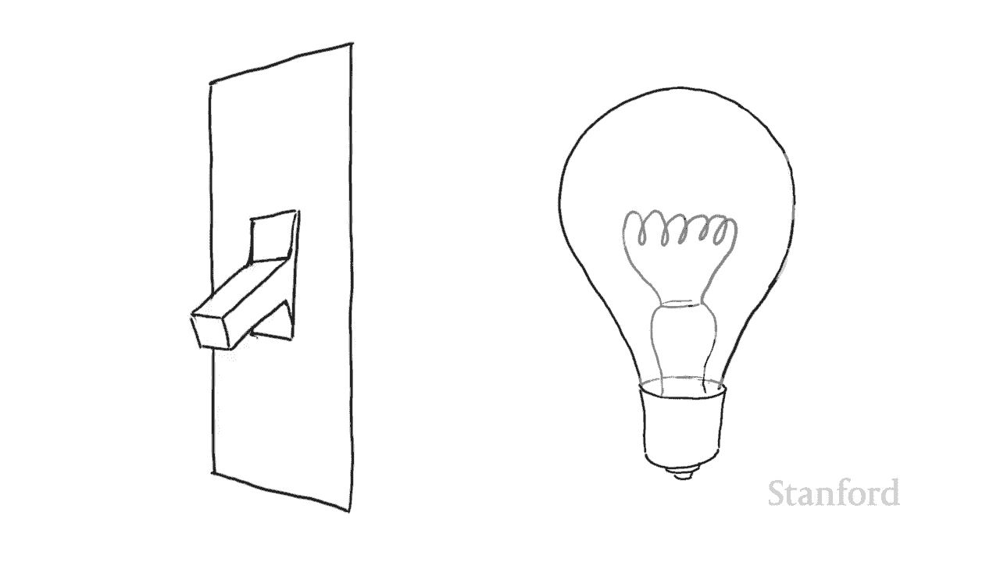

如果我们打开计算机并查看计算机内存，我们会发现计算机内存实际上由一大堆独立的电子开关组成。我们可以把这些电子开关想象成和你的电灯开关没有太大不同。

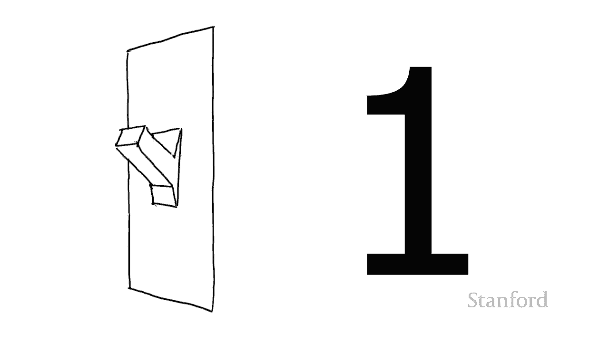

就像墙上的电灯开关可以打开或关闭一样，计算机内部的开关也可以打开或关闭。当开关关闭时，我们认为它代表数字 **0**；当开关打开时，我们认为它代表数字 **1**。

因此，我们的每个开关都对应一个**单个数字**。由于这些数字只能是0或1，所以它们是二进制数字。我们将“二进制数字”缩写为 **比特**。

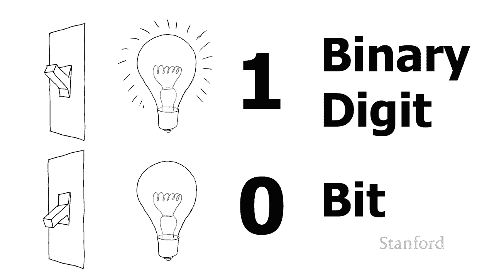

所以，当你听到有人谈论比特时，他们谈论的就是一个0或1，或者是计算机内部用于存储那个0或1的内存。

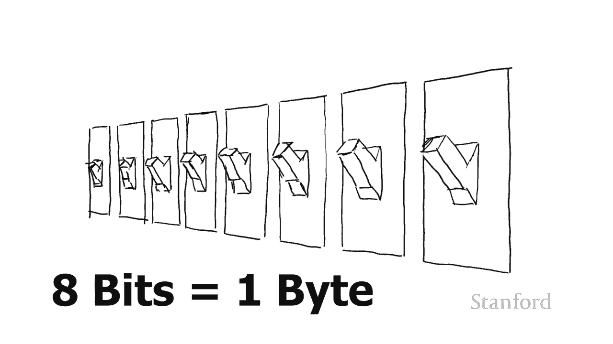

## 从比特到字节

现在，仅用一个比特我们做不了太多事情。因此，我们将比特组合成组。比特的主要分组是一组 **8个比特**，这被称为一个 **字节**。

字节是计算机存储的主要度量单位。

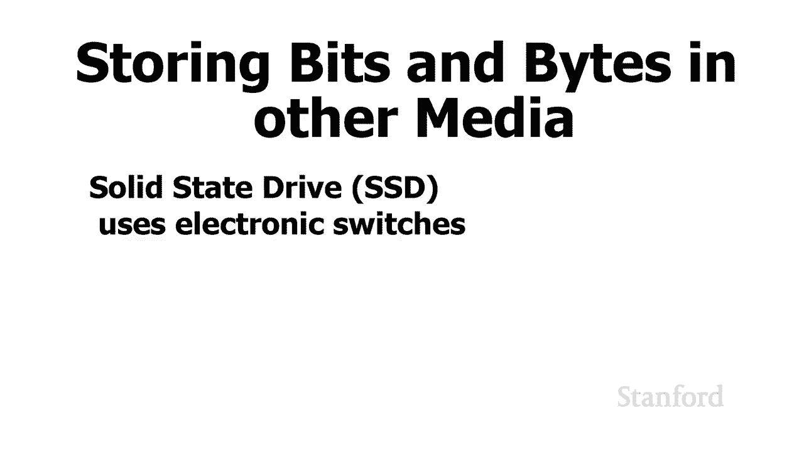

## 所有数字媒介都存储比特和字节

虽然我一直在描述计算机主内存内部的情况，但所有计算机数据最终都以比特和字节的形式存储。

我们使用各种不同的媒介来存储数字信息。在每种情况下，该数字媒介都需要被设置为存储0和1，即比特和字节。

*   **固态硬盘**：大多数笔记本电脑内部使用的就是固态硬盘。它基本上使用电子方式存储信息，这与我们前面描述的非常相似。
*   **机械硬盘**：如果你打开一个机械硬盘，你会发现磁盘本身有被磁化的独立扇区。根据磁极方向，如果磁极朝一个方向，它被视为0；如果磁极朝相反方向，它被视为1。
*   **光盘**：如果我们仔细观察CD、DVD或蓝光光盘，我们会发现光盘由许多不同的区域组成，这些区域要么被称为“凹坑”，要么被称为“平面”。根据光盘该区域是凹坑还是平面，我们最终用这些凹坑和平面来表示0和1。

所以，再次强调，计算机使用的所有信息最终都将存储为这些0和1，即比特，并且它们将被组织成称为字节的8位一组。

## 总结与预告

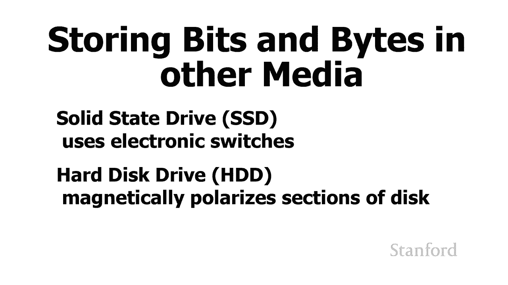

本节课中，我们一起学习了计算机信息表示的基础。我们了解到计算机使用**二进制系统**，仅由**0和1**两个数字构成。计算机内存中的电子开关用开/关状态对应这两个数字，每个开关的状态就是一个**比特**。为了存储更复杂的信息，8个比特被组合成一个**字节**，这是计算机存储的基本单位。无论是内存、硬盘还是光盘，所有数字媒介最终都以比特和字节的形式存储数据。

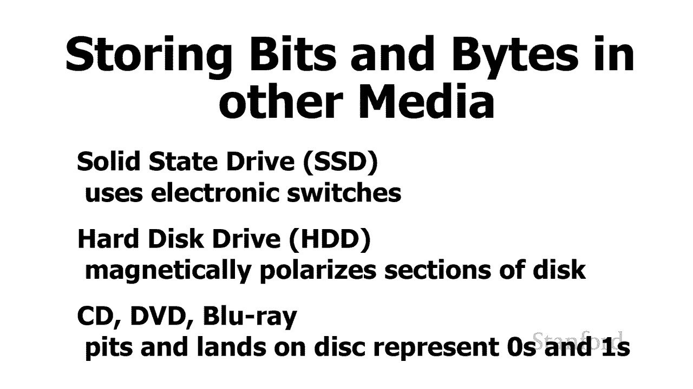

虽然我们的第一个视频相当简短，但本讲座中的其他视频会更长。在下一个视频中，我们将深入了解二进制数字的实际工作原理。