# 计算机科学导论：L1.2：比特、字节与二进制

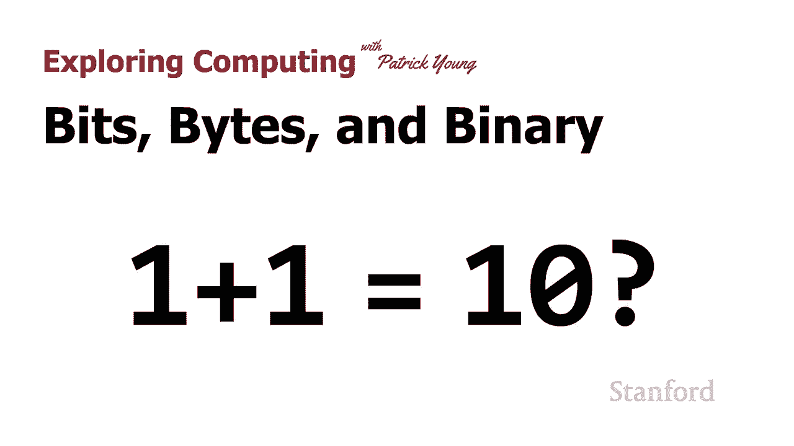

在本节课中，我们将要学习计算机信息表示的基础：比特、字节与二进制数系统。我们将了解二进制如何工作，它与我们熟悉的十进制系统有何不同，以及为什么它在计算机科学中如此重要。

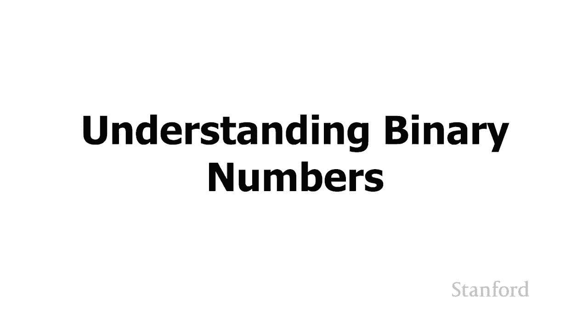

## 概述

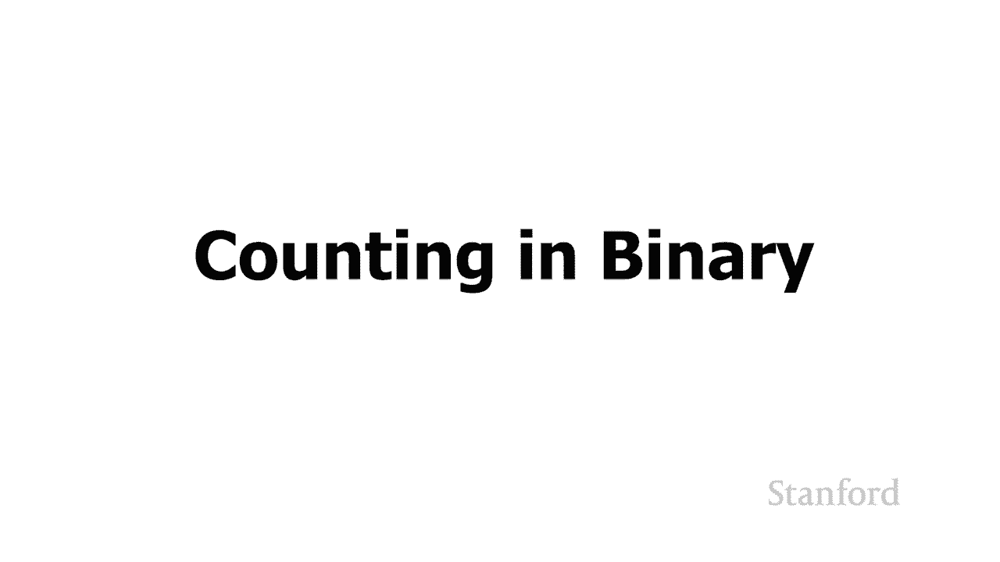

计算机内部使用二进制系统处理所有信息。本节将解释二进制数的基本原理，包括如何计数、如何与十进制数转换，以及比特组合如何表示各种数据。

## 从十进制到二进制

在上一课中，我们了解了计算机为何使用二进制数系统。本节中，我们将仔细看看二进制数的实际工作原理。虽然这会涉及一些数学，但理解二进制数如何工作，以及它们可能代表什么，对于后续学习计算机中的数据表示非常有用。二进制系统在计算机中无处不在，数据的底层表示都使用这些二进制数。

### 回顾十进制计数

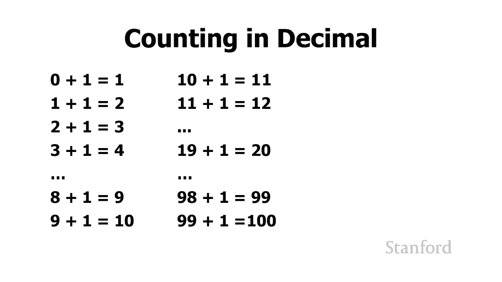

为了理解二进制计数，首先回顾我们熟悉的十进制计数会很有帮助。十进制系统使用0到9这十个数字。

我们从0开始，加1得到1。再加1得到2，依此类推，直到9。当我们尝试将1加到9时，会遇到一个问题：没有第十一个数字。因此，我们执行“进位”操作：将个位的9重置为0，并向十位进1，最终得到10。

这个过程会持续下去。例如，19加1时，个位9加1再次需要进位，我们得到20。99加1时，个位和十位都无法再容纳更大的数字，所以我们从十位向百位进位，最终得到100。

### 二进制计数原理

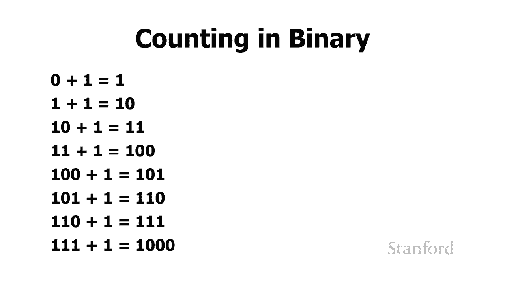

现在让我们来看看它在二进制中是如何工作的。二进制系统只有两个数字：0和1。

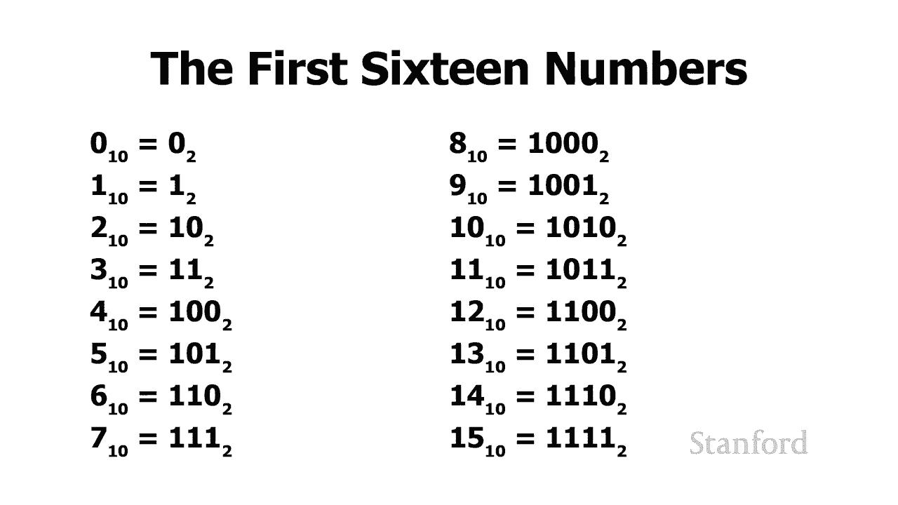

我们同样从0开始，加1得到1（`0 + 1 = 1`）。这与十进制类似。但下一步，当我们尝试计算 `1 + 1` 时，问题出现了。二进制中没有数字“2”，只有0和1。这类似于十进制中 `9 + 1` 的情况。

因此，我们需要执行进位操作：将1加到1的结果是 `10`（读作“一零”）。我们可以继续：
*   `10 + 1 = 11`
*   `11 + 1` 时，又需要进位，得到 `100`

以下是二进制数系统的前几个数字（对应十进制0到15）：
*   `0` -> 0
*   `1` -> 1
*   `10` -> 2
*   `11` -> 3
*   `100` -> 4
*   `101` -> 5
*   `110` -> 6
*   `111` -> 7
*   `1000` -> 8
*   `1001` -> 9
*   `1010` -> 10
*   `1011` -> 11
*   `1100` -> 12
*   `1101` -> 13
*   `1110` -> 14
*   `1111` -> 15

我们有时使用下标来澄清数字使用的进制，避免混淆。例如：
*   `6₁₀` 表示十进制数字6。
*   `110₂` 表示二进制数字“一一零”，而不是十进制的一百一十。

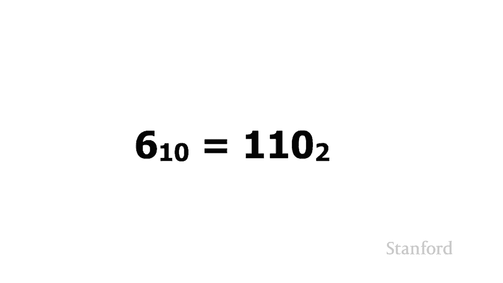

## 二进制与十进制的转换

了解不同进制数字之间的等价性很重要。让我们看看如何进行转换。

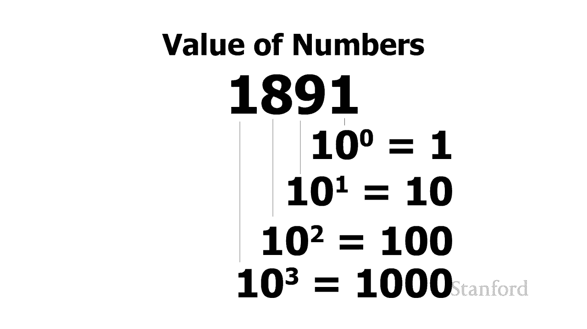

### 十进制数的位值原理

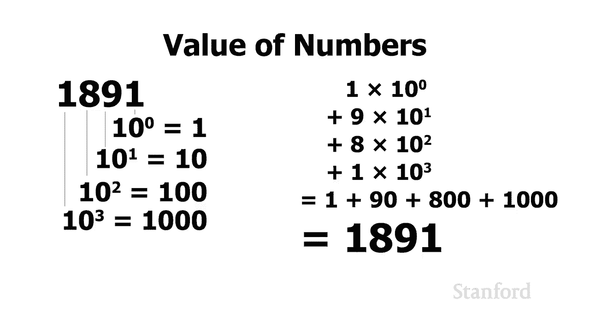

首先，回顾十进制系统。数字 `1891` 中，每个位置代表10的不同次幂：
*   最右边是个位：`1 × 10⁰ = 1`
*   然后是十位：`9 × 10¹ = 90`
*   接着是百位：`8 × 10² = 800`
*   最左边是千位：`1 × 10³ = 1000`
*   总和：`1 + 90 + 800 + 1000 = 1891`

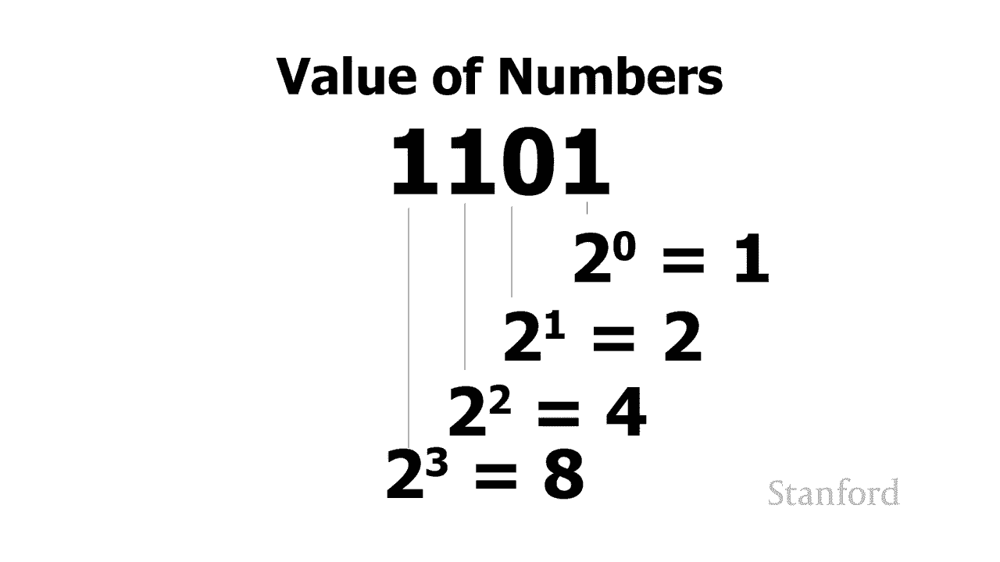

### 二进制数的位值原理

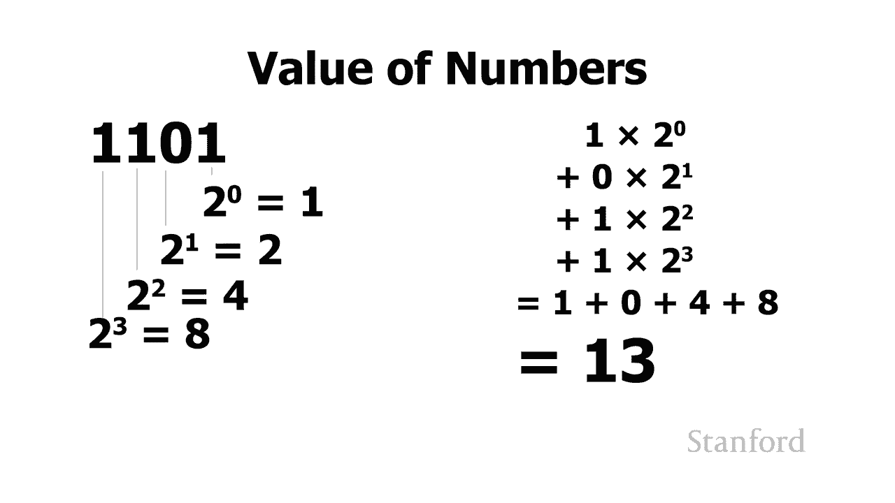

二进制系统使用相同的位值原理，但基数是2。以二进制数 `1101` 为例：
*   最右边是第0位：`1 × 2⁰ = 1`
*   然后是第1位：`0 × 2¹ = 0`
*   接着是第2位：`1 × 2² = 4`
*   最左边是第3位：`1 × 2³ = 8`
*   总和：`1 + 0 + 4 + 8 = 13`

因此，二进制数 `1101₂` 等价于十进制数 `13₁₀`。

## 比特的组合与信息表示

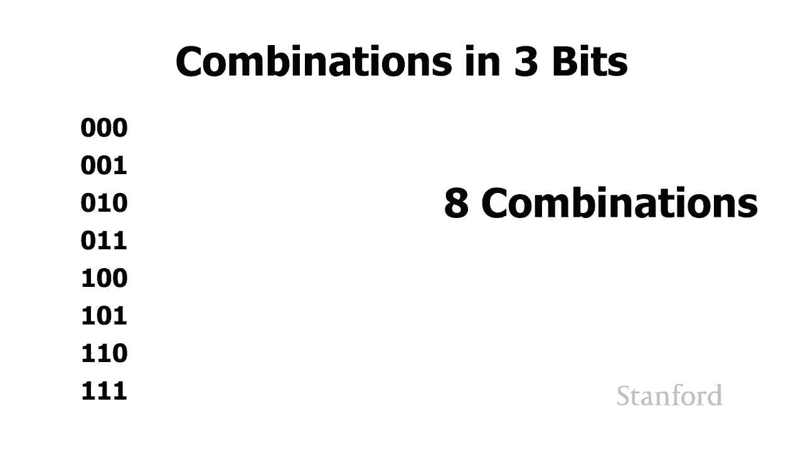

理解了二进制数本身后，一个关键问题是：给定数量的比特（二进制位）可以表示多少种不同的信息组合？这决定了我们能存储或表示多少种不同的东西。

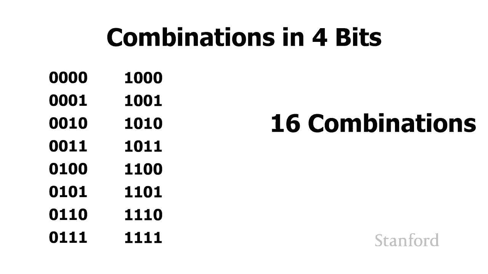

以下是不同数量比特可表示的组合数：
*   **1位**：可以表示 `0` 或 `1` 两种状态。常用来表示 **真/假**、**是/否**。
*   **2位**：可以表示 `00`、`01`、`10`、`11` 四种组合。
*   **3位**：可以表示八种组合（`000` 到 `111`）。
*   **4位**：可以表示十六种组合（`0000` 到 `1111`），对应十进制0到15。

这里有一个通用公式：**如果有 `n` 位，就可以表示 `2ⁿ` 种不同的组合**。

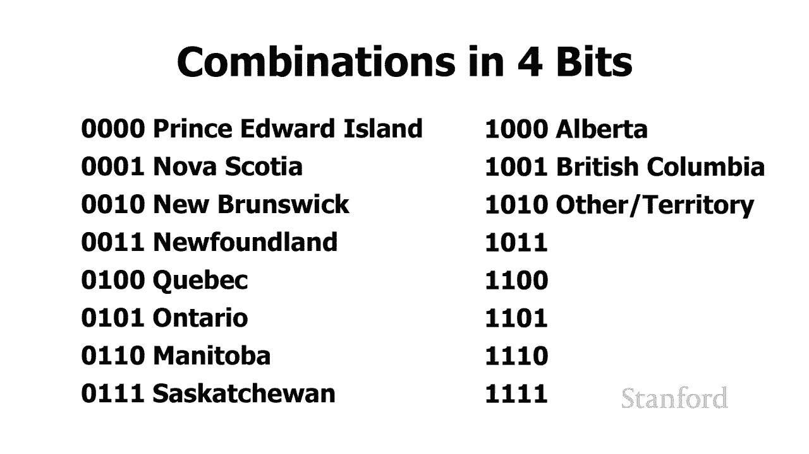

这些组合不仅可以表示数字（正数、负数），还可以表示任何我们定义的事物。例如：
*   用4位可以表示加拿大的10个省和3个地区（共13种，小于16种）。
*   用4位无法表示美国的50个州（需要至少6位，因为 `2⁶ = 64 > 50`）。

程序员在设计程序时，必须决定为某项信息分配多少比特，以及如何用这些比特序列来编码信息（如数字、省份、宿舍等）。

## 计算机存储中的2的幂

你可能注意到，计算机存储设备的容量常常是128、256、512等数字，而不是100、250、500。这是因为这些数字是2的幂（`2⁷=128`, `2⁸=256`, `2⁹=512`），与计算机内部的二进制处理方式更匹配。

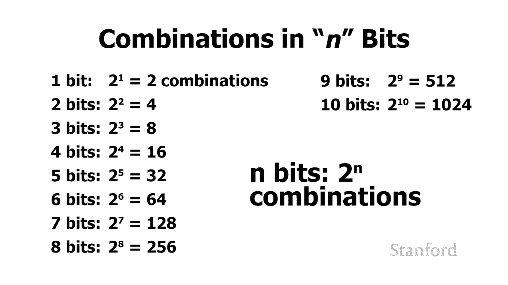

同样，存储单位也使用基于2的幂的命名：
*   1 千字节 ≈ `2¹⁰` = 1024 字节（约一千）
*   1 兆字节 ≈ `2²⁰` = 1,048,576 字节（约一百万）
*   1 吉字节 ≈ `2³⁰` = 1,073,741,824 字节（约十亿）
*   1 太字节 ≈ `2⁴⁰` = 1,099,511,627,776 字节（约一万亿）

需要注意的是，在某些领域（如网络带宽、硬盘制造商），`千`、`兆`、`吉`可能指10的幂（1000, 1,000,000, 1,000,000,000），这有时会造成混淆。但在计算机内存和大多数软件语境中，通常指的是2的幂。

## 总结

本节课中，我们一起学习了：
1.  **二进制计数**：二进制只有0和1，遵循“逢二进一”的规则。
2.  **进制转换**：利用位值原理（`数字 × 基数^位置`）可以在二进制和十进制间转换。
3.  **比特与组合**：`n` 位二进制可以表示 `2ⁿ` 种不同组合，这些组合可被赋予各种含义（数字、状态、代码等）。
4.  **2的幂的应用**：计算机存储容量和单位常基于2的幂，这与二进制系统高效协同。

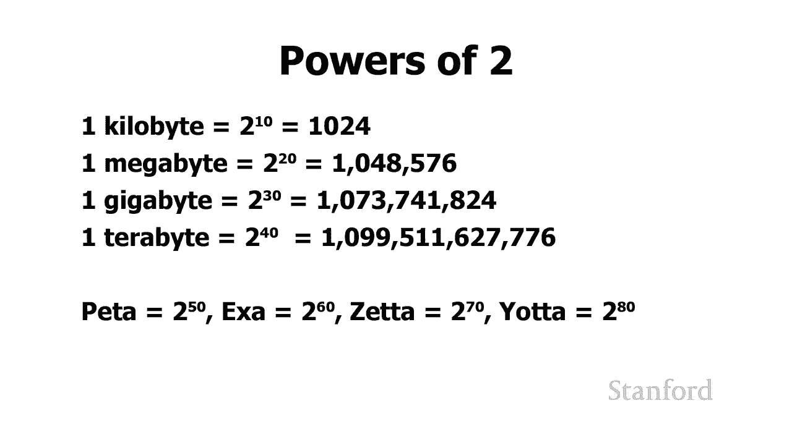

理解比特、字节和二进制是理解计算机如何表示和处理一切信息——从数字、文本到图像、声音——的基石。在接下来的课程中，我们将继续探索如何用这些基本的二进制位来表示更复杂的数据。