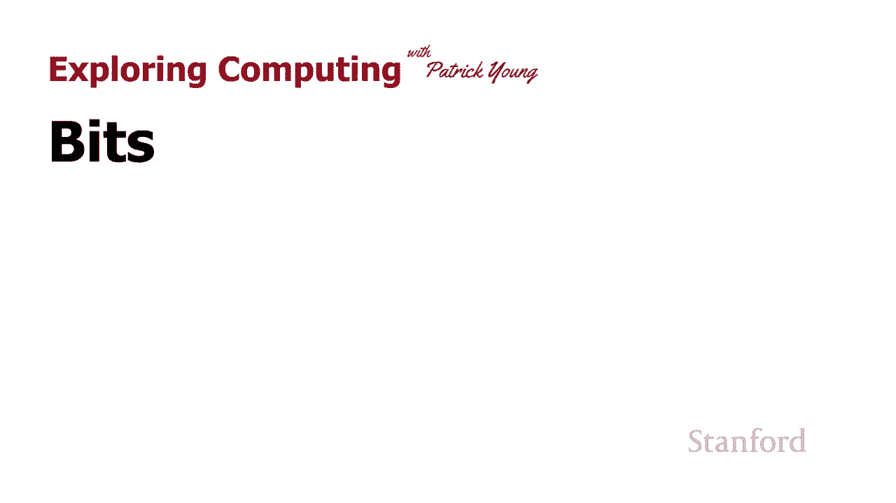
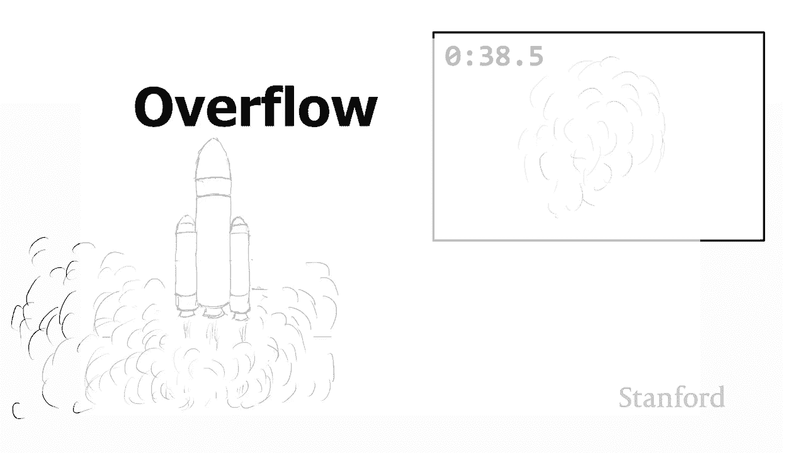
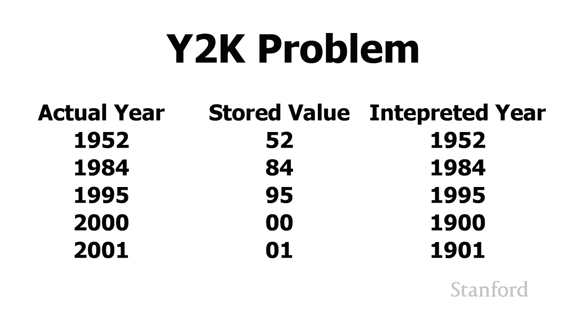
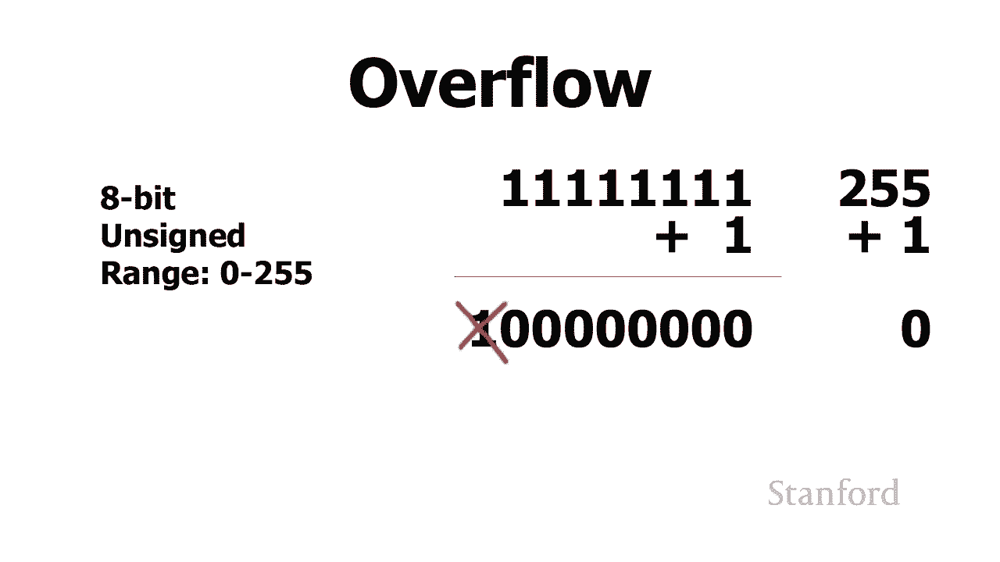
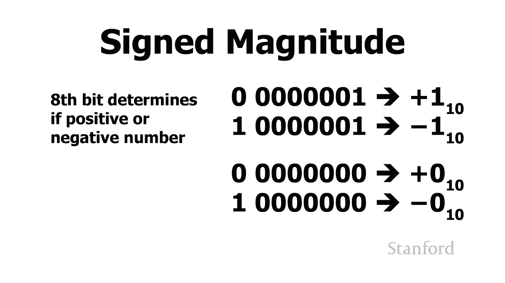
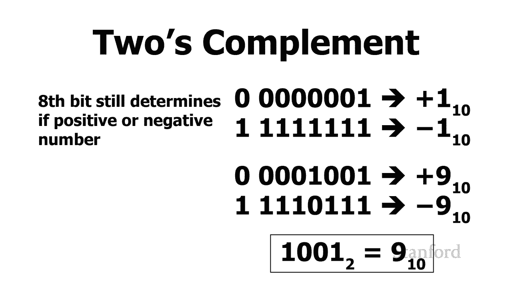
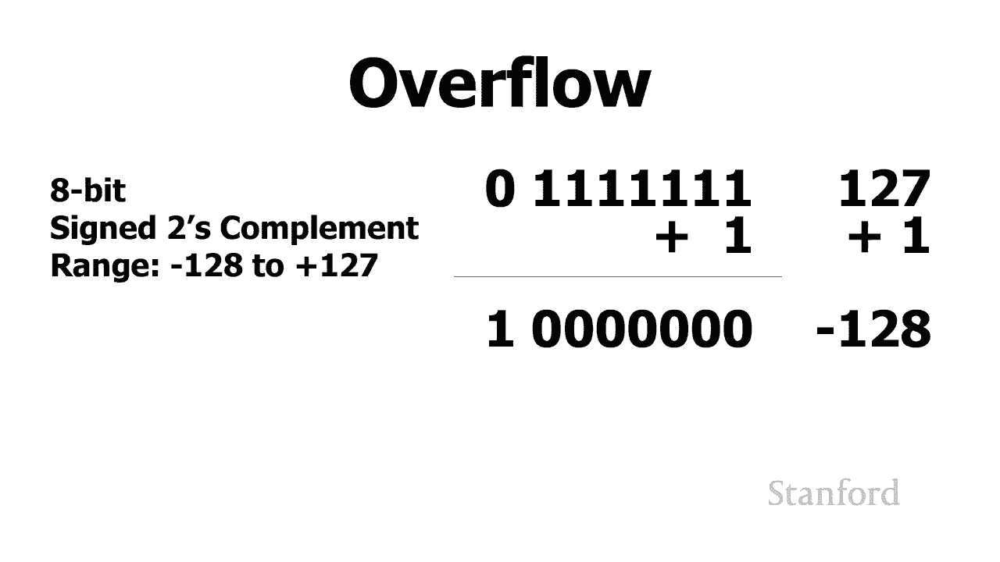
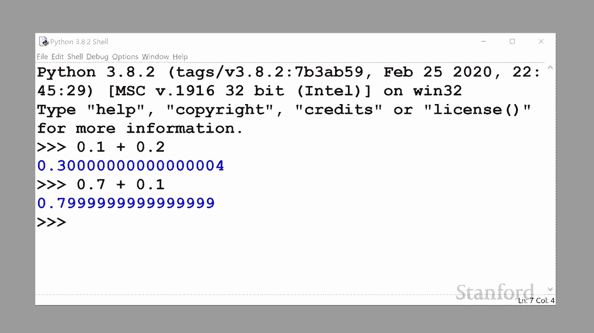
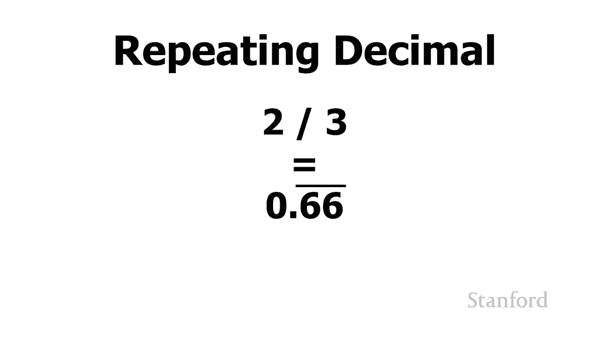
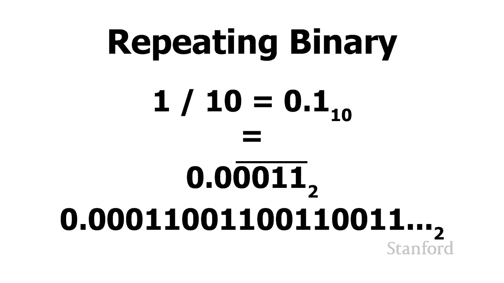

# 计算机科学导论：1.3：比特、字节与二进制：一场由16位引发的火箭事故 🚀

在本节课中，我们将学习计算机如何用比特和字节表示信息，并探讨当数据表示出现错误时可能引发的严重后果。我们将通过一个真实的火箭事故案例，深入理解“溢出”等核心概念。

## 概述

本节课程将从一个代价高昂的真实错误案例开始——1996年欧洲航天局阿丽亚娜5号火箭的发射失败。我们将分析其根本原因：程序员选择了错误的位数来存储数据。通过这个案例，我们将学习二进制表示、溢出错误，并了解与之相关的“千年虫”问题。最后，我们会探讨计算机在处理小数时可能出现的精度问题。

## 阿丽亚娜5号火箭事故

上一节我们介绍了二进制的基本原理，本节中我们来看看当数据表示出现问题时会发生什么。

1996年，欧洲航天局发射了新型火箭阿丽亚娜5号。这枚火箭搭载了四颗总价值3.7亿美元的卫星。发射初期看似顺利，但在飞行37秒后，火箭开始疯狂转向并最终解体，不得不被摧毁。

问题出在哪里？问题根源在于，控制火箭的一个程序试图用16位来存储一个信息。

## 理解16位存储的限制

正如你可能记得的，16位可以存储的最大数字是 **2^16**，这意味着我们可以存储 **0到65,535** 之间的数字。

虽然这个数字对于其前身阿丽亚娜4号来说足够大，但阿丽亚娜5号的性能特征使其运行得更快。它试图存储到一个16位位置的值，已经超出了该位置能容纳的范围。

当程序尝试将一个过大的值放入16位时，最终发生的情况称为“溢出”。

## 溢出与千年虫问题

溢出时可能发生的情况是：我们有一个非常大的数字，然后给它加一，最后却得到零；或者给一个大的正数加一，最后却得到一个大的负数。

这种现象还与另一个著名的问题有关，即“千年虫”问题。

“千年虫”问题的起因是：从上世纪50年代开始，程序员为了在计算机程序中节省空间，在存储年份时，没有用所有四位数字存储全年，而是只存储了后两位数字。

以下是其工作原理的一个示例：
*   假设程序员要存储年份1952，他们只存储“52”。
*   当从计算机内存中读取“52”时，程序会知道需要为其加上“19”。
*   这种模式持续了多年，例如1984年存为“84”，1995年存为“95”。

但当越来越接近2000年时，程序员意识到，如果只存储“00”而不修复程序，就会出问题。程序会认为“00”年代表1900年，而不是2000年。这就是“千年虫”问题。最终，我们不得不花费数百万美元重写计算机程序，以确保当2000年到来时，计算机不会认为我们回到了1900年代。

## 溢出是如何工作的

让我们看看溢出实际上是如何工作的。我将向你展示两种不同版本的溢出。

首先，看看当我们只存储正整数时会发生什么。我将使用8位来演示，这样更容易理解。

在8位中，如果只存储正数，我们可以存储从 **0到255** 的数字。假设我们将数字255存储在一个特定的位置。

数字255是8位中能存储的最大可能数字（所有位都是1）。然后我尝试给它加一。

如果你记得我们上一个关于如何在二进制中加法的视频，那么自然会发生的是：我们会产生进位。我们不断进位，直到最左边。你会看到，第九位被翻转为1，但我们没有第九位，我们只有八位。因此，第九位被丢弃了。

结果，我们从一个由所有位都是1组成的非常大的值（255），变成了一个由所有位都是0组成的非常低的值（0）。

所以，从十进制来看发生的情况是：我们有255，我们给255加1，但实际上我们最终得到了0。这就是溢出。

## 有符号整数溢出

对于下一个示例，我们将看看当我们有一个很大的正数，但将它存储在允许存储正数和负数的空间中时会发生什么。

同样，在这种特殊情况下，我将所有数据存储在一个字节中，这允许我们存储 **-128到127** 之间的数字。

在计算机上存储负数有许多不同的方法。最常见的一种叫做“二进制补码”。所有这些方案的关键点是：最左边的位将代表我们存储的是正数还是负数。

所以，我们现在要做的是，从最大的正数开始。最左边的位是0，代表这是一个正数。所有其他七位都是1，这代表正127。

然后我们继续给它加一。你可以看到这里发生了什么：最左边的位翻转为1，这意味着我们得到了一个负数。使用二进制补码表示，这实际上代表负128。

所以发生的情况是：我们有一个非常大的正数127，我们给它加了1，得到了128，但由于溢出，它变成了负128。这又是一个溢出的例子。

因此，当你使用计算机程序时，可能认为一切正常，但突然你的银行账户被重置为零，或者你的一百万美元变成了负一百万。这里可能发生的情况就是溢出，这可能意味着编写该程序的人没有做好充分的错误处理。

## 二进制小数的精度问题

我还有另一种错误想向你介绍。严格来说，这并非技术性错误，但我们将看到，当我们处理二进制数时，我们对结果应该是什么的直觉不一定正确。

我的意思是，我们将一些数字加在一起，结果在使用十进制时对我们来说应该非常明显，但我们会看到计算机对答案应该是什么有不同的想法。

我运行的是Python解释器，这是一种可以交互式输入Python编程语言命令的方法。CS105的学生将在本季度晚些时候使用这种编程语言。

我在这里要添加一些数字。让Python解释器计算0.1加上0.2。0.1加0.2自然是0.3。让我们看看Python解释器是否同意我们的意见。

再试另一个。让Python解释器将0.7加到0.1。这很清楚应该是0.8，对吧？让我们看看Python解释器得到了什么。

这里发生的事情是：我们可以用一组小数位数表示的数字，在十进制（基数为10）和二进制（基数为2）中是不同的。

你可能还记得，有些数字我们无法用固定的小数位数精确表示。例如，我让你写出三分之二的十进制等价物。你可能会说它是0.67，但这并不准确。0.66667是更准确的表示，实际上正确的表示是0.6（6循环），其中6上方的横杠代表一个无限循环的小数。

我们在这里遇到的问题，是二进制数具有与十进制数系统不同的循环特性。尤其是数字0.1，在十进制中它是有限的（0.1），但它在二进制中没有有限的表示。在二进制中，它是0.0（0011循环）。例如：0.0001100110011...，并且小数点后没有有限的位数。

所以这里发生的事情是：我们正在取这些数字（如0.7加0.1），并且我们得到了一个没有自然终点的数字表示。这就是为什么这些数字会略微偏离的原因。因此，程序员被警告在表示货币等需要精确计算的场合不要使用浮点数，因为你可能会得到这些细微的变化，从而导致错误。

显然，还有很多计算可能会出错，我们会在本季度晚些时候看到其中的一些。但现在，这只是对我们处理二进制数时可能会出错的地方进行一些初步了解。

## 总结

本节课中，我们一起学习了数据在计算机中的表示方式及其潜在风险。我们通过阿丽亚娜5号火箭的失败案例，深入理解了“溢出”错误，即当数据超出其存储位的容量时会发生的情况。我们还回顾了“千年虫”问题，它也是由于数据表示位数不足引发的。最后，我们探讨了二进制系统在处理小数时固有的精度限制问题。理解这些基本概念，对于编写健壮、可靠的程序至关重要。