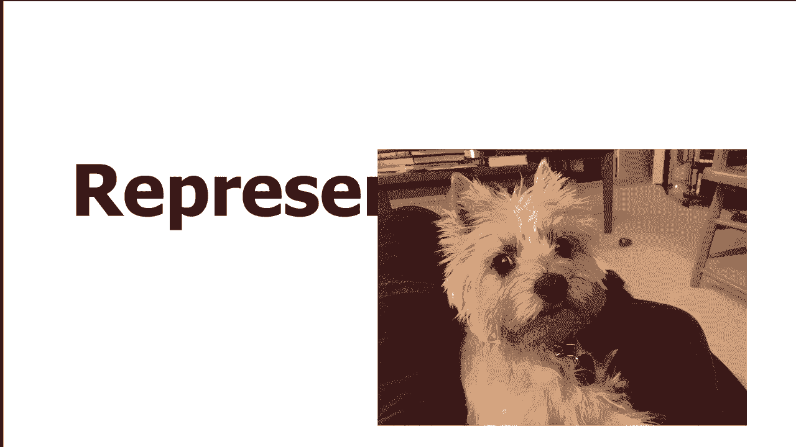
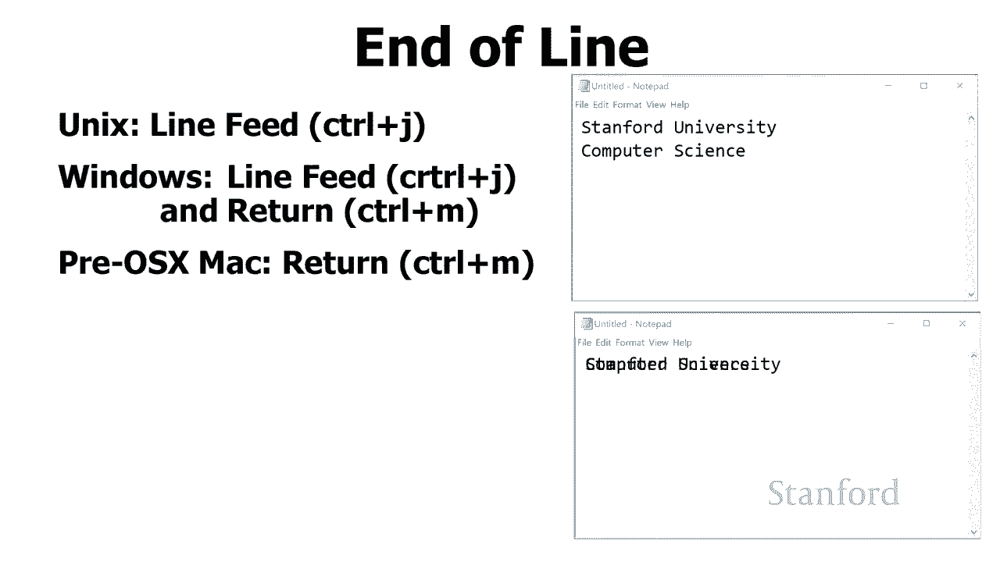
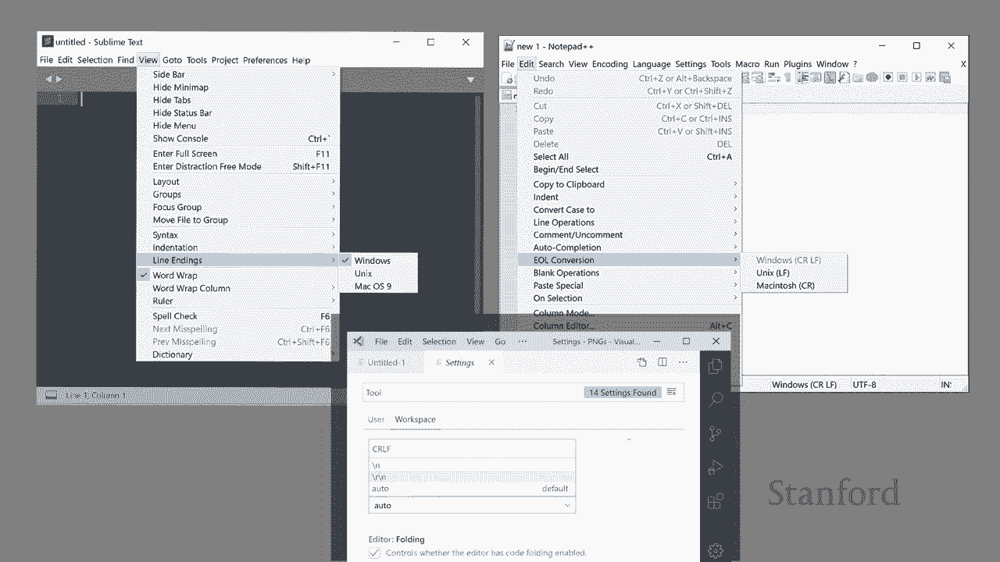
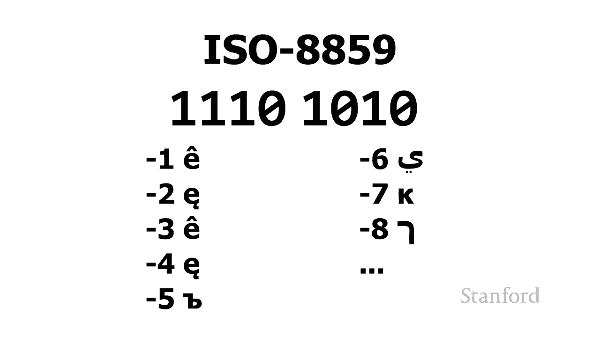
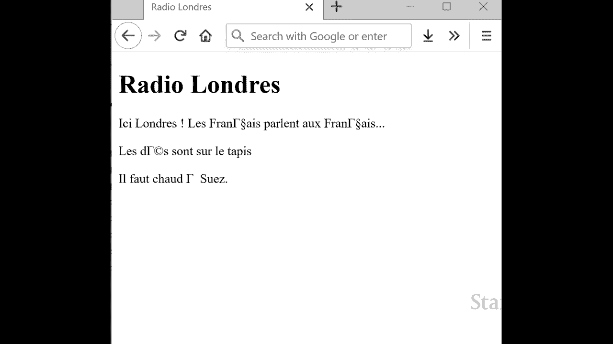
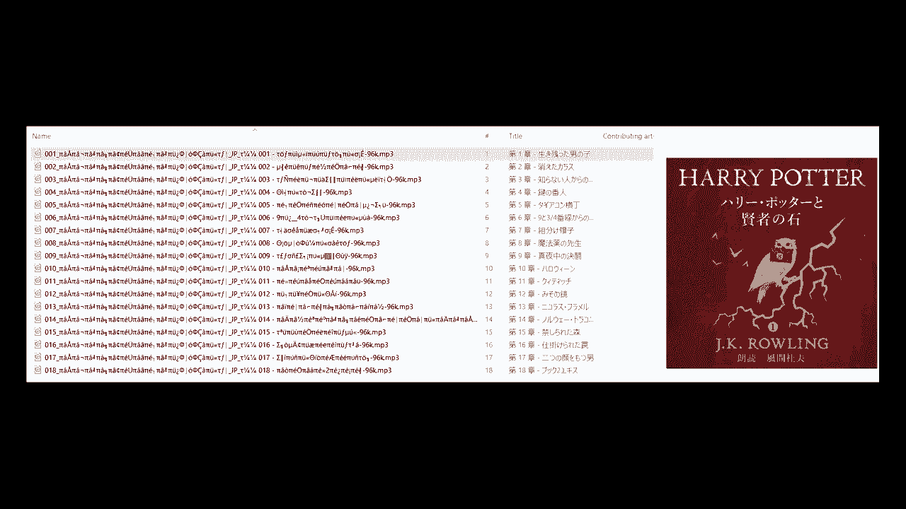

# 计算机科学导论：L1.4：比特、字节与二进制：计算机中的象形文字表示 🧮

在本节课中，我们将要学习计算机如何表示文本信息。我们将从基础的ASCII编码开始，探讨其局限性，并最终了解现代统一编码标准Unicode如何解决多语言字符表示的问题。

到目前为止，我们一直专注于如何在计算机上表示数字。但许多人花在打字和写作上的时间多于计算的时间。因此，本节我们将换个角度，谈谈如何在计算机上表示文本。

我们在之前的课程中简要讨论了如何使用不同的位组合来代表不同的事物，例如某人可能居住的州或省。一种自然的思考方式是，我们可以使用不同的字符组合来表示文本。

## ASCII编码表

接下来我要向你展示一种叫做ASCII表的东西。在ASCII表中，不同的位组合可以用来表示特定的字母、数字甚至计算机上的标点符号。

让我们仔细看看这是如何在ASCII表的右上角完成的。在这里，我们可以看到`abcde`和`f`的大写和小写表示。

假设计算机要看到位组合`000001`（或 off off off off on），我们可以看到这实际上代表了大写字母`A`。相反，如果它看到位序列`110101`（或 on off off on off on），它实际上代表小写字母`e`。

现在我应该提醒你，这些位模式的特定解释仅适用于旨在处理文本的计算机程序。记住，特定序列的位可以代表不同的东西，这取决于查看这些位的特定程序的设计目的。

例如，如果我们正在使用一个处理文本的程序，如文字处理器，`000001`将被解释为字母`A`。但是，如果我们正在使用一个设计用于处理数字的程序，这实际上可以解释为数字`65`。

为什么？让我们快速看一下这里的数学。我们有八位，从右边开始，我们的零位这代表二的零次方，即`1`。接下来我们有二的第一个幂是`2`，第二个幂是`4`，第三个幂是`8`。我们有`16`、`32`和`64`。所以，如果我们看这个，我们有`1`（2的0次方）和`1`（2的6次方，即`64`），所以我们总共有`65`。

我认为当我们查看这些位时，重要的是要记住，在一个层面上，就计算机而言，位只是位。决定如何解释这些位的是与它们一起工作的程序。只要处理这些特定位的程序将它们视为ASCII，那么它将被解释为字母`A`。还有其他可能的解释，它可能是一个数字、一个声音或一张图片。但在这种特殊情况下，我们将假设我们的程序知道这是一个ASCII字符，因此它会在ASCII表中查找并将其显示为`A`。

## 控制字符与行尾

让我们再看看这里的ASCII表。现在关注左侧栏，您会注意到左侧栏实际上有标点符号和数字`0`到`9`，当它们表示为文本文档的一部分时。

现在重点在这张表的左上角，你会注意到这里的数字有点奇怪。如果你仔细看，你会注意到我们的左上角不是从数字零开始的。您可以看到它以`0100000`开头。如果我们继续将其切换为十进制，这将更加明显。您可以在此处看到，代表ASCII字符的代码以数字`32`开头，并继续高达`127`。

为什么它以`32`开始？数字`32`以下发生了什么？事实证明还有另一组代码从`0`到`31`，代表所谓的控制代码。如果你看一下键盘，尤其是Windows或Unix键盘，您会看到有一个控制键。通过按住该控制键并键入不同的字符，我们会创建不同的控制字符。

下表显示了一些更有趣的控制字符。

以下是部分控制字符及其含义：
*   **Control H**：表示退格。
*   **Control M**：表示回车。
*   **Control G**：实际上会响铃。

您可以看到其中一些最初用于回到我们拥有电传打字机的那一天。在这种特殊情况下，我一直很喜欢的Control G实际上会响铃。在相当长的一段时间内，如果您在文本编辑器中工作，您会按下Control G，您的计算机会实际上响铃。但这里的基本思想是，这些不同的控制字符允许我们使用相同的ASCII字符集传输控制信息。

您有时会遇到的控制字符的其他方面是，计算机制造商未就正确的字符使用达成一致。行尾是Unix计算机、Microsoft Windows和pre-OS X Macintoshes都使用不同的字符来表示行尾。

这里涉及的主要两个字符是：
*   **Control M**：代表字符转向（Carriage Return）。
*   **Control J**：历史上是换行（Line Feed）。

Control J换行将获取当前在电传打字机中的一张纸，并将该电传打字机向上移动一行。Control M将从当前在线的任何位置返回打印墨盒，并将其返回到行的开头。

Microsoft Windows假设您需要执行两个操作：您需要执行Control J操作以向下移动到下一行，您需要执行Control M以移动到当前行的开头。Unix只是使用换行符，即使用Control J。而pre-OS X Macintosh只使用字符转向，即Control M。

这可能导致奇怪的情况。例如，一个在Macintosh上创建的文本文件，当在PC文本编辑器上打开时，可能会显示错误。幸运的是，大多数现代编辑器对结束一行的各种可能方式都足够熟悉，它们会为我们翻译。大多数高端文本编辑器，特别是那些为程序员设计的，将允许我们设置我们想要使用的约定。

## 扩展字符集与Unicode

另一个地方我们将如何表示这些不同操作系统的行尾的区别是，当我们使用文件传输程序时。文件传输程序区分文本文件和二进制文件。所以问题之一是，为什么我们有这种区别？文件传输程序询问是否要将特定文件视为文本文件或二进制文件，因为它需要知道这两者之间的区别。如果是一个文本文件，它将遍历文本文件，并查找这些行尾序列中的每一个，并且它将从它在文件中看到的任何内容进行转换为您正在传输的计算机的正确序列。

如果您仔细查看ASCII表，您可能会意识到一些事情。您可能会注意到的第一件事是我们的每个字符只有7位。正如您所知，计算机通常使用8位或一个字节的集合，因此这实际上意味着有一大堆我们没有利用的组合。我们只利用了2的7次方（128种）组合。

另一个问题是ASCII是一个非常以英语为中心的表格。即使只看欧洲，也有很多不同的字符需要表示，而它们没有在那里列出。显然，还有一大堆其他不是欧洲的语言，它们根本没有列出字符。

那么我们将如何处理这个问题？我们可以做的一件事是，我们可以利用我们在一个字节中有256种组合的事实。可以说，其中128个留作英文字符，剩下的128个我们可以用于不同的目的。这就是一个叫做ISO 8859的标准。有许多相关的ISO 8859标准，适用于不同语言，我们可以将语言所需的所有字母包含在256个字符中。

这个特定标准的工作方式是我们必须告诉计算机程序，这些字符集中的哪一个是我们正在使用的。我们需要做的下一件事是我们需要在这里查看我们的八位。如果高端位是`0`，这意味着我正在使用标准的ASCII表。如果高端字符是`1`，这意味着我使用的是ISO 8859。那么特定的字符将取决于我使用的是ISO 8859-1、-2、-3等等。

我们确实需要正确设置ISO字符集。例如，如果我有一个用法语写的网页，我更改了正在使用的字符集。如果我没有正确告诉Web浏览器要使用哪个字符集，并且它认为这是西里尔文或阿拉伯文，您可以看到该网页将出现不同和错误的显示。

现在非西方语言呢？这些也有许多不同的标准，其中大多数使用16位。在16位中，我们可以表示2的16次方个不同的字符，我们称之为65,536。这足以表示大多数的字符，例如中文。所以这些将用于不同的语言。我们需要有一个程序来理解它们，我们需要程序来理解正在使用的特定字符集。

例如，我从Pottermore网站上获得的《哈利波特和魔法石》的日语副本。在最右边我们可以看到这些是日语章节的名称，但我们在左边的内容基本上得到了垃圾。这里发生的事情是，当我从Pottermore得到这些文件后，我将它们下载到我的电脑上，它期望字符只有8位长，而Pottermore文件使用的字符是16位，我的电脑不知道如何处理它们，所以它基本上改变了文件的名称，变成垃圾。

所以我们在这里看到的问题是，不同的位组合代表不同的东西，这取决于特定的编码。我们可以有一个字符组合来代表英语中的`e`，而相同的字符组合可能代表日语中的`tsu`。所以我们需要的是一个更统一的系统。

## Unicode：统一的解决方案

事实证明，实际上有一个更统一的系统：Unicode。Unicode每个字符使用1到4个字节。如果你计算2的32次方种可能的组合（因为有32个不同的位在四个字节中），允许有4,294,967,296个组合。这是一大堆组合。

Unicode不仅允许我们存储我们已经见过的所有不同的语言，它还具有一些组合，这将使我们能够表示古语言，如埃及象形文字、苏美尔楔形文字，甚至迈锡尼线性B。它也包括诸如音乐字符和表情符号之类的东西。

所以我们要做的是，我们将快速了解您如何使用此Unicode。例如一个历史文件，假设我正在写一篇历史论文，我需要在我的历史剧本中使用埃及象形文字。

我需要做的第一件事是我需要掌握一种可以显示埃及象形文字的字体。请记住，Unicode只指定特定的位序列来表示这些字符，它保证有一个独特的位序列对于我的埃及象形文字，不能与中文字符或英文字母混淆。但这并不意味着每种字体都有这40亿个组合中的一个可能已经计算出来，所以它知道如何绘制它。

例如，如果您使用了Times New Roman字体，它是为英语和欧洲语言设计的，它不是为了显示迈锡尼线性B。所以，在Times New Roman中看到迈锡尼线性B字符的位组合，字体就像“我不知道那是什么”，所以它只是要画一个块。所以你经常会看到有问题的块或小菱形，它们中的标记。这些是不同的迹象，表明您使用的字体知道存在这种独特的位模式，但它实际上没有能力显示这种独特的字形。

因此，如果我们想在这里用埃及象形文字写我们的论文，我们需要做的第一件事是，我们需要继续找到一种支持埃及象形文字的字体。你可以去谷歌搜索“埃及象形文字unicode字体”，你会得到一堆不同的热门选择。计算机及其过程将根据您拥有的计算机类型而有所不同。

我们接下来要做的就是，找出我们想要用于在我们的论文中重现的特定字符的特定位模式。这样，我们就可以查找表格。维基百科有许多Unicode支持的不同语言的表格。这是维基百科上关于埃及象形文字Unicode的表格。我要做的是查看左侧的列和顶部的行，然后将这两个列结合起来形成一个唯一的数字。这些实际上是十六进制的。这是一个与二进制非常密切相关的编号系统，您可以将其视为一种非常紧凑的二进制形式。

所以我要找出十六进制数是什么，然后我要继续去Microsoft Word。我要设置字体，因为再次记住，如果我使用像Arial这样的标准字体之一，它们实际上没有埃及字符的图纸，所以我需要切换到我的字体，里面有埃及字符。然后我要插入符号，这就是Microsoft Word允许你插入任何Unicode字符的方式。切换到插入选项卡，在最右边有插入符号，然后一直点击到底部，它会显示“更多符号”，然后会弹出一个对话框。我将继续输入维基百科表格中的Unicode代码，将其输入到对话框中，然后继续将我的埃及字符插入到我的文档中。这样，我就知道如何在计算机上输入埃及象形文字了。

## 总结与展望

本节课中我们一起学习了计算机如何表示文本。我们从基础的ASCII编码开始，了解了它如何用7位表示英文字符和控制代码。接着，我们探讨了其局限性，以及为了表示更多语言而出现的扩展字符集（如ISO 8859）和多字节编码。最后，我们介绍了Unicode这一统一的编码方案，它使用1到4个字节为世界上几乎所有的字符系统提供了唯一的数字标识，从而解决了跨语言文本表示的难题。

现在，我们已经看过计算机如何表示一些基本数据类型。在接下来的几节课中，我们将转向一些更复杂的数据类型。我们将首先看看计算机如何表示图像。本课将很有用，无论您打算购买一台新电脑或一台新电视，我们将讨论底层技术和术语。如果您打算创建任何类型的数字图像并且需要知道正确的工具以及存储文件的正确格式，这也将非常有用。之后，我们将研究计算机如何表示音乐和声音。在数字图像和声音讲座之间，我们将仔细研究对数字和模拟之间差异的批判性理解中的关键差异。