# 计算机科学导论：L2.1：数字图像基础 🖼️

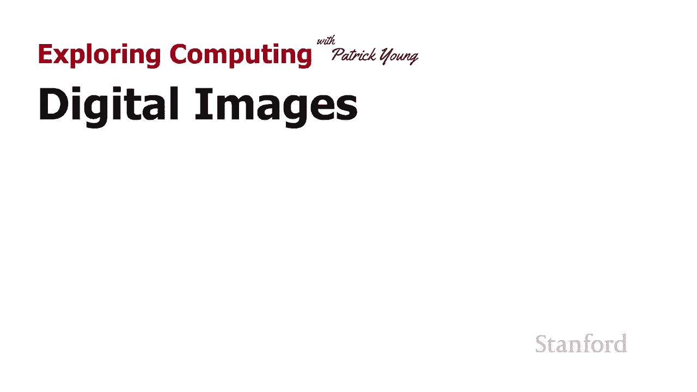

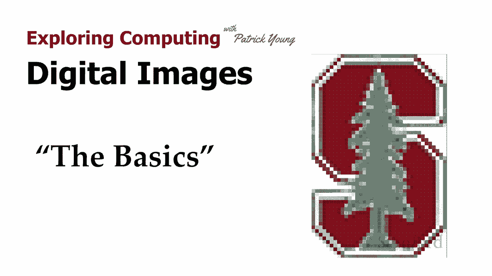

在本节课中，我们将要学习数字图像的基础知识，特别是计算机显示器的工作原理。我们将了解屏幕如何通过像素网格来显示图像，并探讨屏幕分辨率、纵横比等核心概念，以及它们如何影响我们的观看体验。

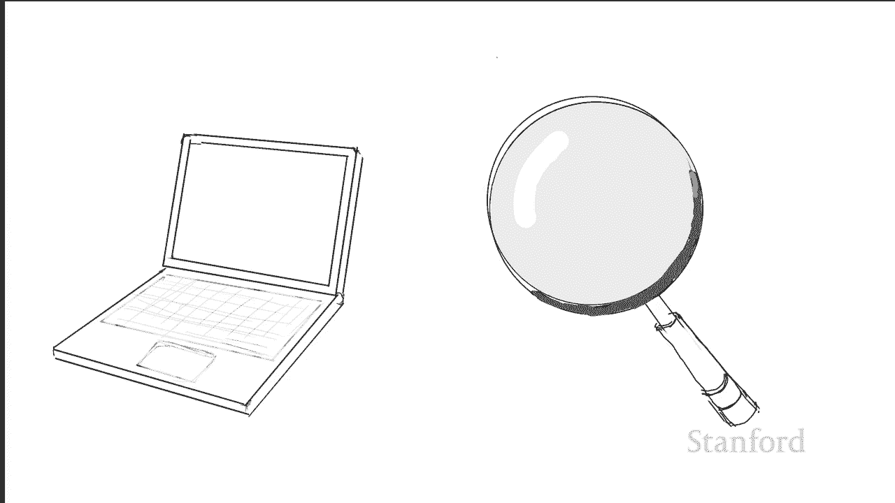

## 显示器的工作原理 🔍

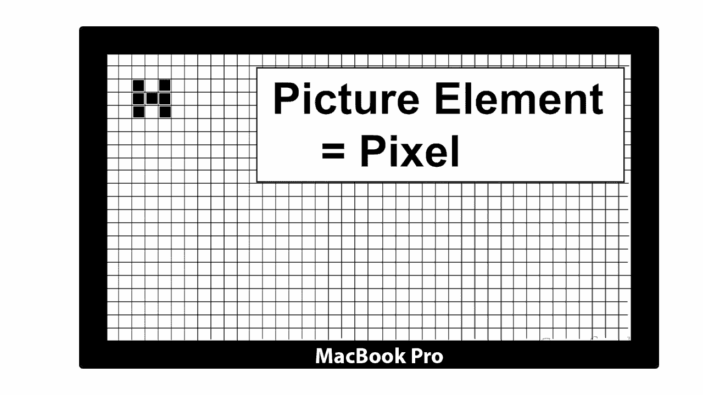

上一节我们介绍了课程概述，本节中我们来看看计算机显示器是如何工作的。

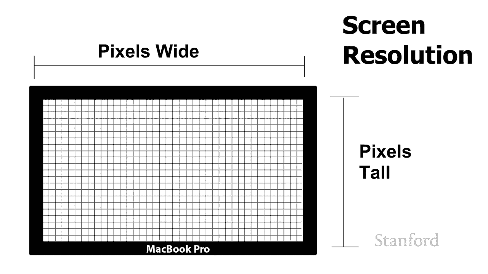

计算机屏幕实际上是由一个巨大的网格组成的。在黑白图像的情况下，网格中的每个元素都可以被打开或关闭。这些独立的网格元素被称为**图片元素**，简称**像素**。

每个像素都由计算机内存中的一个**位**来控制。如果该位为“开”，则相应的像素点亮；如果该位为“关”，则像素熄灭。

**核心概念**：像素状态由内存中的位控制。
```plaintext
像素状态 = 内存位值
如果 位 == 1，则 像素亮
如果 位 == 0，则 像素灭
```

## 屏幕分辨率 📏

了解了像素的基本原理后，接下来我们需要认识一个选购设备时的重要参数：屏幕分辨率。

屏幕分辨率指的是显示器在宽度和高度上各有多少像素。它通常表示为“宽度像素数 x 高度像素数”。

以下是不同设备屏幕分辨率的示例：
*   **Surface Book 15英寸**：3000 x 2000 像素
*   **MacBook Pro 15英寸**：3072 x 1920 像素
*   **34英寸超宽显示器**：3440 x 1440 像素
*   **55英寸高清电视**：1920 x 1080 像素

一些常见的分辨率有特定名称，例如：
*   **640 x 480**：旧电脑和电视使用的VGA标准，也称为480i或480p。
*   **1920 x 1080**：常被称为**高清电视**或**1080p**。

## 屏幕纵横比 📐

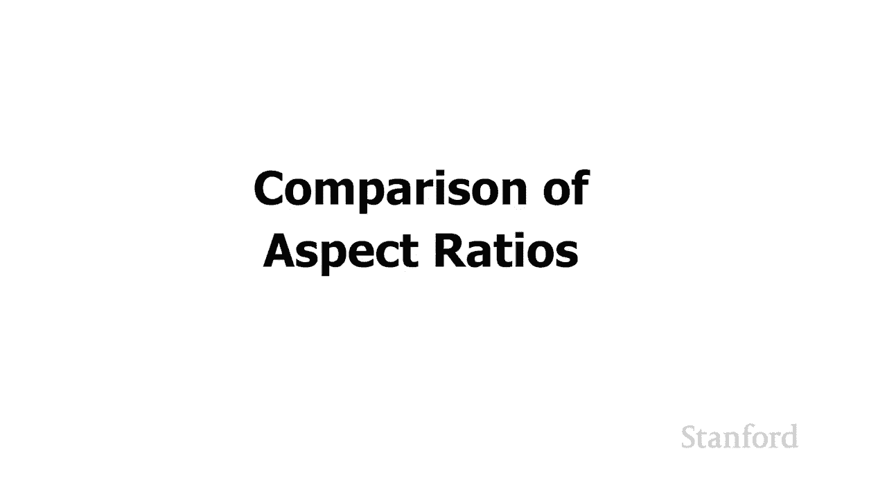

除了分辨率，另一个关键质量指标是屏幕的**纵横比**。它描述了屏幕宽度与高度的比例关系。

计算纵横比时，我们用宽度像素数除以高度像素数，并将其简化为最简整数比。

例如：
*   一个分辨率为 1024 x 768 的显示器。计算过程为：1024 ÷ 256 = 4，768 ÷ 256 = 3。因此，其纵横比为 **4:3**。
*   一台 1920 x 1080 的高清电视。计算过程为：1920 ÷ 120 = 16，1080 ÷ 120 = 9。因此，其纵横比为 **16:9**。

**核心概念**：纵横比计算公式。
```
纵横比 = 宽度像素数 : 高度像素数 (化简为最简整数比)
```

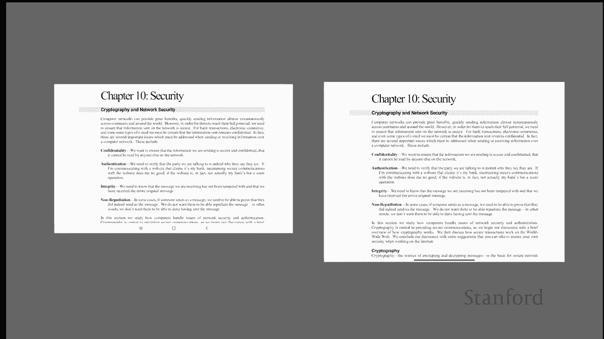

需要注意的是，纵横比相同的屏幕，其像素总数（即清晰度）可能大不相同。例如，一个27英寸的老式CRT电视（640x480）、一个12.9英寸的iPad Pro（2732x2048）和一个7.9英寸的iPad mini（2048x1536）都具有4:3的纵横比，但像素数量差异巨大。

## 如何选择合适的纵横比？ 📱🖥️

那么，哪种纵横比最好呢？这实际上取决于设备的用途和尺寸。

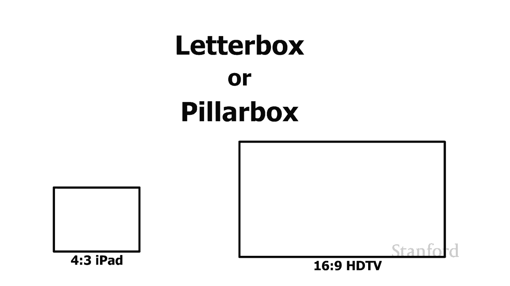

对于工作而言，宽屏显示器通常更佳。
*   例如，一台27英寸的16:9显示器非常宽，可以舒适地并排查看两个文档，提高工作效率。

对于平板电脑，不同的纵横比适合不同的任务。
*   16:10或16:9的宽屏平板（如三星Galaxy Tab）更适合观看视频等娱乐活动。
*   4:3比例的平板（如iPad）在竖屏状态下能显示更多文档内容，因此可能更适合阅读和处理文档。

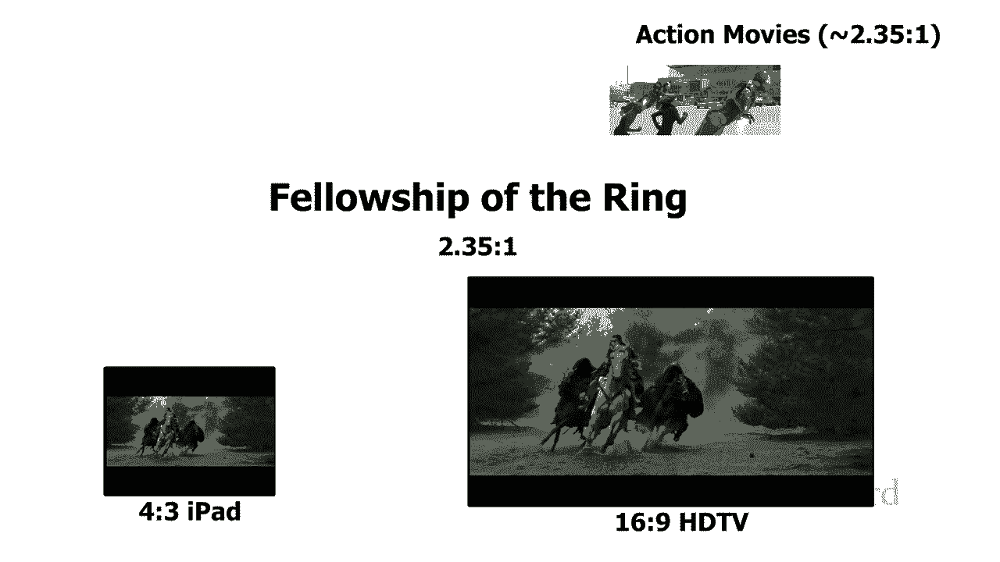

## 纵横比与影视内容 🎬

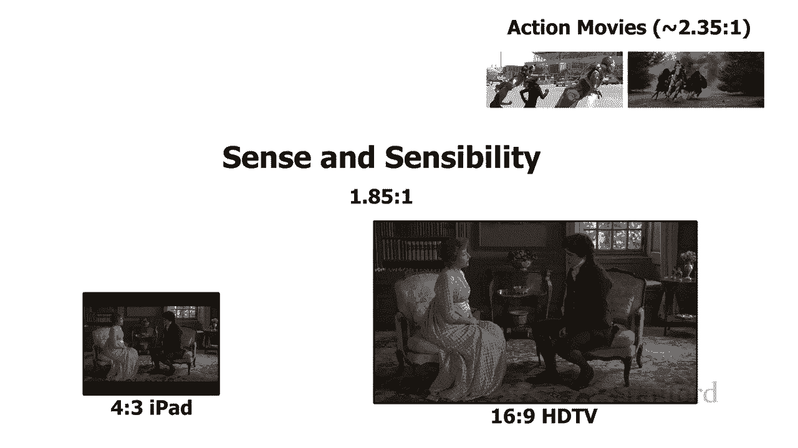

在观看电影和电视时，内容的纵横比与屏幕的纵横比是否匹配至关重要。影视内容的纵横比通常用小数表示，如2.35:1或1.85:1。

当内容与屏幕的纵横比不匹配时，会出现两种情况：
1.  **信箱模式**：内容位于屏幕中央，上下出现黑条。这通常发生在宽屏内容在较“矮”的屏幕上播放时。
2.  **邮筒模式**：内容位于屏幕中央，左右出现黑条。这通常发生在较“方”的内容在宽屏上播放时。

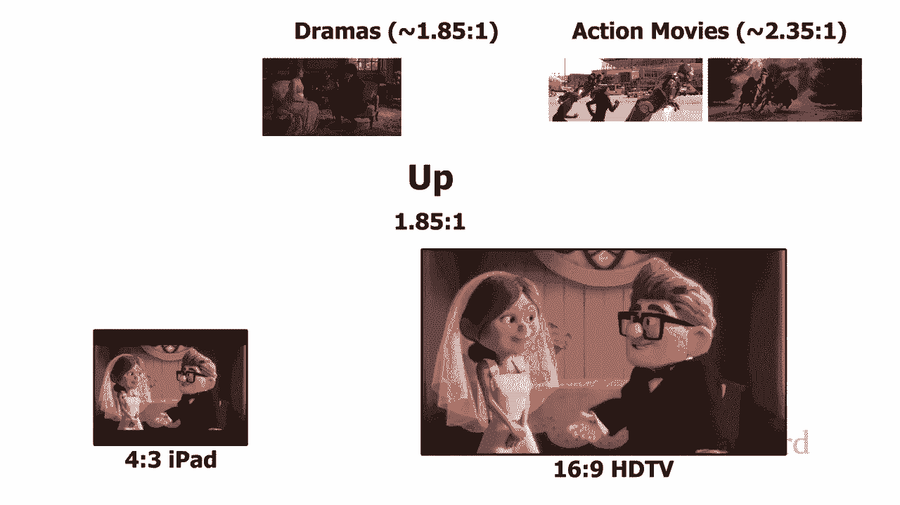

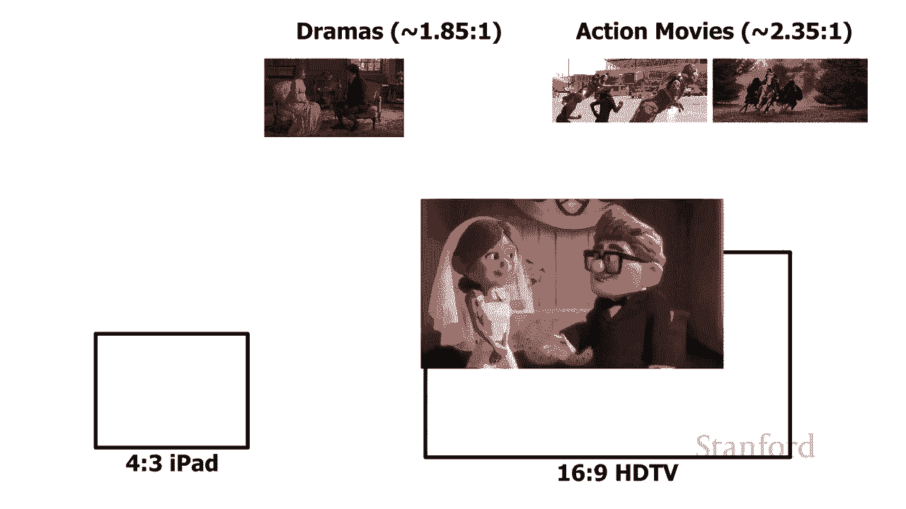

让我们看一些例子：
*   **动作片**（如《美国队长3：内战》，比例约2.35:1）在16:9的高清电视上播放时，上下会有轻微的黑条（信箱模式）；在4:3的iPad上播放时，上下黑条会更粗。
*   **电视剧/剧情片**（如《理智与情感》，比例约1.85:1）与16:9的高清电视几乎完美匹配，观看体验最佳。
*   **老式电视节目**（如《老友记》，比例4:3）在4:3的iPad上完美播放，但在16:9的高清电视上，左右会出现黑条（邮筒模式）。
*   **经典老电影**（如《绿野仙踪》，比例约1.37:1）同样更适合4:3的屏幕，在宽屏电视上会以邮筒模式播放。

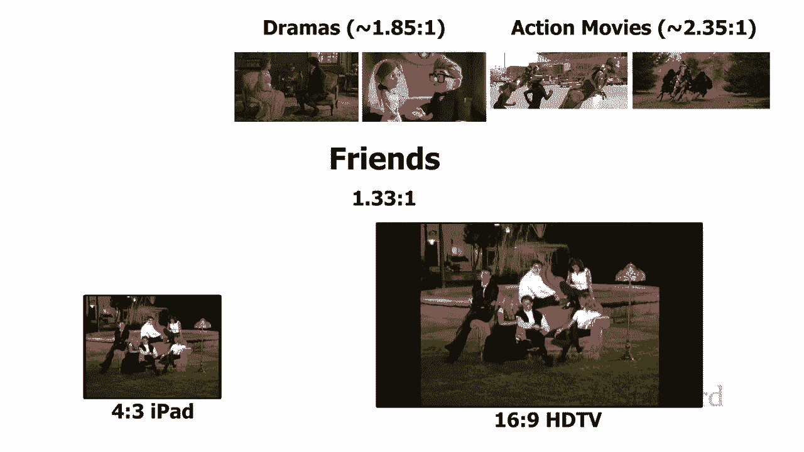

## 总结 📝

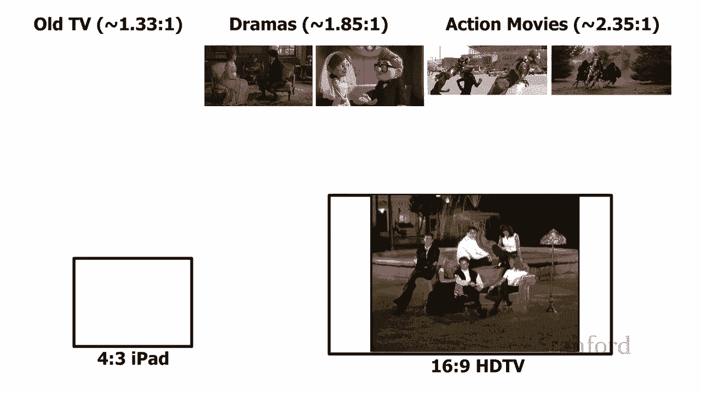

本节课中我们一起学习了数字图像的基础知识。我们了解到计算机屏幕由像素网格构成，每个像素由内存中的位控制。我们学习了**屏幕分辨率**和**纵横比**这两个核心概念，知道了如何计算和解读它们。最后，我们探讨了不同纵横比如何影响工作和娱乐体验，以及当影视内容与屏幕纵横比不匹配时会发生什么。理解这些基础知识，将帮助你在选择电子设备和享受数字媒体时做出更明智的决定。

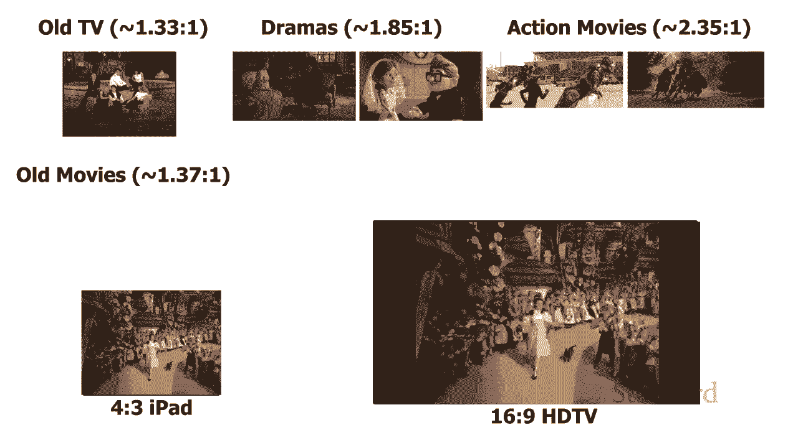

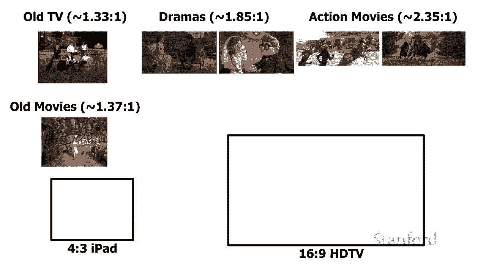


在下一个视频中，我们将更深入地研究颜色是如何在数字设备上生成和显示的。