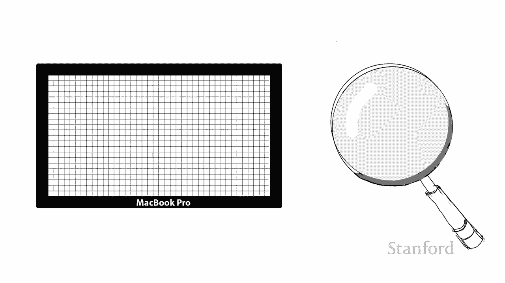
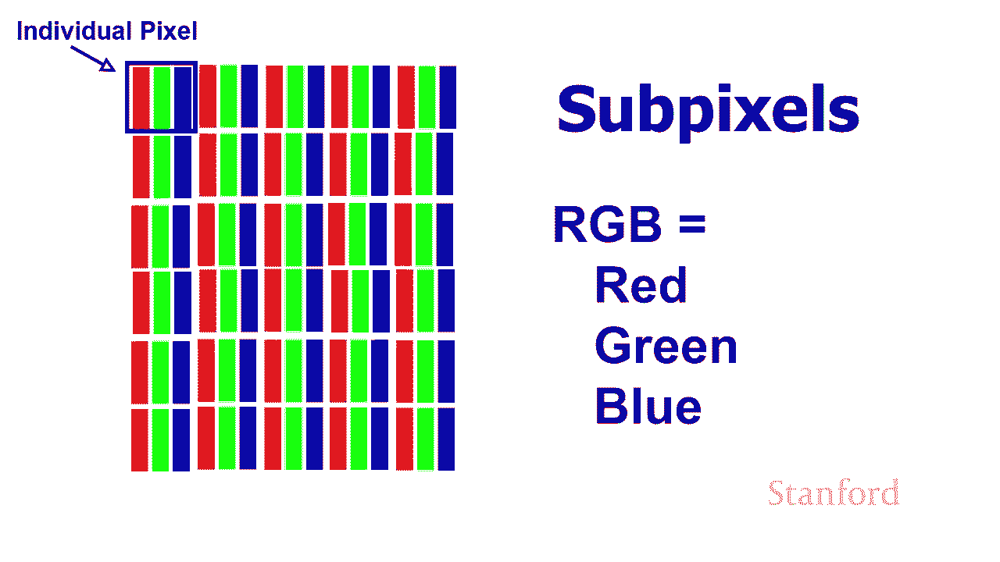
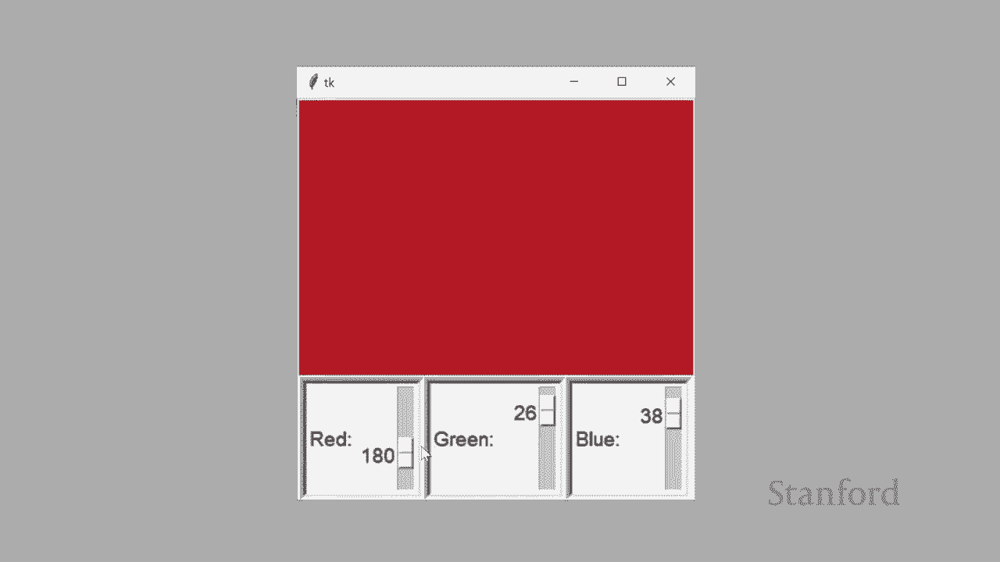
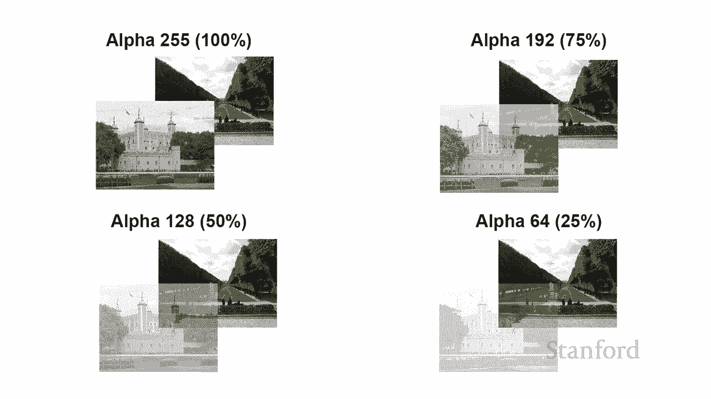
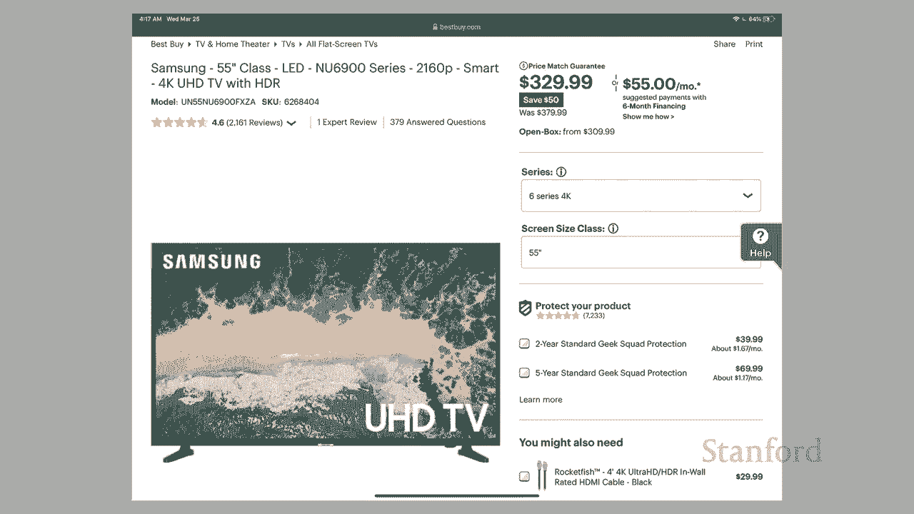
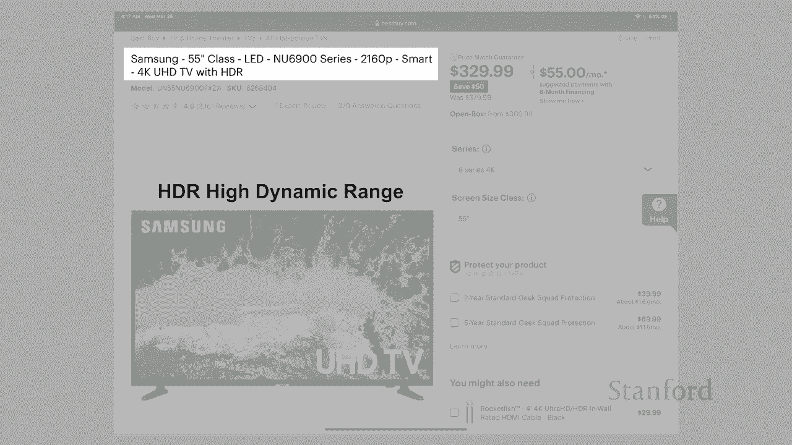
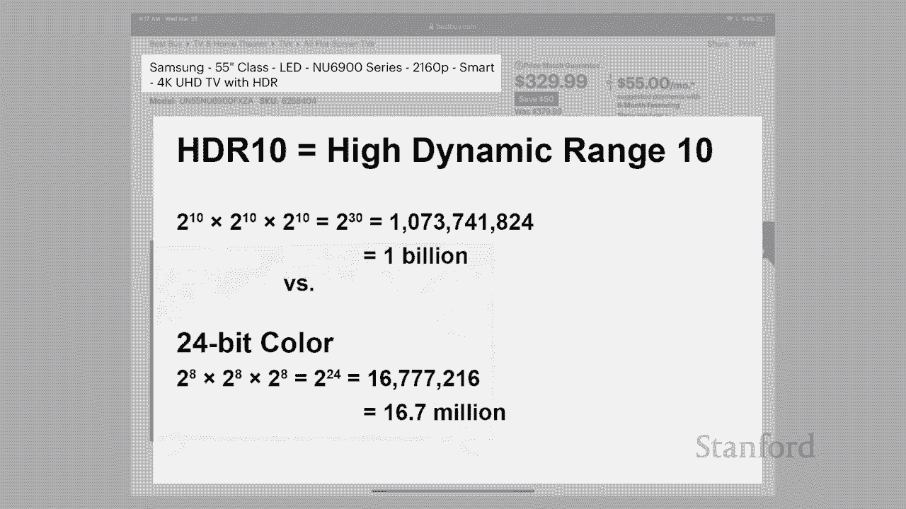

# 计算机科学导论：L2.2：数字图像：颜色与数据 🎨

在本节课中，我们将要学习数字图像如何表示颜色。我们将从计算机屏幕的物理结构开始，了解像素和子像素的概念，然后深入探讨RGB颜色模型及其在计算机中的表示方式。最后，我们会对比显示器和打印机在颜色生成上的不同原理。

## 屏幕的微观世界 🔬

上一节我们介绍了数字图像的基本概念，本节中我们来看看计算机屏幕是如何显示颜色的。

回到上一堂课，我们观察了笔记本电脑屏幕。当我们使用放大镜仔细观察计算机屏幕时，会发现每个单独的像素都不是由一个正方形组成。它实际上由许多所谓的子像素组成。

现在这些子像素的确切几何配置会因计算机而异，主要取决于大多数液晶屏使用的特定计算技术。子像素实际上是条形。

如果我们仔细观察一个老式阴极射线管或CRT，我们实际上会看到一个红色条、一个绿色条和一个蓝色条。实际上有三个不同的圆圈，但同样会有一个红色圆圈、一个绿色圆圈和一个蓝色圆圈。

## RGB颜色模型 🟥🟩🟦

你会听到计算机科学家经常谈论RGB，其中R代表红色，G代表绿色，B代表蓝色。所以大多数颜色在计算机中是使用RGB完成的。我们将在几分钟内了解打印机的工作原理，它们实际上有一个名为CMYK的不同系统，我们稍后再看一下。

但让我们再次看一下我们的红绿蓝。这里的想法是，通过混合红、绿、蓝的数量，我们可以创造出各种颜色。

让我们来看看我几年前写的一个小计算机程序。这个特定的程序实际上是用Python编写的，它是CS105学生将在本季度晚些时候学习的编程语言。尽管我们不会完全达到制作像这样的轻微图形用户界面的地步，但这个特定程序显示了当我们现在将红、绿和蓝色混合在一起时会发生什么。

我已经将红、绿和蓝色都设置为零，所以根本没有灯。我要在这里做的是我继续并在此处调高红色，您可以看到我正在慢慢变得越来越红。我可以将其最大程度提高到255，这是计算机可以发出的最大红色量。

让我们继续前进，你可以看到我可以用绿色做同样的事情。最后是蓝色。当然有趣的是当我们继续尝试混合它们时，我有一点点蓝色，大约30%。我可以继续混合一些绿色，你可以看到我在这里得到不同深浅的绿色，取决于我有多少绿色强度。我可以开始混合一些红色，并通过混合这些不同的颜色，并改变红色、绿色和蓝色的强度，我实际上能够创造出许多不同的颜色。所以这实际上是计算机本身将如何生成颜色。它有红、绿和蓝色条，或者正如我们在CRT中看到的那样，它有那些红、绿和蓝色圆圈。通过增加这些单个条的强度，它实际上是混合的颜色。我们看不到单独的颜色，因为它们真的很小，所以我们的眼睛看到的只是组合在一起的光。但事实上，如果我们把显微镜放在电脑屏幕上，我们实际上会看到以不同强度点亮的各个条。

## 颜色示例与表示 🎨

让我们来看看一些实际的颜色示例。

以下是几种常见颜色的RGB构成：
*   **红色**：由红色组成，一直向上，没有绿色和蓝色。尽管我们可以通过增加或减少红色的强度来创建不同的红色阴影，从最大数量到较少数量的红色，或通过稍微混合一些绿色或一些蓝色。
*   **蓝色**：没有红色，没有绿色和最大数量的蓝色。然后我们可以开始混合。
*   **紫色**：如果我们把红色子像素调到最大强度的一半，把绿色子像素关掉，把蓝色子像素调到最大强度的一半。如果我们把红色一直调高，蓝色一直向上，让绿色关闭，就会变成紫色。
*   **紫红色**：如果我们将绿色变成蓝色的一半，红色的一半关闭红色，我们实际上最终会得到紫红色。
*   **蓝绿色**：如果我们将绿色调高，蓝色一直保持，红色仍然关闭，我们实际上会得到蓝绿色。

我们可以获得更多异国情调的颜色。所以这里有一些样本来自我们将在本季度晚些时候讨论的HTML5规范。你可以在这里看到绿色组成，绿色但不是绿色在最大强度下，只有255种中的139种，然后混合了一些红色和一些蓝色，但大多数都非常低。记住这是一个从0到255的比例。结实的木头由很多红色组成，相当数量绿色和相当数量的蓝色，但少于绿色和红色的数量。还有一个番茄，你知道，主要是红色。红色在这里几乎是最大值，但也混合了一些绿色和一些蓝色。所以这些是不同的例子，我们可以使用这个系统创建的颜色类型。事实上，我们可以使用这个特定的系统创建1670万种颜色。

我是如何达到1670万种颜色的？让我们仔细看看这些颜色在计算机中是如何实际表示的。

这里是颜色的方式。基数红色在计算机内部表示，我们可以看到有24位或24个开关用于表示这种特定的颜色。这24位被分成八组，您会记得将其称为字节。因此我们留出了一个字节对于红色，在此图中为绿色预留了一个字节，为蓝色预留了一个字节。您可以看到我在这里放置了十进制等价物。红色的组合在远处切换，最左边的红色位组合相当于十进制140。中间八位的组合对应绿色的数量，即十进制21。右边的组合，再次与开关相同，绿色再次代表十进制数21。所以计算机知道它应该将红色设置为最大强度的一半以上，然后它应该添加一点绿色和一点蓝色。

现在因为红色的数量由8位表示，你会记得在我们之前的讲座中，我们可以用8位表示2到8个组合，即256。我们希望这些组合中的一个代表零，代表没有光出来那个特定的子像素。所以不是从1到256，而是从0到255。所以我们有红色0到255，绿色0到255，和蓝色0到255。这就是你在上一个例子中看到的，当我滑动时，在一个小Python程序上找到滑块。

因为我有红色的两种到第八种可能的组合，绿色的两种到第八种可能的组合，以及蓝色的两种到第八种可能的组合，我实际上总共有两种到24种可能的组合。事实证明，如果你计算出所有24位的所有可能组合，我会得到1670万多一点。所以我们通常说在24位颜色中，我们可以表示1670万种颜色。

现在这个24位颜色系统是当今计算机上使用的最常见的颜色系统之一。但有一个更高级的变体，它使用一个额外的字节。这是32位颜色系统中的32位颜色系统。我们实际上有一个额外的字节，而这个额外的字节实际上被搁置了，代表一个叫做Alpha的东西。Alpha代表一个特定对象的不透明度或透明度。

如果我们将一个对象滑动到另一个我们想要显示的对象的顶部，我们会使用它。如果它下面的对象你通常可以看到，当我们在操作系统周围移动窗口时使用的这种技术。

## Alpha通道与透明度 🌫️

让我们仔细看看我们的Alpha是如何工作的。

我在这里得到的是我在这里有一对图像。我下面有一张图片，它停在卢浮宫附近，然后我在左上角有一张伦敦塔的图像。我将公园与伦敦塔重叠。我将Alpha设置为更高的百分比。Alpha设置为100%，伦敦桥图像将完全不透明，我们将无法看透它。但是当我们降低不透明度时，我们将能够看到它下面越来越多的巴黎公园。

Alpha设置为255中的192，即75%，你可以看到公园开始显现出来。看到更多下面的公园，你也可以看到我们伦敦塔的那部分不在巴黎公园上的部分开始看起来有点褪色。然后最后，在我们这里的最后一张图片中，我将Alpha设置为25，即64/255。你可以看到，我们几乎可以完全看到公园，伦敦塔的图像几乎完全褪色。如果我们进一步降低Alpha，我们将Alpha设置为零，我们将无法看到塔。

## 实际应用：选购电视 📺

让我们把我们新发现的知识应用到一些实际的事情上。例如，假设我们有兴趣购买一台新电视。这是百思买网站上三星新电视的网页。所以，如果我们快速浏览一下这个网页，对我来说最突出的第一件事是你可以以329.99的价格购买一台全新的高清电视。为什么我不认真地拥有其中一个呢？反正这些价格真的很低。

让我们来看看这个电视的规格。我们将重点放在标题行上。我们可以看到这是三星制造商，它是55英寸，这是从显示屏的一个角到对角的距离。我们可以看到它是LED，这是在谈论显示器所使用的技术，与等离子电视或老式阴极射线管电视不同。

所以这是2160p。2160指的是从上到下的像素数。P实际上代表渐进式。所有现代显示器都是渐进式。为了了解渐进式是什么，我们需要看一下使用隔行信号的旧技术。所以例如，一个老式的录像机磁带是隔行扫描的。这里的隔行信号的想是，嗯，而不是更新每一行在电视上，我们会每隔一行更新电视上的信息。假设我们的信号正在输入，我们能够每秒获取30次信息。隔行扫描信号会发生，在电视上每奇数行的前30秒将被更新，然后在下一个30秒内，每条偶数线将被更新，然后每条奇数线将被更新，每条偶数线将被更新。并且渐进式电视每条线都会同时更新。所以这是一方面，这是一件非常好的事情。这实际上是隔行扫描的VCR磁带和渐进式DVD之间的巨大差异。所以你知道如果你曾经玩过这两种技术，这是一个巨大的改进。

但作为购买者，我们对它并不是特别感兴趣一台新电视，因为所有新电视都是渐进式。“智能的”指的是它可以直接连接到互联网，而且还有呃，它具有执行显示等操作的内置功能，例如Netflix或Hulu或迪士尼Plus。

“4K”指的是像素数。在这种情况下，从左到右有3840个像素。而“UHD电视”指的是超高清电视，再次指的是它有很多像素宽和很多像素高。所以这是超高清电视，而不是高清电视。高清电视是1920x1080像素。所以我们实际上可以容纳四个高清电视显示在这台电视上，因为如果我们继续乘以从左到右和从上到下的像素数，它的像素数是它的四倍，这是高清电视上的四倍。

我认为这是最后一部分，“HDR”实际上是最有趣的。所以HDR指的是高动态范围。显示技术已经有了许多重要的改进。例如，DVD被定义为差异化之一。推论是我们每英寸的像素要高得多。所以，你知道我们刚刚看到它有很多像素高，很多像素宽。实际上我们的像素是高清电视的四倍。但另一个区别是现代电视有更好的对比度。所以最暗和最亮的灯光之间的差异比以前大得多。我们现在也有更高的整体亮度。为了利用最暗和最亮的灯光之间的这种对比，我们需要一个用于定义颜色的新系统。

## HDR与更多颜色 🌈

我们之前已经讨论过现代计算机技术如何使用24位颜色。因此，8位代表红色，8位代表绿色，8位代表蓝色。嗯，24位整体导致总共1670万种颜色。HDR的作用是什么？实际上增加了每个单独像素的位数。它增加了每个颜色通道的位数。

有许多不同的竞争标准。DS有一种标准对颜色通道使用10位，另一种标准对颜色通道使用12位。我将讨论10位用于颜色通道的示例，因为这似乎更为普遍。因此，每个颜色通道10位之一标准是这个HDR10。对于HDR10，我们将为红色预留10位，为绿色预留10位，为蓝色预留10位。这将允许我们为每个设置0到255之间的强度，在这三个颜色通道中，我们将能够存储0到1023强度之间的强度。因此，我们能够拥有更多的渐变。事实上，如果我们继续进行数学计算，请记住在我们拥有2^24之前，给我们1670万种颜色。现在我们有2^30，这给了我们超过10亿种颜色。所以这只会给我们更多的颜色变化，更能代表实际图像。所以这实际上是一个漂亮、整洁的技术，应该会极大地改善您在电视机上的图像。

## 打印机与CMYK 🖨️

之前我提到打印机使用与显示器不同的颜色技术，所以让我们快速浏览一下。这里的主要思想是打印的页面和绘画以与我们的笔记本电脑显示器不同的方式创建颜色。

让我们快速浏览一下。我们的笔记本电脑或计算机或电视使用所谓的加色来创建颜色。这些不同的显示技术产生的颜色会创建颜色并将它们以对比的方式映入我们的眼睛。如果我们考虑绘画或印刷页面的工作方式，我们想要的是我们想要明亮的白光。白光会照在我们的印刷页面或我们的绘画上。发生的情况是该印刷页面中的不同墨水或该绘画使用的油漆将吸收其中的一部分白光。

因此白光包含色谱中的所有不同颜色，其中一些颜色会被印刷品吸收页面或绘画，以及剩下的东西被发送到我们的眼睛或被反射到我们的眼睛。因此这被称为减色法。因此这是一种与我们在显示器上看到的颜色产生根本不同的方式。

因此实际上，用于打印技术的一组不同的原色。正如我们之前看到的，计算机屏幕使用RGB红、绿和蓝色作为我们的原色。而事实证明打印机使用CMYK。因此它们使用青色、洋红色、黄色和黑色。所以如果您要购买打印机墨盒，你不会看到打印机墨盒有红、绿和蓝色。他们实际上有青色、洋红色、黄色和黑色。你实际上不需要黑色，在技术上可以创建混合一大堆青色、洋红色和黄色的黑色墨水。但事实证明，这会使用大量墨水，有时会给您带来混乱的结果。

关于RGB与CMYK的另一件事要注意的是，事实证明存在您可以在一种配色方案中生成而在另一种配色方案中无法生成的颜色。因此，您真的应该在创建图像时做出决定，该图像是用于计算机屏幕还是印刷品页面。所以你可以做的是你可以选择某些颜色，因为你知道它们在其中一种配色方案中效果很好，而不是在另一种配色方案中。

你也会发现我们稍后会讨论关于如何设计网站和网站配色方案的季度。以及您可能为网站选择颜色的方法之一是您将使用色轮。结果发现，艺术家使用了不同的色轮。艺术家色轮自然地使用原色，使用减色进行绘画。而网络色轮则基于RGB的加色使用。

## 总结 📝

本节课中我们一起学习了数字图像中颜色的表示。我们从计算机屏幕的物理结构出发，了解了RGB颜色模型如何通过混合红、绿、蓝三原色的光来生成各种颜色，并用24位（或32位带Alpha通道）数据来表示。我们还探讨了HDR技术如何通过增加每个颜色通道的位数来提供更丰富的色彩。最后，我们对比了显示器使用的加色法（RGB）与打印机使用的减色法（CMYK）之间的根本区别。接下来，我们将研究程序如何表示和操作图像，以及用于存储图像信息的不同格式。