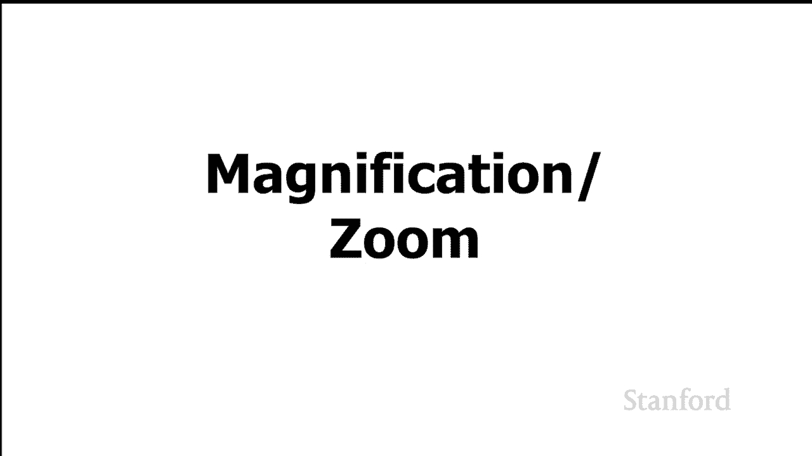
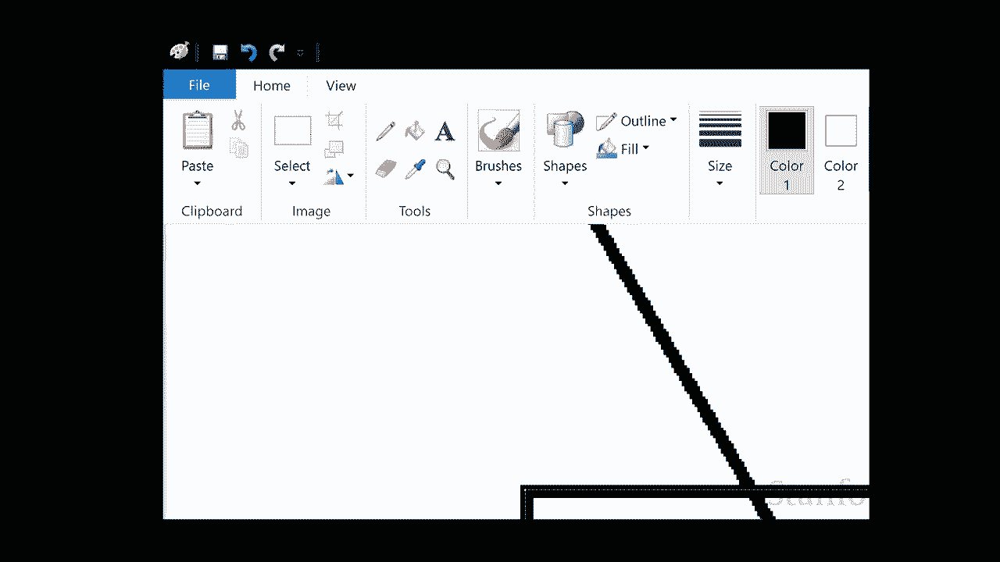
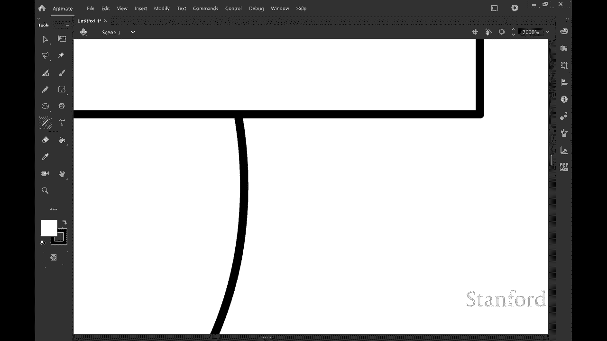
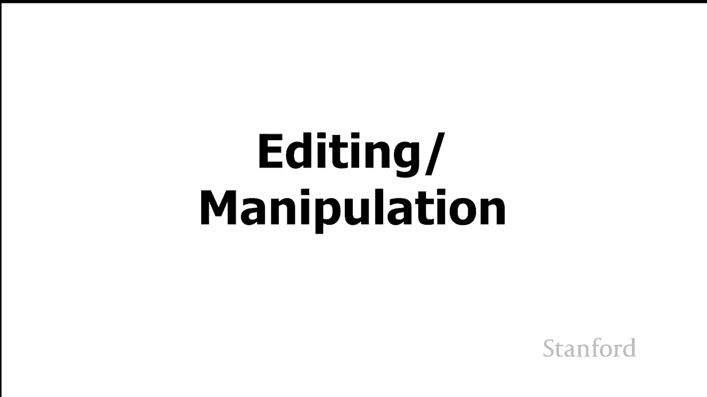
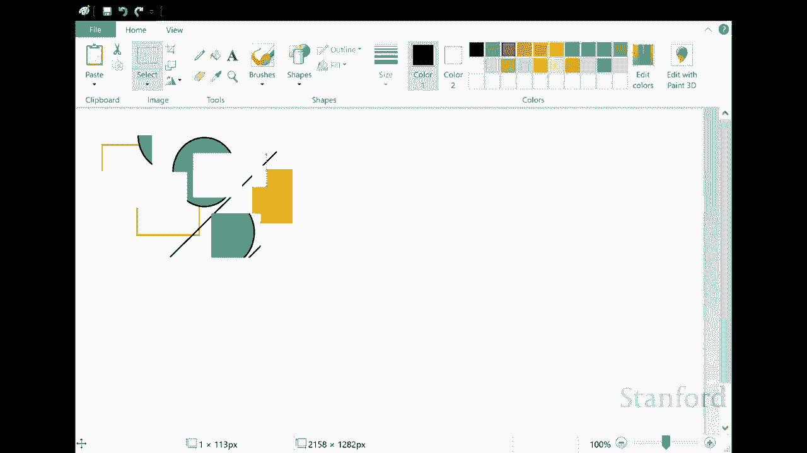
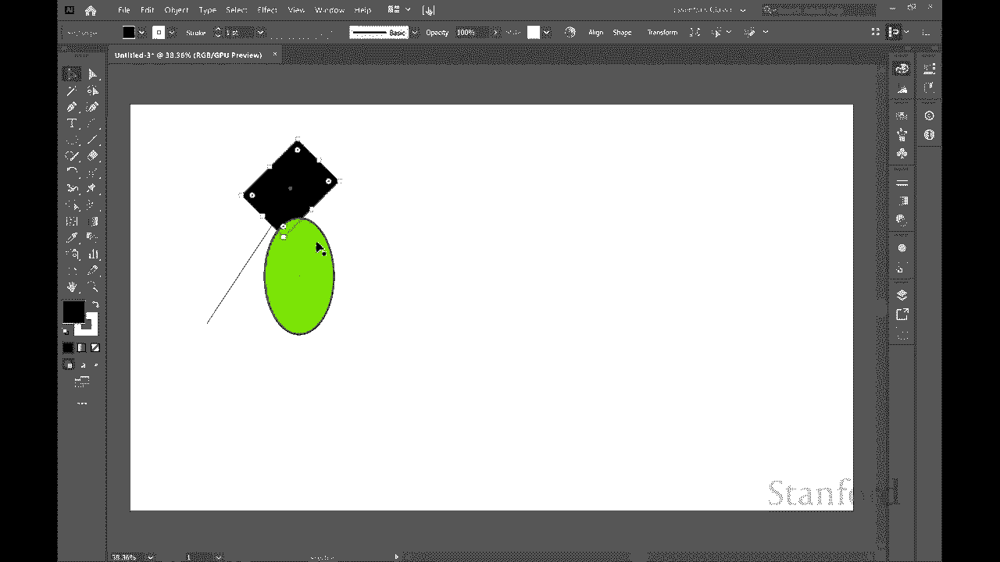

# L2.3：数字图像：位图与对象 🖼️

在本节课中，我们将要学习数字图像的两种基本存储方式：位图（光栅图形）和对象（矢量图形）。我们将探讨它们的工作原理、各自的优缺点以及适用场景。

## 概述

之前的视频中，我们关注了计算机显示器的实际工作方式。本节中，我们将切换视角，看看图像实际上是如何存储在计算机上的。

区别在于硬件如何工作与我们想要使用的文件如何工作以存储我们的图像。结果证明有两种基本方法可以将图像存储在文件中。

## 位图（光栅图形）表示法

第一种方法与我们在计算机显示工作方式方面看到的非常相似。我们看到计算机显示每个单独的像素都有一个支持它的位。如果我们有彩色图像，我们有一个黑白图像或一组位或字节。所以我们看到有24位颜色，其中每个单独的像素后面有24位。我们看到32位颜色等等。我们可以做的是我们可以只存储每个单独的像素值，并将它们存储在一个文件中。

所以这里有一个图像。假设我们想将它存储在一个文件中，我们将从我们的位图表示开始。它与显示工作方式相似。你可以看到我们所做的是我们在这里得到了所有单独的像素值，我们只是要单独存储每个值。

所以我可以说，在左上角我有像素(0,0)，那是RGB(255,255,255)。这意味着红色、绿色和蓝色最大，这意味着我们将有白色。我可以将下一个像素的值存储在像素(0,1)上，这也是RGB(255,255,255)等等。

我们向下走几行，我们将存储每一行中的每个单独像素。我们向下几行，我们到达那个圆圈的顶部。你可以看到，像素(9,4)意味着x等于9，y等于4（9从左边，4从顶部）仍然是白色的RGB(255,255,255)。然后我们转到下一个像素(10,4)，这个像素实际上是红色的，所以RGB是(255,0,0)等等。然后我们可以继续填充所有这些单独的像素值。

迟早我们要到达那里的矩形。你可以看到你知道的矩形就在第21行的矩形之前。这是y等于12，x等于21，那个仍然是白色的RGB(255,255,255)。我们到达下一个像素，在x上等于22，y等于12。然后这是一种不同的颜色。所以你可以看到这主要是蓝色，蓝色247，但那里有一些红色和绿色：红色87，绿色84，蓝色247。然后我将下一个像素存储在那个像素上，相同的颜色等等。我只是一个接一个地存储所有单独的像素值。

现在这绝对有效，这与显示器的工作方式完全匹配。但还有其他方法可以存储相同的信息。因此这种特定表示再次被称为位图或光栅图形。

## 对象（矢量图形）表示法

我们将看看另一种表示信息的方式。下一种表示信息的方式是我们所说的对象，或有时称为矢量图形。

你可以在这里看到我们得到了完全相同的图像，但我们将不存储所有单个像素值，而是将它们视为几何形状。所以我可以想，我有一个圆，这里是中心的x和y坐标，半径为8个像素。作为笔颜色宽度的笔画是一个像素，笔画颜色实际上是红色RGB(255,0,0)。然后我有了我的矩形，我继续在左上角开始xy位置，我继续存储宽度和高度，然后我继续存储填充颜色。您可以看到这也存储了完全相同的图像，但它以不同的方式存储了图像。

因此从根本上说，我们有两个选择：我想要将某物存储为位图（也称为光栅），还是我想将事物存储为对象（有时也称为矢量图形）？

所以我们现在要做的是看看这两种方法的优缺点。

## 比较：存储空间占用

我们要比较的第一件事是这两种方法占用多少空间。

所以我们在这里得到的是在我们的左边，我们将尝试估计我们的小图像在这里占用了多少空间。当我们将事物存储为具有24位颜色的位图时，我们需要为图像中的每个像素存储三个字节。

现在这里的图像实际上大约是64像素乘48像素。我知道它看起来大得多，但那是因为我放大了所有内容。因此，当您将3个字节乘以64 x 48个像素时，我们可以仔细查看所有内容，您最终得到的只是9000多个字节。

现在让我们来看看我们需要多少空间对于我们的对象表示。它取决于我们将为每个对象存储的每个单独的值。例如，我们正在存储中心，我们将开始一个x和y值。这些xy值有多大？它们每个占一定字节数。您知道我们可能会为矩形存储更多属性，而不是圆形。这些对象将要占用的空间会有所不同，但我估计我们每个对象需要大约8到12个字节。假设我们存储它的图像相对较小。如果它是一个更大的图像，我们需要存储更大的图像，我们的x和y的值会更大。所以在这种特殊情况下它确实会有所不同。我是说在这个特定图像中我们每个对象需要大约8到12个字节。我只有两个对象，所以你可以看到占用16到24个字节。

所以它真的不是很多。在一个例子中比较，对象的存储我有16到24个字节，而位图我们有9216个字节。所以你可以看到这里的明显赢家是将事物存储为我们的矢量图或对象图形。

## 比较：缩放效果

我想看看当我们使用这两种技术中的一种获得图像时，我们继续放大，会发生什么。

所以我得到的是我们将看看我们正在使用的两个不同的程序。将从我们的位图表示开始。所以我们在这里看到的是Microsoft Paint，它是一个标准的绘画程序，包含在Microsoft Windows中。我在这里绘制几个不同的对象，然后我放大。这里主要要寻找的是，注意，因为我放大的东西开始看起来有点参差不齐。

所以这里发生的事情是当我放大时，我没有得到更多的像素。发生的事情是位图表示中的像素只是显示为更大和越来越大的方块，所以他们变得非常参差不齐。

所以下一个程序是Adobe Animate，这是我在本课程中用于一些简单动画的动画程序。所以我将再次在这里绘制几个不同的对象，现在我要放大。你可以看到我可以放大，就我想要的而言，没有那些锯齿状边缘的迹象。

所以这里发生的事情是使用对象/矢量图形方法，我实际上有一个数学公式。我可以重新计算，因为我越来越近，越来越近。我可以只需使用该公式，我就可以重新计算需要放置的位置，并且可以根据需要进行放大，并且该几何形状仍然看起来很平滑。

## 比较：编辑与操作能力

所以我现在想谈论的是，当我们查看这两种可能的表示时，我们在创建文档后编辑或操作文档的能力是什么。

所以我们将一次又一次地从我们的位图表示开始。这是微软的油漆。你可以看到我已经绘制了许多不同的对象在我的文档中。如果我尝试编辑此文档，我们将发现我无法在此处编辑单个形状。因此您知道我在将这些对象绘制在屏幕上一旦我将它们放入我的文档中，它们就不再被视为单个几何形状。而是程序认为它们只是“嘿，这里是一堆像素，这些像素是特定颜色”。一旦我完成绘制它们，它们就不再是几何形状的一部分。因此当我操作此文档时，我只能操作单个像素或像素组。我无法操作原始圆形或线条或正方形。

现在下一个应用程序，这是Adobe Illustrator。这是一个为对象或矢量图设计的程序。所以你可以看到我可以继续抓取这些单独的形状。我可以旋转它们，我可以改变它们的颜色，我可以用对象或矢量图形表示改变它们的大小。这些单独的形状在屏幕被认为是几何形状，我可以继续将它们作为几何形状进行操作。因此这与我们的位图表示形成了非常鲜明的对比。

## 适用场景总结

那么，我为什么要很好地使用位图（光栅）呢？这里有一些事情你根本无法用数学公式表示。所以这是Maddie的照片。我们也许可以想出一些几何形状来表示，例如计算机，也许我们可以表示T恤作为几何形状。但你知道Maddie的皮毛怎么样？这不会发生。所以我们无法想出一个数学公式来代表她的每个单独的毛囊。

所以当我们看照片时，如果我们在头脑中从头开始生成一些东西，比如某种图表或某种标志或某种图形，那么我们用相机拍摄的将被表示为位图。是利用矢量对象表示的好时机。因此您知道何时可以使用矢量对象表示。

但请注意，在很多情况下您只需要使用位图。因此您知道数字绘画、照片，这些都是可以的，不能真的用矢量图形完美表示。

## 总结

本节课中我们一起学习了数字图像的两种核心存储格式：位图（光栅图形）和对象（矢量图形）。我们了解到：

*   **位图** 通过记录每个像素的颜色值（如 `RGB(255,0,0)`）来存储图像，与显示器工作原理一致，但放大时会失真，且后期难以编辑单个几何对象。
*   **对象（矢量）** 通过记录几何形状的数学描述（如圆心坐标、半径、颜色）来存储图像，文件体积小，可无限放大而不失真，并且便于后期编辑。

位图适用于照片等复杂、非公式化的图像；而矢量图形则更适用于徽标、图表、插图等由清晰几何形状构成的图像。理解这两种格式的区别，有助于我们在不同场景下选择最合适的工具。