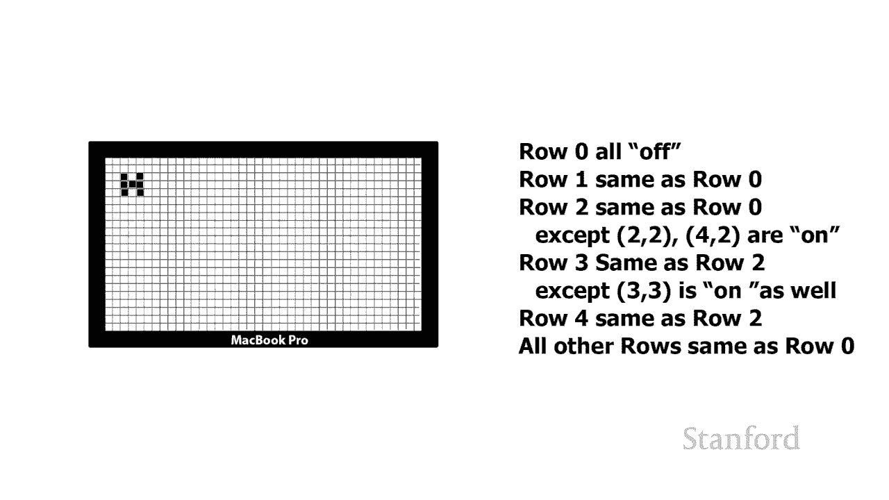
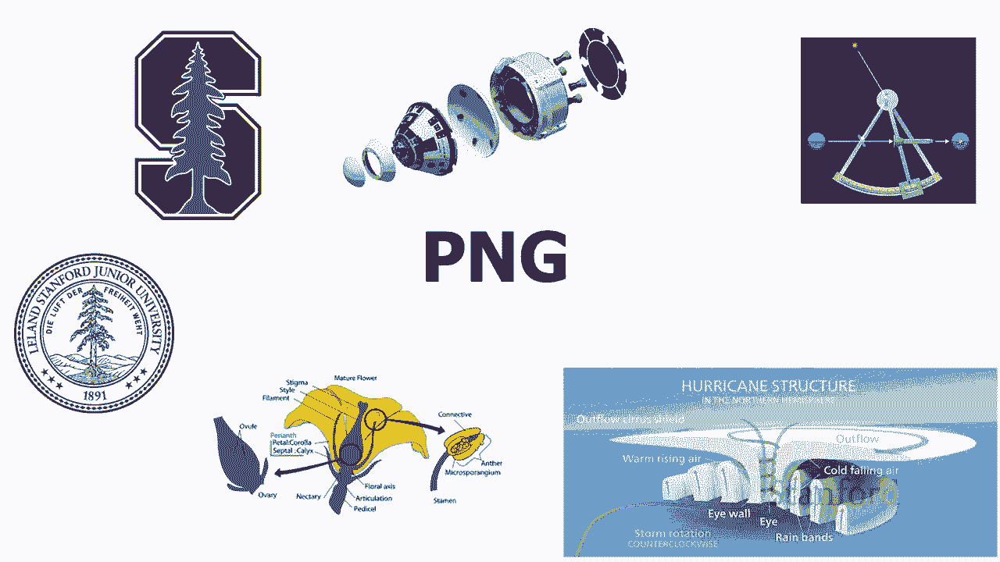
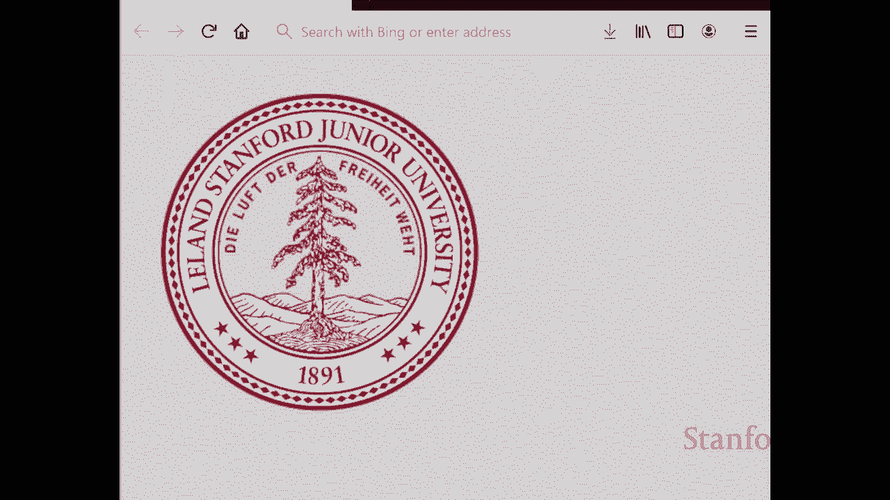
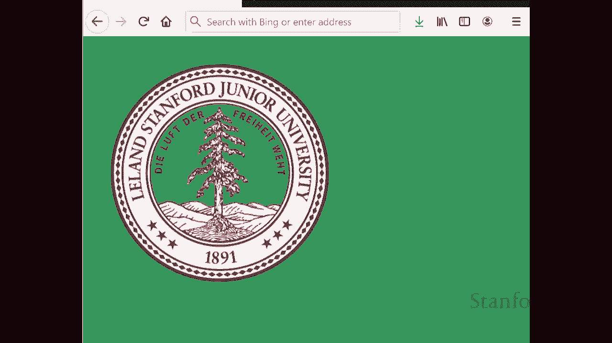
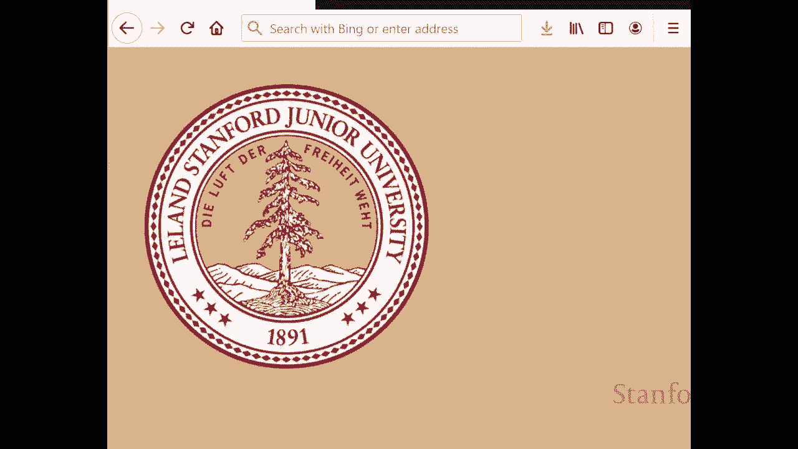
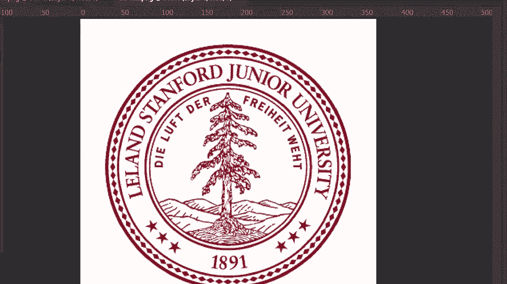

# L2.4：数字图像：任务与正确的格式 📸

在本节课中，我们将要学习数字图像的不同文件格式。我们将重点关注在计算机和网络上使用的主要格式，了解它们的工作原理、适用场景以及各自的优缺点。通过对比，你将学会如何为不同的任务选择合适的图像格式。

## 概述

数字图像有多种存储格式，每种格式都有其特定的设计目标和适用场景。本节我们将探讨几种主流的位图格式，如JPEG、PNG和GIF，并简要介绍SVG、RAW和HEIC等格式。理解这些格式的核心差异，能帮助我们在存储、编辑和分享图像时做出最佳选择。

## 网络上的主要图像格式

在网络上，主要使用三种位图格式：JPEG、PNG和GIF。此外，还有一种相对较新的对象格式SVG，它与HTML有相似之处。由于我们将在本季度晚些时候讨论HTML，因此关于SVG工作原理的详细内容将推迟到那时再讲解。

SVG格式适用于能用一系列几何形状（如圆形、矩形）描述的图像，这种格式也称为矢量格式。矢量格式非常紧凑，具有易于编辑和无限放大的优点。然而，对于像照片这样复杂的对象，矢量格式并不适用，此时位图格式是更好的选择。

## 位图格式与压缩原理

位图格式关注构成图像的每个像素的颜色值。你可能会认为，存储所有像素值是最直接的方法。但事实上，有更高效的方式来描述相同的信息，这涉及到“压缩”技术。

让我们通过一个在黑白显示器上显示字母“H”的例子来理解这一点。描述屏幕上所有像素状态（开或关）的最直接方法，是逐行逐列地列出每个像素的值。这种方法虽然准确，但非常冗长且占用空间。

以下是描述“H”图像的更紧凑方法：
*   第0行：所有像素关闭。
*   第1行：与第0行相同。
*   第2行：与第0行相同，但位置(2,2)和(4,2)的像素开启。
*   第3行：与第2行相同，但位置(3,3)的像素也开启。
*   第4行及之后所有行：与第0行完全相同。

通过指出某些行与已描述的行相同，我们大大减少了描述图像所需的信息量。这种技术就是**压缩**。它改变了信息的表示格式，从而减少了其占用的空间量。

## JPEG格式：适用于照片的有损压缩

JPEG（联合摄影专家组）格式专为存储照片而设计。大多数消费级相机和手机（在iPhone转向HEIC格式之前）默认使用JPEG格式来保存和分享照片。

JPEG存储24位颜色，这意味着它支持完整的1670万色域。然而，JPEG是一种**有损压缩**格式。这意味着在压缩过程中，为了显著减小文件大小，它会丢弃一些人眼不太容易察觉的图像信息。

例如，一张威尼斯的大尺寸图像（1.39 MB）和一张经过更高压缩的同分辨率图像（215 KB，仅为原大小的1/6）。在正常观看下，两者差异不大。但放大后查看细节（如栏杆或电线），压缩后的图像会出现模糊或混乱的块状区域，这些就是**JPEG压缩伪影**。

JPEG的优势在于我们可以控制压缩程度。你可以选择高质量（文件大、伪影少）以接近原始图像，也可以选择高压缩（文件小、伪影明显）以便于网络快速传输。

关于其他格式：
*   **HEIC**：苹果公司使用的新格式，在压缩效率上通常优于JPEG。
*   **RAW**：高端相机使用的格式，直接存储传感器捕获的原始数据，没有任何压缩或处理，文件体积非常大。

## PNG格式：适用于图表图形的无损压缩

PNG（便携式网络图形）格式建立在较旧的GIF格式之上，旨在存储图表、图形等由计算机生成或手动绘制的图像，而非照片。

PNG和GIF使用的压缩技术，与我们之前描述“H”字母的例子非常相似。它们会寻找图像中完全相同的部分（例如，图表中两条相同的线，或一大片纯色区域），并通过引用这些重复模式来减少文件大小。这种压缩是**无损的**，意味着压缩后的图像可以精确还原为原始图像，没有任何信息丢失。

此外，PNG和GIF支持JPEG所不具备的一个功能：**透明度**。你可以将图像中的某些像素指定为透明，这样当图像放置在不同背景上时，透明区域会显示出背景内容，而不是图像本身的颜色（通常是难看的白色矩形背景）。在编辑软件中，透明区域通常显示为棋盘格图案。

## GIF格式：简单的动画与有限色彩

GIF格式之所以著名，主要是因为它支持创建短小的**动画**。动画GIF本质上是在同一个文件中打包一系列静止图像，并按顺序循环播放。

虽然现在也有支持动画的PNG格式（APNG），但其浏览器支持相对较新，尚未完全普及。因此，如果你希望所有人都能看到你的短动画循环，目前仍应使用GIF格式。

GIF是一种较旧的格式，它有一个主要限制：仅支持最多**256种颜色**。这与JPEG或PNG的1670万色相比非常有限。因此，GIF图像（尤其是照片）看起来可能色彩单调或有颗粒感。除了制作动画，GIF在静态图像领域已基本被PNG格式取代。

## 总结

本节课我们一起学习了数字图像的主要文件格式及其核心特性。

*   **JPEG**：采用**有损压缩**，通过丢弃部分信息来大幅减小文件体积，最适合存储**照片**。其压缩程度可调，需要在文件大小和图像质量之间权衡。
*   **PNG**：采用**无损压缩**，通过查找重复模式来减小文件，能精确还原原始图像。它支持**透明度**，最适合存储**图表、图形和徽标**等计算机生成的图像。
*   **GIF**：支持简单的**动画**，但色彩有限（最多256色）。目前其主要用途是制作在网络上广泛传播的短动画循环。
*   **SVG**：一种**矢量图形**格式，用数学公式描述图像，无限放大不失真，适合图标和线条图形。
*   **RAW/HEIC**：RAW是相机原始数据，HEIC是苹果的高效图像格式，它们通常需要在分享前转换为JPEG等通用格式。

理解这些格式的差异，能帮助你在不同场景下（如网页设计、照片存储、图表制作）选择最合适的工具，从而在保证所需质量的同时，优化存储空间和传输速度。