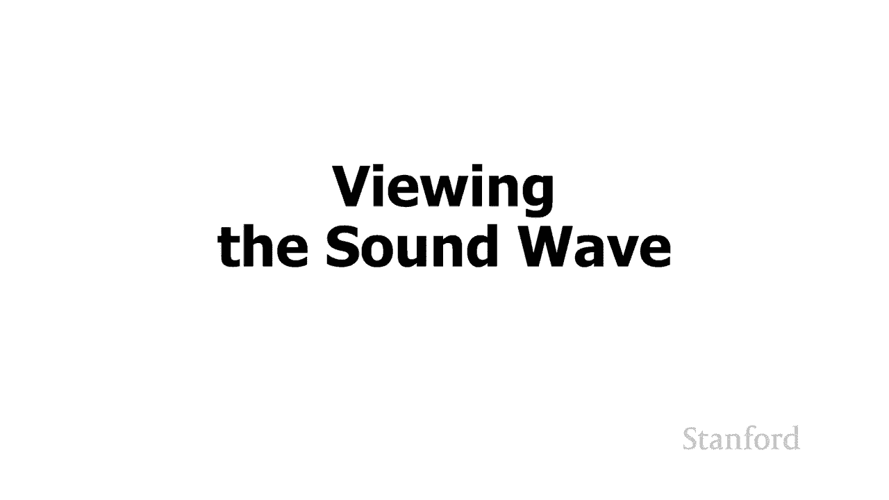
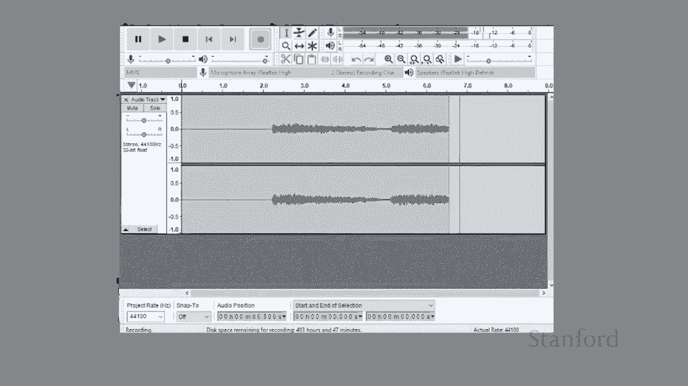
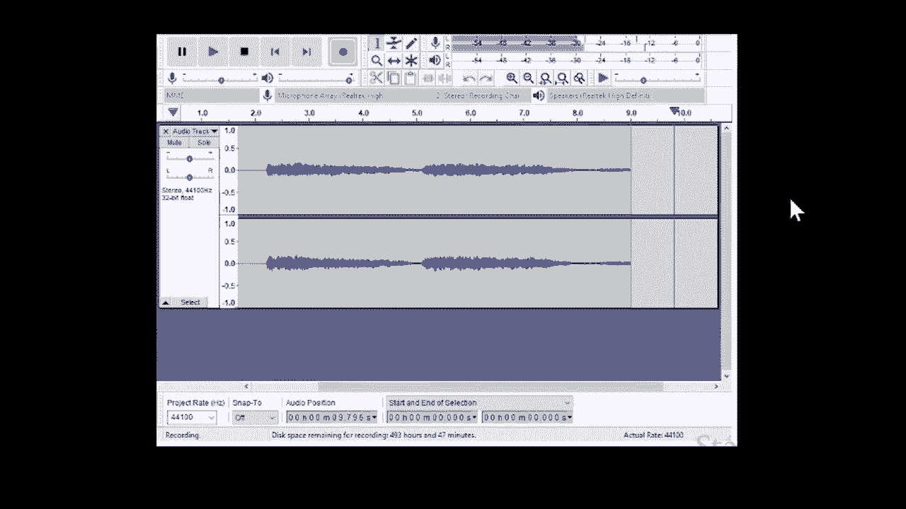
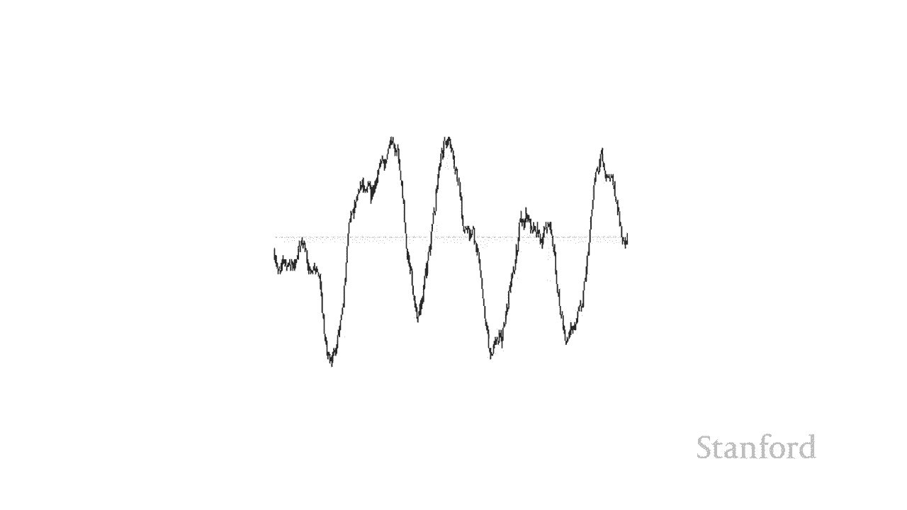

# 斯坦福CS105：计算机科学导论：P10：L3.1- 数字音乐：影音录制背后的科学 🎵

在本节课中，我们将要学习数字音乐的基础知识，特别是声音是如何产生、被录制，并最终在计算机上以数字形式存储的。我们将从物理世界的声音波开始，逐步探索录音技术如何捕捉这些波，以及计算机如何表示和处理它们。

## 声音的产生与传播 🔊

上一节我们介绍了课程的主题，本节中我们来看看声音是如何实际产生的。

首先假设我们在教室里，斯坦福交响乐团正在全班面前演奏贝多芬的第五交响曲。当他们演奏交响曲时，会发生什么？正在发生的是，各种乐器都在产生**声波**，并且这些声波在空气中传播。它们最终到达我们的耳膜。所以，我们所感知的音乐，是声波击中我们耳膜的结果。

## 录音的基本原理 🎤

了解了声音的产生后，我们来看看录音是如何实际发生的。

现在假设我们想把斯坦福交响乐团送回家，然后听他们的录音。我们要做的是，和之前一样，让斯坦福交响乐团现场演奏。然后，我们要用一些设备代替我们的耳朵——**麦克风**。我们有一个单独的麦克风，放置在房间中间。麦克风会在声波撞击它时拾取声波。

不知何故，我们需要存储使用该麦克风产生的声波。我们可以从磁带或老式留声机等设备开始。我们需要存储交响乐团正在播放的波的**振幅**和**频率**。

在立体声的情况下，我们将设置两个麦克风：一个在左边，一个在右边。我们将做同样的事情。声波将在稍微不同的时间到达这两个麦克风。我们继续并再次获取声波的幅度和频率，然后我们继续记录。

## 从录音到播放 🔊

记录下内容后，我们要做的是将斯坦福交响乐团送回家。我们得到一些扬声器并将它们连接到我们的录音设备。如果扬声器能够产生与斯坦福交响乐团最初创建的完全相同的声波，我们基本上可以完整再现斯坦福交响乐团的表演。

## 可视化声波 📊

我们实际上可以使用计算机上可用的一些工具来看看这些声波是什么样子。我们接下来要做的是，使用一个叫做 **Audacity** 的程序。它将让我们看看这些声波。我要演奏一个版本的贝多芬第五交响曲，并用我电脑上的麦克风来接收交响乐团演奏的声音。我们将看到的是声波的图形化表示。

以下是使用 Audacity 观察声波的步骤：
1.  打开 Audacity 程序。
2.  使用电脑麦克风录制一段声音（例如播放的交响乐）。
3.  程序界面将显示声音的波形图。

如果我们将正在观看的声波在 Audacity 中放大，那么 Audacity 将向我们展示音乐播放时的声波形态。我们把它放得更大，就能看到更详细的波形。所以，我们的下一个任务是把我们在这里看到的这个波，以某种方式把它转换成**位和字节**，这样我们就可以在计算机中存储和处理它。

## 总结 📝

本节课中我们一起学习了数字音乐录制背后的科学。我们从声音的产生和传播开始，了解了声波如何被麦克风捕捉并记录下来。接着，我们探索了如何通过扬声器重现这些声波来播放音乐。最后，我们使用 Audacity 工具可视化了声波，并引出了将模拟声波转换为数字位和字节的核心任务，为后续学习数字音频格式打下基础。