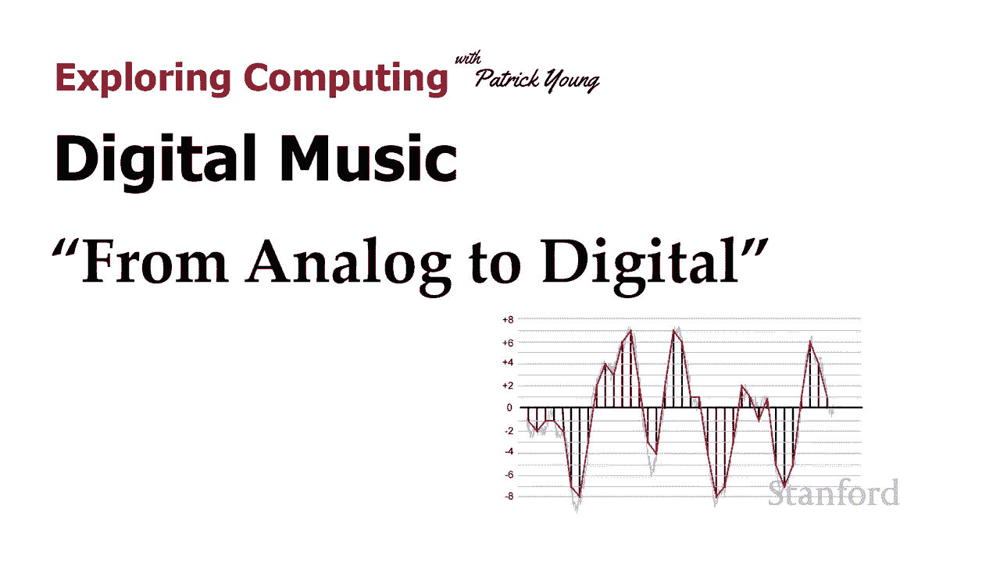
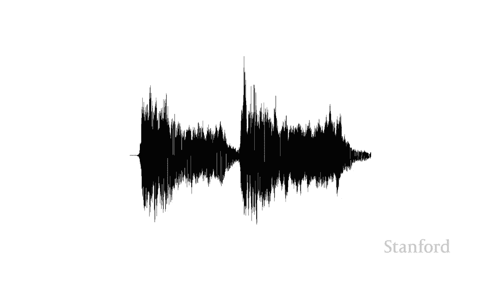

# L3.2：数字音乐：从模拟信号到数字信号 🎵

在本节课中，我们将学习如何将现实世界中的模拟音乐信号（声波）转换为计算机可以存储和处理的数字信号。我们将重点理解两个核心概念：采样率和位深度。

在上一节中，我们了解到音乐本质上是一种声波。本节中，我们将看看如何利用这种波，并使用我们在之前课程中学到的位和字节来表示它。

## 观察声波 📈

现在让我们仔细观察声波，以确切了解其特性。下图是贝多芬第五交响曲声波的一个特写片段。

横轴（X轴）代表时间的推移。纵轴（Y轴）代表波在特定时间点的大小（振幅）。为了将这些信息存储到计算机中，我们需要在特定的时间点进行测量。

我们将存储一系列数字，这些数字对应于波在不同时间点的高度。

## 核心概念一：采样率 ⏱️

当我们进行测量时，需要决定采样的频率。这被称为**采样率**。采样率决定了我们每秒从声波中采集多少个样本。

下图展示了采样过程。红线代表根据我们采集的样本重建出的波形。

你会注意到，红线并不完全遵循原始的浅灰色声波线。如果我们能采集无限数量的样本，那么红线将与原始灰线完全匹配。但我们不能采集无限样本，因为那需要无限量的存储空间。

这里发生的是：我们沿着声波线获取特定点的样本，并尝试用这些样本来重现原始声波。

### 采样率的影响

让我们看看如果降低采样率会发生什么。在下一张图像中，采样率降低了。

我们看到采集的样本数量少了很多。红线开始严重偏离原始灰线，这个新波形看起来与原始波形大不相同。

问题在于：因为我们没有足够频繁地采样，我们的样本完全错过了原始信号的一些峰值和谷值。

## 核心概念二：位深度 🎚️

我们可以控制的另一个因素是沿Y轴的测量精度。这控制了我们的**动态范围**。我们可以改变所谓的**位深度**，即我们留出多少位来表示沿Y轴的数字。

以下是两个示例：
*   在第一个示例中，我存储介于**+8 和 -8**之间的数字。
*   在第二个示例中，我存储介于**+2 和 -2**之间的数字。

（注：为了示例简单，这里使用了偶数范围。实际上，对于n位，范围通常是从 **-(2^(n-1))** 到 **+(2^(n-1))-1**。）

所以让我们先看+8到-8的示例。您可以看到我正在采集一些样本。这里要记住的是，我分配了给定的位数，因此我不能存储无限数量的可能值。我不能存储波高恰好是7.2562这样的值，我必须将它存储在我已给定的位数范围内。在这个例子中，我假设可以存储从+8到-8的整数值。你可以看到我试图遵循原始的灰线，但我仅限于沿着这些特定的离散整数值存储。

现在让我们看看另一个例子，我只能存储-2和+2之间的值。

您可以立即看到，第二个示例的效果不是特别好。这里发生的情况是：位深度越大，我就能够越准确地表示波形。

## 权衡：质量 vs. 存储空间 💾

我们已经看到，我们可以控制**采样率**（即随时间采集的样本数量）和**位深度**（这决定了动态范围和每个样本点的存储精度）。

显然，我们采集的样本越多越好，我们的位深度越宽越好。那么问题来了：为什么我们不直接为这两者使用巨大的值？

答案当然是：采样率越高、位深度越大，我们的音乐文件占用的存储空间就越大。

以下是常见的标准：
*   **CD**：使用每秒 **44,100** 个样本（通常写作 **44.1 kHz**），每个样本 **16 位**，并且有两个通道（一个左声道和一个右声道）。
*   **DVD**：使用非常相似的每秒样本数和位深度。
*   **蓝光**：实际上可以增加每个样本的位数。

但这基本上是我们大多数人聆听音乐的质量。然而，我们还没有真正完成，因为在您听到的大部分音乐真正进入您的计算机之前，通常还会有一个额外的步骤（如压缩）。这是因为上述规范适用于实际的物理CD磁盘。在下一个视频中，我们将看看这个额外的步骤是什么样子的。

## 总结 📝

本节课中，我们一起学习了将模拟音乐信号数字化的核心过程：
1.  **采样**：以固定的时间间隔（采样率）测量声波的振幅。采样率越高，对原始波形的还原度越高。
2.  **量化**：将每个采样点的振幅值，近似为指定位数（位深度）所能表示的最接近的离散值。位深度越大，表示的动态范围越广，精度越高。
3.  **权衡**：更高的采样率和位深度能带来更好的音质，但也会导致数据量（文件大小）显著增加。实际应用（如CD标准）是在音质和存储效率之间取得的平衡。