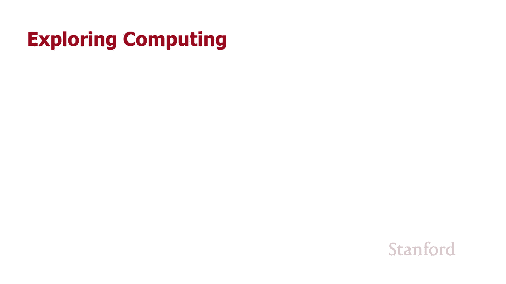
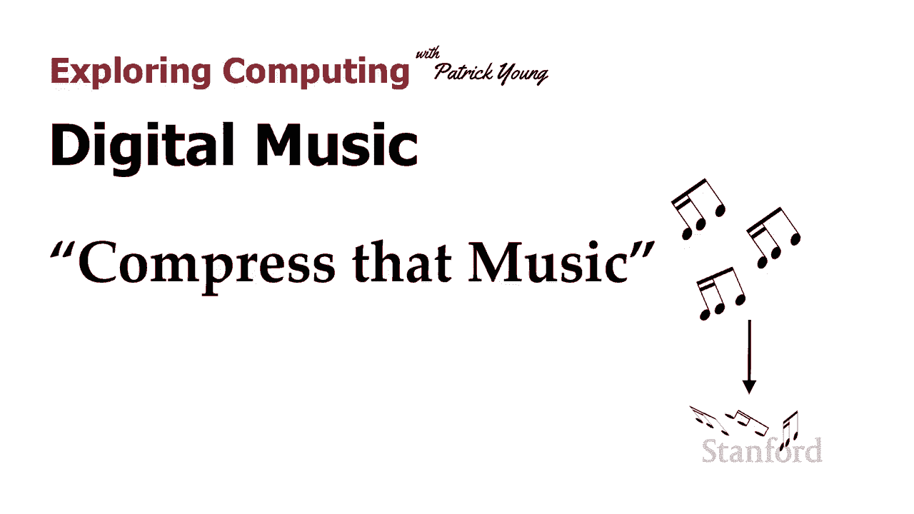
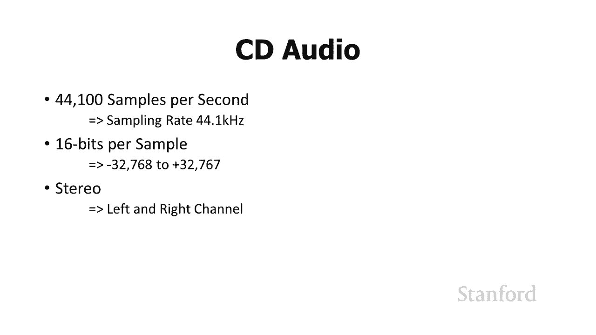
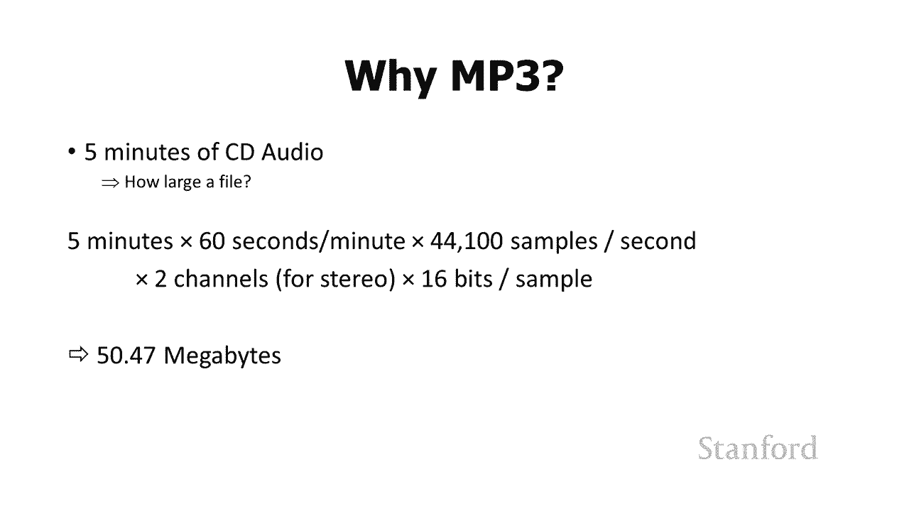
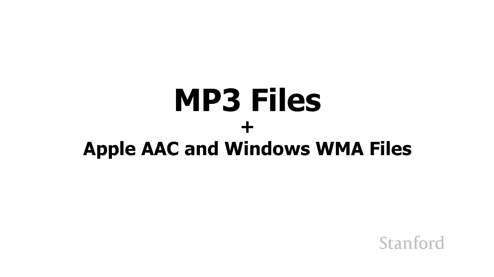
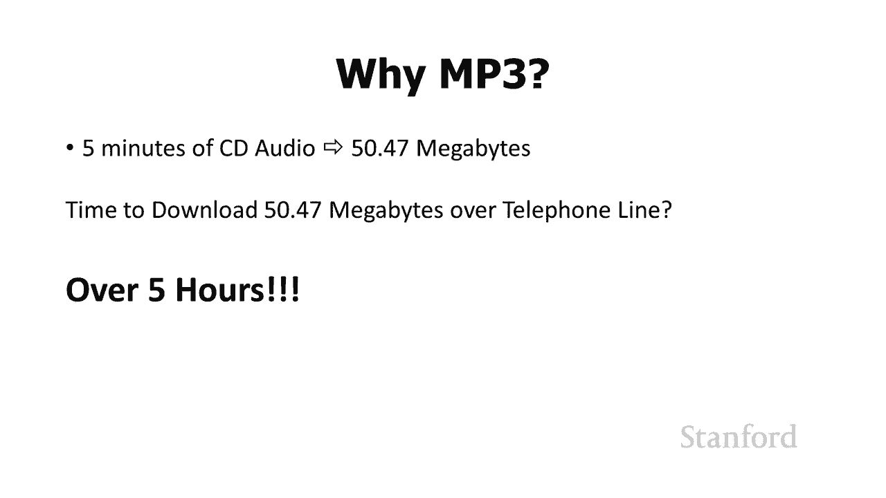
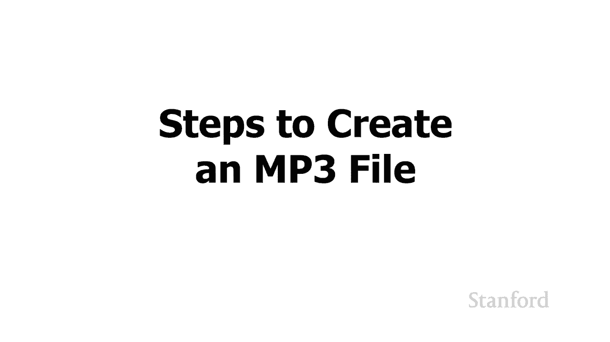
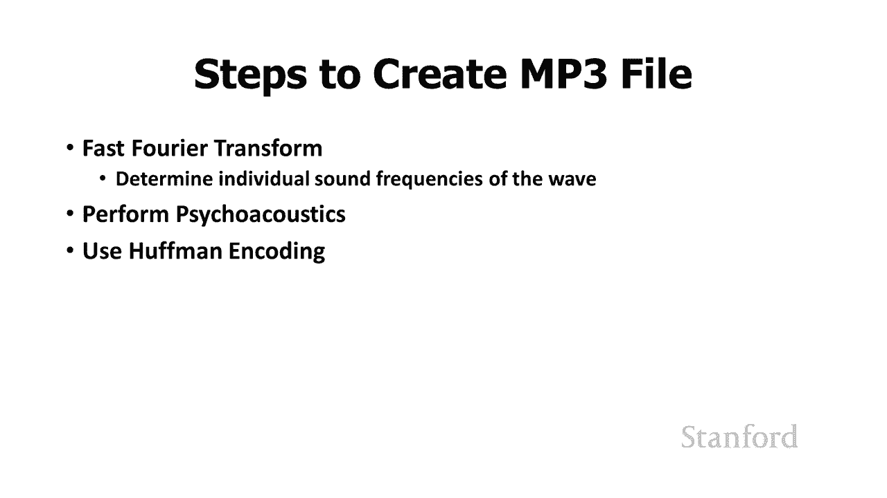
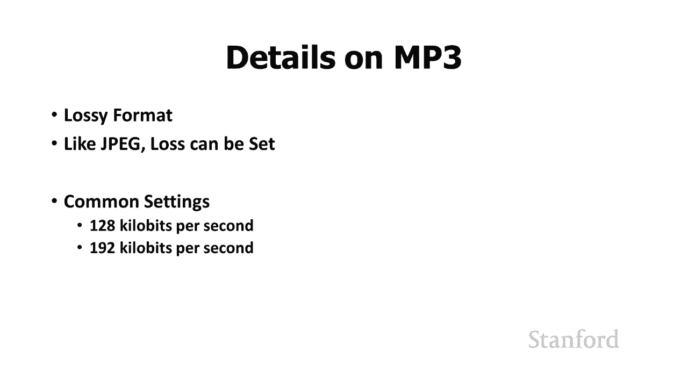
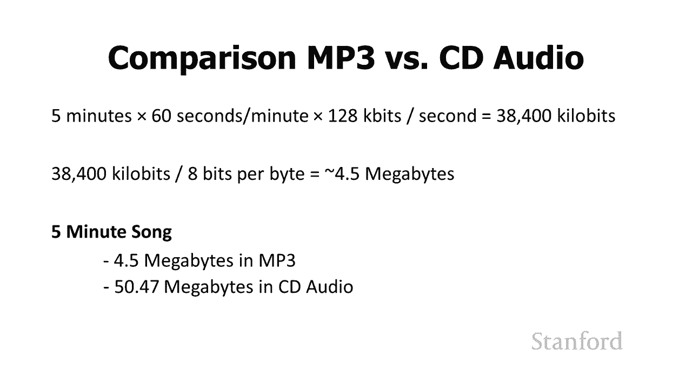

# L3.3：压缩音乐 🎵

在本节课中，我们将要学习数字音乐压缩的核心原理。我们将探讨为什么原始的CD音频格式不适合互联网传输，并详细介绍MP3等压缩格式如何通过一系列技术手段，在保证人耳听感基本不变的前提下，大幅减小音频文件的大小。

上一节我们介绍了如何将模拟声音信号转换为数字的CD音频格式。本节中我们来看看如何对这种数字音频进行压缩，使其更适合存储和网络传输。

## CD音频的存储问题

在上一个视频中我们提到，即使CD音频允许我们以数字方式存储音乐，但如果这个标准是现在制定的，那它可能不会被广泛使用。因为互联网音乐标准实际上是在大约20年前制定的。

CD音频存在一个问题：它占用了很多空间。让我们来计算一下一首歌曲需要多少空间。

假设我们有一首五分钟的歌曲，并且我们正试图通过互联网发送它。例如，你的父母在一个乐队中创作了一首五分钟的朋克摇滚歌曲，他们想把它发送给家里的弟弟或妹妹。他们使用我们之前讨论的技术将其转换为数字格式。问题是，这个文件有多大？

让我们来计算一下：
*   5分钟 × 60秒/分钟 = 300秒
*   每秒44,100个样本 × 2个通道（左/右）= 88,200个样本/秒
*   每个样本16位 = 16比特/样本
*   总比特数 = 300秒 × 88,200样本/秒 × 16比特/样本 = 423,360,000比特
*   转换为字节（1字节=8比特）：423,360,000比特 ÷ 8 = 52,920,000字节 ≈ 50兆字节

按照今天的标准，50兆字节听起来并不可怕。但回到20年前，当你的父母上大学时，他们需要通过互联网将这首歌发送给家里的弟弟或妹妹。问题在于，下载这首五分钟的歌曲需要多长时间？

结果证明，它需要大约五个小时。而当时电话线既用于互联网又用于语音，你必须选择使用哪一个。在五个小时内，弟弟或妹妹正在下载那首五分钟的歌曲，没有其他人可以使用电话。这显然是一个问题。

## 解决方案：音频压缩格式

解决方案是MP3文件。我们将在本视频中讨论MP3文件，但需要提一下还有其他几种密切相关的格式。例如，如果你在从iTunes购买的Apple设备上听音乐，可能会使用AAC格式。如果你在Windows设备上收听，可能会使用WMA格式。AAC和WMA标准都非常密切地遵循MP3的原理。我在这里谈论的几乎所有关于MP3的内容，对于其他音频格式而言都非常相似。

但有一种较新的格式非常不同，它并不需要进行那么多压缩，我们将在本系列的最后一个视频中讨论这个问题。

## MP3压缩的核心步骤

为了在合理的时间内在互联网上传输这些文件，我们需要减少音频文件占用的空间量。我们要做的是执行许多不同的步骤来压缩文件。

以下是MP3压缩涉及的三个主要步骤：

### 1. 快速傅里叶变换

我们要做的第一件事是执行一个快速的傅里叶变换。我不想讨论这个的数学细节。快速傅里叶变换背后的基本思想是：任何声波都可以分解成成分（零件），其中每个零件都是一个单频。例如，我们可能有一首歌在播放，我们可以把这首歌分解成60赫兹的波、80赫兹的波、120赫兹的波等等。它们都有不同的振幅，但是当它们全部结合在一起时，这就是我们实际听到的内容。所以，我们将执行这个快速傅里叶变换来确定各个组成频率。

### 2. 心理声学分析与信息丢弃

现在我们要做的是使用一种叫做“心理声学”的东西，消除其中的一些频率。心理声学是研究人类如何实际聆听声音的科学。事实证明，有一堆声音我们根本听不见。

最值得注意的是，有些频率太高了我们听不到。例如，狗哨是有效的，因为当你吹狗哨时会发出非常高的高频声音，狗可以听到，但是人类不能，因为它太高以至于人类听不到。

我们还可以使用其他技巧来从我们的信息中消除某些声音。例如，如果有一个声音很大，然后在附近的频率中有更柔和的声音，人类会完全忽略更柔和的声音。

所以，我们要做的是使用心理声学知识，开始丢弃部分音乐信息。

现在需要注意的一件事是：我们正在丢失信息。之前我们谈到压缩图像时，我们谈到了使用JPEG技术和PNG技术进行压缩。记住，PNG技术是无损的，没有信息丢失，我们能够完全重现原始的位图图像。相比之下，JPEG会丢失信息。MP3将类似地工作，它是一种“有损”压缩。

一种思考方式是：假设我把贝多芬《第五交响曲》的原始CD音频，和我对它进行心理声学分析并压缩后的MP3版本进行比较。如果我压缩得很好，希望音乐对我来说听起来完全一样。但想想我的狗，我的狗正在听原始CD质量的声音，里面有这些美妙的高频音调，我听不见，所以我继续把它们扔掉了。当我用新的MP3格式重播音乐时，我的狗可能会想：“你做了什么？所有那些美丽的高频音符发生了什么？” 所以，我们在这里丢失了信息。

### 3. 霍夫曼编码

我们还没有完成压缩，尽管我们需要采取另一个步骤，那就是执行霍夫曼编码。

现在我不想详细介绍这个，但基本思想是：这是一种查找频繁出现的序列和不经常出现的序列的编码方式。它要做的是将频繁出现的序列存储在较小的空间中，与不经常出现的序列相比。

我喜欢通过类比来说明这一点。你们中的许多人可能至少熟悉摩尔斯电码的概念。最著名的摩尔斯电码信息可能是SOS（拯救我们的船）。在摩尔斯电码中，SOS的符号是：`... --- ...`（三点三划三点）。这与我们的讨论有什么关系呢？在摩尔斯电码中，传输一个字母所需的空间量取决于字母的频率。字母E是一个非常常见的字母，我们将只用一个点（`.`）来传输E。而字母A也很常见，所以我们将通过点划线（`.-`）传输A。而字母Q不经常出现，所以我们要以“划划点划”（`--.-`）来传输。因此，传输AQ将占用四倍于传输E的空间或时间。

因此，霍夫曼编码将对我们的音乐做一些非常相似的事情，为常见的数据模式分配短的编码，为不常见的模式分配长的编码。

## 压缩效果对比

所以我们执行了快速傅里叶变换，进行了心理声学分析，并完成了霍夫曼编码。我们有了歌曲的新版本，它以MP3格式存储。让我们快速看看MP3与原始CD音频相比将占用多少空间。

我们需要记住的第一件事是，MP3是一种有损格式，就像JPEG一样。和JPEG一样，可以设置压缩的“损失量”。因此我可以决定我希望它听起来尽可能接近原始，或者我可以决定我将在健身房听这个，所以我不太关心质量有多好。

一些常见的MP3比特率设置是每秒128千比特（Kbps）和每秒192千比特（Kbps）。让我们假设我们使用128 Kbps的比特率来压缩我们的五分钟歌曲。

计算如下：
*   5分钟 × 60秒/分钟 = 300秒
*   128千比特/秒 × 300秒 = 38,400千比特
*   转换为字节：38,400千比特 × 1024比特/千比特 ÷ 8比特/字节 = 4,915,200字节 ≈ 4.7兆字节

记住，我们原来的CD音频歌曲大约是50兆字节。我们可以通过将其转换为MP3，以大约4.7兆字节的空间来收听完全相同的音乐（对人耳而言）。因此，你可以看到我们已经节省了大量的空间。至于质量损失，我们至少可以通过选择不同的比特率来控制它。

## 总结

本节课中我们一起学习了数字音乐压缩。我们了解到原始的CD音频格式文件体积庞大，不适合互联网传输。MP3等压缩格式通过三个核心步骤——**快速傅里叶变换**、**基于心理声学的信息丢弃**和**霍夫曼编码**——在牺牲部分人耳不易察觉的信息的前提下，极大地减小了文件大小。这使得音乐在互联网上的快速分享和存储成为可能。这是一种典型的“有损”压缩，其关键在于巧妙地利用人类听觉系统的特性。