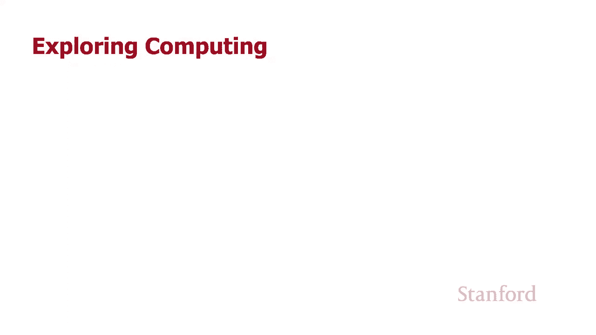
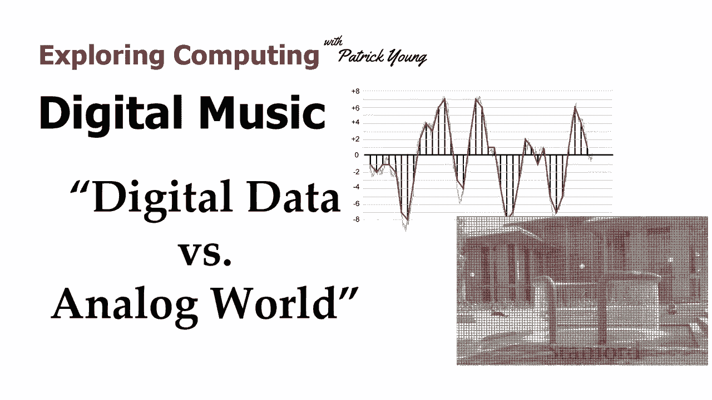
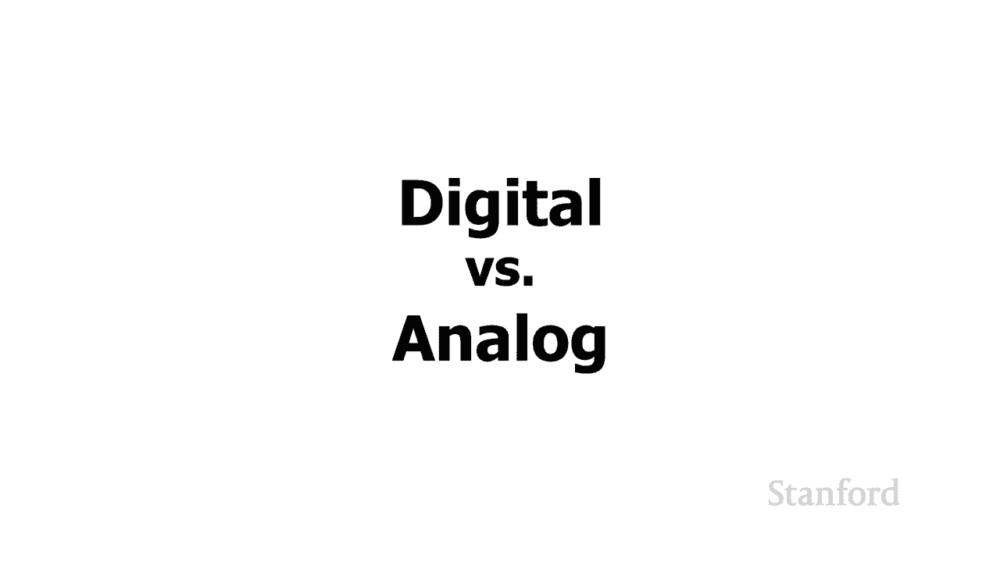
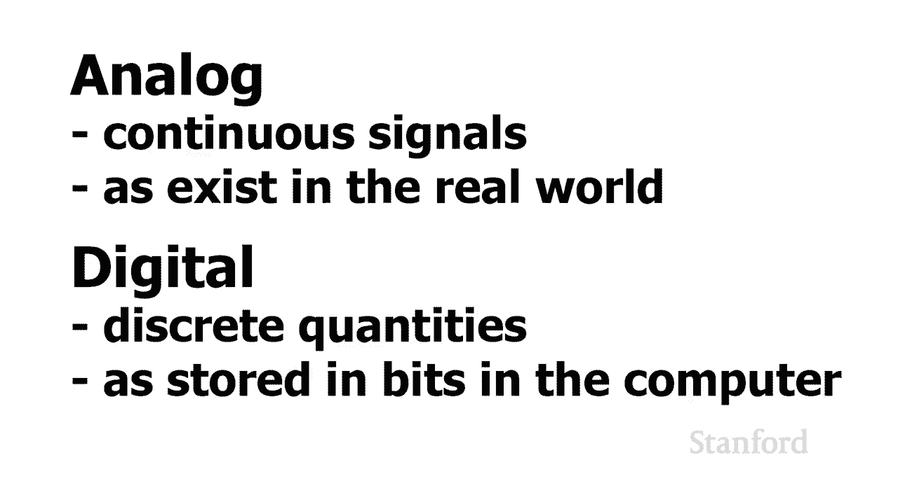

# 斯坦福CS105：计算机科学导论：L3.4：数字音乐：数字信号 vs 模拟信号 🎵

在本节课中，我们将要学习数字信号与模拟信号的核心区别。我们将探讨计算机如何将现实世界中连续的模拟信息（如图像和声音）转换为离散的数字数据，以便进行存储和处理。

## 概述

本周我们已经研究了计算机内部运作与我们现实生活中习惯的事物之间的许多差异。我们看到的第一个差异是数字系统：我们习惯使用十进制数，但计算机使用二进制数。但第二个，也是更重要的区别，是模拟和数字之间的区别。

上一节我们介绍了二进制与十进制的区别，本节中我们来看看模拟与数字的本质差异。

## 模拟信号与数字信号

当我们观察现实世界时，**模拟**指的是**连续信号**。现实世界充满了连续的量。相比之下，**数字**意味着我们以**离散量**存储信息。

因此，数字图像和数字音乐的全部内容，就是将真实的模拟世界转换成这些离散量，以便我们可以将其存储在计算机中。当我们想要将任何东西移入计算机时，总会有这个过程：我们必须将真实世界的模拟实体，以某种方式转换为数字世界。

## 从模拟到数字的转换

### 图像的数字化

如果我们在看一张照片，例如绿色图书馆前的红色喷泉照片。假设我们实际上站在图书馆前，世界以其所有的荣耀呈现。我们可以问一些问题，比如“现实世界中有多少颜色？”或“现实世界中有多少像素？”。这些问题没有意义，因为现实世界没有离散数量的颜色，也没有离散的像素。

当我们拍摄数码照片时，我们将它从现实世界转换成这些离散的单元（像素），以便存储在我们的计算机内部。我们将现实世界中的真实场景转换为单个像素的网格。在这些单个像素中，我们查看颜色，并将其转换为数字序列。例如，我们可能将该颜色转换为一个由8位（红色）、8位（绿色）和8位（蓝色）组成的序列。这样，我们就在数字化真实世界，以便将其作为离散量存储在计算机中。

### 声音的数字化

类似地，当斯坦福交响乐团在教室前演奏贝多芬第五交响曲时，他们并不是在生成每秒四万四千一百个数字的数字流，其中每个数字都在负三万二千七百六十八和正三万二千七百六十七之间。这不是他们正在做的事情。他们正在生成一个**连续的模拟信号**。

当我们将这个声音存储到我们的计算机中时，我们需要做的是：我们需要将该连续的模拟信号，转换为离散的数字量，以便我们实际上可以将它们存储起来。

## 核心概念总结

以下是模拟与数字的核心区别：

*   **模拟信号**：在时间和幅度上都是**连续**的。现实世界中的大多数现象（如声音、光线）最初都是模拟的。
    *   公式表示：`信号值 = f(时间)`，其中 `f` 是连续函数。
*   **数字信号**：在时间和幅度上都被**离散化**（采样和量化）。这是计算机存储和处理信息的方式。
    *   公式表示：`数字信号值 = 量化( f(采样时间点) )`。

将模拟信号转换为数字信号的过程主要包含两个步骤：

1.  **采样**：在连续的时间点上测量信号的值。
    *   代码概念：`sample_value = analog_signal(t)`
2.  **量化**：将每个采样得到的连续幅度值，近似为最接近的离散电平值。
    *   代码概念：`digital_value = round(sample_value / quantization_step) * quantization_step`

## 总结

本节课中我们一起学习了数字信号与模拟信号的根本区别。我们了解到，计算机是一个数字系统，它处理的是离散的数据。为了将现实世界中连续的模拟信息（如图像和声音）带入计算机，我们必须通过**采样**和**量化**的过程将其**数字化**。理解这一转换过程是理解数字媒体（如图片、音乐、视频）如何在计算机中表示和存储的基础。