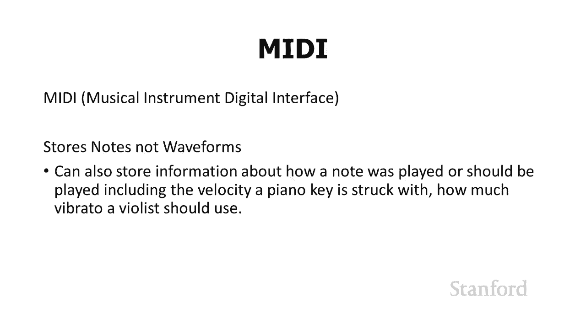
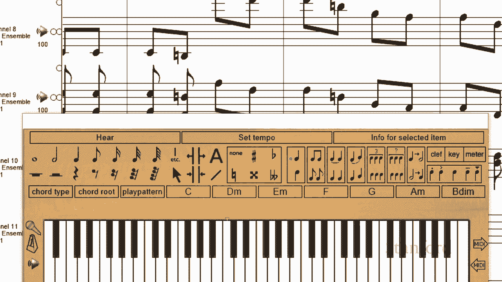
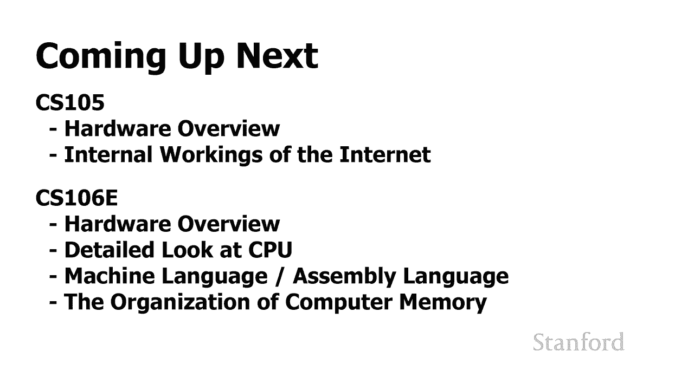
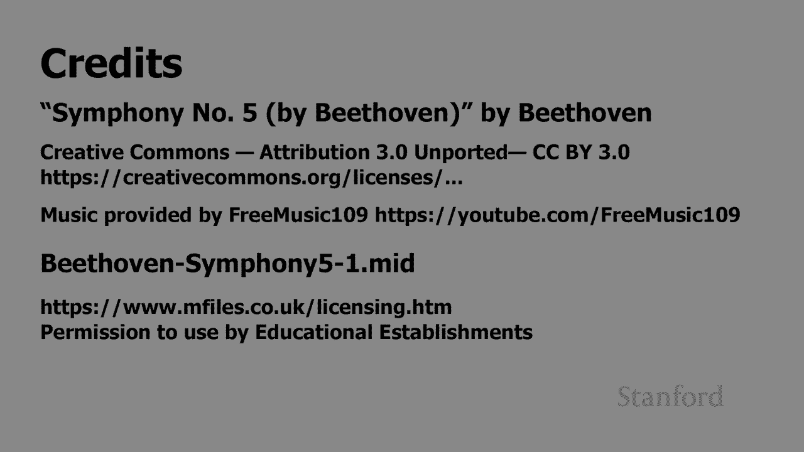

# 计算机科学导论：L3.5：数字音乐：音乐与格式 🎵

在本节课中，我们将探讨数字音乐的存储格式。我们已经了解了MP3等有损压缩格式，本节将介绍无损压缩格式FLAC以及完全不同的MIDI文件格式，并比较它们的特点与应用场景。

## 无损音频格式：FLAC

上一节我们介绍了MP3等有损压缩格式，它们通过舍弃一些人耳不易察觉的声音信息来减小文件体积。本节中我们来看看一种不同的思路：无损压缩。

FLAC是一种无损音频编解码器。它通过对原始CD音频数据进行压缩来减小文件大小，但**不会丢失任何声音信息**。其压缩原理类似于我们在图像处理中见过的PNG文件。因此，一个FLAC文件解码后的音频数据与原始CD音频数据完全一致，音质理论上与CD相同。

苹果和微软也拥有具备类似特性的自有无损音频格式。

以下是FLAC、MP3与原始CD音频的文件大小对比（以一首5分钟的歌曲为例）：
*   **原始CD音频**：约 50.47 MB
*   **FLAC文件**：约 35.67 MB
*   **MP3文件**：约 4.5 MB

可以看到，FLAC在保持音质无损的前提下，相比原始CD音频节省了部分空间，但节省的幅度远小于MP3。对于追求极致音质的听众而言，FLAC是一个很好的选择。

## 另一种思路：MIDI文件

接下来，我们探讨一种完全不同的音乐存储方式。请先聆听以下两段贝多芬《第五交响曲》的录音，感受它们的区别。

[此处为音频示例对比]

你更喜欢哪一个？第二个录音之所以听起来不同，是因为它并非存储声音波形，而是使用了MIDI格式。

MIDI文件的核心在于存储**单个的音符指令**，而非记录声音的波形。这带来了几个显著的优点。

首先，从文件体积来看，MIDI文件通常比基于波形的声音文件（如CD音频、MP3、FLAC）小得多。因为存储一系列音符指令所需的数据量，远小于存储每秒数万个音频采样点。

但MIDI文件更重要的意义在于其**可编辑性**。由于音乐被表示为独立的音符，我们可以方便地对其进行修改和编辑。

如上图所示，在名为“Songworks”的程序中处理MIDI文件时，我们可以清晰地看到并操纵每一个单独的音符。这对于作曲家和音乐家来说非常有用，因此MIDI在音乐创作和制作领域被广泛使用。

## 课程总结与预告

本节课中我们一起学习了数字音乐的两种重要格式。我们探讨了**无损压缩格式FLAC**，它能提供与CD相同的音质；也认识了**MIDI文件格式**，它通过存储音符指令来实现极小的文件体积和强大的可编辑性，适用于音乐创作。

下周，我们将进入新的主题，开始探索计算机硬件。CS106E课程会深入研究中央处理器（CPU）和计算机内存的工作原理，而我们的CS105课程也将从计算机硬件概述开始，进而了解互联网是如何运作的。

