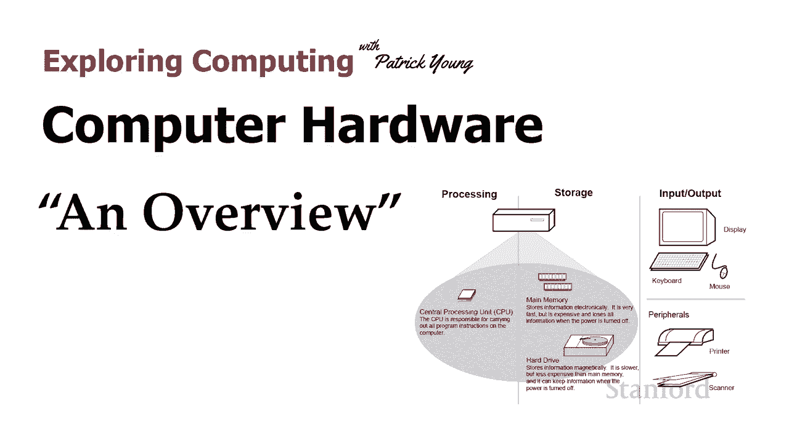
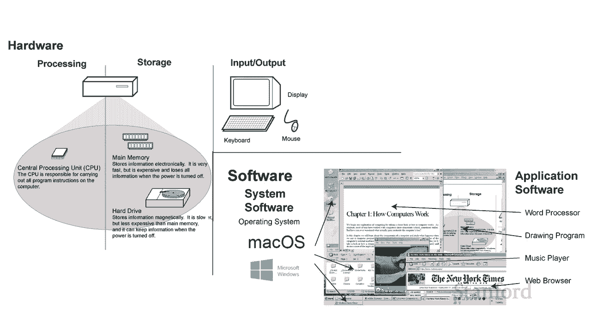
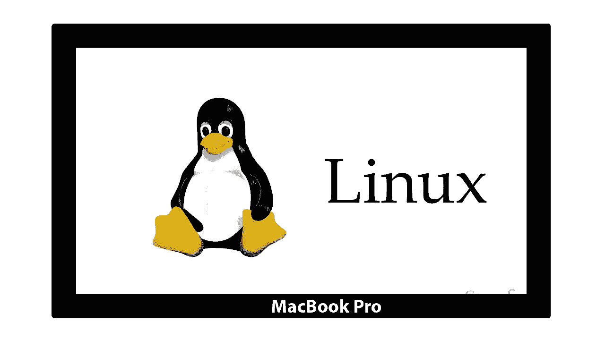

# L4.1：计算机硬件总览 🖥️

在本节课中，我们将要学习计算机硬件的基础知识。我们将了解硬件与软件的区别，并认识构成计算机的三大核心硬件类别：处理器、内存和输入/输出设备。

## 硬件与软件的区别

上一节我们介绍了课程概述，本节中我们来看看什么是计算机硬件。首先，我们需要明确硬件与软件的区别。

软件是我们安装到计算机中的程序。例如，我需要录制本季度的所有讲座，我可能会决定获取一个视频编辑程序（如 Premiere Pro）的副本，并将其安装到我的电脑上。这属于应用软件。

然而，计算机中还有很多我们认为是其不可或缺部分的东西，实际上并不属于硬件。例如，我可以从商店购买一台 MacBook Pro，它预装了 macOS 操作系统。但实际上，我可以在这台 MacBook Pro 的硬件上，将 macOS 替换为 Microsoft Windows 或 Linux。这是因为操作系统也属于**系统软件**，它是一组运行在硬件之上的指令，本身是可替换的。

因此，我们区分了：
*   **硬件**：计算机的物理设备。
*   **软件**：运行在硬件之上的指令集。
    *   **系统软件**（如操作系统）：管理计算机硬件和资源。
    *   **应用软件**（如 Premiere Pro）：为用户执行特定任务。

我们将在后续讲座中更详细地探讨系统软件和操作系统。现在，让我们专注于硬件本身。

## 计算机硬件的三大类别

我们已经区分了软件和硬件，接下来我们聚焦于硬件。计算机硬件主要分为三大类。

以下是三大核心硬件类别：

1.  **处理器**
    *   主要指**中央处理器**，负责执行程序指令和进行运算。现代设备（如智能手机）通常还包含**图形处理单元**，专门处理图形和图像计算。

2.  **内存**
    *   内存由两种类型组成：
        *   **主存储器**：通常被称为 **RAM**。它的特点是**易失性**，即断电后其中存储的信息会丢失。它的优点是速度非常快。
        *   **辅助存储器**：例如固态硬盘、机械硬盘、闪存盘等。它的特点是**非易失性**，即使完全断电，信息也能持久保存。它的缺点是速度比主存储器慢得多。

3.  **输入/输出设备**
    *   这包括显示器、键盘、鼠标、打印机、扫描仪等外部设备。它们负责计算机与外界的信息交换。

> **注意**：虽然以上分类以笔记本电脑和台式机为例，但智能手机和平板电脑的工作原理几乎完全相同。它们同样具备 CPU、GPU、主存（RAM）、辅存（内部存储）以及输入/输出设备（如触摸屏）。此外，还有**嵌入式计算机**（如汽车内部的电脑），它们也包含这些硬件组件来处理特定任务（如监测发动机温度、控制燃油喷射）。

## 硬件如何协同工作

我们已经认识了处理、内存和输入/输出这三大类硬件，现在我想看看这些不同的组件是如何在执行基本计算任务时协同工作的。

让我们以“安装并运行一个应用程序”为例。假设我需要安装 Premiere Pro。

1.  **获取与安装**：我首先需要从互联网或光盘获取程序的安装文件。这些文件通常是压缩的，以节省空间和传输时间。下载后，计算机需要将其解压缩，然后运行安装程序。因为我想在计算机关闭后依然保留这个程序，所以安装程序会将 Premiere Pro 的指令（程序文件）写入**辅助存储器**（如硬盘或固态硬盘）。

2.  **运行程序**：安装完成后，如果我仅仅是将程序放在电脑里而不运行它，那么指令就静静地待在辅助存储器中。当我双击程序图标启动它时，情况发生了变化：程序指令需要从较慢的辅助存储器复制到速度极快的**主存储器**中。这是因为 **CPU 无法直接访问辅助存储器上的内容**，它只能与主存储器高速交互。

3.  **处理文档**：同理，当我用程序（如 Microsoft Word）打开一个文档时，该文档原本也存储在辅助存储器中。为了让我能编辑它，文档的内容也需要被复制到主存储器中。我在主存中对文档进行修改，然后通过“保存”操作，将修改后的内容从主存写回到辅助存储器，从而实现永久保存。

## 如何选择内存

在了解了主存和辅存的区别后，一个自然的问题是：我怎么知道我的电脑需要更多的主内存还是更多的辅助存储空间？

这取决于你的使用需求：

*   **需要更多辅助存储**：如果你需要存储大量数据，例如成为视频博主，拥有很多视频文件。你通常不会同时编辑所有视频，但需要将它们都保存下来，这时就需要更大的硬盘或固态硬盘空间。
*   **需要更多主内存**：如果你习惯同时运行大量程序（例如同时打开浏览器、多个文档、编程环境和音乐播放器），那么你需要更大的 RAM。如果运行的程序所需内存超过了物理 RAM 的容量，计算机会使用一种叫做“虚拟内存”的技术（利用一部分硬盘空间来模拟内存），但这会显著降低系统速度。因此，增加物理 RAM 容量能让多任务处理更流畅高效。

---

**本节课中我们一起学习了**：计算机硬件与软件的基本区别，认识了构成计算机的三大核心硬件（处理器、内存、输入/输出设备），并通过安装运行程序的例子了解了它们如何协同工作。我们还学会了根据实际需求（存储大量文件 vs. 同时运行多个程序）来判断是需要升级辅助存储器还是主存储器。