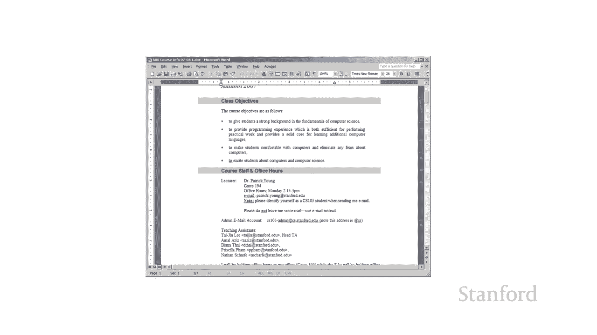
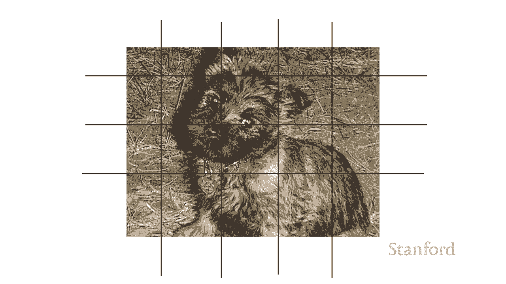

# L4.2：电脑硬件：处理过程近观 🔍

在本节课中，我们将深入探讨计算机硬件的核心——处理过程。我们将了解中央处理器（CPU）的工作原理、多核处理器的优势与挑战，以及图形处理单元（GPU）等专用处理器的作用。

## 概述

在上一个视频中，我们看到了处理是计算机最重要的组件之一。本节中，我们将仔细看看这个处理组件，特别是中央处理器（CPU），并探讨如何通过多核和专用处理器来提升计算能力。

## 中央处理器（CPU）

您可能知道，最重要的处理组件是**中央处理器**或**CPU**。但实际上，这里还有更多内容需要了解。

首先，为了让每个人都清楚我们的内容，这里列举一些你可能会遇到的处理器常用名称：
*   如果你有英特尔处理器，消费级计算机上最常见的是酷睿 i3、酷睿 i5、酷睿 i7 和酷睿 i9。
*   如果你有一台配备 AMD 处理器的电脑，那么它们的普通消费级 CPU 是 Ryzen 和 Athlon。

现在，关于 CPU 的一个问题是，CPU 往往是一个很大的瓶颈。正如我们所见，所有处理都通过 CPU 进行。内存可以记住事情，但最终为了让我们的计算机真正充当计算设备，CPU 需要执行所有的工作。

## 多核处理器

有几种方法可以解决 CPU 瓶颈问题。其中之一是使用多核 CPU。

我们开始获得多核 CPU，并不是因为我们真的需要多核，而是更多因为电气工程师很长一段时间都不擅长让 CPU 速度越来越快。现在我们开始在速度上趋于稳定。所以电气工程师的想法是：我们不能让单个处理器更快，但是我们可以给你两个核心、四个核心、六个核心，甚至八个核心。

关于多核处理器，拥有几个核心很有用，但实际上能够充分利用四核、六核或八核，很大程度上取决于你所做的工作类型。这实际上是程序员面临的一个问题，因为程序员通常不知道如何利用多核处理器中的多个核心。

所以，如果你希望应用程序快速运行，并且你知道自己正在多核计算机上运行，那么理想情况下，你希望你的应用程序能利用尽可能多的内核。我认为程序员在这方面做得更好了。我记得第一个多核视频游戏机出现时，这对游戏程序员来说是一笔大买卖，按顺序利用这八个内核并不总是很清楚。

但是，有些应用程序肯定可以利用多核处理器。以下是多核处理器擅长处理的任务类型：
*   **照片处理**：处理器可能非常擅长。你基本上可以将照片分成不同的部分，因此可以让一个核心处理一个部分，另一个核心处理另一部分，第三个核心处理第三部分。

这里有一点演示。假设我们有一张照片（这是我的老狗莫莉），我们想把它从彩色转换成黑白。我们的模拟将展示会发生什么。
*   使用**一个处理器**，我们只是继续并一次处理每个像素。
*   现在如果我们切换到**两个处理器**，你可以看到将其拆分：图片的上半部分交给一个处理器，下半部分交给另一个处理器。
*   处理器数量又以更快的速度增加到4个，最后我们使用8个。你可以看到这真的很容易分解这个过程以利用额外的内核，因为有一种划分工作的明确方法。

因此，如果我们再次执行诸如天气模拟之类的任务，就很容易弄清楚如何使用多个核心来将不同的计算任务分配给不同的区域。实际上，超级计算机拥有许多核心，例如数万个核心，因此除了多核处理器之外，它们还经常用于模拟工作。

## 专用处理器

尽管我们可以通过多核方式解决 CPU 瓶颈，但还有另一种方式，这就是添加**专用处理器**。

因此，现代计算机通常除了可能是多核的主中央处理单元外，还具有**图形处理单元（GPU）**。

图形处理单元可能因消费者创建 3D 图形的能力而广为人知，例如用于游戏。但 GPU 也可以用于其他目的：
*   也可以用于照片或视频编辑。
*   也可以用于人工智能和神经网络。
*   它们已经被臭名昭著地用于比特币挖矿。实际上，比特币矿工使用图形处理单元确实提高了价格，这让游戏玩家感到有些不安。而且事实证明，比特币矿工正在使用大量电力，这对环境来说真的很糟糕。

无论如何，我只是想让你了解一下处理过程中发生的不同事情。

## 总结

本节课中，我们一起学习了计算机处理过程的核心细节。我们了解到 CPU 是主要的处理单元，但也存在性能瓶颈。为了突破瓶颈，现代计算机采用了多核 CPU 和像 GPU 这样的专用处理器。多核处理器通过并行处理提升效率，但其效能取决于任务是否易于分割以及程序员的优化。专用处理器则针对图形渲染、AI 计算等特定任务进行了优化，极大地提升了计算机在特定领域的性能。理解这些处理组件如何协同工作，是理解现代计算机能力的基础。