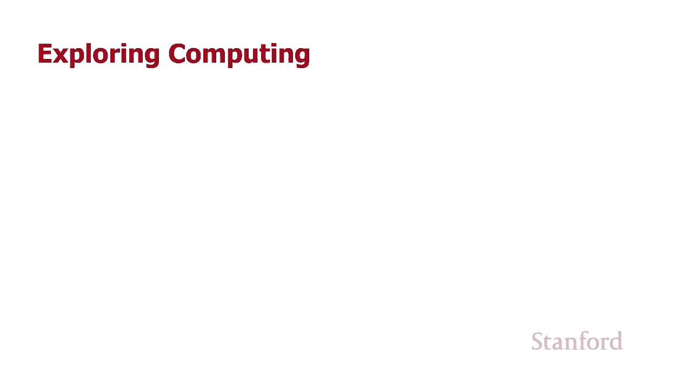
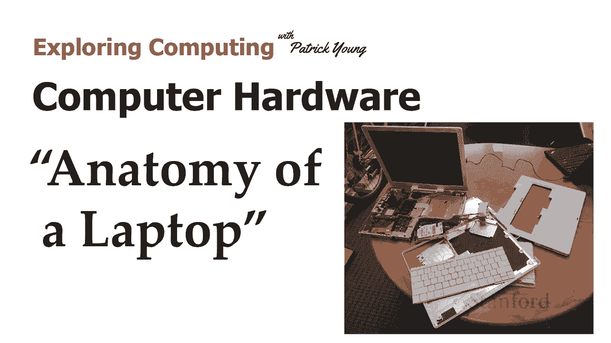

# 计算机科学导论：L4.3：笔记本电脑硬件剖析 🖥️





在本节课中，我们将拆解一台笔记本电脑，深入了解其内部硬件组件。我们将从外部开始，逐步探索主板、存储设备、处理器等核心部件，并解释它们的功能与工作原理。

## 概述

我们将拆解一台约15年历史的苹果iBook G4笔记本电脑。通过这个过程，我们将直观地认识构成一台计算机的物理部件，并理解它们如何协同工作。

## 外部观察与初步拆解

首先，我们看到的是笔记本电脑的外部。这台iBook G4有明显的使用痕迹。我们的第一步是取下键盘。

取下键盘后，我们可以看到内部结构。这台较老的笔记本电脑设计允许用户升级某些部件。例如，在键盘下方有一个可以插入Wi-Fi卡的插槽，以及用于添加内存（RAM）的插槽。

请注意，大部分区域被一块金属板覆盖。这块金属板是**电磁屏蔽层**，其作用是减少笔记本电脑发出或接收的电磁辐射，防止干扰其他附近的电子设备。

## 内部组件总览

将笔记本电脑完全拆开后，我们可以看到所有内部组件。以下是主要部件的概览：

*   **Wi-Fi防护罩**：一个U形金属罩，用于屏蔽Wi-Fi卡。
*   **散热器**：一块大型金属部件，用于传导热量。
*   **硬盘驱动器（HDD）**：用于长期存储数据的设备。
*   **主板**：绿色的大型电路板，是计算机的核心。

接下来，我们将逐一详细探讨这些核心组件。

## 存储设备：硬盘驱动器（HDD）与固态硬盘（SSD）

上一节我们看到了内部布局，本节中我们来看看数据存储的核心设备。

**硬盘驱动器（Hard Disk Drive, HDD）** 是一种使用磁性存储的机械设备。它内部包含多个高速旋转的盘片（`platters`）。读写磁头在盘片上方移动，通过磁化盘片上的微小区域来存储数据（位），或通过读取磁性状态来获取数据。

**公式表示数据访问**：`数据访问时间 ≈ 寻道时间 + 旋转延迟 + 传输时间`

HDD的优点是每字节存储成本较低，适合存储大量数据（如视频监控录像）。缺点是速度相对较慢，且由于包含高速运动的机械部件，更怕震动。

**固态硬盘（Solid State Drive, SSD）** 则完全不同。它没有活动部件，其内部类似于一块小型主板，上面焊接了许多存储芯片（闪存）。数据通过电信号直接存储在芯片中。

**代码类比存储方式**：
```python
# HDD 访问（类似机械寻址）
def read_from_hdd(sector, track):
    move_arm_to(track)      # 机械移动
    wait_for_disk_rotation(sector) # 等待旋转
    return read_magnetic_data() # 读取数据

# SSD 访问（直接电信号）
def read_from_ssd(memory_address):
    return flash_chips[memory_address] # 直接电子访问
```

SSD的优点是速度快、抗震性强、更安静。缺点是每字节成本更高。如今，SSD已成为大多数个人电脑的首选。

## 核心与散热：主板、CPU与散热器

了解了存储设备后，我们来看计算机的“大脑”和“神经系统”。

**主板（Motherboard）** 是一块**印刷电路板（Printed Circuit Board, PCB）**。绿色的基底是绝缘材料，上面蚀刻着无数细小的金属导线，用于在各个组件之间传递电信号和数据。所有其他关键部件都连接在主板上。

主板上最重要的两个芯片是：
1.  **中央处理器（Central Processing Unit, CPU）**：负责执行程序指令和处理数据。
2.  **图形处理单元（Graphics Processing Unit, GPU）**：专用于处理图像和图形计算。

这些芯片在工作时会产生大量热量。**散热器（Heatsink）** 通常由导热良好的金属（如铜或铝）制成，并紧密贴合在CPU和GPU芯片上。它的作用是吸收芯片产生的热量。散热器设计有大量鳍片，以增大与空气接触的表面积。通常还会有一个风扇对着散热器吹风，加速热空气的排出，从而有效降低芯片温度。

在台式机中，CPU通常被设计成可插拔升级的。CPU底部有许多引脚，用于连接主板插座，传输电力、数据、地址和控制信号。

**公式表示数据流**：`CPU <--[数据引脚]--> 内存` 和 `CPU --[地址引脚]--> 内存`

## 临时记忆：内存（RAM）

最后，我们来看看计算机的“短期记忆”——内存。

我们在主板上看到了**内存模块**。无论是笔记本电脑还是台式机，内存模块上都焊接有多颗内存芯片。这些芯片的数量通常是2的幂（如4颗、8颗、16颗），这与计算机二进制工作的本质相符。

内存（RAM）用于临时存储CPU正在处理和即将使用的数据与程序指令。它的读写速度远快于硬盘或SSD，但断电后数据会丢失。CPU通过其地址引脚指定要访问的内存位置，再通过数据引脚进行数据的读取或写入。

## 总结

本节课中，我们一起学习了笔记本电脑的硬件解剖。我们从外部拆解开始，逐步认识了：
1.  **电磁屏蔽层**的作用。
2.  **硬盘驱动器（HDD）** 的机械工作原理及其与**固态硬盘（SSD）** 的电子存储方式的区别。
3.  **主板**作为连接核心，**CPU**作为处理大脑，以及**散热系统**对于维持稳定运行的重要性。
4.  **内存（RAM）** 作为高速临时存储器的角色。


理解这些硬件组件如何协同工作，是理解计算机科学基础的重要一步。每个部件，从机械的硬盘到精密的CPU，共同将电信号和物理操作转化为我们所依赖的数字功能。