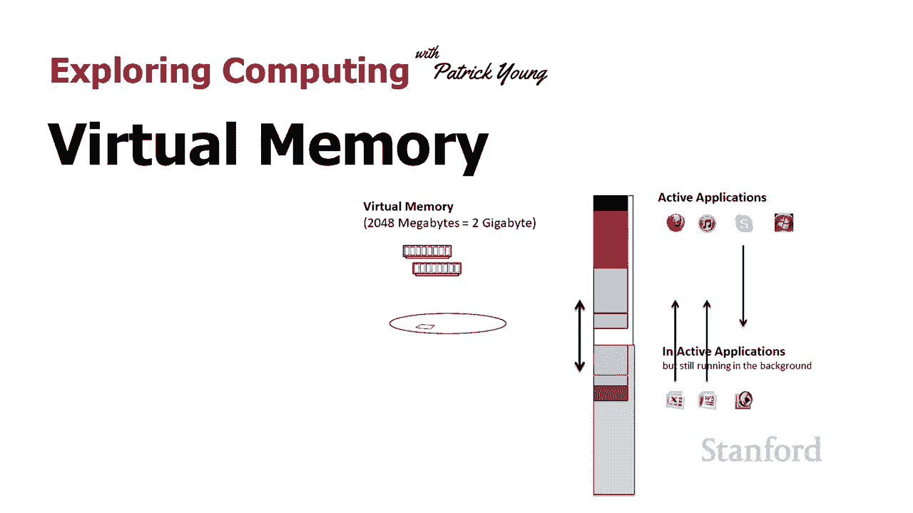
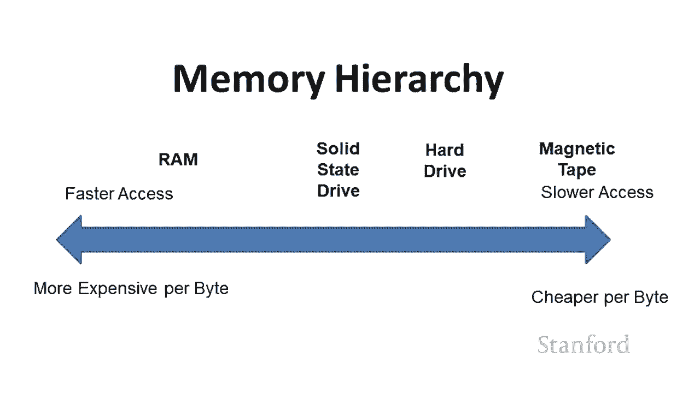
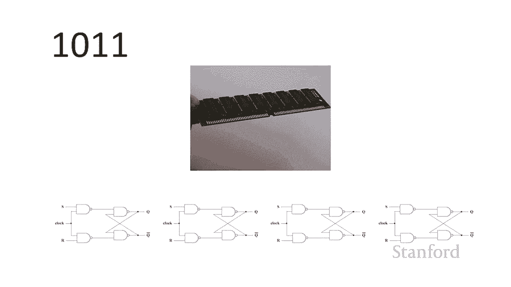
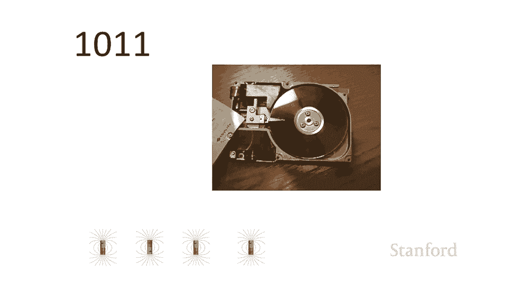
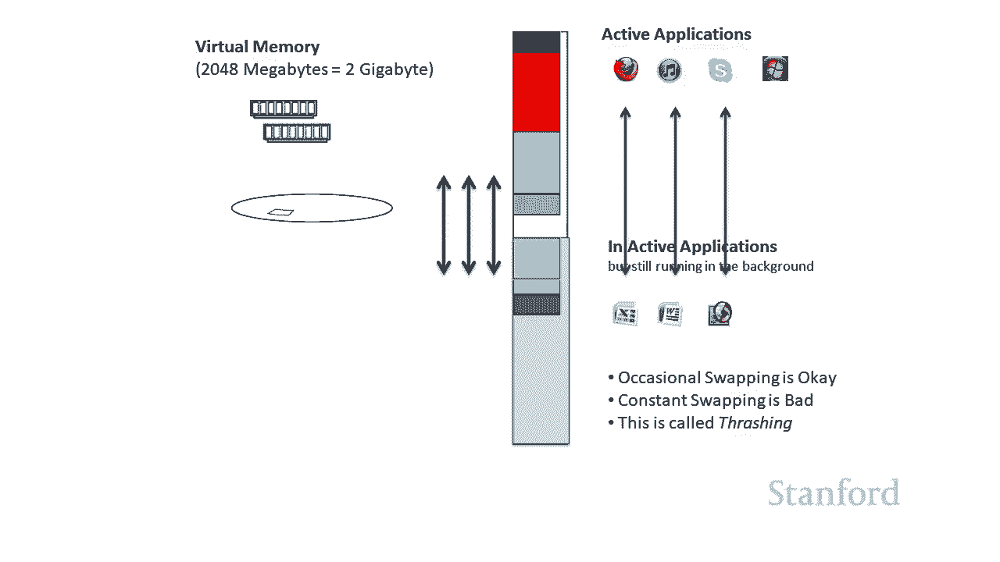

# 计算机科学导论：L4.4：虚拟内存 💾

在本节课中，我们将要学习计算机硬件中的一个重要概念——虚拟内存。我们将了解它是什么、它如何工作，以及它如何帮助计算机同时运行多个程序。

## 概述

当计算机同时运行太多程序时，其性能可能会下降。一种解决方案是添加更多物理内存。然而，这并不总是可行或经济。虚拟内存技术提供了一种软件解决方案，它允许计算机使用硬盘空间来模拟额外的内存，从而让用户感觉可以运行比物理内存容量更多的程序。

上一节我们介绍了计算机内存的层次结构，本节中我们来看看虚拟内存这一具体技术。

## 内存层次结构回顾

让我们从一张图开始回顾。这张图强调了计算机有多种类型的内存。

主内存（RAM）速度很快，但容量有限且成本较高。硬盘驱动器（包括固态硬盘）容量大、成本低，但速度慢。介于两者之间还有其他存储介质。请记住，我们通常可以更轻松地负担得起大容量的硬盘空间。

我还想提醒，这些类型的内存中的每一种都有不同的物理工作原理。

例如，内存模块使用电子电路存储数据。硬盘驱动器使用磁极存储信息。CD驱动器则使用凹坑和平面来存储信息，其过渡处代表二进制的0和1。

## 物理内存的限制

我们在这里看到的右边方框代表物理内存。假设我有1GB的物理内存，并且有一堆应用程序，每个都占用一部分内存。

在理想情况下，计算机一次只运行一个程序。只要我运行的程序所需内存不超过1GB，一切正常。例如，运行一个需要400KB的程序，或者一个需要300KB的媒体播放器，这都很好。

但我们通常不想一次只运行一个程序，我们想同时运行多个。除了应用程序，系统本身也需要内存。因此，如果我同时打开文字处理器、电子表格、浏览器，并启动一个视频会议软件，这些程序所需的总内存可能会超过实际的物理内存容量。

## 虚拟内存的工作原理

幸运的是，我们有虚拟内存技术。在这个例子中，我有1GB的物理内存芯片，但我还有一个容量大得多的硬盘驱动器（例如固态硬盘）。虚拟内存技术让我可以将硬盘的一部分空间当作主内存来使用。

操作系统软件会“欺骗”运行中的程序，让它们认为自己拥有足够的、连续的内存空间，而实际上部分数据被存储在速度较慢的硬盘上。它们只是二进制位，与物理内存中的位没有本质区别，但访问这些位的速度不同。

让我们看看具体如何工作。假设我有1GB物理内存，并在硬盘上划出1GB空间来假装是额外的主内存。

现在，我可以同时运行文字处理器、媒体播放器、电子表格和视频会议软件，因为我不再受限于1GB的物理内存。理论上，只要硬盘空间足够，我可以添加更多程序。

## 活动与非活动状态

理想情况下，只有正在被用户**主动使用**的应用程序和数据才保留在快速的物理内存中。其他暂时不用的应用程序，其相关数据可以存放在硬盘的虚拟内存区域。

因此，之前我们提到，当程序未运行时，其信息如何管理？为了实际编辑一个文档，程序需要被加载到内存中。我们可以打开许多程序，它们看起来都在运行。但只要用户没有主动与某些程序交互，这些程序就可以驻留在虚拟内存中。

例如，假设我打开了文字处理器、电子表格和浏览器，但我实际上只在用文字处理器工作。那么，电子表格和浏览器的数据可以放在虚拟内存里。当我想切换回电子表格时，计算机系统会意识到我正在主动使用它，于是将所需的数据从硬盘的“虚拟内存”部分移回物理内存，同时可能将文字处理器的部分数据移出到硬盘，以腾出空间。

## 虚拟内存的潜在问题：颠簸

当你在所有打开的应用程序之间频繁切换时，系统可能就会遇到麻烦。因为每个被激活的应用程序都需要从硬盘换入物理内存，这会导致系统花费大量时间在**移动数据**，而不是**执行计算**。

这个过程被称为**颠簸**。颠簸是指系统频繁地在物理内存和硬盘之间来回移动数据页（页是内存管理的基本单位）。如果你过于频繁地切换程序，系统最终将花费大部分时间进行数据交换，而无法有效工作。

因此，当你的计算机开始变慢，并且硬盘灯频繁闪烁时，通常意味着发生了颠簸。系统正在使用虚拟内存，并可能频繁地在内存和硬盘间交换内容。

## 最佳解决方案

所以，最好的解决方案是，如果你的计算机允许，**购买并安装更多的主内存（RAM）**。这可以为你带来最直接的性能提升，减少系统对虚拟内存的依赖。

## 总结

本节课中我们一起学习了虚拟内存。我们了解到，虚拟内存是一种利用硬盘空间扩展可用内存的技术，它允许系统运行比物理内存容量更大的程序。其核心思想是将不活跃的程序数据暂时移至硬盘，当需要时再换入物理内存。虽然虚拟内存很有用，但过度依赖会导致性能下降（颠簸）。因此，增加物理内存容量是提升多任务处理能力的根本方法。

