# L5.1：计算机网络硬件

## 概述

在本节课中，我们将要学习计算机网络的基础硬件知识。我们将从了解计算机如何通过物理方式连接在一起形成网络开始，探讨不同的网络拓扑结构和连接介质，并介绍一些关键的硬件设备和网络术语。这些知识是理解互联网如何工作的基础。

## 网络拓扑与连接介质

上一节我们介绍了单个计算机的工作原理，本节中我们来看看多台计算机如何连接在一起工作。使计算机变得非常有用的一点，特别是考虑到它们当前的情况，是它们能够在网络上协同工作。我们将从查看计算机网络硬件开始。

要形成一个计算机网络，我们需要关注两件不同的事情。第一，我需要担心我的网络拓扑结构，即计算机的几何配置是什么。第二，我需要担心使用什么介质将计算机连接在一起，例如是使用电磁波、光缆还是铜线。

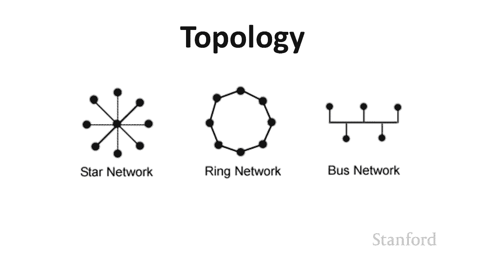

以下是三种经典的网络拓扑结构示例：

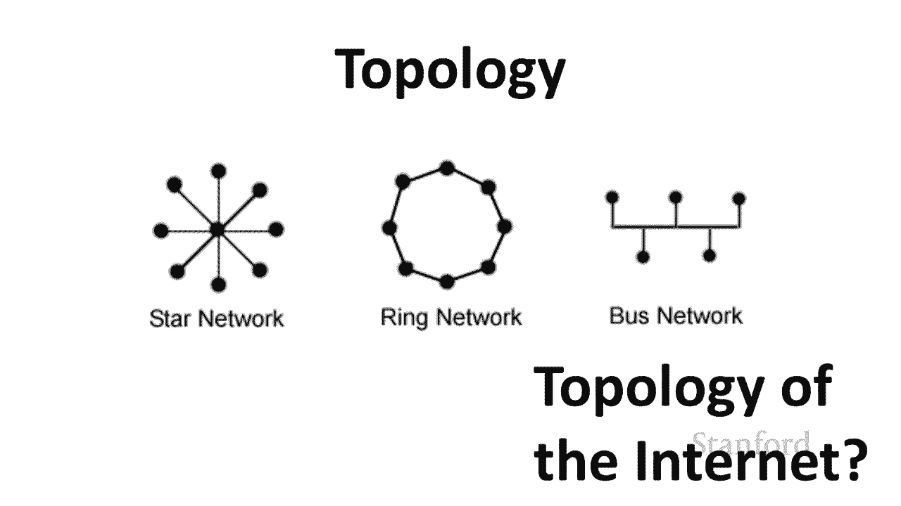

*   **星型网络**：在中间有一个中心节点，外面连接着一堆其他节点。你们都很熟悉这种网络，因为 Wi-Fi 使用的就是这种类型。例如，家里的多台设备都连接到一个单独的 Wi-Fi 路由器。
*   **环形网络**：计算机一个接一个地连接成一个环。这种拓扑比星型网络需要更少的连接介质，常用于光缆网络。它的一个问题是，如果其中一个节点发生故障，消息可能会停止在环中传播。
*   **总线网络**：所有计算机都连接到一条公共电缆上。这种网络曾经在教室等环境中很常见。总线网络的一个问题是，如果多台计算机尝试同时发送信号，线路上会产生争用，网络需要制定规则来管理这种情况。

## 互联网：网络的网络

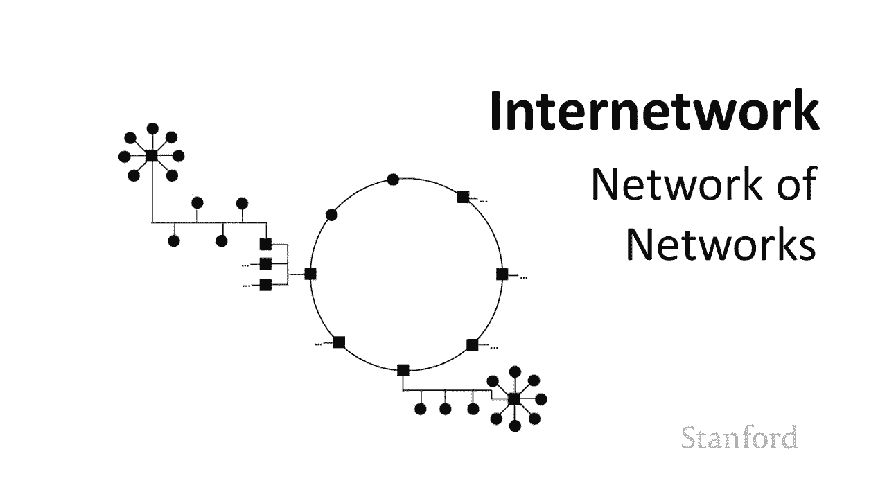

上一节我们看到了三种不同的网络类型，本节中我们来看看互联网属于哪种类型。互联网本身是一个旅行问题，因为它不是一个单一的网络。它实际上是一个由不同网络组成的网络，我们称之为**互联网络**。

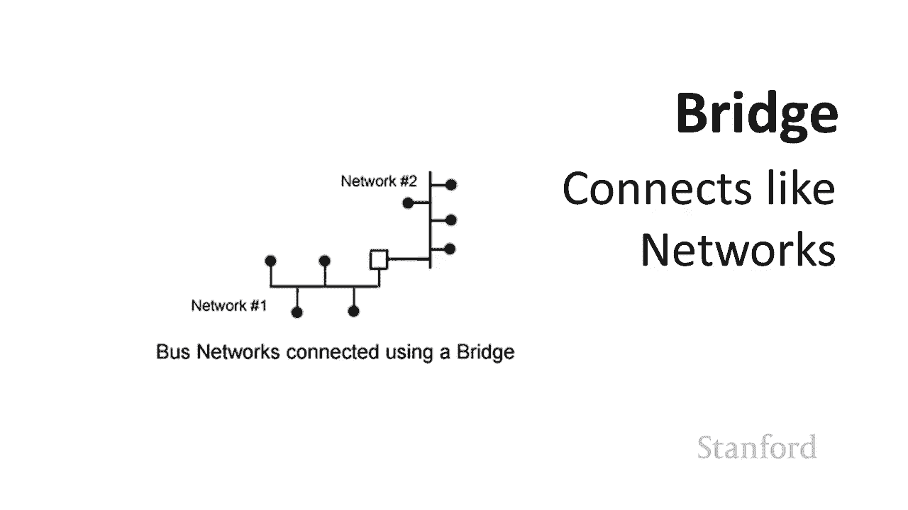

例如，一个大学校园可能有一个光纤环网连接不同建筑，每栋建筑内部可能使用总线网络连接不同楼层，而每个楼层又可能通过 Wi-Fi 路由器（星型网络）连接个人设备。互联网本身就是由这样无数个相互连接的不同网络组成的。

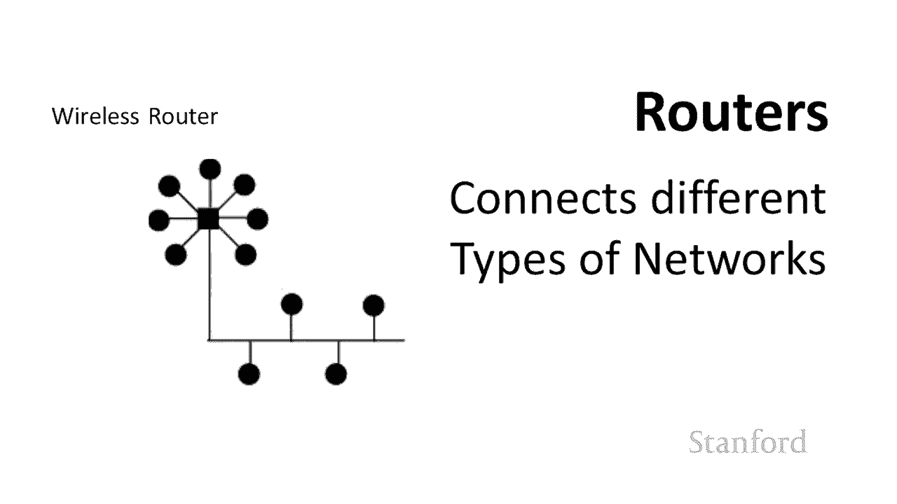

## 网络连接设备

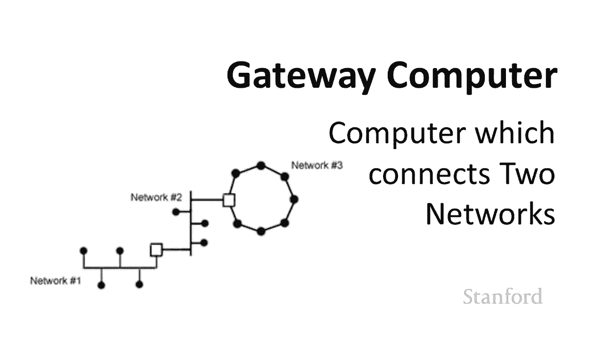

当我们构建和使用互联网络时，会遇到不同类型的连接硬件。

以下是几种关键的连接设备：

*   **网桥**：用于连接两个相同类型的不同网络。例如，连接两个宿舍楼各自的总线网络。
*   **路由器**：用于连接两种不同类型的网络。最著名的例子是无线路由器，它连接无线 Wi-Fi 网络和其他有线网络。
*   **网关**：网关计算机是一台通用计算机，其功能类似于路由器或网桥，用于将不同的网络连接在一起。它与专用路由器盒子的区别在于，网关计算机是一台承担网络流量处理任务的通用计算机。

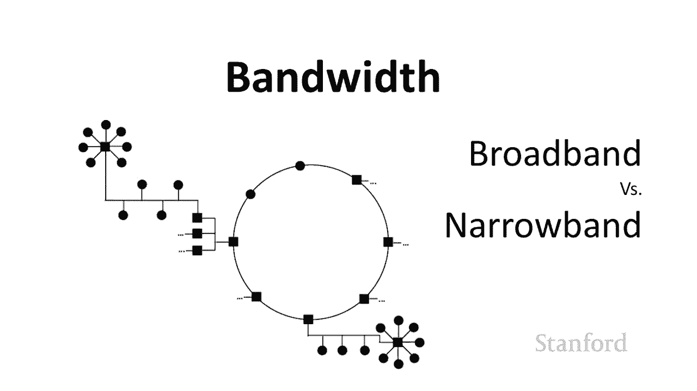

## 带宽、延迟与相关术语

上一节我们介绍了连接网络的硬件，本节中我们来了解衡量网络性能的几个关键概念。当我们谈论不同的连接介质时，出现的问题之一是带宽等。

**带宽**最初指的是为特定通信预留的频带宽度。频带越宽，能发送的消息就越多。现在，大多数人用带宽来指代网络速度。带宽高意味着可以快速发送大量信息。

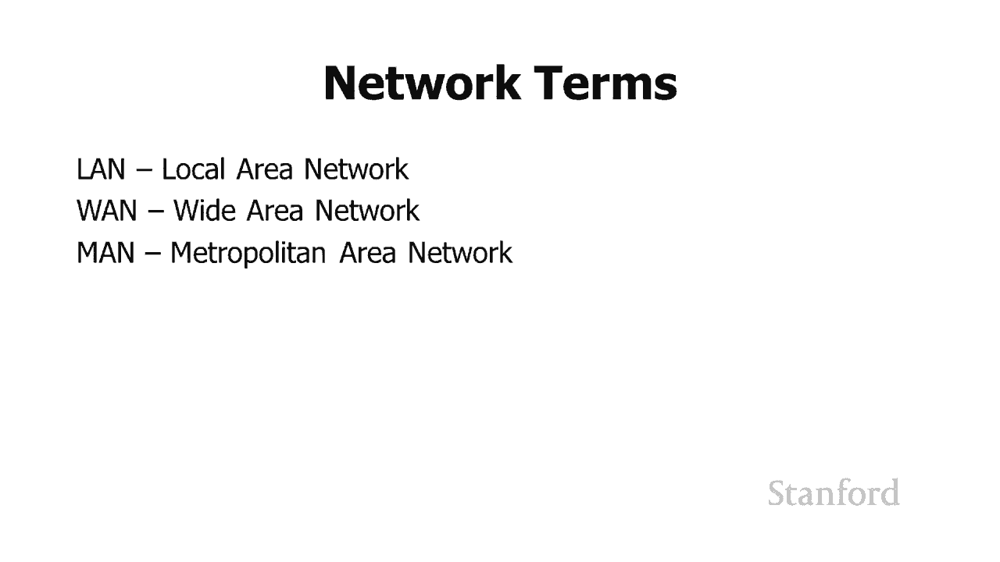

您可能还会听到**宽带**和**窄带**这两个术语。窄带通常指传统的电话线（POTS），带宽非常低。宽带则泛指那些不是窄带的、速度更快的连接。虽然这些术语现在不常被提及，但“宽带”一词仍出现在许多公司名称中。

除了连接速度，网络性能还受其他因素影响。因为互联网是一个网络组成的网络，所以消息需要经过多个网络才能到达目的地。

这里有一些您可能会遇到的术语：

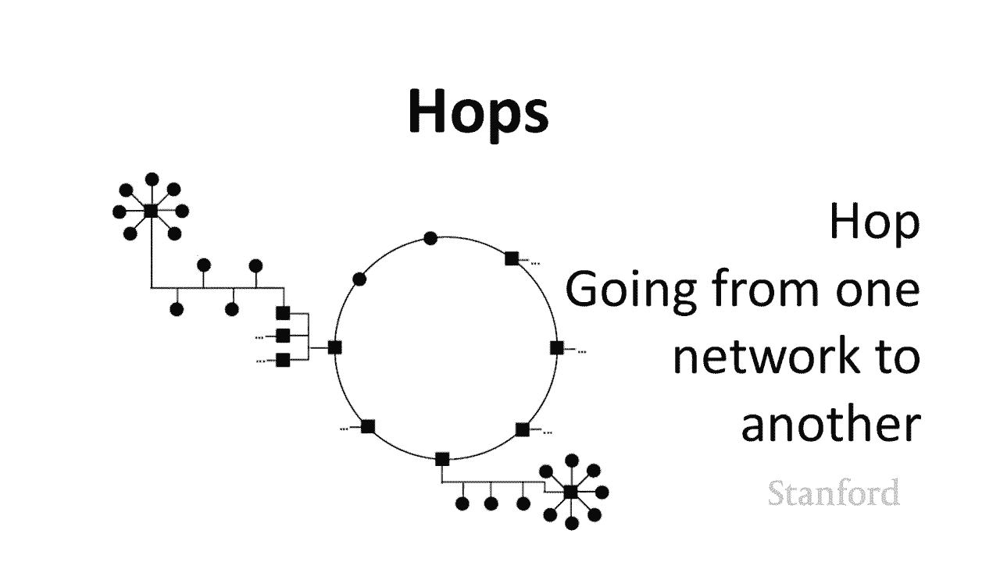

*   **局域网**：指一个小型网络，例如一个教室或一栋建筑内的计算机网络。朋友们聚在一起用电脑联机游戏，就是一个“局域网派对”。
*   **广域网**：指连接跨城市、大洲甚至全球的城市的网络。
*   **城域网**：指一个城市范围内的网络。
*   **跳数**：指消息从源到目的地需要经过的网络数量。跳数越多，通常意味着路径越长、越复杂。

每次消息从一个网络传输到另一个网络时，连接设备（如路由器）都需要花时间查看该消息，以确定它应该发送给谁或如何传递到下一个网络，这个过程会产生**延迟**。延迟是指消息传递缓慢的感觉，例如视频通话时声音和画面不同步。在游戏中，高延迟可能导致玩家的操作指令没有及时到达服务器。

**延迟**是一个更技术性的术语，通常指传输中涉及的延迟量，但它与“延迟”经常被同义使用。

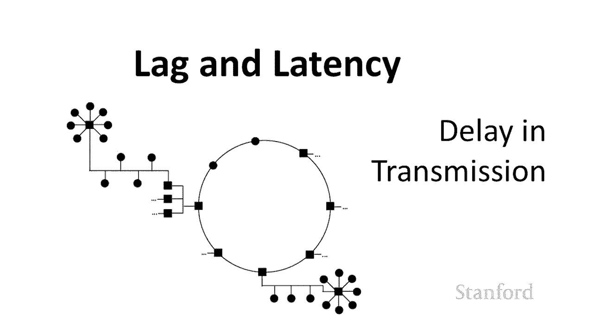

需要明确的是，延迟和延迟不一定与连接速度（带宽）直接相关。例如，向火星发送消息，无论带宽多高，由于距离遥远，第一个数据位到达都需要很长时间（高延迟）。高带宽只能保证在第一个位到达后，剩余数据能较快传送完；而低带宽则会在高延迟的基础上，还要等待更长的数据传输时间。

因此，网络性能由带宽、距离（导致的传播延迟）和跳数（导致的路由处理延迟）等多个因素共同决定。

## 内容分发网络

当我们开始考虑为全球用户提供网络服务时，延迟就成为一个实际问题。如果服务器在加利福尼亚，而客户在澳大利亚，消息需要经过很多跳，延迟会很长。

处理此问题的一个更好方法是使用**内容分发网络**。CDN 的作用是，将位于中心服务器（如在加利福尼亚）的文件，分发到世界各地的大量服务器中。这样，无论用户从何处访问，都能从附近的服务器获取信息，从而减少跳数、降低延迟，让信息更快到达。

## 总结

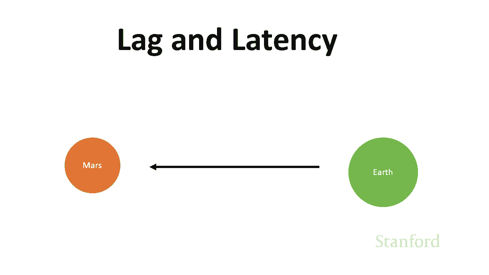

本节课中我们一起学习了计算机网络的基础硬件知识。我们了解了星型、环形和总线等不同的网络拓扑结构，认识了互联网是由众多网络互联而成的“网络的网络”。我们还介绍了网桥、路由器和网关等关键网络连接设备，并深入探讨了带宽、延迟、跳数等影响网络性能的核心概念。最后，我们了解了 CDN 如何通过在全球部署服务器来优化内容分发，降低延迟。在下一讲中，我们将讨论如何识别网络上的单个计算机。