# 计算机科学导论：L5.2：电脑硬件：命名 📝

在本节课中，我们将要学习计算机网络中如何命名和识别不同的设备。上一节我们介绍了如何将计算机连接成网络，本节中我们来看看如何为网络上的每台计算机和设备分配唯一的标识符，以便准确发送信息。

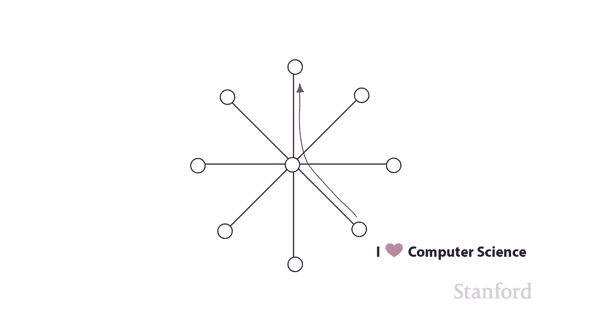

## 概述
在教室的Wi-Fi网络中，所有学生的笔记本电脑都连接到了同一个无线路由器。虽然设备已经物理连接，但如果我们想给教室对面的朋友发送一条消息，就需要一种方法来**唯一识别**他的电脑，而不是将消息广播给所有人。这就是**命名**系统要解决的问题。

## 命名方案一：MAC地址 🔢
第一种命名方案是**MAC地址**，也称为**物理地址**。MAC代表“媒体访问控制”（Media Access Control）。

一个MAC地址看起来像这样：`00:01:42:af:3b:05`。它由6组十六进制数字组成，每组两个字符。十六进制是一种基数为16的数字系统，便于转换为计算机使用的二进制。

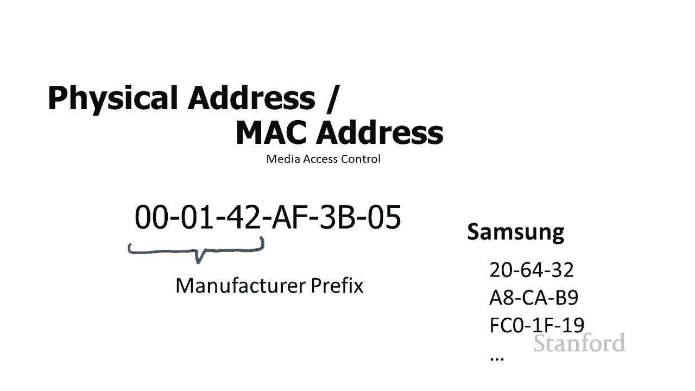

以下是关于MAC地址的几个关键点：
*   **唯一性**：每台网络设备的MAC地址在全球都是唯一的。
*   **制造商编码**：地址的前6位（前3组数字）是**制造商标识符**。例如，以`00:00:95`开头的地址很可能属于苹果公司的设备。
*   **多接口设备**：一台计算机可能有多个MAC地址，例如Wi-Fi适配器、以太网接口和蓝牙模块各有独立的MAC地址。

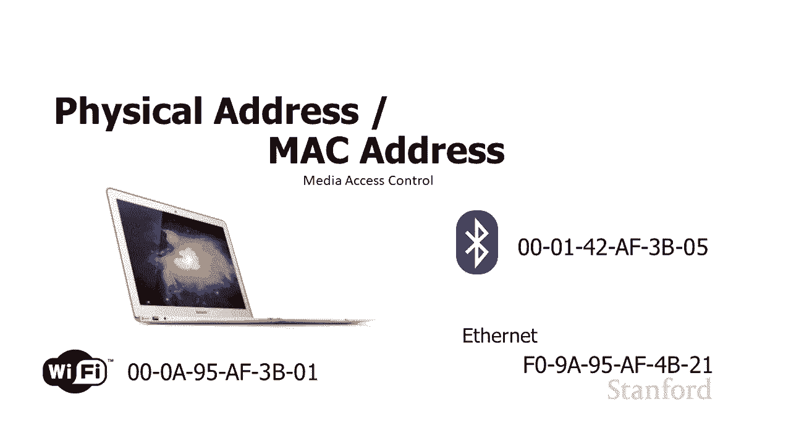

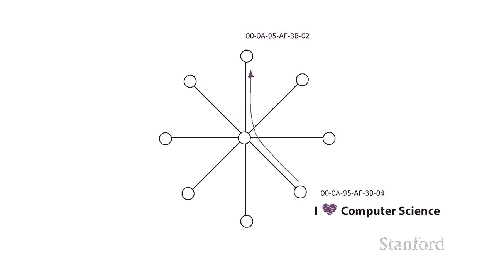

MAC地址在**本地网络**（如我们的教室Wi-Fi）中可以直接用于设备间通信。然而，它有一个主要缺点：MAC地址是基于设备制造时分配的，与设备当前所在的**物理位置无关**。这就像试图用社会安全号码（一个唯一的身份ID）来寄信，邮局无法知道收件人住在哪里。因此，MAC地址不适合在广阔的互联网上路由信息。

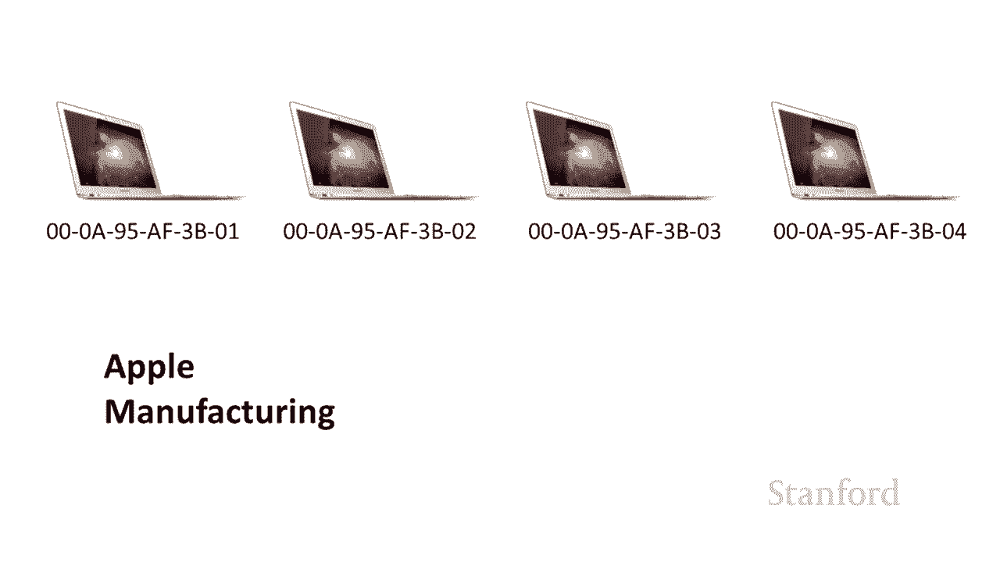

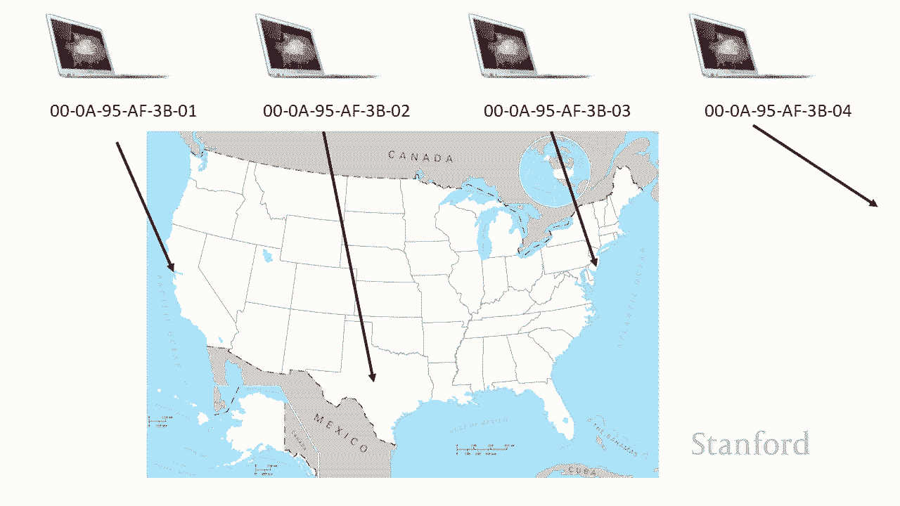

## 命名方案二：IP地址 🌐
为了在互联网上定位计算机，我们使用**IP地址**。IP代表“互联网协议”（Internet Protocol）。

传统的IP地址（IPv4）格式如下：`171.64.20.1`。它由4个用点分隔的数字组成，每个数字在0到255之间（对应一个字节的存储范围）。

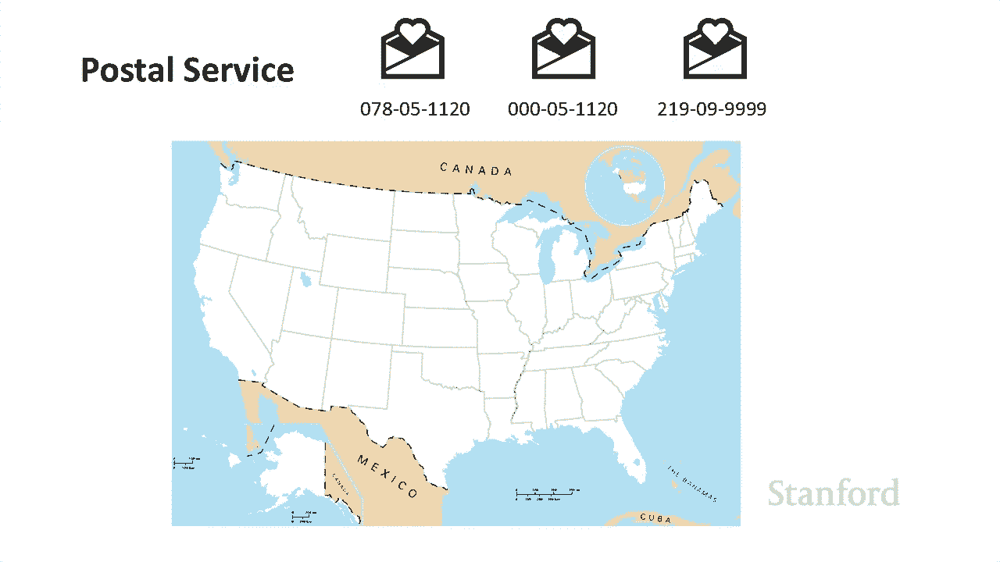

IPv4地址空间约有42亿个组合，但全球设备数量已远超这个数字，导致地址不足。因此，出现了新版本**IPv6**。

一个IPv6地址示例：`2001:0db8:85a3:0000:0000:8a2e:0370:7334`。它由8组16位的十六进制数组成，提供了极其庞大的地址空间（约3.4×10³⁸个），足以应对未来需求。

以下是IP地址的核心特点：
*   **由ISP分配**：与MAC地址由制造商分配不同，你的IP地址是由你的**互联网服务提供商**（如校园网、康卡斯特）动态或静态分配的。
*   **具有层次性**：IP地址的各个部分具有地理和网络层次信息。例如，地址`171.64.xxx.xxx`可能指向斯坦福大学，而更后面的数字可以进一步定位到校园内的特定子网或建筑。这种层次结构使得互联网上的路由器能够高效地将数据包转发到目的地。
*   **当前状态**：IPv4目前仍被广泛使用，但行业正在向IPv6过渡。

## 命名方案三：主机名 🏷️
IP地址对计算机很友好，但对人类来说难以记忆。因此，我们使用**主机名**，也就是常见的网址。

例如：`www.stanford.edu` 或 `www.nasa.gov`。

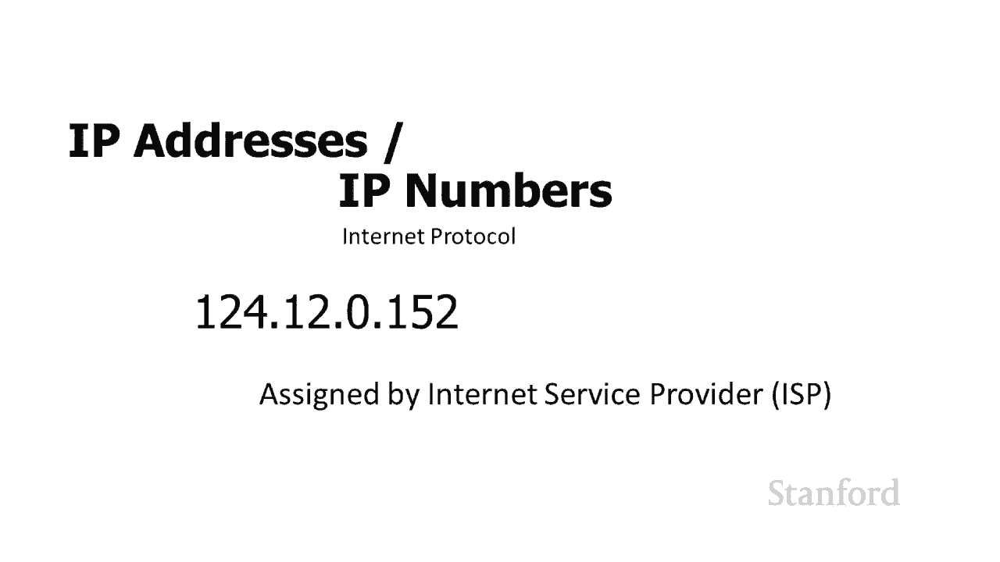

有一个名为**DNS**的系统专门负责将我们输入的、易于记忆的主机名，翻译成计算机用于实际通信的IP地址。互联网上所有的流量最终都是通过IP地址传输的。

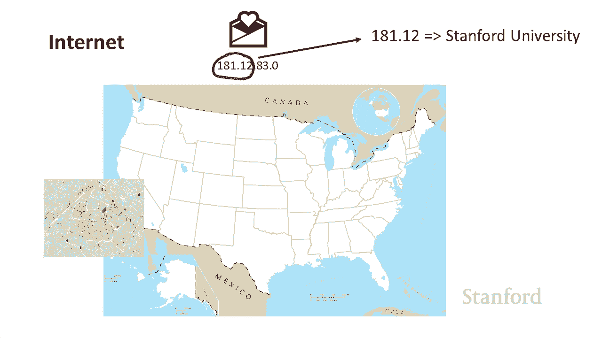

## 命名方案四：端口号 🚪
之前的命名系统用于识别网络上的**计算机**，而**端口号**用于识别单台计算机上运行的**具体程序**。

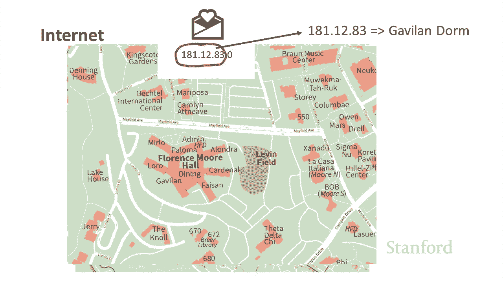

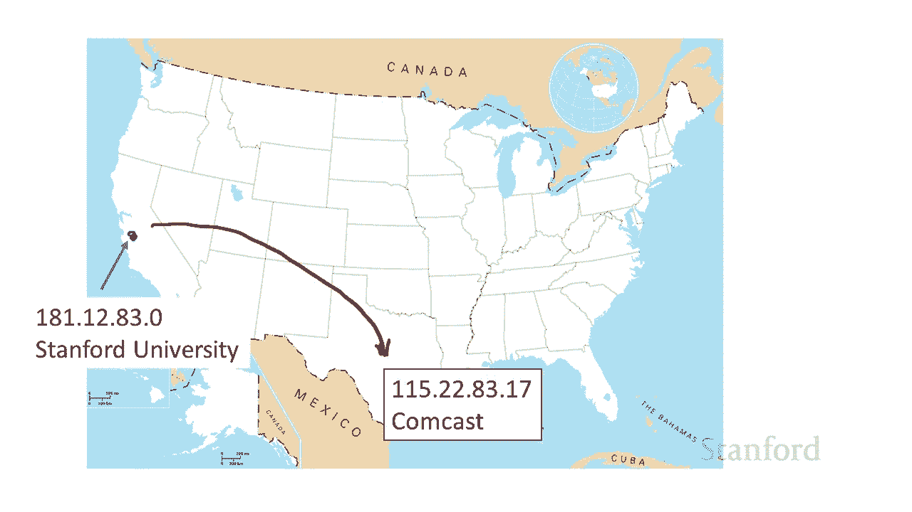

一台计算机可以同时运行多个网络程序（如浏览器、邮箱、音乐软件）。当数据从网络到达计算机时，操作系统需要知道该将数据交给哪个程序处理。

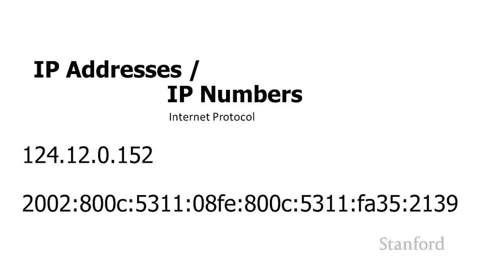

端口号就是用于这个目的。以下是一些常见端口号：
*   **端口 80**：通常用于HTTP网页浏览。
*   **端口 443**：用于HTTPS安全网页浏览。
*   **端口 25**：用于SMTP邮件发送。
*   **端口 143**：用于IMAP邮件接收。

数据包会标有目标端口号。例如，标有端口80的数据会被交给网页浏览器，标有端口143的数据则会被交给邮件客户端。**防火墙**安全设备常常通过控制特定端口的“开放”或“关闭”来管理进出计算机的网络流量。

与端口相关的另一个概念是**套接字**，它可以理解为两台计算机之间基于特定IP地址和端口号的**连接通道**。一个服务器可以同时与多个客户端建立不同的套接字连接。

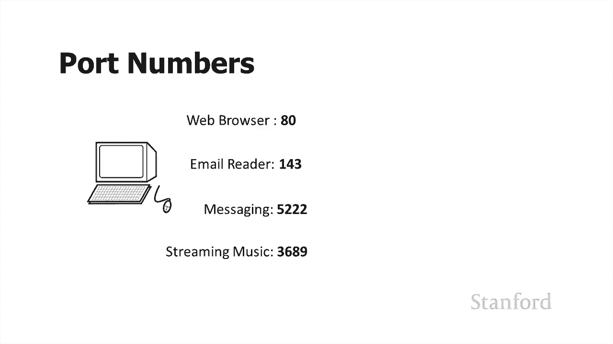

## 总结
本节课中我们一起学习了计算机网络中的四种核心命名方案：
1.  **MAC地址**：设备唯一的物理标识，用于本地网络通信。
2.  **IP地址**（IPv4/IPv6）：设备在互联网上的逻辑地址，具有层次性，用于全球路由。
3.  **主机名**：方便人类记忆的地址，通过DNS系统转换为IP地址。
4.  **端口号**：用于标识计算机上特定的应用程序或服务。

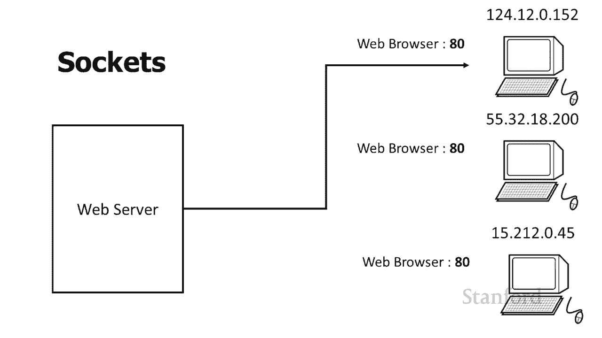

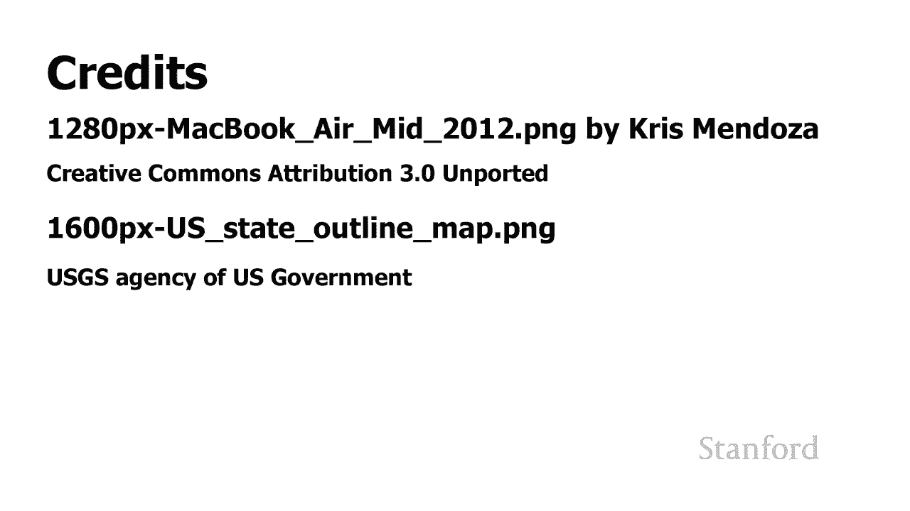

这些命名方案层层协作，确保了数据能够从源头的某个特定程序，准确无误地抵达目的地网络的另一台计算机上的另一个特定程序。