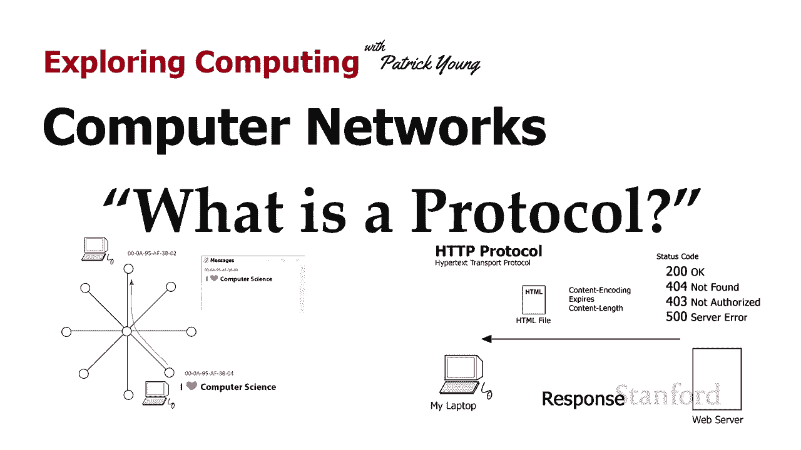
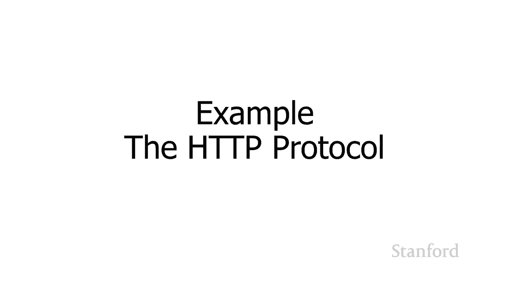
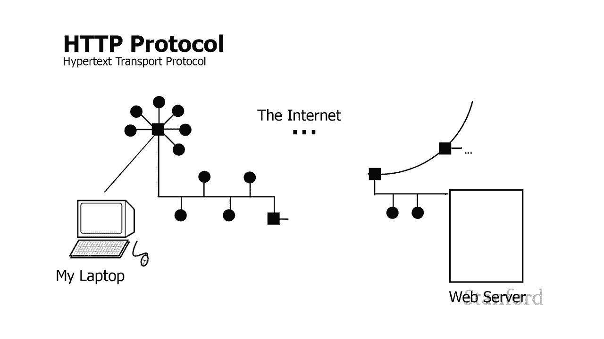
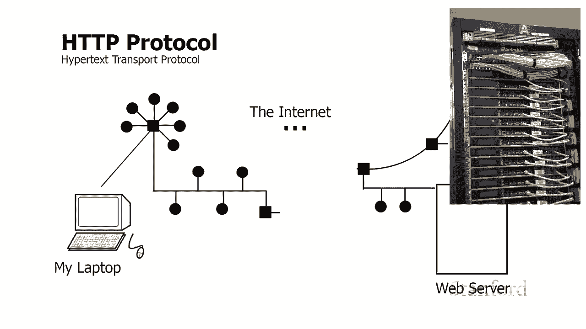
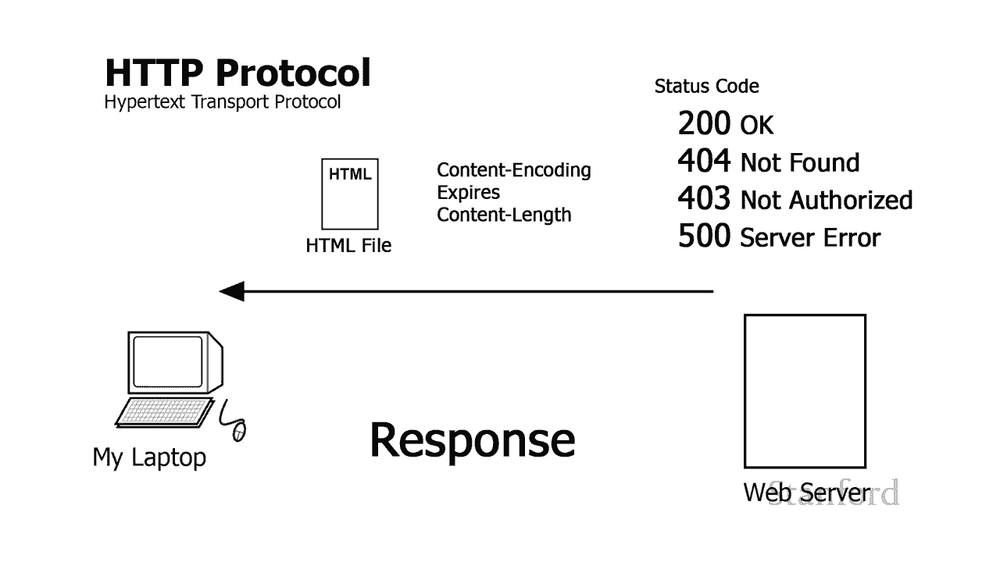
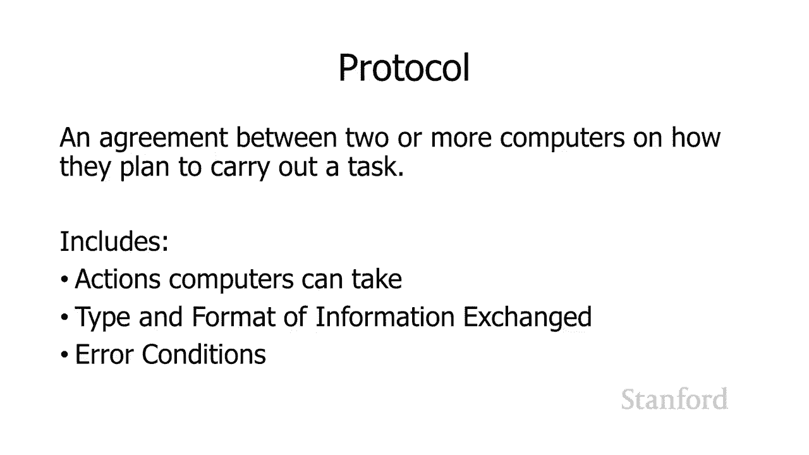
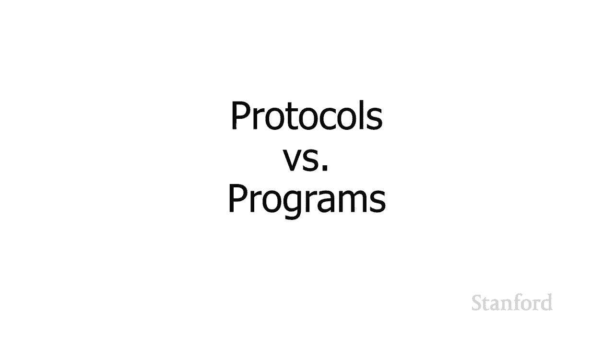
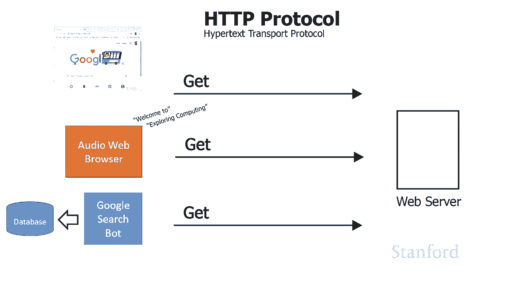
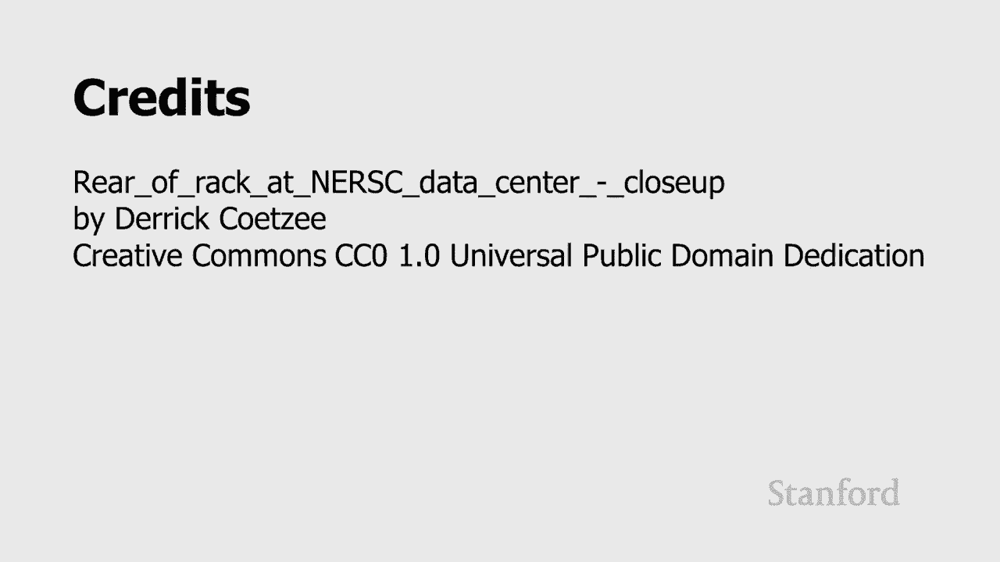

# L6.1：网络协议：什么是协议 📡

在本节课中，我们将要学习计算机网络中的一个核心概念——**协议**。我们将探讨为什么需要协议，协议是什么，并通过一个现实世界的例子（HTTP协议）来理解协议的具体构成和工作方式。

---

## 为什么需要协议？🤔

上一节我们介绍了如何在网络中识别计算机（例如通过IP地址或主机名）。本节中我们来看看，当两台计算机想要通信时，仅仅知道对方的地址是不够的。

假设我想在教室的Wi-Fi网络中给朋友发送一条消息“我喜欢计算机科学”。即使我知道她电脑的地址，直接将这条消息发送过去，她可能只会收到一串随机的字节。她如何知道这条消息是谁发的？消息的格式又是什么？

这里的关键问题是：**发送方和接收方必须事先就信息的组织和含义达成一致**。例如，双方需要约定：
*   消息内容本身放在哪里。
*   如何标识发送者和接收者（例如，是先放“发件人”还是先放“收件人”）。
*   这些信息之间用什么字符分隔（例如用冒号、空格或特定的“终止符”）。

这种计算机之间关于“如何执行一项任务”的预先约定，就是**协议**。

---

## 现实世界的协议示例：HTTP 🌐

为了更具体地理解协议，让我们看看万维网（World Wide Web）使用的 **HTTP（超文本传输协议）**。

想象一个典型的场景：你的笔记本电脑（客户端）通过互联网向一台网络服务器请求一个网页。

以下是HTTP协议需要规定的一些关键部分：

### 请求的类型
客户端可以对服务器发出几种不同类型的请求，每种请求代表不同的意图：
*   **GET**：请求获取服务器上的信息（例如，请求一个网页）。
*   **POST**：向服务器提交数据，可能会修改服务器的状态（例如，提交一个订单表单）。
*   **DELETE**：请求删除服务器上的资源（通常需要授权）。

### 请求中的附加信息
除了请求类型，客户端还可以在请求中包含许多其他信息，以便与服务器更有效地沟通。

以下是请求中可以包含的一些信息示例：
*   **字符编码**：告知服务器客户端可以处理哪些字符集（如UTF-8）。
*   **缓存控制**：告诉服务器“如果文件自某个日期后没有修改，就不必发送新副本”。
*   **接受编码**：告知服务器客户端支持哪些压缩格式（如gzip），以便服务器在发送前压缩数据，节省带宽。

### 服务器的响应
服务器收到请求后，会根据协议格式进行回复。响应主要包含两部分：
1.  **状态码**：一个数字代码，快速告知客户端请求的结果。
    *   `200`：成功。
    *   `404`：未找到请求的文件。
    *   `403`：禁止访问（权限不足）。
    *   `500`：服务器内部错误。
2.  **响应内容与元数据**：如果请求成功，会返回请求的数据（如HTML文件），并附带一些描述信息，例如：
    *   内容类型（如`text/html`）。
    *   内容编码（如`gzip`）。
    *   文件有效期等。

通过HTTP这个例子，我们可以看到，一个协议需要明确规定：
*   可以发起哪些类型的交互（请求类型）。
*   交互中应包含哪些信息。
*   这些信息的**格式**是什么。
*   当出现问题时**该如何处理**（错误状态码）。

---

## 协议与程序的关系 🔗

学生经常对协议和程序之间的关系感到困惑。让我们来澄清一下。

**协议是一套规则**，而**程序是这些规则的实现者**。

以HTTP协议为例：
*   谷歌Chrome、火狐Firefox、Safari等**网络浏览器**，是遵循HTTP协议规则编写的**程序**。它们知道如何构造HTTP请求并解析服务器的响应。
*   Apache、Nginx等**网络服务器软件**，同样是遵循HTTP协议规则编写的**程序**。它们知道如何解析收到的HTTP请求并生成格式正确的响应。

关键在于，只要不同的程序都遵循同一套协议规则，它们就能相互协作。Chrome浏览器可以向Nginx服务器请求网页，Firefox也可以。甚至一些非人类使用的程序（如谷歌的搜索爬虫机器人、为视障人士服务的音频浏览器）也能通过HTTP协议与服务器通信。

**协议定义了交互的“语言”和“礼仪”，而程序则是使用这种语言进行对话的“参与者”。**

---

## 总结 📝

本节课中我们一起学习了网络协议的基础知识。

我们首先探讨了**为什么需要协议**：为了实现有效通信，计算机之间必须预先约定数据交换的格式和规则。

接着，我们通过**HTTP协议**这个现实例子，深入了解了协议的具体内容，包括请求类型、附加信息、状态码和响应格式。

最后，我们明确了**协议与程序的关系**：协议是标准化的规则集，而程序是这些规则的实现；多种不同的程序可以遵循同一协议实现互操作。

在下一节，我们将探讨互联网协议一个更重要的特性：**分层**。理解分层协议模型，将帮助我们更深入地洞察互联网的工作原理。