# L6.2：网络协议：互联网协议 🧩

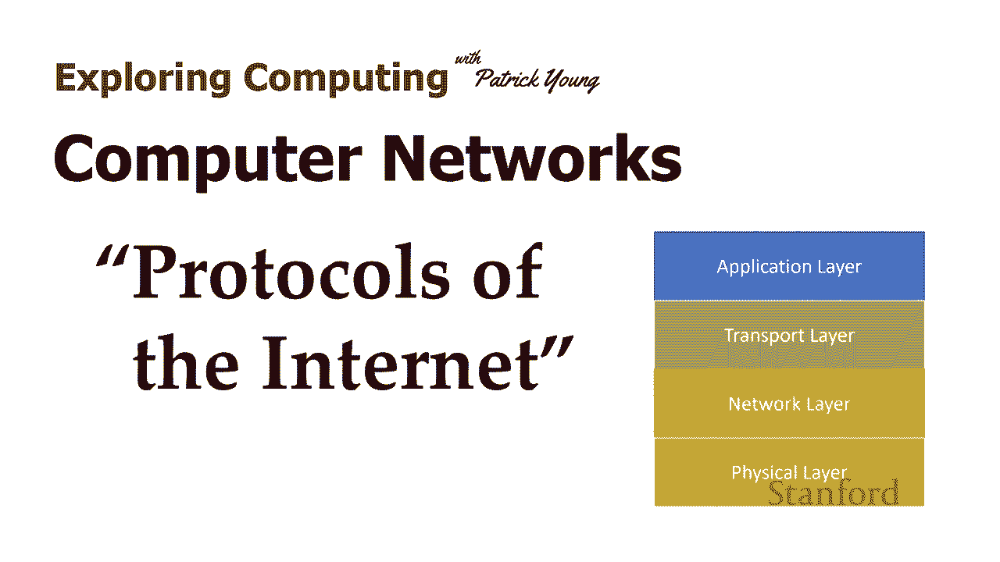

在本节课中，我们将要学习互联网协议栈的分层结构。我们将通过一个简单的类比来理解每一层的功能，并探讨这种分层设计如何让应用程序开发者无需关心底层网络的复杂性。

---

## 概述

互联网协议是分层的。理解互联网的真正运作方式很重要。我喜欢通过类比来教授分层协议。

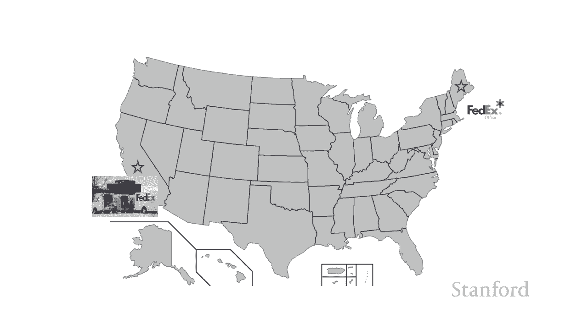

## 分层协议类比

让我们从一个假设开始。假设我在斯坦福完成教学后退休，搬到缅因州。我一直很擅长手工活，曾经建立模型。所以我决定制作一些木制玩具，而这些木制玩具最终非常受欢迎。因此，世界各地的人们都问他们是否可以购买我的玩具。斯坦福大学的某个人，加利福尼亚州的一位前学生想要购买我的玩具。

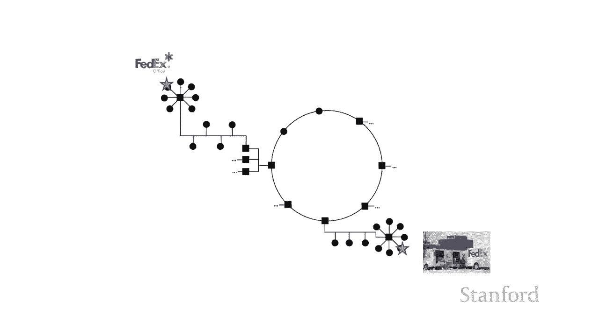

这里有一种可能性：我雇了卡车，我的卡车把玩具带到火车站。我们把玩具转移到火车站，火车开到芝加哥，然后它转乘另一列火车，最终到达洛杉矶的某个地方。然后我租了另一辆卡车将玩具从洛杉矶运到我以前的学生居住的任何地方。因此，假设我可以管理跑步的复杂性，这会将玩具送到我以前的学生手中。一个完整的交通网络，但这似乎不是一个很好的主意。我不想这样做。我想专注于制造玩具，我不想处理任何交通问题。

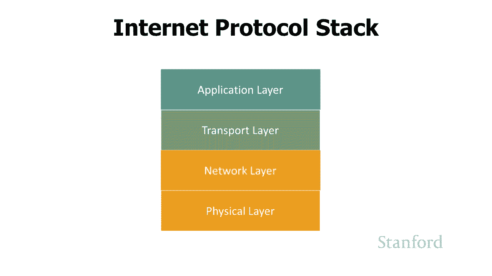

我想要做的是：我喜欢把玩具拿到联邦快递办公室，然后神奇地让它出现在我以前的学生的家里。我以前尝试过的所有步骤，比如租用卡车、制定火车时刻表、给卡车加满汽油，一切都还在发生。但不同的是，我没有处理它。联邦快递是这样的。

所以，当我们为互联网开发软件时会发生同样的过程。最终，有人在那地方工作在这一层，有人试图弄清楚如何装满卡车或制定火车时刻表。但大多数程序员在互联网上编程应用程序并没有处理这种复杂程度。而是相当于放弃了一些信息在联邦快递办公室，让它神奇地出现在另一端。

## 互联网协议栈

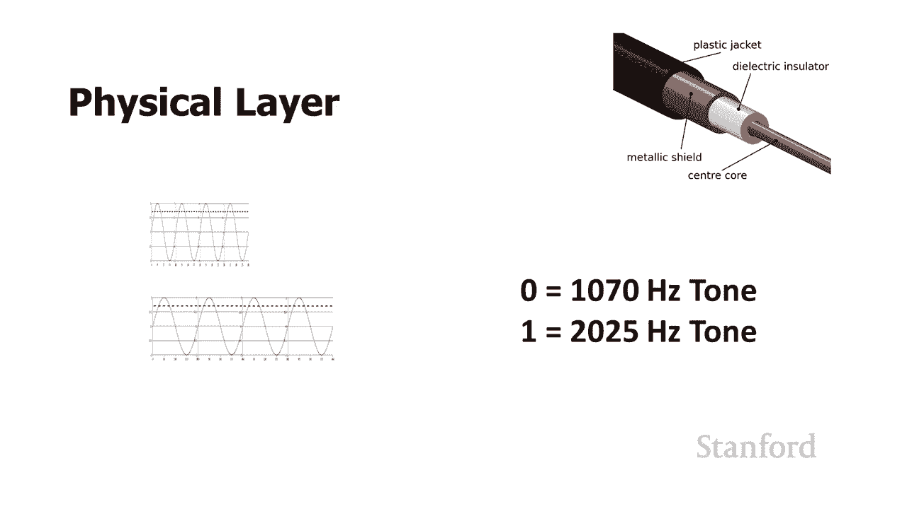

所以，我们要做的是看看有时被称为互联网协议栈的东西。我们将从用气体层填充卡车的底层，橡胶真正接触道路的地方。我们将看到构建在顶部的不同层，直到我们到达顶层。这是应用程序发生的地方，相当于从联邦快递中删除信息，它神奇地出现在另一端。

所以这是互联网协议栈。然后在底层我们有物理层。那就是层，基本上是我们给卡车装满汽油的库。然后我们在上面有很多层。然后在顶层我们有应用层。那是人们从联邦快递丢包裹的层。

所以，让我们来看看这些层中的每一层，看看它们是如何工作的。

## 第一层：物理层

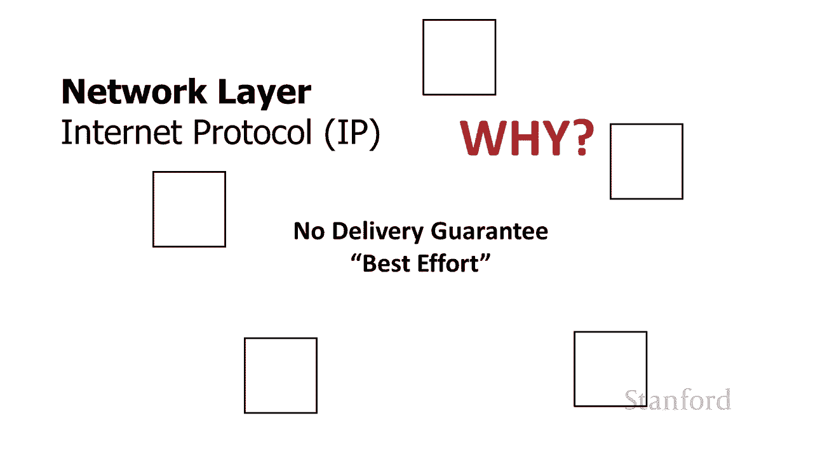

第一层，底层是物理层。当我们在物理层工作时，我们需要确切地决定我们如何使用 0 和 1 来传输信息。例如，当我们通过电话传输信息时，我们将有一个 1070 赫兹的音调，我们将有一个 2025 赫兹的音调。其中哪一个代表零，哪一个代表一？我们需要弄清楚物理连接是什么样的。我们需要弄清楚一切将如何组合在一起。

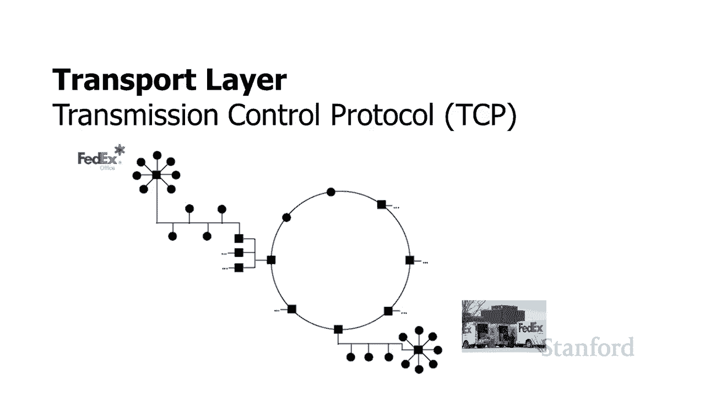

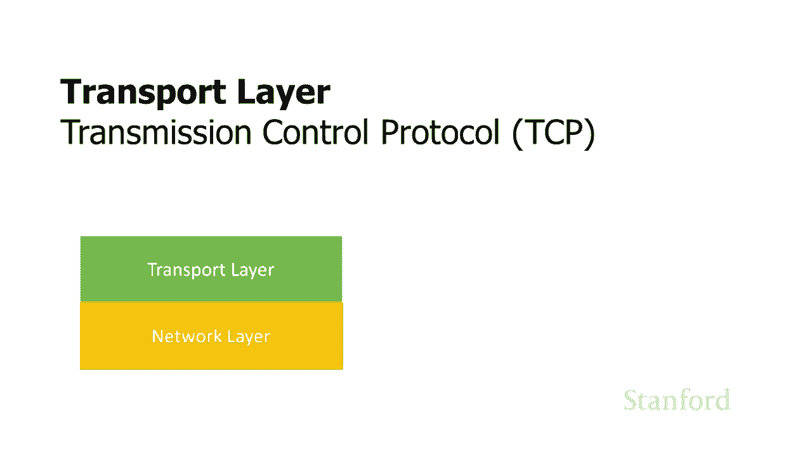

现在关于物理层的事情是：任何时候你想出一个新的网络，你需要定义一个新的物理层。我们将发现并非所有层都是这种情况，而是较低的层。每次我们拥有一种新类型的网络时，我们都需要定义一个新副本。所以如果我决定在太平洋上获取信息的最佳方法是让一群鲨鱼头上有可怕的激光束，我需要弄清楚这些鲨鱼将如何在网络的物理层顶部跨太平洋传输零和一。

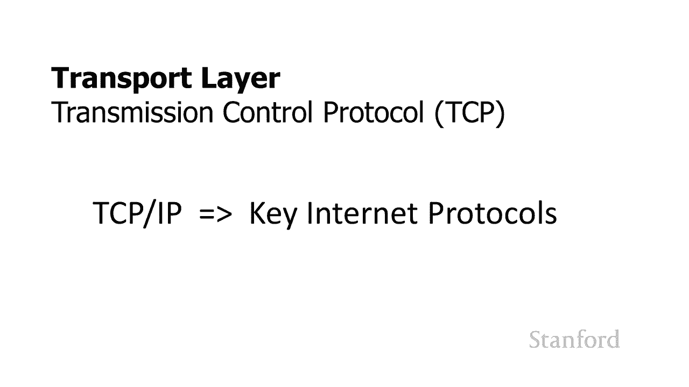

## 第二层：网络层

网络层的协议是互联网协议。这与我们看到 IP 地址时看到的互联网协议相同。而这一层建立在物理层之上。它仍然非常原始。所有通过互联网协议发送的信息都在进行，限制为 64 KB 数据包。这些数据包将包括发件人的 IP 地址、收件人的 IP 地址、校验和（这是一种尝试确定是否意外发生的方法，弄乱了数据包中的一些位），然后是实际数据。

特别使这个网络层有点烦人的事情之一是没有交付保证。互联网协议层说它将“尽最大努力”把包裹送到目的地。所以问题之一是：为什么我们有这个非常原始的层？答案是：因为无论何时我们有一种我们想要定义的新型网络，我们需要定义物理层，我们需要定义网络层。

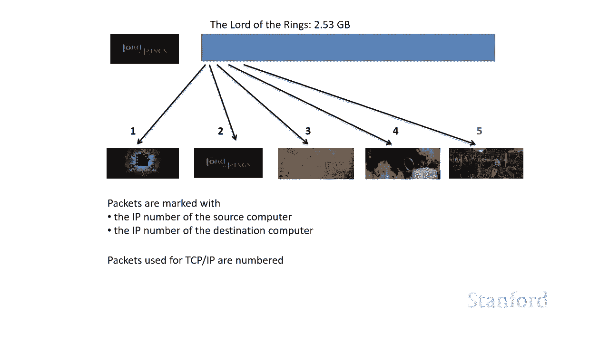

所以，回到我的鲨鱼与可怕的激光束示例。我需要让这些鲨鱼以某种方式排队以将数据包从太平洋的一侧发送到另一侧。我不想处理更复杂的协议。我想要最简单的协议，因为我在试图让这些鲨鱼对齐时遇到了足够的麻烦。所以因为网络层相对简单，所以对某人来说相对容易想出一个新的网络类型，并在这个新的网络类型上实现网络层。

## 第三层：传输层

向上一层我们有传输层。实际上有几个协议在这一层工作，但到目前为止最著名的是传输控制协议或 TCP。TCP 协议基本上就像我们的联邦快递一样。我们将能够用传输控制协议来做，它会建立在网络层之上，最终建立在物理层之上。我们将能够在传输层放下包，它们就会神奇地出现在另一端。TCP 和 IP 通常被认为是关键的互联网协议，互联网最重要的协议。

让我们来看看这如何工作。所以我们这里有一个关于指环王的视频：《指环的团契》。它是 2.53 GB。这实际上意味着我在我们之前制作了这个小互动视频，拥有广泛使用的高清电视。因此，这部电影 2.53 GB 太大，无法放入我们单独的 64 KB 数据包中。因此如果我们想发送这部电影，需要将它分成所有这些小数据包。然后，是 TCP 将为我们做的事情。

所以作为建立在 TCP 之上的人，我将电影交给 TCP。TCP 将电影分解成所有这些小的单独数据包。如果你解决了，有超过 663,000 个数据包用于整个电影。TCP 要做的是给每个单独的数据包编号，并用源计算机的 IP 号和目标计算机的 IP 号标记数据包。然后它开始通过互联网使用互联网协议。

正如我们之前讨论的，互联网协议不保证传输，它只是尽最大努力。除其他外，这意味着一些数据包将丢失，并且某些数据包将以错误的顺序到达。现在 TCP 要做的是跟踪不同的数据包。如果数据包以错误的顺序到达，它会将它们重新排序为正确的顺序。甚至更好，它将跟踪数据包的总数。如果某些数据包丢失，它将使用 IP 将请求发送回原始计算机，说：“嘿，该数据包没有出现，您可以向我发送另一个副本。” 然后再发送该副本。

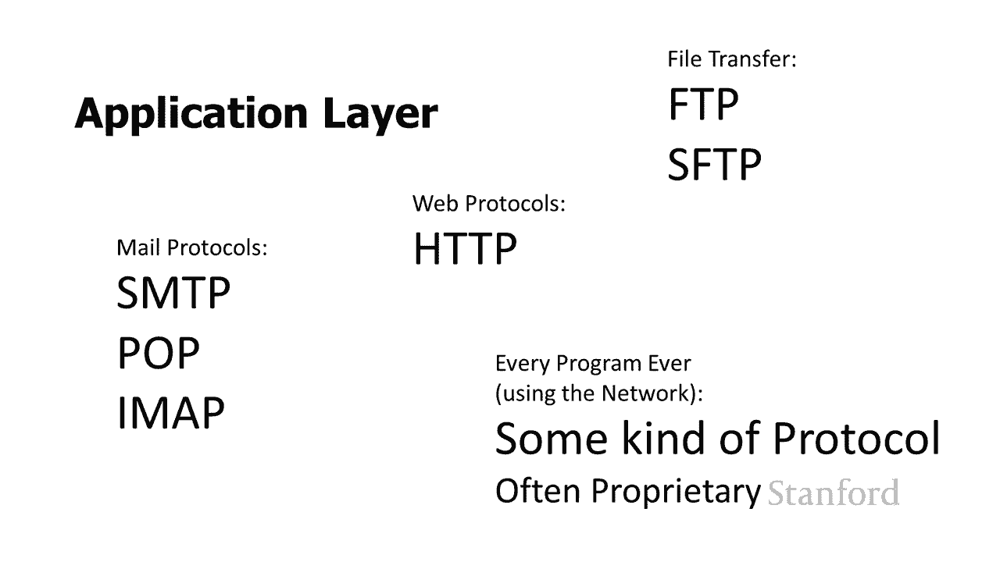

从使用 TCP 的人的角度来看，这完全是隐藏的。就 TCP 用户而言，我们只是从一台计算机到另一台计算机有直接连接，我们可以铲除我们想要的任何信息。这种连接最终会神奇地出现在另一边。

## 第四层：应用层

最终将我们带到我们的最后一层：应用层。这是你们关心的所有事情发生的层。所以我们有一大堆邮件协议：SMTP、POP、IMAP。网络协议 HTTP 在这里。有文件传输协议，如 FTP 和安全 FTP。基本上网络上的每个程序都需要有某种协议。它们可能是指定的协议，是公开可用的，并且不同的程序可以互操作。或者它们可能是完全专有的。

但最终，正如我们之前看到的，如果两台计算机在网络上并一起运行，那么这两台计算机之间需要某种正式协议。并且正式协议是一种协议。但正如我们所见，应用层是建立在其他层之上的。因此，如果您为互联网上的全新类型的应用程序想出了一些很棒的新想法，您就不必回头并说：“嘿，我需要弄清楚如何移动这些数据包，我需要知道如何重新排序那些数据包。” 完全由 TCP 为您处理。我只是将事情交给 TCP，并且 TCP 会照顾到。你不必担心：“嘿，我是通过 Wi-Fi 网络运行它？我是通过光纤电缆运行它？我是在帕特里克鲨鱼激光束网络上运行它吗？” 完全被较低层隐藏。因此您可以看到这种分层协议确实为顶层人员提供了一些巨大的优势。

## 分层协议的优势

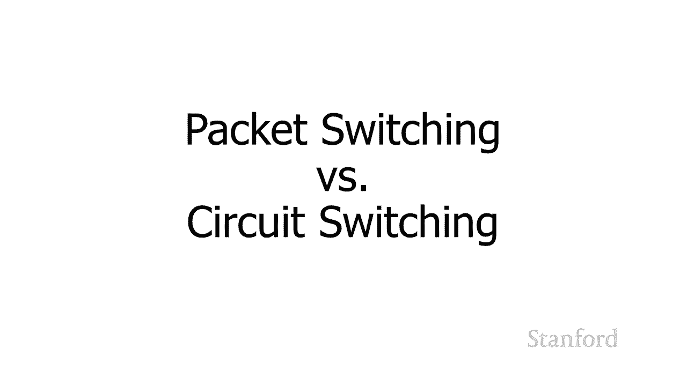

还有一些其他方便的含义，即下面的所有内容都由数据包处理。请考虑，例如，我坐在我的宿舍里，我正在尝试下载《指环王》。现在，事实证明，来自我们特定楼层的所有互联网流量都通过相同的电缆传输到更广泛的大学互联网。因此，没有数据包，当我正在下载《指环王》时，没有其他人可以做任何事情。但是，因为流量被分解成数据包，我会得到我的 64 KB 小数据包。可能我隔壁的朋友正在看电影，她会从上面拿走她的 64 KB 包。我会从《指环王》那里拿一个包。也许有人真的想完成一些工作，他们会得到一些电子邮件进入。基本上所有数据包都将共享相同的电缆。一些数据包会为我进入，一些数据包会为其他人提供。如果我们要发送，人们将能够在我们的数据包之间工作。一切都将在一个大块中，也许你会得到相同数量的流量，但每个人都必须坐下来等待大块的通过。所以事情在一个数据包中分解的事实实际上非常好。

另一种情况是数据包当它们被用于通信目的时，工作得很好。所以如果你研究电信，你会发现电信有两种不同的方式。你可以拥有什么称为电路交换，传统上是电信发生的方式。或者您可以进行分组交换。实际上一切都在转向分组交换。您可能已经注意到斯坦福的电话通常是思科电话。您可能认为：“我认为思科是一家网络公司，但我不认为他们是一家电话公司。” 我们正在使用思科电话，因为思科电话使用互联网分组技术。结果互联网分组技术比传统电话高效得多。

## 电路交换 vs. 分组交换

所以让我们看看它的实际工作原理。所以我多次提到我的朋友 Tammy，她很久以前搬到了意大利。所以我们会通过电话交谈，并使用传统的电路交换技术。当我在电话中与 Tammy 交谈时，会发生以下情况：斯坦福和意大利之间有一条特定的电线。所以它可能不是一条线，它实际上是一系列经过不同交换机的线，但最终一路上有一条特定的电线。而我正在和她通电话，她完全专注于我们两个人。如果我们正在交谈，那就太好了，我们正在使用我们的电线。如果我们彼此生气并且说得不好，这些线路仍然完全专用于我们，即使我们什么也没说。所以这不一定是这些电线的最有效用途。这些电线是现在将斯坦福连接到意大利的这些电缆。

您可能已经注意到，你们中的一些人给海外朋友拨打的大部分电话实际上是完全免费的。也许您正在使用诸如 FaceTime 或 Google 环聊之类的东西，或者诸如此类的技术，使用互联网数据包。那么，在这些情况下会发生什么？而不是你之间有一个完全专用的电路，并说你的朋友和南非的银行海外项目正在发生的是：你的声音被切断了这些 64 KB 的小数据包。这些数据包与其他人的数据包一起被推入网络。您的数据包将到达另一端。并且由于线路现在是共享的，因此不像线路专用时那么昂贵。并且老实说，意大利这里的电话系统并不是那么好，以至于拥有一条专用线路必然会带来很好的结果。所以你知道，也许最好的 FaceTime，尽管我没有使用 Skype 给人们带来很好的体验。南非，所以你知道，这在很大程度上取决于互联网连接的情况。

这实际上带来了另一个关于整个数据包情况如何工作的有趣点。因为数据包正在与其他所有内容在线共享，有时数据包会被装瓶随着互联网流量的其余部分。正在发生的事情是在另一端，您收到一个数据包，您有决定：“啊，我错过了这个数据包。但如果我在播放视频之前等待太久，我的用户会认为这变得有点奇怪，所以也许我应该在数据包到达之前继续播放视频。我们只是会有一个小故障。” 所以可能会发生各种有趣的情况，因为这些信息是以数据包的形式发送的。

---

## 总结

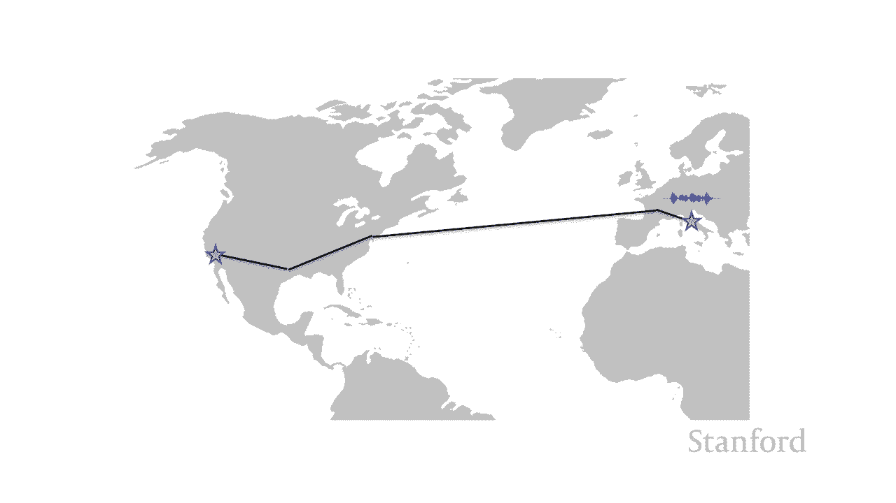

本节课中我们一起学习了互联网协议栈的分层结构。我们从物理层开始，了解了如何传输0和1；然后探讨了网络层（IP协议）如何尽力传输数据包；接着学习了传输层（TCP协议）如何确保数据的可靠、有序传输；最后到达了应用层，各种应用程序协议在此运行。这种分层设计极大地简化了网络应用的开发，让开发者可以专注于业务逻辑，而无需关心底层网络的复杂细节。我们下周将转移到那里，将开始研究万维网，我们将开始学习如何制作网页。