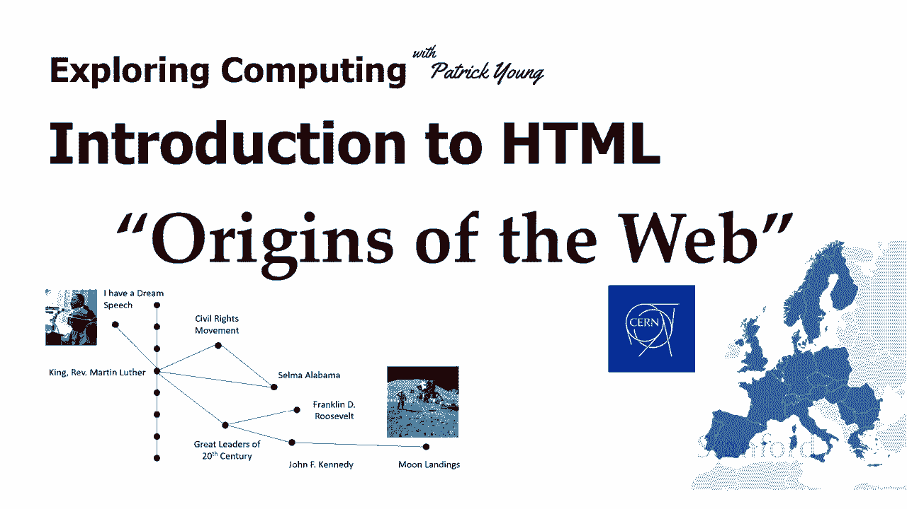
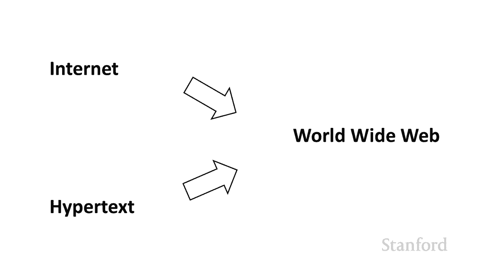
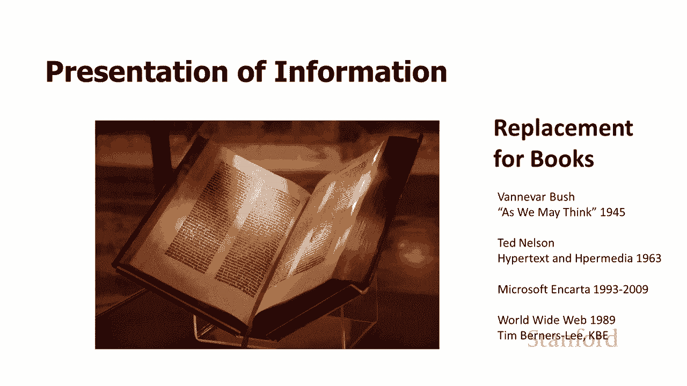
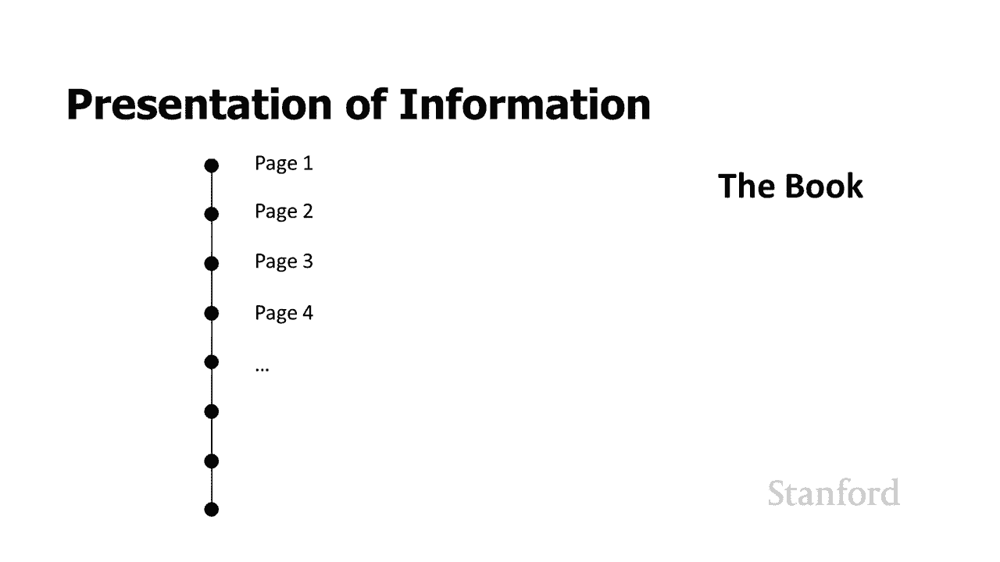
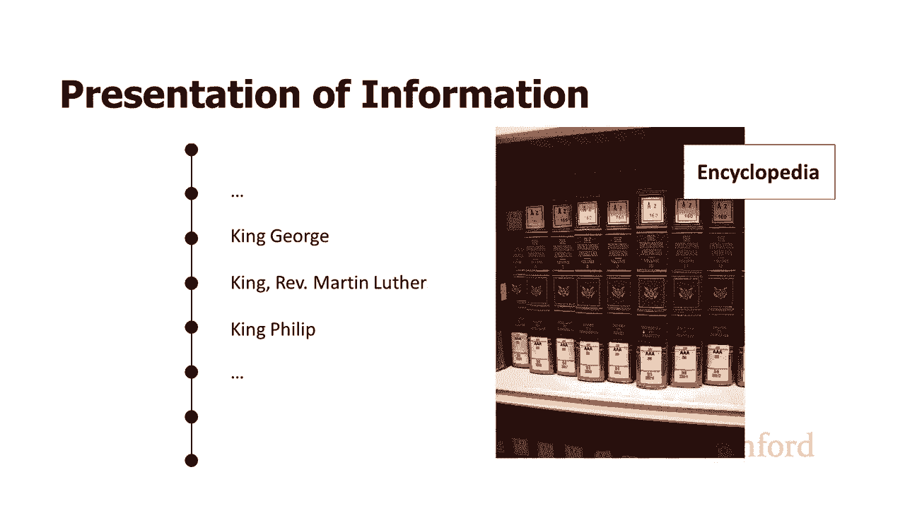
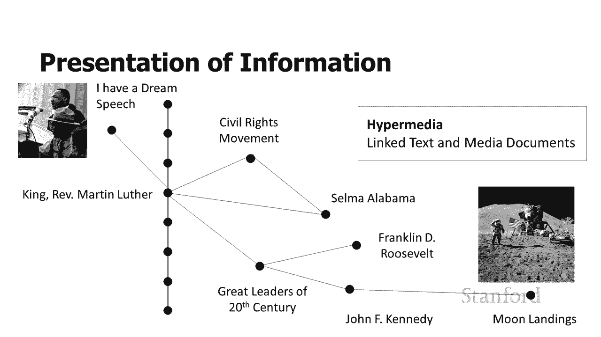
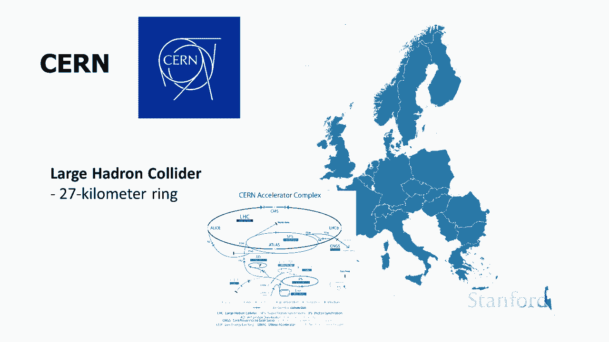
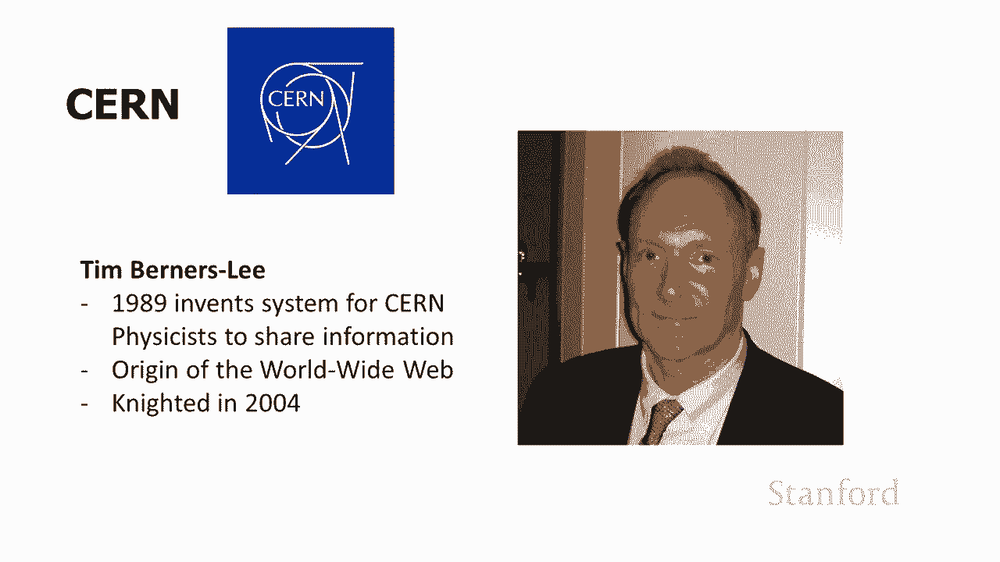

# L7.1：HTML 介绍与 Web 的起源 🌐

在本节课中，我们将要学习万维网（World Wide Web）的起源，了解其背后的两项核心技术——互联网与超文本，并探讨它们是如何结合，最终形成了我们今天所熟知的 Web。

---

## 万维网的来源

上一节我们提到了 Web 的诞生背景。本节中，我们来看看万维网具体是如何产生的。

万维网来源于两种基本技术：
*   第一个是**互联网**，我们在之前的课程中已经花了很多时间研究它。
*   第二种是**超文本**技术。

接下来，我们将开始深入了解超文本。

---

## 超文本的基本思想

在了解了 Web 的两大技术支柱后，本节我们来看看超文本背后的基本思想。

超文本的核心思想是：我们如何为人们呈现信息？我们一直在使用书籍，但书籍存在局限性。信息科学家们思考了很长时间，如何用信息技术来替代书籍。这个问题在二战结束前后就开始被探讨。

万维网背后的关键技术是超文本。超文本和超媒体的概念实际上可以追溯到 1963 年。超文本的第一次广泛使用可能是在 CD-ROM 上的电子百科全书中，例如微软的 Encarta 从 1993 年开始提供了一个很好的例子。而万维网则首次出现于 1989 年，早于这些商业产品，但最初只被非常有限的人群使用。

---

## 书籍的局限性

我们已经了解了超文本的概念，那么，它要解决的具体问题是什么呢？本节我们来分析传统书籍的局限性。

书籍有什么问题？我们为什么想要替换它？关于书籍的一点是：一本书由页面组成，每一页都按顺序跟随前一页。这看起来很明显，但这可能是一个非常大的限制，具体取决于我们看的是哪种类型的书。

以下是书籍的局限性：
*   **线性结构**：书籍有第一页、第二页、第三页等顺序。对于阅读小说，这可能是个不错的选择（除非你想直接翻到最后看结局）。但对于像百科全书这样的参考书，单一的线性顺序就成了问题。
*   **查找与关联困难**：印刷的百科全书只有一种信息排序方式。例如，要找一篇关于马丁·路德·金的文章，你可能会发现他被编排在“英格兰的乔治国王”和“西班牙的菲利普国王”之间，而他与这两人并无直接关系。这种线性排序使得查找文章容易，但很难发现不同文章之间的内在联系。

因此，当我们转向计算机时，我们不再局限于信息的单一排序。我们可以创建不同的信息节点，并将任何节点链接到任何其他节点。这样，我们既可以维护便于查找的序列，也可以将“马丁·路德·金”与“民权运动”、“阿拉巴马州塞尔玛”、“20世纪的伟大领袖”等文章关联起来。我们现在拥有的是一个信息网络，“万维网”（World Wide Web）一词正是由此而来。

超文本概念基本上就是说：我们有这些不同的文本节点，并将它们链接起来。这正是万维网的工作方式。在计算机上，我们可以更进一步，因为我们不再局限于文字。我们可以有演讲、音频（如马丁·路德·金的“我有一个梦想”演讲）、照片和电影。这被称为**超媒体**。以上就是超文本和超媒体背后的基本思想。

---

## 互联网与超文本的结合

超文本提供了组织信息的新方式，但这还不足以构成万维网。本节中，我们来看看等式的另一半——互联网，是如何与超文本结合在一起的。

如何将两者最终结合在一起？我们需要将目光转向欧洲。在欧洲，有一个名为 **CERN** 的物理实验室联盟，它有23个成员国，总部设在日内瓦。它最著名的是拥有一个用于高能物理研究的大型对撞机（一个27公里长的环），与斯坦福的SLAC类似。

在80年代后期，一位在CERN工作的计算机科学家**蒂姆·伯纳斯-李**，有兴趣找到一种方法，让CERN的物理学家们能够分享研究论文。在CERN，成员国将他们的物理学家派来，有时这些物理学家又会回到各自国家的机构。因此，他正在寻找一种在所有物理学家之间共享论文的方法。

很自然地，他认为应该使用**互联网**。此外，他还认为应该使用人们已谈论许久的**超文本**技术（该技术在实验室环境中已被研究了相当长一段时间）。于是，蒂姆·伯纳斯-李在1989年提出了结合互联网和超文本，以便在物理学家之间共享信息的想法。这就是**万维网**的起源，他因此在2004年被封为爵士。

所以，当你查看万维网并想知道为什么某些事情会以某种方式运作时，很重要的一点是记住：它最初是为了让物理学家共享物理研究论文而发明的。因此，它最初并没有拥有我们可能期望用于大众媒体的所有技术。我们会看到，其中一些技术是后来才被加入的。如果你专门为大众市场和普通消费者设计系统，你可能会采用略有不同的形式主义。为了让网页比物理学论文更丰富多彩、更有趣，必须添加很多东西。

---

## 总结

本节课中，我们一起学习了万维网的起源。我们了解到，Web 是**互联网**（提供全球连接的基础设施）与**超文本/超媒体**（提供非线性、可链接的信息组织方式）两项技术结合的产物。它最初由蒂姆·伯纳斯-李于1989年在CERN提出，旨在方便物理学家共享研究论文。这一起源也影响了Web早期的一些设计特点。

在下一个视频中，我们将看看 **HTML**，它实际上是用于创建网页的语言。