# 斯坦福CS105：计算机科学导论：L7.2：HTML 介绍：超文本标记语言 🏗️

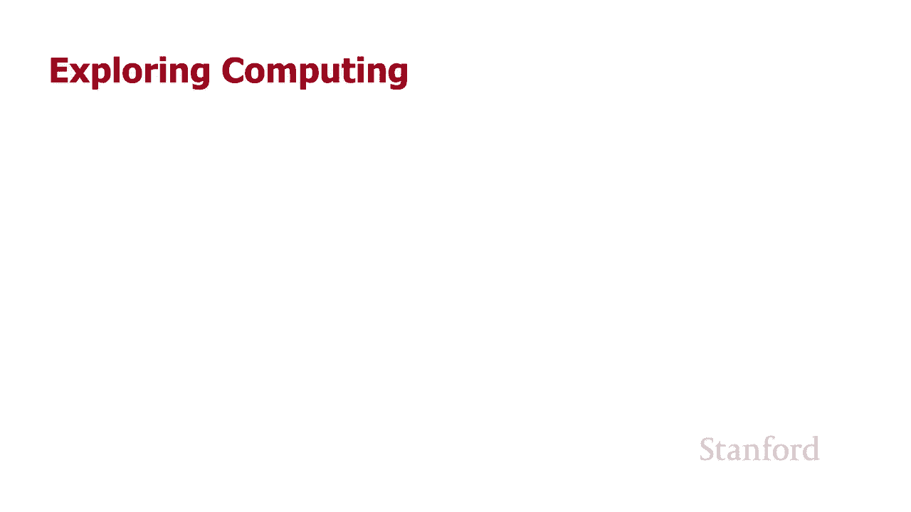

在本节课中，我们将要学习**超文本标记语言**的基础知识。我们将了解HTML是什么，它与HTTP协议的关系，以及如何使用标签和元素来构建网页的基本结构。

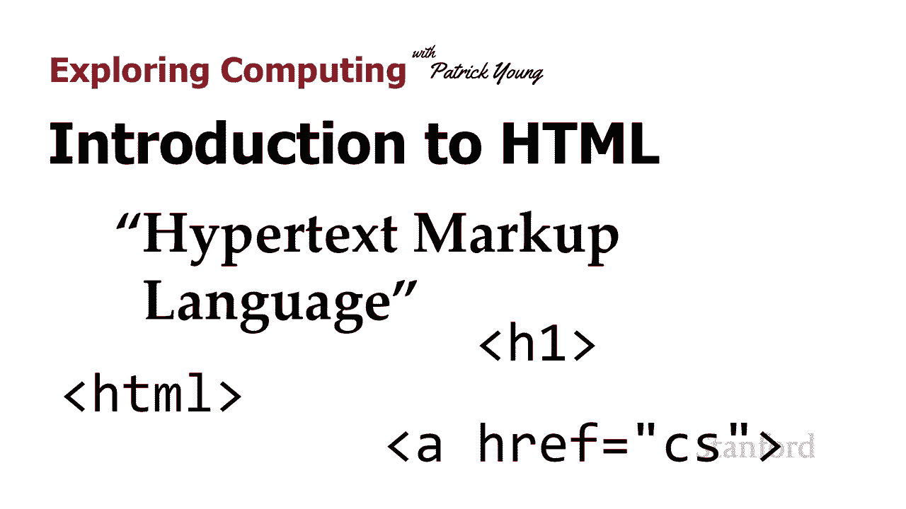

---

## 回顾：HTTP与HTML的关系

上一节我们介绍了万维网的起源和**HTTP**协议。本节中我们来看看**HTML**，并理解它与HTTP的关系。

HTTP代表**超文本传输协议**。它是一个协议，控制着万维网上两台计算机如何交互。一台计算机可以向网络服务器发出请求，请求特定文件，服务器则通过发送文件来响应。

这些文件可以有多种格式，最常见的格式就是**HTML文件**。HTTP协议本身并不指定文件的格式，它只负责传输。因此，HTML作为一种**文件格式**，定义了网页的内容和结构。

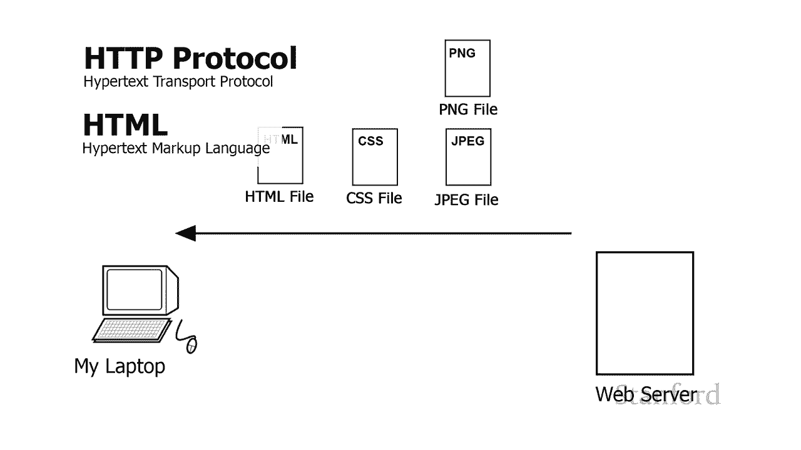

HTML代表**超文本标记语言**。我们已经了解了“超文本”的含义，而“标记”则来源于出版行业。

---

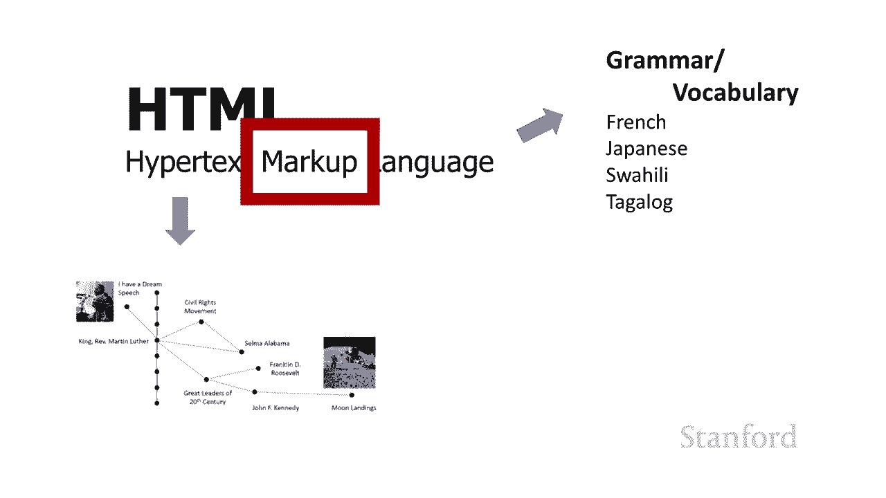

## 什么是“标记”？

术语“标记”来自出版行业。在传统出版中，作者负责撰写文章的正文内容，而编辑则会介入，决定文章的最终呈现格式，例如标题的字体、照片的位置等。

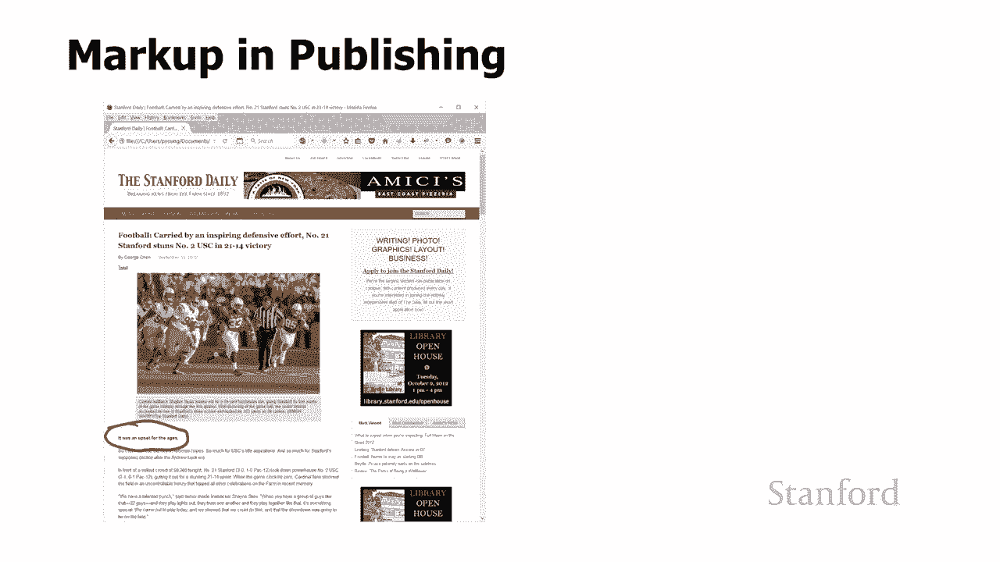

编辑会使用“标记”在作者的文稿上写下这些格式注释，指导排版人员如何进行版面设计。HTML正是借鉴了这一概念。

在HTML中，我们使用一种计算机能理解的、更正式的“标记”来告诉浏览器如何显示网页内容。

---

## HTML的基本构成：标签与元素

学习HTML工作原理的关键是理解**标签**和**元素**。

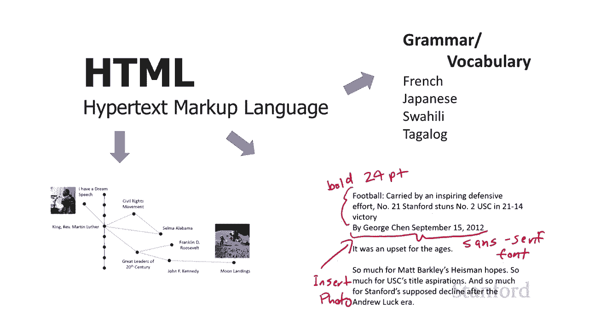

假设我们想创建一个网页，上面显示“*go* **Stanford**”，并希望“go”以斜体显示，“Stanford”以粗体显示。在HTML中，我们会这样写：

```html
<i>go</i> <b>Stanford</b>
```

以下是HTML的核心概念：

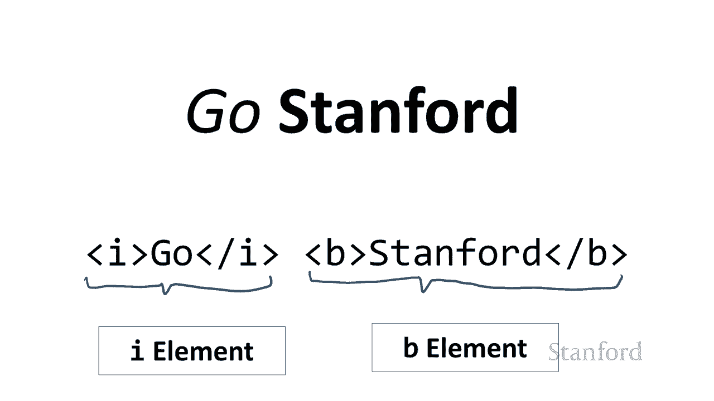

*   **标签**：像 `<i>`、`</i>`、`<b>`、`</b>` 这样的符号就是标签。它们通常成对出现。
*   **元素**：一个元素由**开始标签**、**结束标签**以及它们之间的所有内容组成。例如，`<i>go</i>` 构成了一个斜体元素。
*   **容器关系**：元素可以嵌套。例如，粗体元素可以包含斜体元素。但必须保持完整的包含关系，不能交叉嵌套。

```html
<!-- 正确的嵌套 -->
<b><i>go</i> Stanford</b>

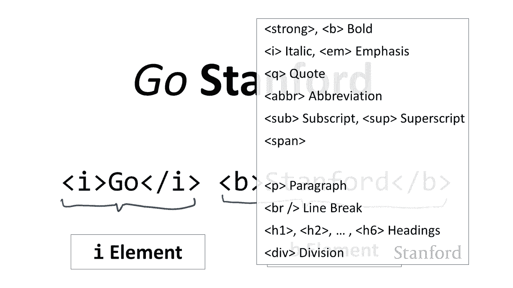

<!-- 错误的嵌套（非法） -->
<b><i>go</b> Stanford</i>
```

---

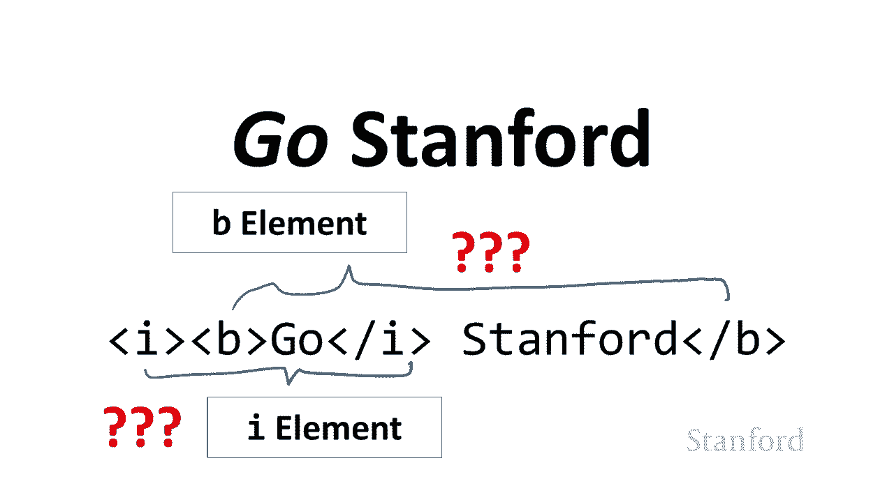

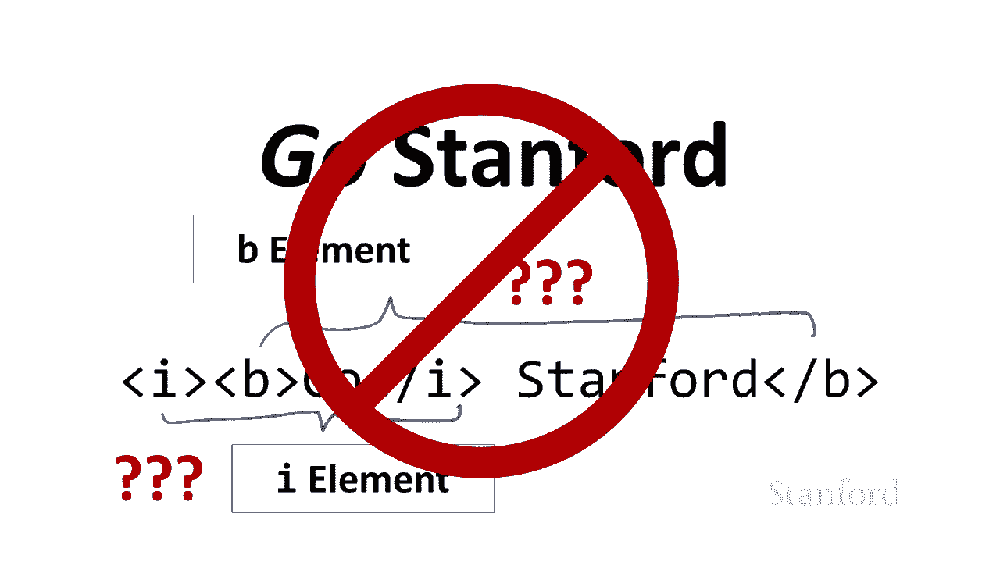

## 属性与自闭合标签

有时，标签本身需要提供额外信息。例如，如果我们想将“Stanford”一词链接到斯坦福大学的官方网站，就需要使用锚点标签 `<a>`，并告诉它链接的目标地址。

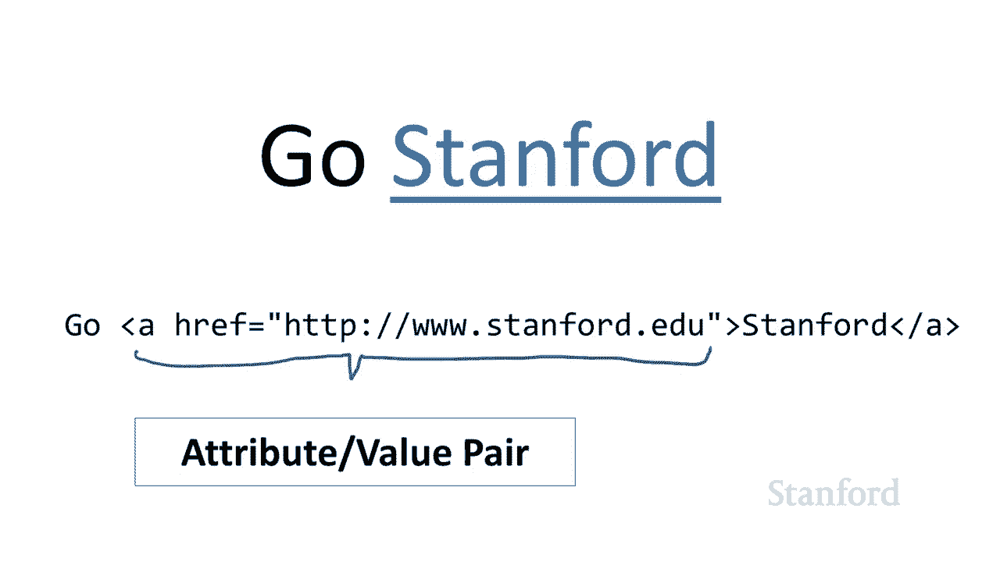

```html
<a href="https://www.stanford.edu">Stanford</a>
```

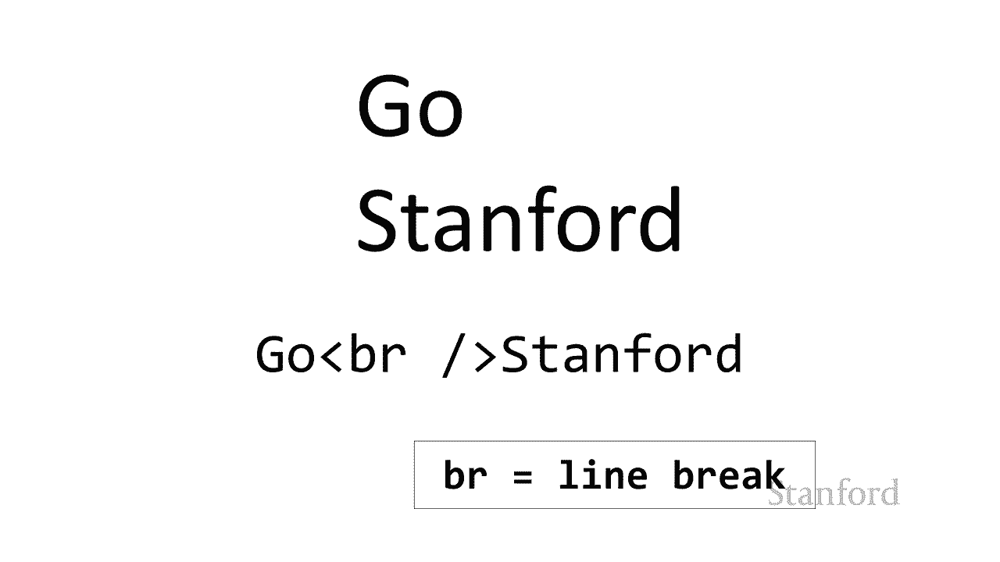

*   **属性**：`href` 被称为**属性**，它为 `<a>` 标签提供了附加信息（这里是超链接的地址）。
*   **属性值**：`“https://www.stanford.edu”` 是 `href` 属性的**值**，需要用引号括起来。

某些标签并不成对工作，它们被称为**自闭合标签**。例如，换行符 `<br />` 标签。它没有结束标签，为了清晰表明它是独立的，我们通常在末尾加上一个斜杠 `/`。

---

## 空白字符与段落

在HTML中，连续的空白字符（包括空格、制表符、回车）都会被合并为**单个空格**。如果你想控制文本的换行和段落，需要使用特定的标签。

*   **换行符**：`<br />` 标签会强制换行，但不会在两行之间创建空行。
*   **段落**：`<p>` 标签用于定义一个段落。浏览器通常会在段落之间显示一个空行。

```html
<p>这是第一段。</p>
<p>这是第二段。</p>
```

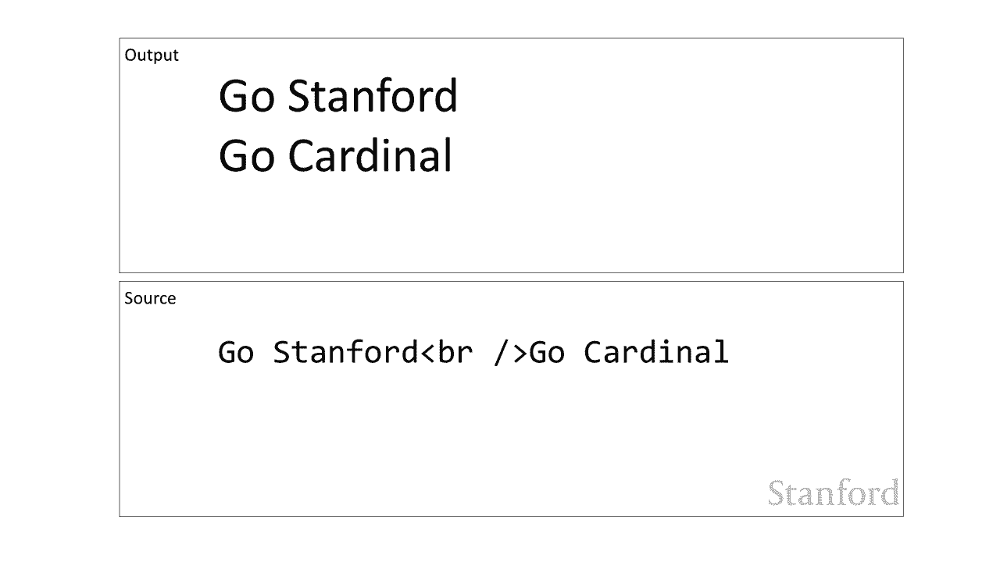

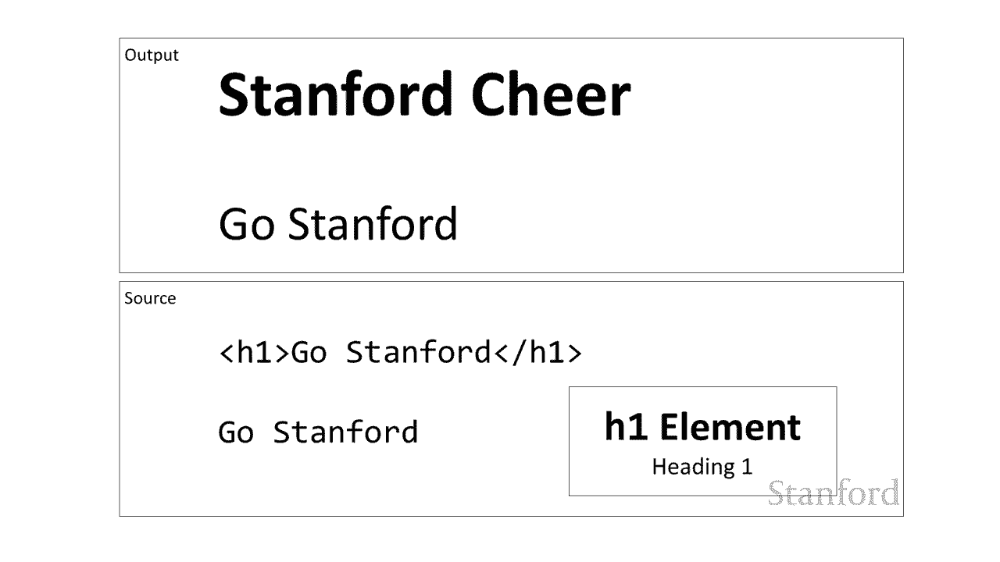

---

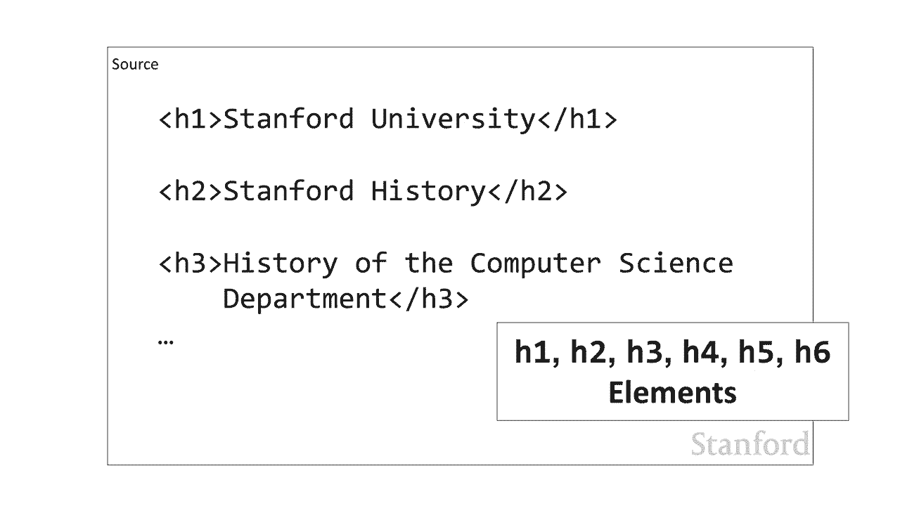

## 标题与格式控制

HTML提供了用于创建标题的标签，从 `<h1>` 到 `<h6>`，其中 `<h1>` 是最高级（最重要）的标题，`<h6>` 是最低级的标题。

```html
<h1>这是一级标题</h1>
<h2>这是二级标题</h2>
```

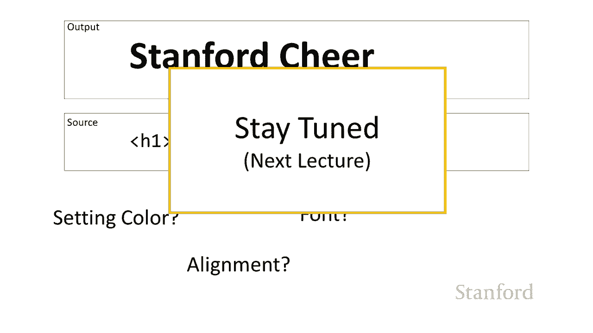

你可能想知道如何控制颜色、字体或对齐方式。在过去，这些样式信息也通过HTML标签来设置。但现在，我们使用**级联样式表**来专门处理所有样式问题，这使得HTML可以更专注于网页的结构和内容。

---

## 一个完整的HTML文档结构

一个格式良好的HTML文档需要包含一些基本框架标签。

以下是所有网页都需要的基本结构：

```html
<!DOCTYPE html>
<html>
  <head>
    <meta charset="utf-8" />
    <title>网页标题</title>
  </head>
  <body>
    <!-- 网页的实际内容放在这里 -->
  </body>
</html>
```

以下是各部分的作用：

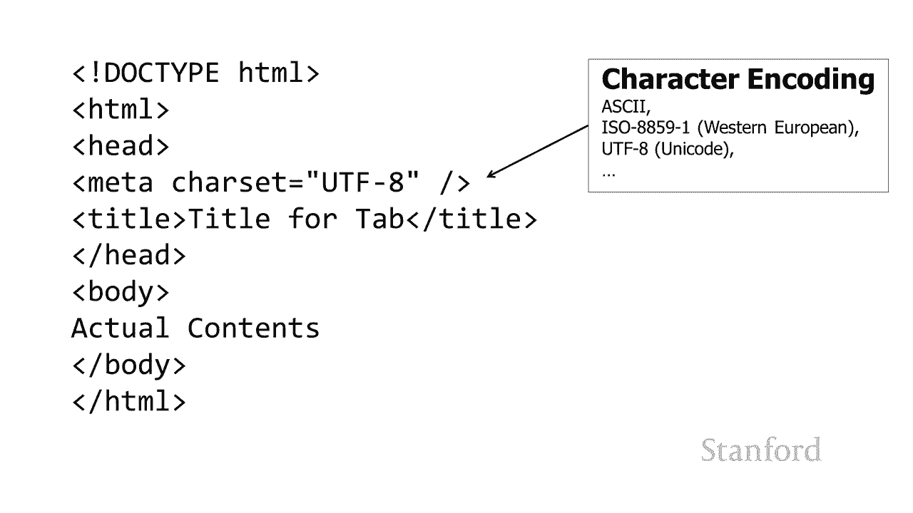

*   `<!DOCTYPE html>`：文档类型声明，告诉浏览器这是一个HTML5文档。虽然现代浏览器对此要求不严，但包含它可以避免浏览器进入“怪异模式”。
*   `<html>`：根元素，包裹整个HTML文档。
*   `<head>`：头部部分，包含网页的元信息，如字符编码、标题等，这些内容不会直接显示在网页上。
    *   `<meta charset=“utf-8”>`：指定文档的字符编码为UTF-8，以支持多语言。
    *   `<title>`：定义网页的标题，它会显示在浏览器标签页上。
*   `<body>`：主体部分，包含所有会在网页上显示的实际内容，如文本、图片、链接等。

---

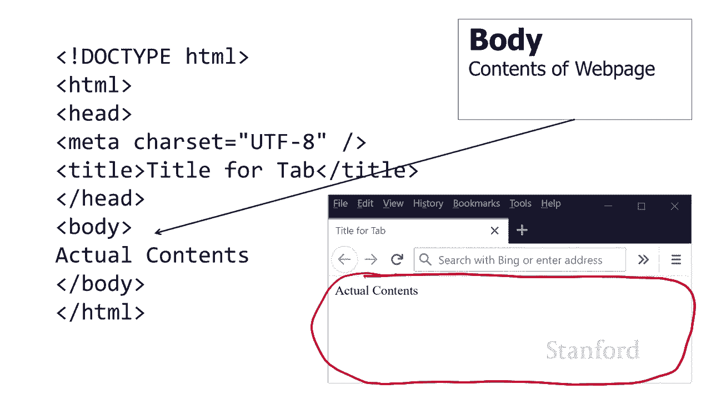

## HTML的变体：XHTML

HTML有多个版本和变体。当前主流版本是HTML5。此外，还有一种更严格的变体叫做**XHTML**。

XHTML要求代码书写更规范，例如：
*   所有标签和属性必须使用**小写字母**。
*   所有属性值必须放在**引号**内。
*   自闭合标签（如 `<br />`）必须有**结束斜杠**。

遵循XHTML的规则可以使代码更统一、更清晰，是专业开发中的常见做法。

---

## 总结

本节课中我们一起学习了**超文本标记语言**的基础知识。我们了解了HTML与HTTP协议的关系，学习了如何使用**标签**和**元素**来构建网页结构，认识了**属性**的作用，并掌握了一个标准HTML文档的基本框架。

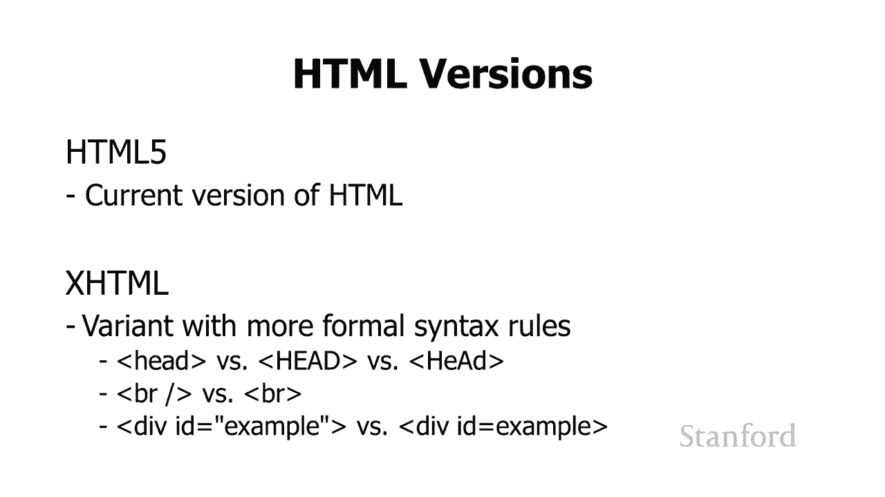


记住，HTML的核心是定义**内容的结构**，而样式则由CSS负责。在下一个视频中，我们将动手实践，学习如何创建、保存并在浏览器中查看你自己的HTML文件。