# 斯坦福CS105：计算机科学导论：L7.3：HTML 介绍：逐步创建网页 🚀

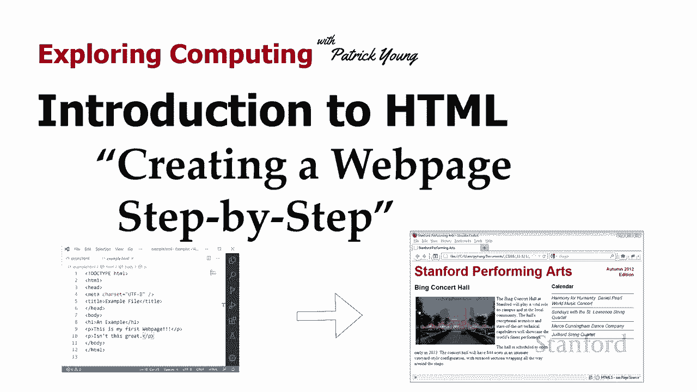

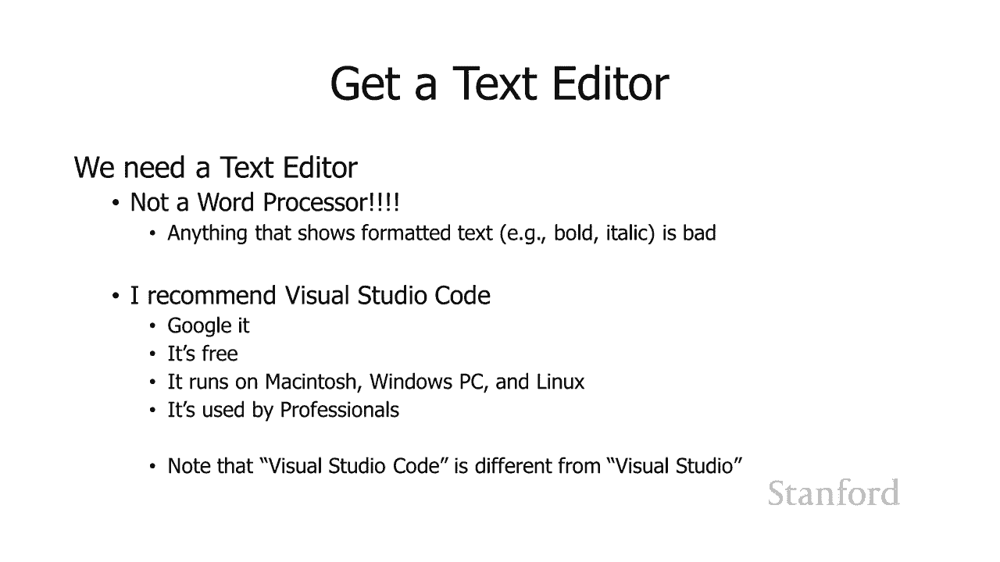

在本节课中，我们将学习如何从零开始创建一个HTML网页。我们将介绍创建网页所需的基本工具、步骤和最佳实践，包括使用文本编辑器、编写HTML代码、验证语法以及如何在浏览器中预览效果。

---

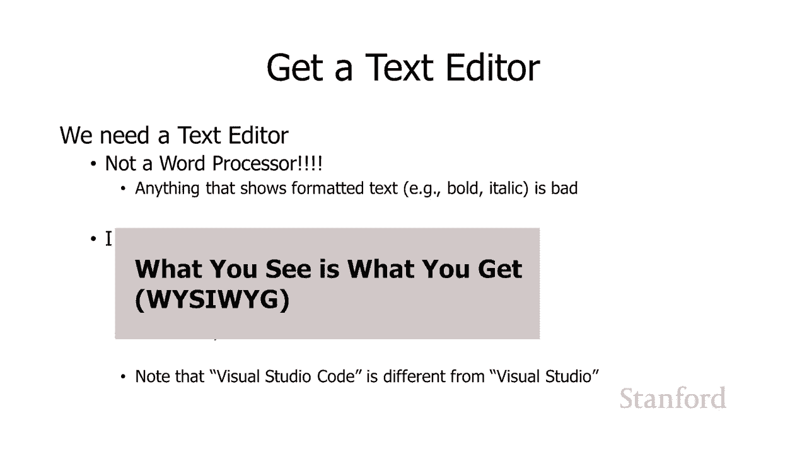

## 概述 📋

HTML是构建网页的基础。本节我们将通过一个简单的流程，引导你完成创建第一个网页的每一步。这个过程包括准备工具、编写代码、检查错误和查看结果。

---

## 第一步：准备工具 🛠️

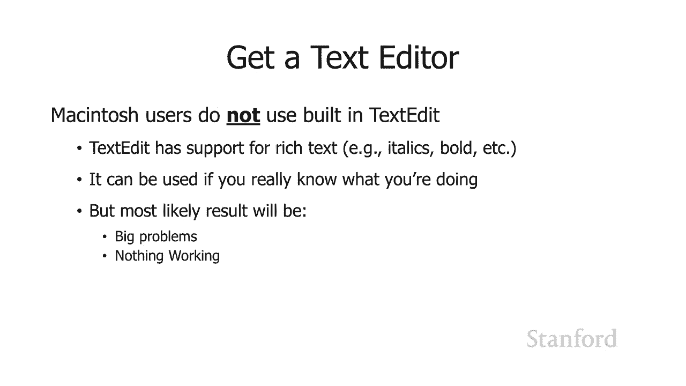

上一节我们介绍了HTML的基本概念，本节中我们来看看创建网页需要哪些工具。

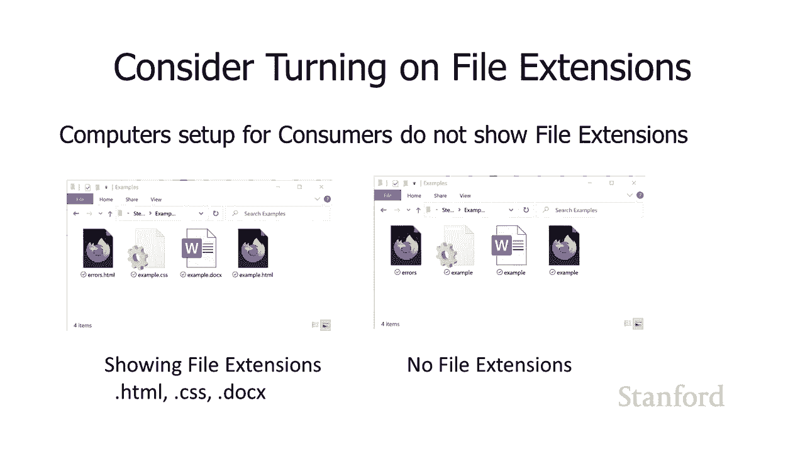

首先，你需要一个**文本编辑器**。请注意，文本编辑器与文字处理器（如Microsoft Word）不同。文字处理器使用“所见即所得”的方式创建格式化文档，而HTML网页需要在各种不同设备上显示，因此我们需要使用纯文本编辑器来编写代码。

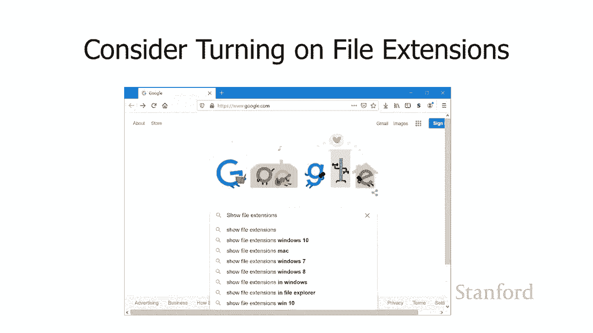

以下是几个推荐的文本编辑器：
*   **Visual Studio Code**：功能强大且免费，支持Mac、Windows和Linux。
*   **Sublime Text**：轻量且快速，被许多专业人士使用。
*   **Atom**：由GitHub开发，开源且可高度定制。

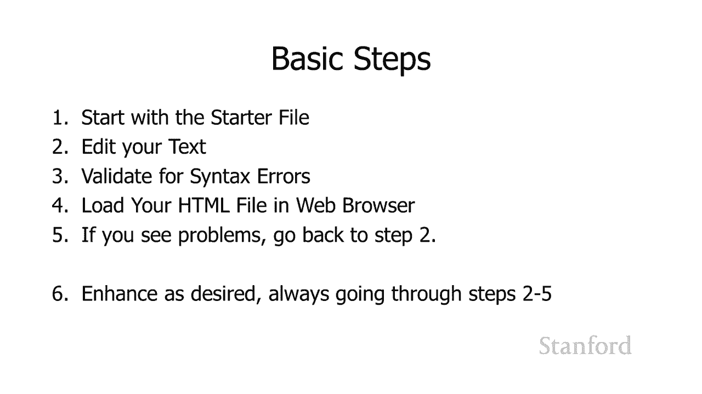

**特别注意**：Mac用户应避免使用系统自带的“文本编辑”应用，因为它默认支持富文本格式，可能会干扰HTML代码的编写。请确保你使用的是纯文本编辑器。

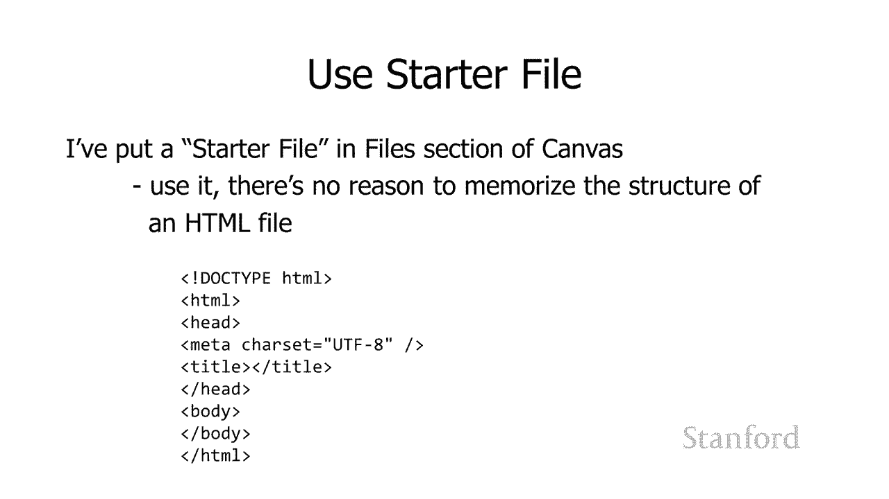

---

## 第二步：显示文件扩展名 📁

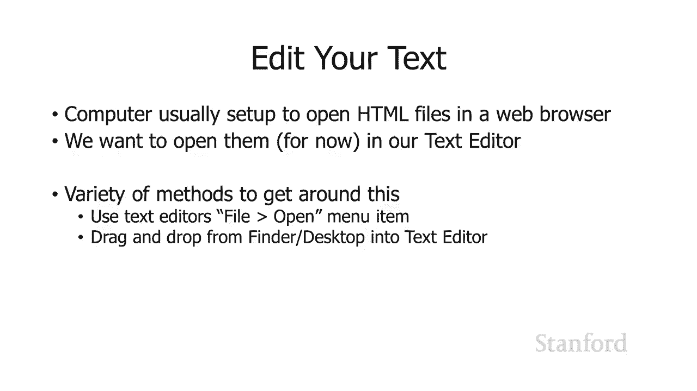

在开始编辑文件之前，建议你在操作系统中设置显示文件扩展名。文件扩展名（如 `.html`、`.txt`）能帮助你清晰地区分文件类型，这在后续的编程工作中非常重要。

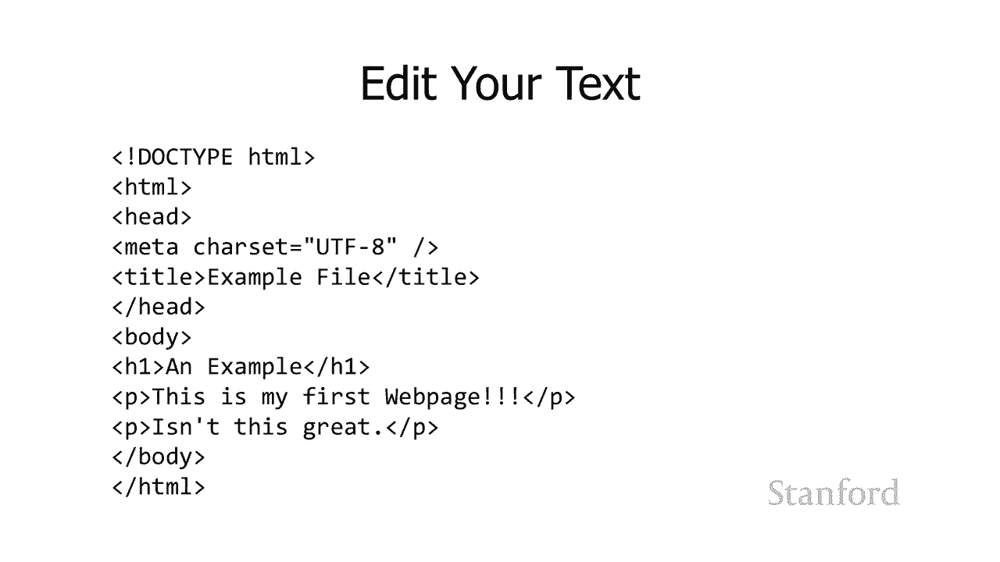

---

## 第三步：创建与编辑网页的流程 🔄

现在，我们来看看创建和编辑一个网页的基本步骤。我们将遵循一个循环流程来完善我们的网页。

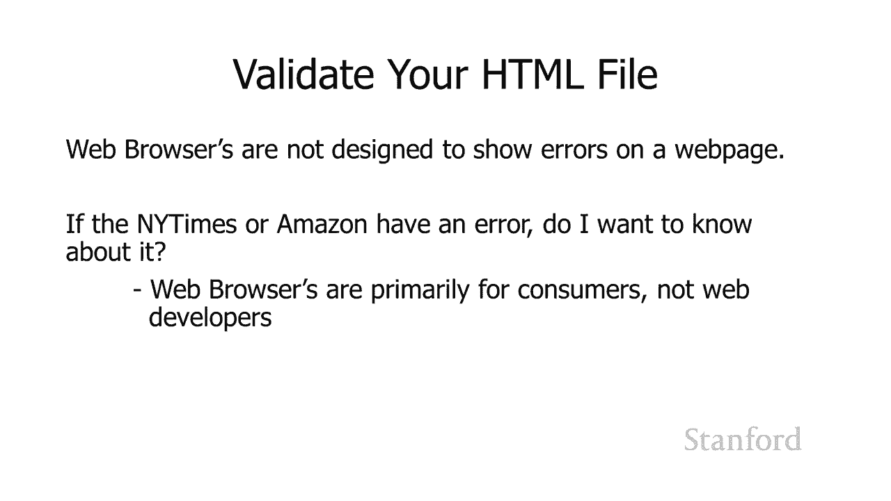

以下是创建网页的核心步骤：
1.  **从初始文件开始**：我们将为你提供一个基础的HTML文件模板，你无需记忆所有结构代码。
2.  **在文本编辑器中打开并编辑**：使用你的文本编辑器打开初始文件，然后添加或修改内容。**注意**：不要双击HTML文件，否则它会在浏览器中打开。你应该通过文本编辑器的“文件”菜单或拖放方式在编辑器中打开它。
3.  **验证HTML语法**：使用在线验证工具检查代码中是否存在语法错误。这是确保网页在不同浏览器中表现一致的关键步骤。
4.  **在浏览器中加载并查看**：将验证无误的HTML文件在网页浏览器（如Firefox）中打开，查看实际效果。
5.  **循环改进**：如果你对效果不满意或想添加新功能，就回到第2步编辑代码，然后重复验证和预览的过程。

这个“编辑 -> 验证 -> 预览”的循环被称为**编辑调试周期**，是程序员的核心工作流程。

---

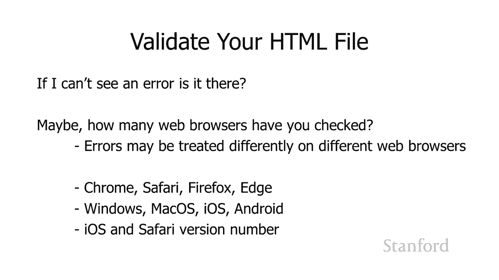

## 第四步：使用HTML验证器 ✅

在将网页加载到浏览器之前，验证HTML代码至关重要。因为网页浏览器被设计为对用户友好，即使代码有错误，它也会尝试显示页面，而不会明确报错。这可能导致网页在不同浏览器或设备上显示不一致。

我们推荐使用万维网联盟提供的在线验证服务。访问 `validator.w3.org`，通过“文件上传”选项提交你的HTML文件进行检查。

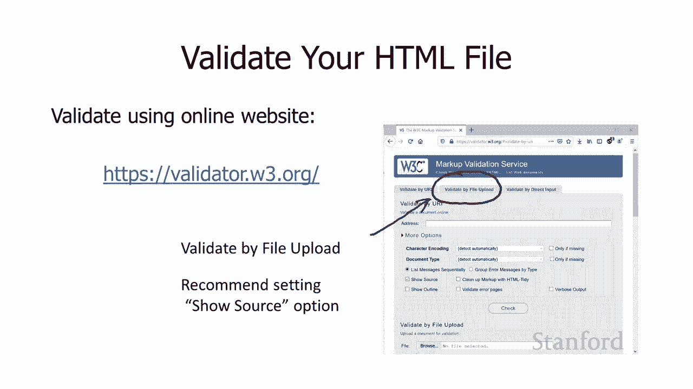

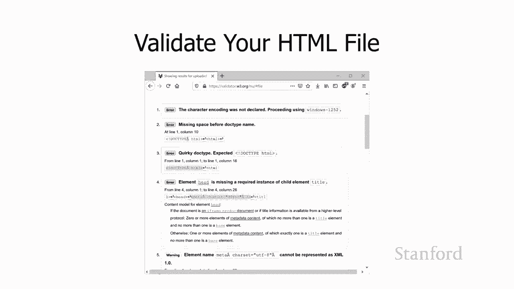

关于验证器结果的几点说明：
*   **不要被错误数量吓倒**：有时一个早期错误会导致验证器报告大量后续错误。修复第一个错误后重新验证，很多错误可能会消失。
*   **错误定位**：验证器报告的错误行号有时可能比实际出错位置晚一行。请关注列表中的第一个错误，并检查其附近代码。

务必在提交作业前完成验证，以确保代码质量。

---

## 第五步：在浏览器中预览 🌐

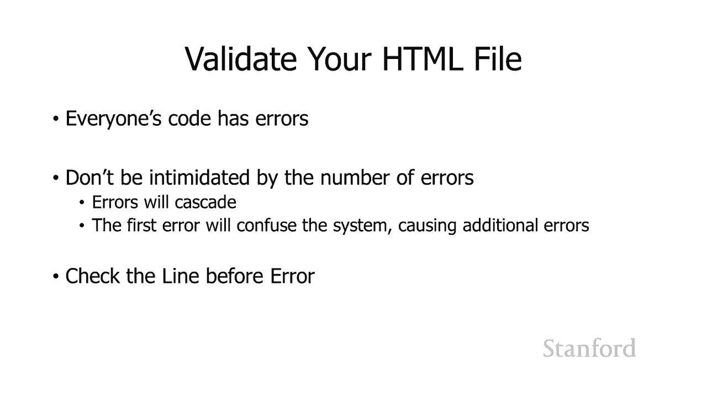

完成验证并修复所有错误后，就可以在网页浏览器中查看你的作品了。为了课程评分的一致性，我们建议使用**最新版本的Firefox浏览器**。

在浏览器中打开文件的方法不是双击，而是启动Firefox后，通过“文件”菜单中的“打开文件”选项，或者直接将文件图标拖放到浏览器窗口中。

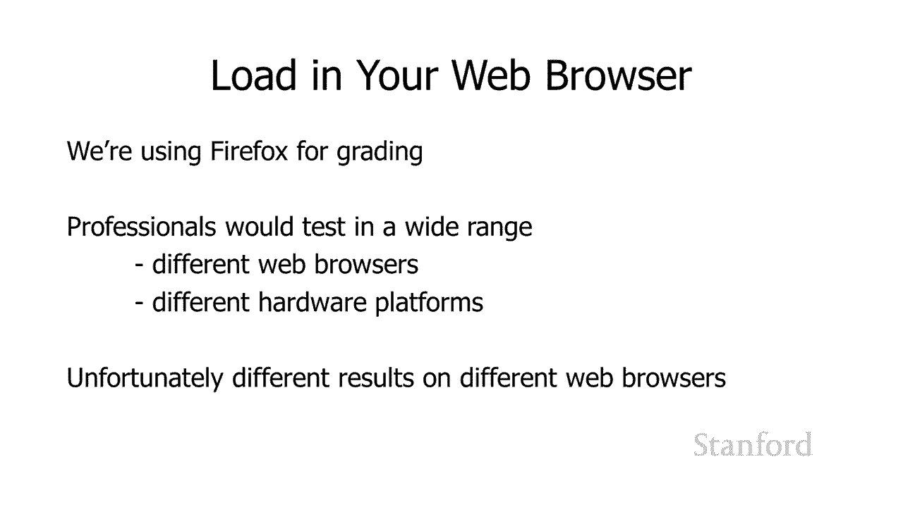

---

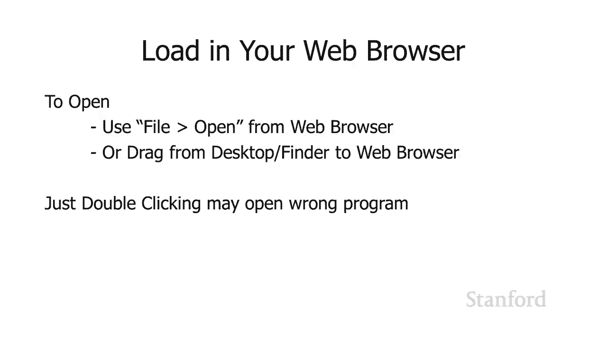

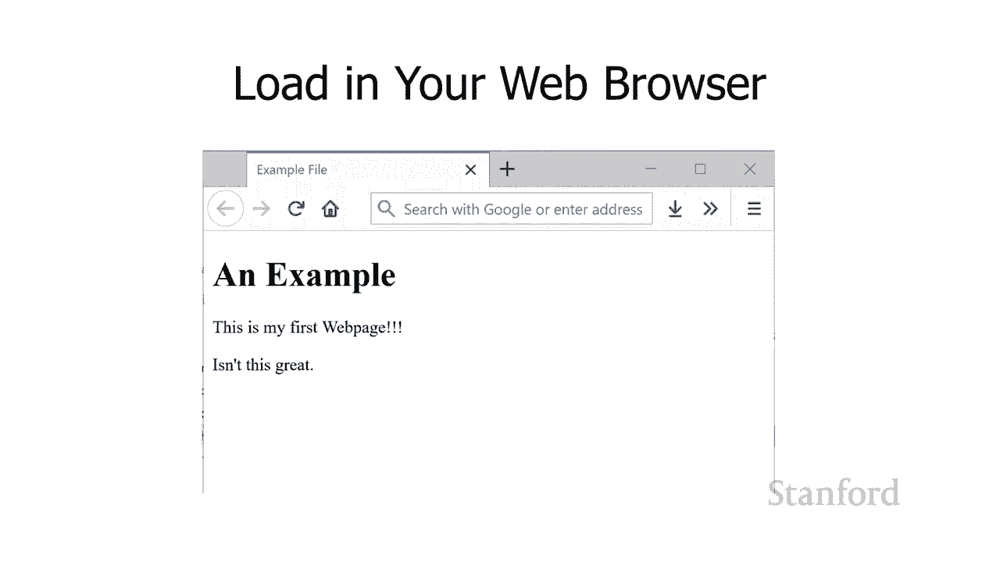

## 总结 🎯

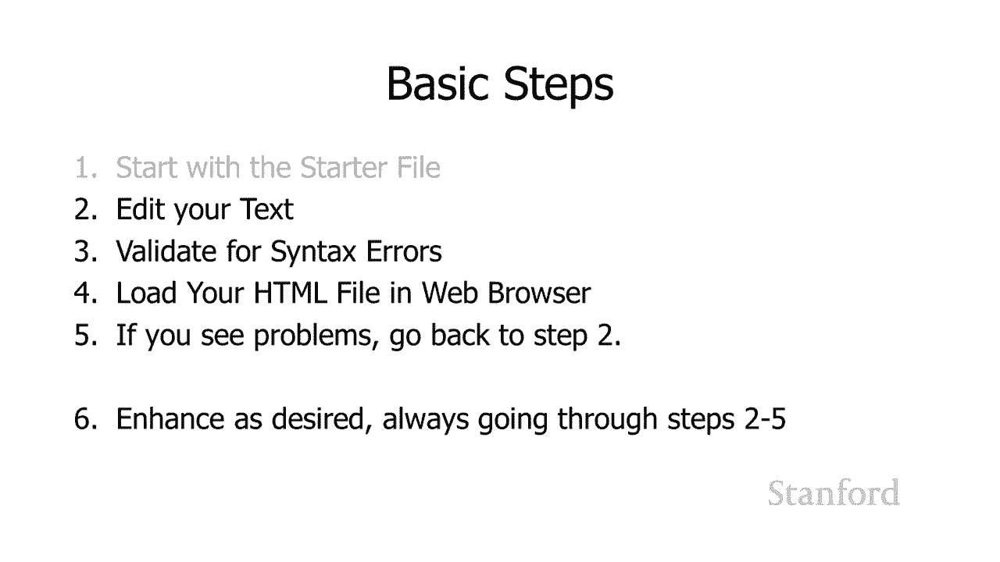

本节课中我们一起学习了创建HTML网页的完整流程。我们了解了文本编辑器与文字处理器的区别，掌握了“编辑-验证-预览”的核心工作循环，并学会了使用W3C验证器来确保代码质量。记住，编程是一个迭代的过程，耐心和细心是成功的关键。在接下来的作业中，你将有机会亲自实践这一切。