# CS105：L7.4：HTML 语法与词汇规则 🧩


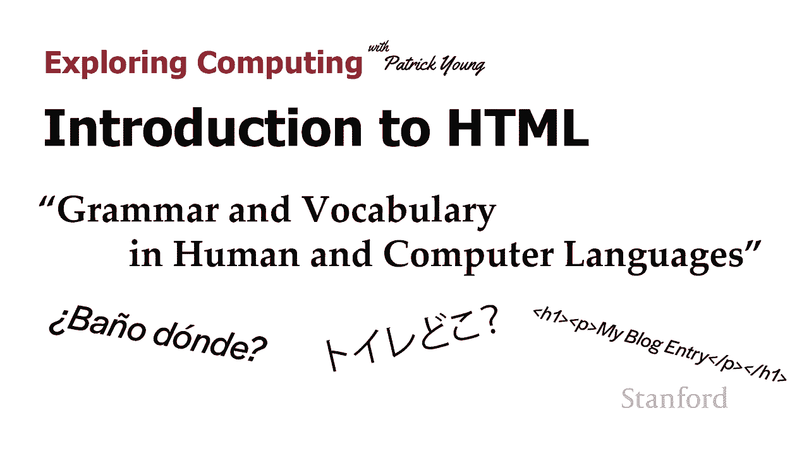

在本节课中，我们将学习 HTML 的语法和词汇规则。我们将了解计算机语言与人类语言的相似之处，并掌握构成 HTML 文档的基本规则。课程将涵盖 HTML 的词汇量、语法规则（句法），以及如何正确使用标签来构建网页。

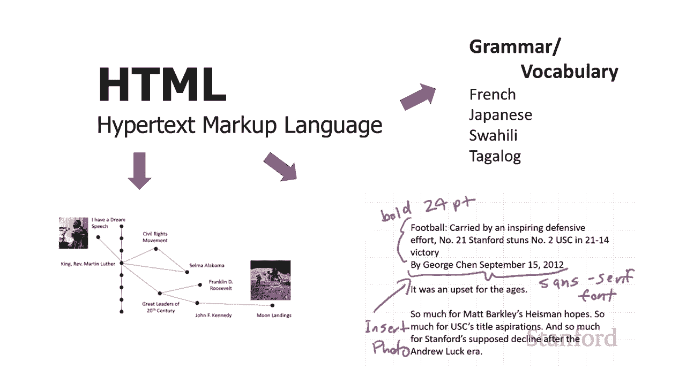

---

## 计算机语言与人类语言

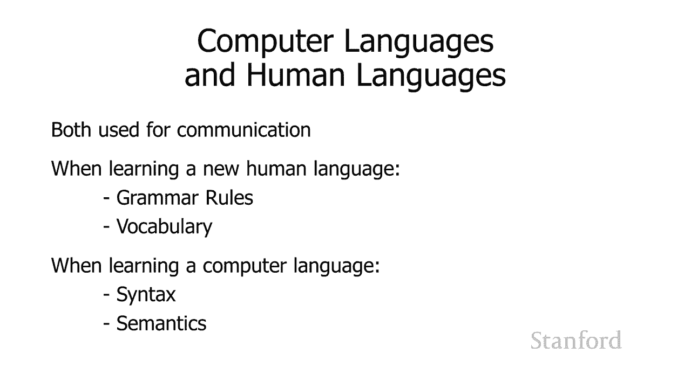

上一节我们介绍了 HTML 的基本概念，本节中我们来看看计算机语言与人类语言的异同。

计算机语言和人类语言都用于交流。人类语言用于人与人之间的交流，而计算机语言则用于人与计算机之间的交流。

学习一门新的人类语言时，我们需要掌握两样东西：**语法规则**和**词汇**。学习计算机语言也是如此。

在计算机科学中，语法规则被称为**句法**，而词汇则与**语义**的概念相关。对于人类语言，词汇通常比语法更重要。例如，即使语法不完美，人们通常也能理解对方的意思。

然而，对于计算机语言，尤其是 HTML 和后续将学习的编程语言，语法必须接近完美。计算机不会像人类一样去猜测不完美语法背后的意图。

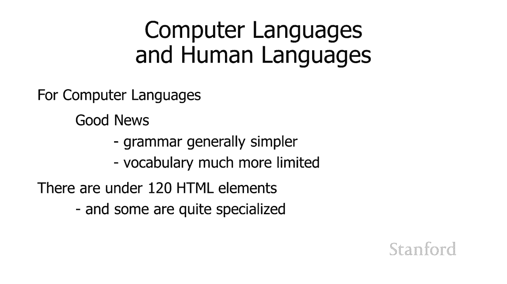

好消息是，与人类语言相比，计算机语言的语法规则通常更简化，词汇量也更有限。

---

## HTML 的词汇量

HTML 的词汇量实际上非常小。整个 HTML 规范包含不到 120 个元素（标签）。

以下是部分 HTML 元素的例子：

*   **`<bdi>` 和 `<bdo>`**：用于处理从右到左书写的文本方向，在特定语言环境下很重要。
*   **`<wbr>`**：用于指定一个单词中合适的换行位置（例如，`supercalifragilist<wbr>icexpialidocious`）。
*   **`<track>`**：用于为音频或视频元素指定字幕轨道。

其中许多元素非常专业化，在创建普通网页时可能永远用不到。而另一些元素则非常常用和直观，例如：

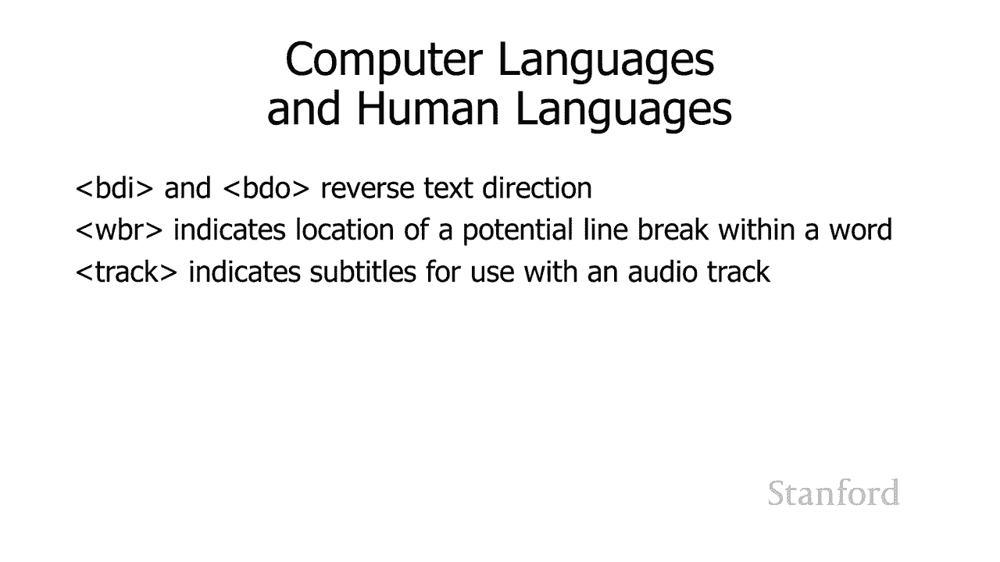

*   **`<p>`**：用于定义段落。
*   **`<article>`**：用于定义一篇文章，比如博客中的一篇帖子。
*   **`<section>`**：用于定义文档中的一个节。

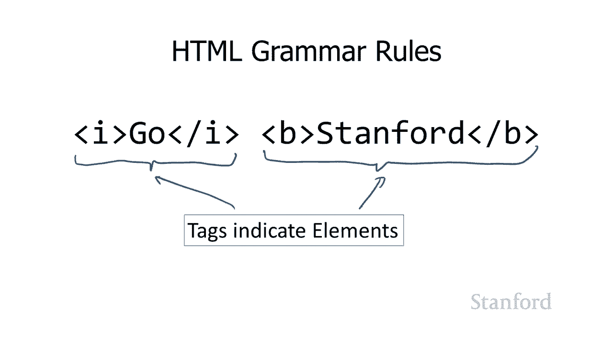

因此，虽然 HTML 有约 120 个元素，但其中很多并不常用，实际需要掌握的核心词汇量是适中的。

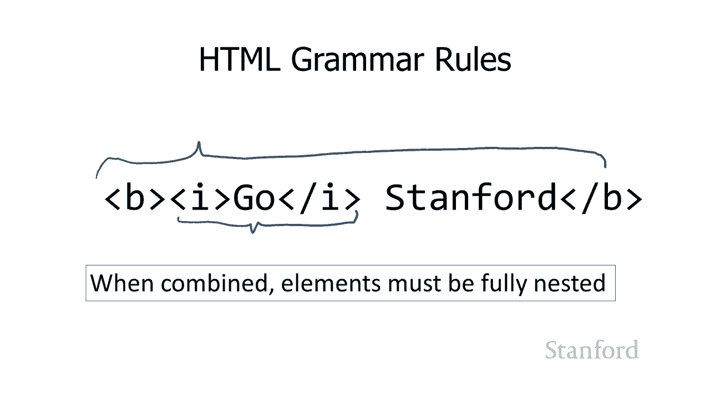

---

## HTML 的语法规则（句法）

我们已经学习了 HTML 的一些语法规则。在计算机科学中，这些规则被称为**语法**。

例如，我们了解到 HTML 使用**标记**（标签）来定义元素。一个元素通常由开始标签、内容和结束标签组成。

我们还学习了标签组合的规则：**标签必须完全嵌套**。这意味着如果一个斜体标签 `<i>` 在一个粗体标签 `<b>` 内部开始，那么它必须在同一个粗体标签内部结束。不能出现标签交叉的情况。

```html
<!-- 正确：完全嵌套 -->
<b>这是<b>粗体<i>和斜体</i></b>文本</b>

<!-- 错误：标签交叉 -->
<b>这是<b>粗体<i>和斜体</b></i>文本</b>
```

那么，关于如何嵌套元素，还有哪些更多的语法规则呢？

---

## 元素嵌套的类别规则

HTML 元素根据其用途被分为不同的类别，这决定了它们内部可以包含什么内容。在 HTML4 中，规则相对简单，可以作为一个很好的经验法则。

主要有两种类型的标签：

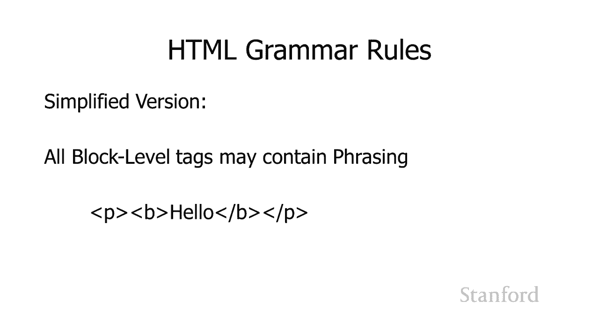

1.  **文本级标签**（或称行内标签）：用于修饰段落内的几个词或字母。
    *   例如：`<b>`（粗体）、`<i>`（斜体）、`<sub>`（下标）、`<sup>`（上标）。
2.  **块级标签**：用于创建文本块或结构块。
    *   例如：`<h1>`-`<h6>`（标题）、`<p>`（段落）、`<table>`（表格）、`<ul>`（列表）。

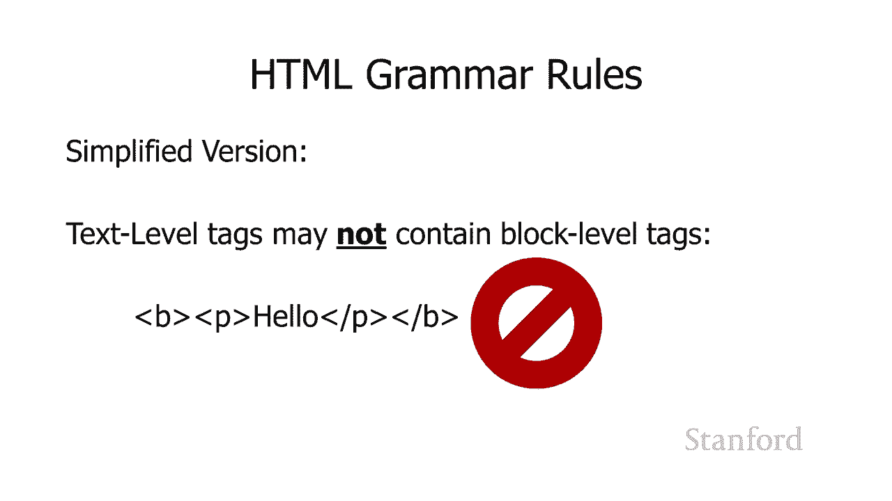

此外，还有一类**结构标签**，如 `<html>`、`<head>`、`<body>`，本次讨论暂不涉及。

基于此，我们引入两个关键概念：

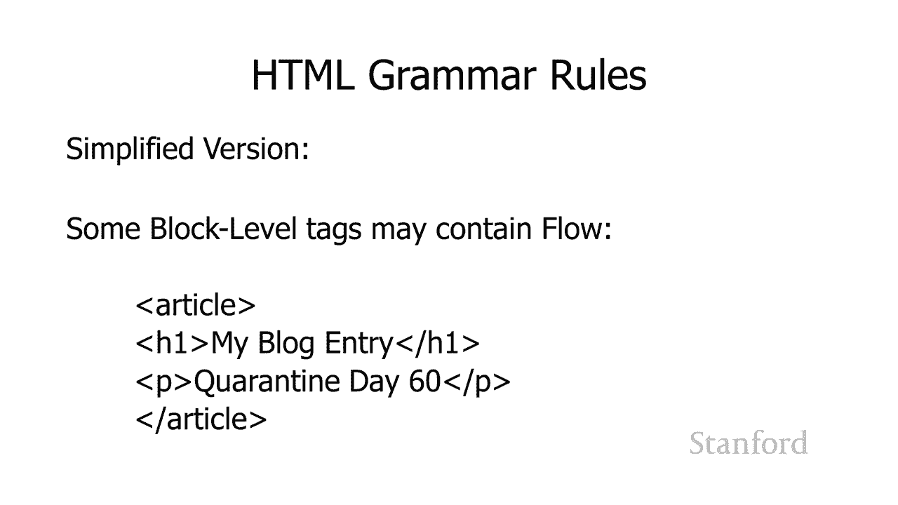

*   **短语内容**：可以包含文本和文本级标签。
*   **流内容**：可以包含短语内容以及所有的块级标签（即任何能在页面上创建实际内容的东西）。

由此可以得出一些嵌套规则：

*   **文本级标签只能包含短语内容**。这意味着你不能在 `<i>` 或 `<b>` 标签内放置一个段落 `<p>`。
*   **某些块级标签可以包含流内容**。例如，`<article>` 标签内部可以包含标题、段落、表格等任何内容。
*   **某些块级标签只能包含短语内容**。例如，`<h1>` 标题标签内部只能包含文本和文本级标签（如 `<i>`），但不能包含其他块级标签（如另一个 `<p>`）。

```html
<!-- 正确：<h1> 包含短语内容（文本和<i>） -->
<h1>斯坦福 <i>历史</i></h1>

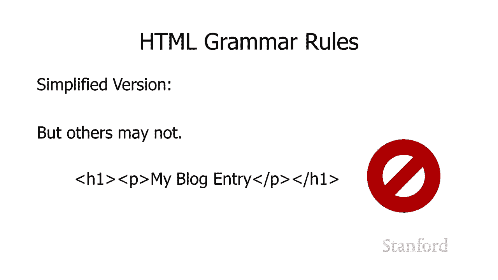

<!-- 错误：<h1> 试图包含块级内容（<p>） -->
<h1>斯坦福 <p>历史</p></h1>
```

然而，从 HTML5 开始，规则变得更加复杂。HTML5 引入了更多内容类别（如“标题内容”、“节内容”）。因此，要准确知道某个元素能包含什么，最可靠的方法是查阅官方文档或参考资料（如课程讲义附录 A）。

---

## 一个重要的语法细节：引号

另一个关键的语法规则是关于引号的使用。

请注意下面两对引号的区别：
`“Hello”` （弯引号） 与 `"Hello"` （直引号）

弯引号（“ ”）和直引号（" "）是不同的 Unicode 字符。**在 HTML 标签的属性值中，只允许使用直引号**。

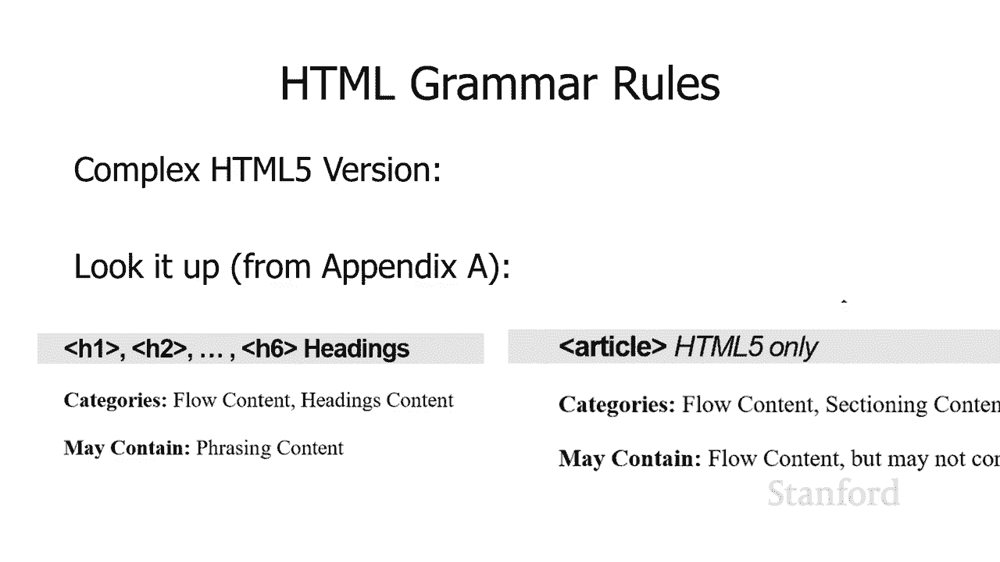

```html
<!-- 正确：使用直引号 -->
<a href="https://www.stanford.edu">Stanford</a>

<!-- 错误：使用弯引号（可能导致链接失效） -->
<a href=“https://www.stanford.edu”>Stanford</a>
```

弯引号通常由文字处理器（如 Microsoft Word）自动生成。因此，强烈建议使用纯文本编辑器或代码编辑器来编写 HTML，以避免引入这类不可见的语法错误。

---

## 验证你的 HTML

HTML 的语法规则看似很多，但底线是：**在发布网页前，务必使用验证器进行检查**。

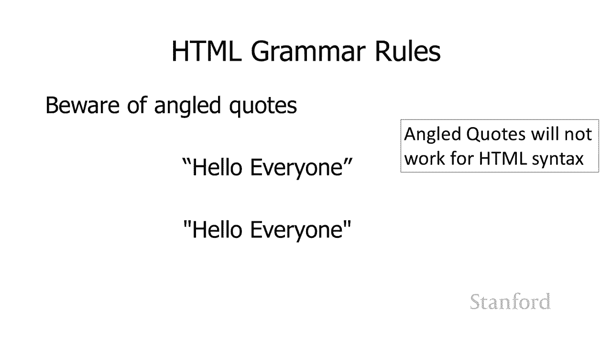

验证器（如 W3C Markup Validation Service）能够检测出各种语法问题，包括：
*   使用了非法的弯引号。
*   元素嵌套不符合 HTML5 规则。
*   标签未正确闭合。

通过验证器运行你的代码，可以确保其语法正确，从而在不同浏览器中都能正常显示。

---

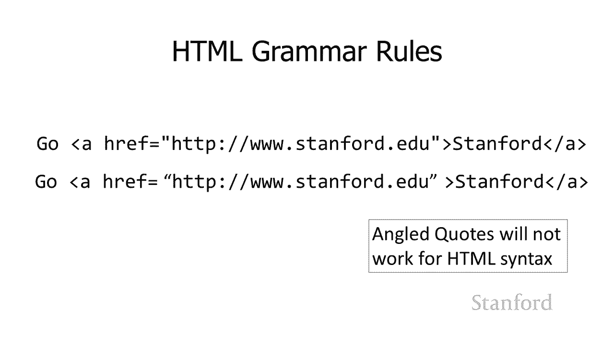

## 总结与预告

本节课中，我们一起学习了 HTML 的语法和词汇规则。我们了解到：
1.  HTML 的词汇量有限，核心元素数量适中。
2.  HTML 语法要求严格，标签必须正确嵌套和使用。
3.  元素根据类别（文本级、块级）有不同的内容模型规则。
4.  必须使用直引号来定义属性值。
5.  使用验证器是保证 HTML 语法正确的关键步骤。


下一节课，我们将开始学习**级联样式表**。掌握了 CSS 之后，我们将能够为网页添加丰富的样式和进行各种有趣的格式化，让网页真正变得生动起来。