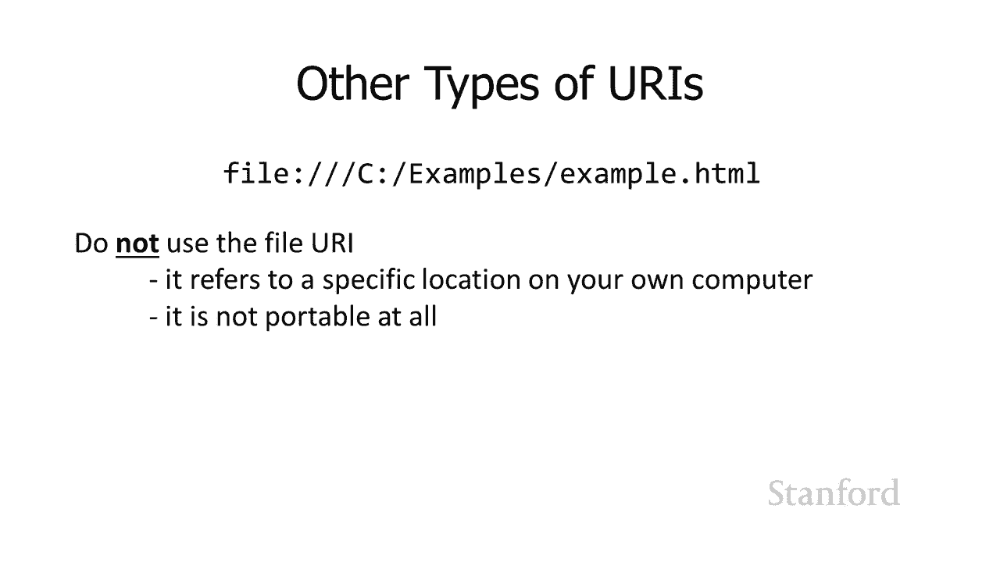

# L8.2：链接网页：制作链接 🔗

在本节课中，我们将学习网页制作的核心技术之一：创建超链接。我们将了解链接的基本原理、绝对引用与相对引用的区别，以及如何正确地在网页中实现它们。

## 概述

超链接是万维网（Web）的核心，它使得网页之间能够相互连接。本节课程将介绍如何在HTML中创建链接，重点讲解绝对引用和相对引用的概念、各自的优缺点以及适用场景。

## 链接的基本原理

上一节我们介绍了网页的基本结构，本节中我们来看看如何将不同的网页连接起来。链接是通过HTML中的 `<a>`（锚点）标签实现的。其基本语法是创建一个指向另一个网页的引用。

例如，一个指向 `another.html` 网页的链接代码如下：
```html
<a href="another.html">访问另一个网页</a>
```
这段代码表示，点击“访问另一个网页”这段文本，浏览器就会请求并跳转到 `another.html` 这个文件。

## 绝对引用与相对引用

在指定链接目标时，我们有两种主要方式：绝对引用和相对引用。理解它们的区别至关重要。

### 绝对引用

绝对引用包含了完整的路径信息，从协议（如 `http://` 或 `https://`）到服务器域名，再到具体的文件路径。

例如，一个指向斯坦福大学服务器上某个文件的绝对引用如下：
```
http://www.stanford.edu/another.html
```
这种引用方式明确指出了资源在互联网上的完整“地址”。

### 相对引用

相对引用则只指定相对于当前文件所在位置的目标文件路径。它省略了协议和服务器域名。

例如，如果 `example.html` 和 `another.html` 文件位于服务器的同一个文件夹下，链接可以简写为：
```
another.html
```
如果 `another.html` 位于当前目录下的一个名为 `articles` 的子文件夹中，引用则写为：
```
articles/another.html
```
在Web领域，无论底层操作系统如何，路径分隔符统一使用正斜杠 `/`。

## 如何选择：绝对引用 vs. 相对引用

那么，在实际创建网站时，我们应该使用绝对引用还是相对引用呢？以下是它们各自的优缺点。

### 相对引用的优势

使用相对引用有很多优势，这是我们优先考虑使用它的主要原因。

**1. 可移植性更强**
相对引用的最大优点是便于移植。如果网站内所有链接都使用相对引用，那么整个网站文件夹可以轻松地移动到另一台服务器或另一个目录，而所有内部链接依然有效。

**2. 代码更简洁**
相对引用更短，减少了需要键入的字符数量。这不仅编写起来更方便，也使得HTML文件体积更小，理论上能略微减少带宽消耗并提升加载速度。

### 绝对引用的适用场景

我们使用绝对引用的主要原因，是在需要链接到另一台Web服务器上的资源时。例如，从你的个人网站链接到 `nytimes.com` 上的一篇文章，就必须使用绝对引用，因为相对引用只能在同一个服务器内部使用。

## 关于URL和默认文件的补充说明

你可能会注意到，很多URL（如 `www.stanford.edu`）并没有指定具体的文件名。这是因为Web服务器通常配置了一个默认文件（最常见的是 `index.html`）。当访问一个目录路径时，服务器会自动提供该目录下的默认文件。

此外，我们常说的URL（统一资源定位符）实际上是URI（统一资源标识符）的一个子集。除了常见的 `http:` 和 `https:`，还有其他类型的URI，例如：
*   **`mailto:`**: 用于创建电子邮件链接。
*   **`ftp:`**: 用于文件传输协议。
*   **`file:`**: 用于指向本地计算机上的文件（**注意：在网页开发中应避免使用，因为它完全不可移植**）。

## 总结




本节课中我们一起学习了网页链接的创建。我们掌握了使用 `<a>` 标签制作链接的基本方法，深入理解了**绝对引用**和**相对引用**的核心概念与区别。记住，在网站内部链接时，优先使用**相对引用**以获得更好的可移植性和简洁性；只有在链接到外部网站时，才必须使用**绝对引用**。同时，我们也要避免使用 `file:` 这类不可移植的URI。在下一个视频中，我们将学习如何设计链接的样式，例如改变它的颜色和外观。