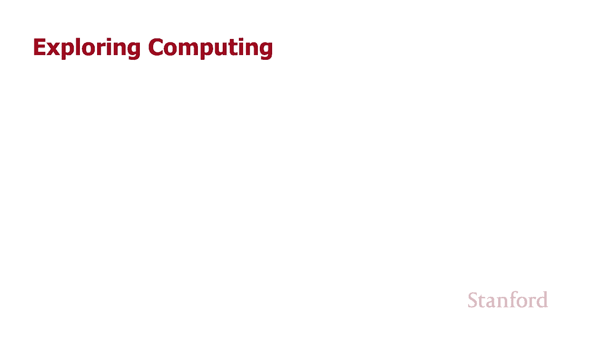
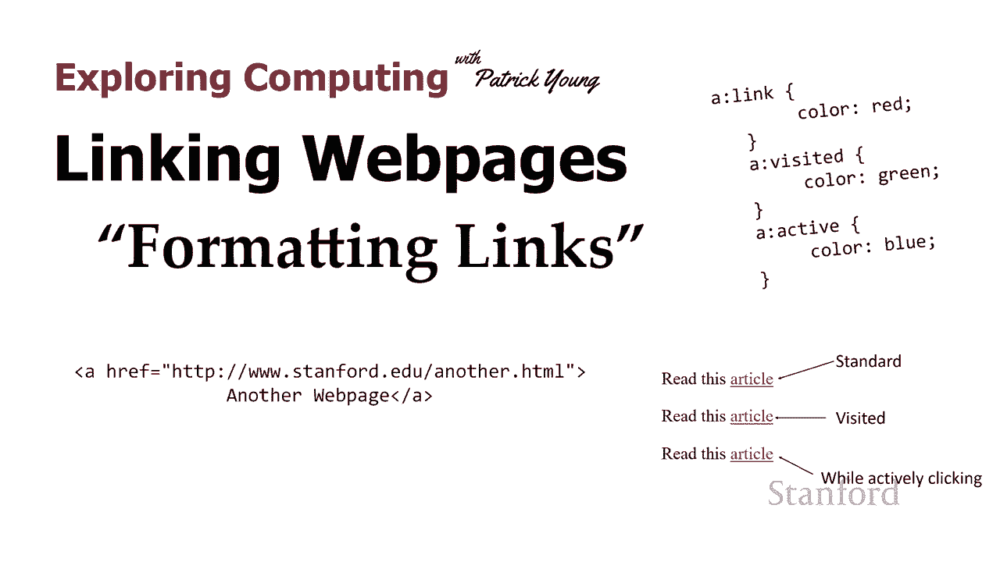
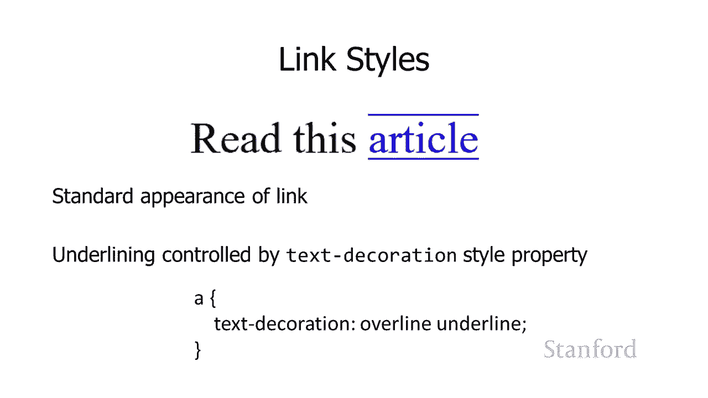
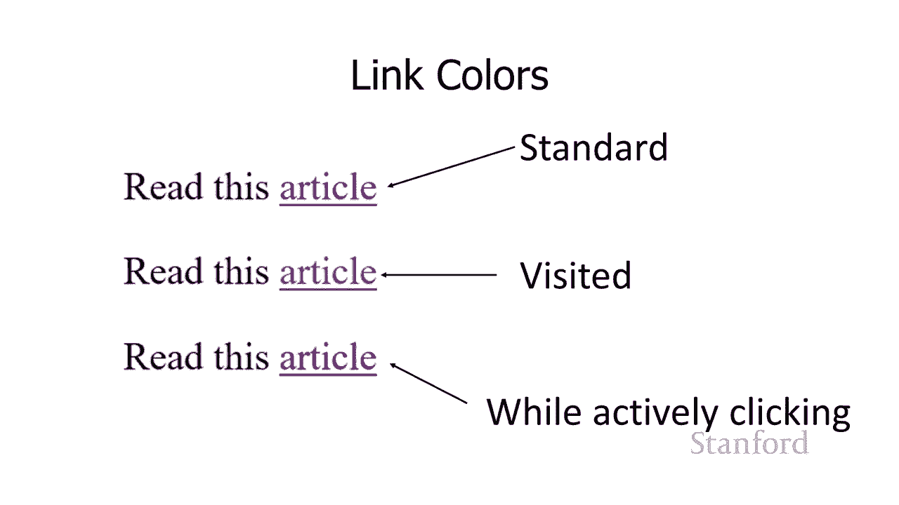
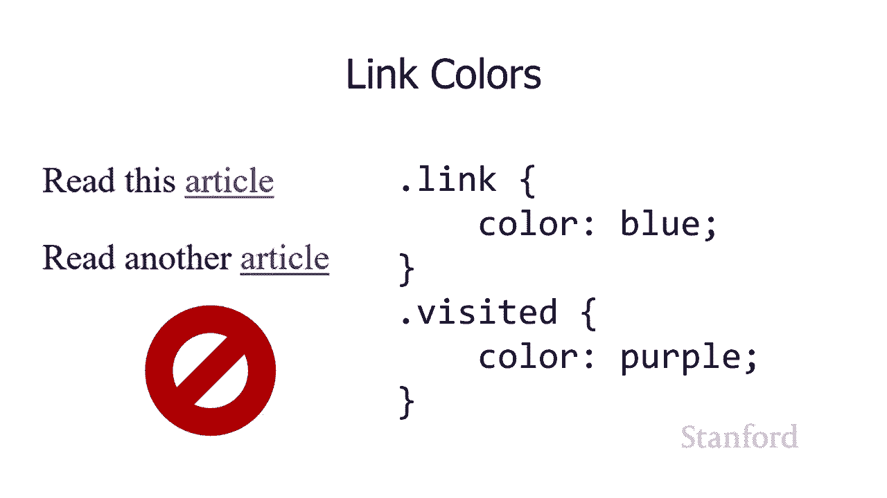
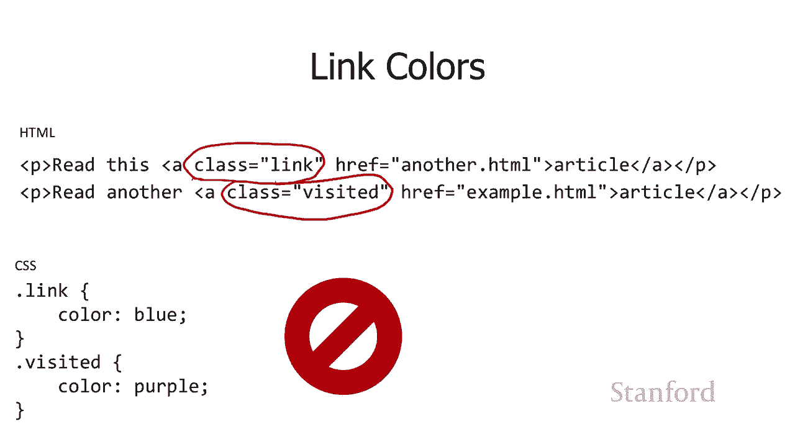
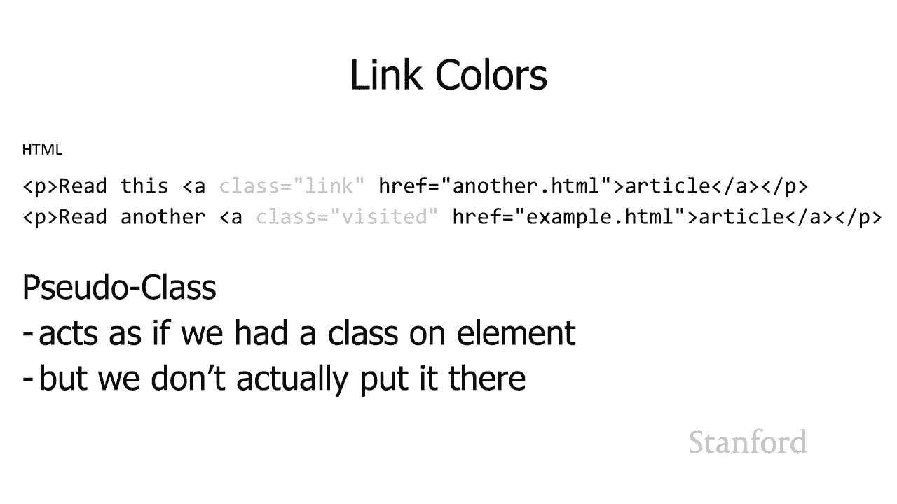
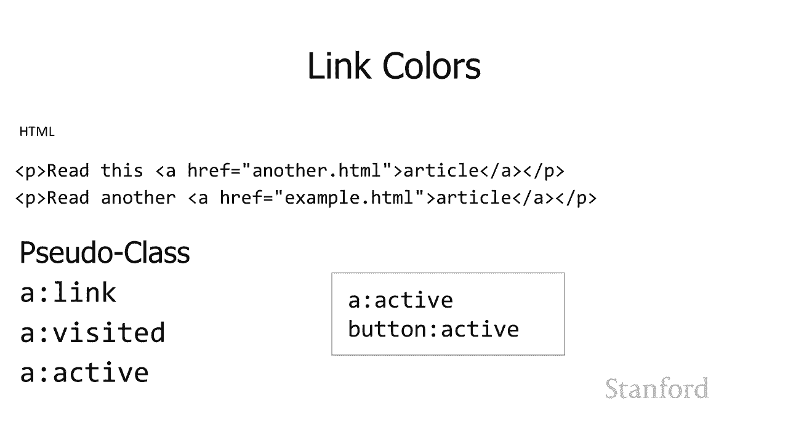
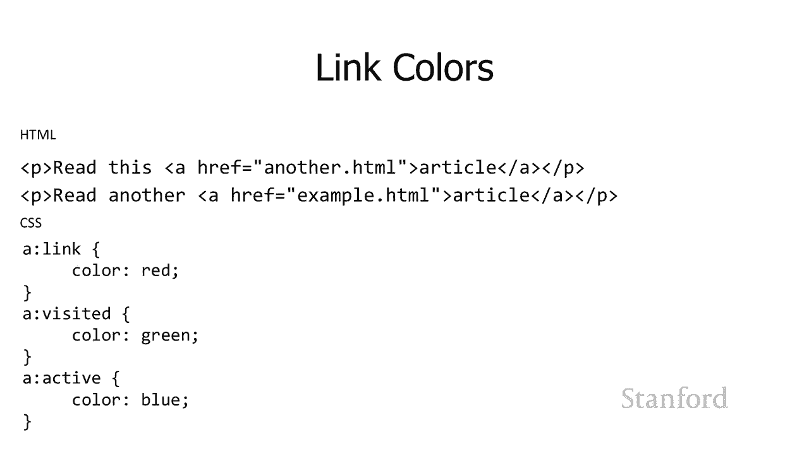
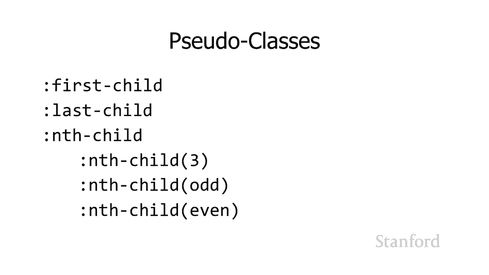

# L8.3：链接网页：格式化链接 🔗





## 概述
在本节课中，我们将学习如何格式化网页中的超链接。我们将重点介绍如何移除链接的下划线、如何改变链接的颜色，并引入一个强大的CSS概念——**伪类**，它允许我们根据用户与链接的交互状态（如是否访问过、是否正在点击）来应用不同的样式。

---

## 链接的默认样式与下划线
在上一节中，我们学习了如何使用 `<a>` 标签创建链接。本节中，我们来看看如何改变链接的默认外观。

默认情况下，链接通常带有蓝色和下划线。下划线由CSS的 `text-decoration` 属性控制。

如果你想移除链接的下划线，可以通过将 `text-decoration` 属性设置为 `none` 来实现。



**代码示例：**
```css
a {
  text-decoration: none;
}
```
这段CSS规则表示：所有的锚点元素（即链接）都不显示下划线。

但需要注意，下划线是向用户表明“这是一个可点击链接”的重要视觉线索。移除下划线可能会降低链接的**可供性**，即用户可能无法立即识别出哪些文本是链接。因此，如果移除了下划线，应考虑用其他方式（如颜色、背景）来突出显示链接。

你也可以反其道而行之，为其他非链接文本添加下划线，但这可能会造成混淆，因为用户习惯性地认为带下划线的文本就是链接。





---

## 链接的颜色状态
链接的颜色通常会根据其状态发生变化。标准链接有三种主要状态颜色：
1.  **未访问链接**：通常是蓝色。
2.  **已访问链接**：通常是紫色。
3.  **活动链接**：当鼠标按下（或手指触摸）但尚未释放时链接显示的颜色。



你可能会想为不同状态的链接设置不同的类，例如 `.link` 和 `.visited`。但这种方法行不通，因为网页服务器无法为每个用户动态生成不同的HTML（它不知道某个用户是否访问过某个链接）。

解决方案是使用CSS**伪类**。伪类由浏览器动态应用，它根据链接的当前状态自动为元素添加一个虚拟的“类”。

以下是链接的三种核心伪类：
*   `a:link`：用于选择所有未被访问过的链接。
*   `a:visited`：用于选择所有已被访问过的链接。
*   `a:active`：用于选择正在被激活（例如鼠标按下时）的链接。



**代码示例：**
```css
a:link {
  color: red; /* 未访问的链接显示为红色 */
}
a:visited {
  color: green; /* 已访问的链接显示为绿色 */
}
a:active {
  color: blue; /* 点击瞬间的链接显示为蓝色 */
}
```
请注意，伪类选择器前使用的是冒号 `:`，而不是类选择器使用的点 `.`。将 `a` 放在伪类前面是为了明确指出这些样式只应用于 `<a>` 标签，因为有些伪类（如 `:active`）也可能适用于按钮等其他元素。

---

## 其他有用的伪类
伪类的概念不仅限于链接，它还可以用于许多其他格式化场景，帮助我们选择特定条件下的元素。



以下是一些常用的伪类示例：
*   `:first-child`：选择父元素下的第一个子元素。
*   `:last-child`：选择父元素下的最后一个子元素。
*   `:nth-child(n)`：选择父元素下的第n个子元素。



例如，你可以使用 `:nth-child(odd)` 和 `:nth-child(even)` 来为表格创建斑马条纹效果，使奇数行和偶数行具有不同的背景色，从而提高可读性。

**代码示例：**
```css
tr:nth-child(odd) {
  background-color: lightgray;
}
tr:nth-child(even) {
  background-color: darkgray;
}
```

---




## 总结
本节课中，我们一起学习了如何格式化网页链接。我们掌握了如何通过 `text-decoration` 属性控制下划线，并理解了保持良好可供性的重要性。更重要的是，我们引入了**伪类**的概念，学会了使用 `:link`、`:visited` 和 `:active` 来根据链接状态设置不同颜色。最后，我们还了解到伪类可以广泛应用于其他元素，如 `:nth-child` 用于创建列表或表格的交替样式。这些工具能帮助我们创建更美观、交互更清晰的网页。