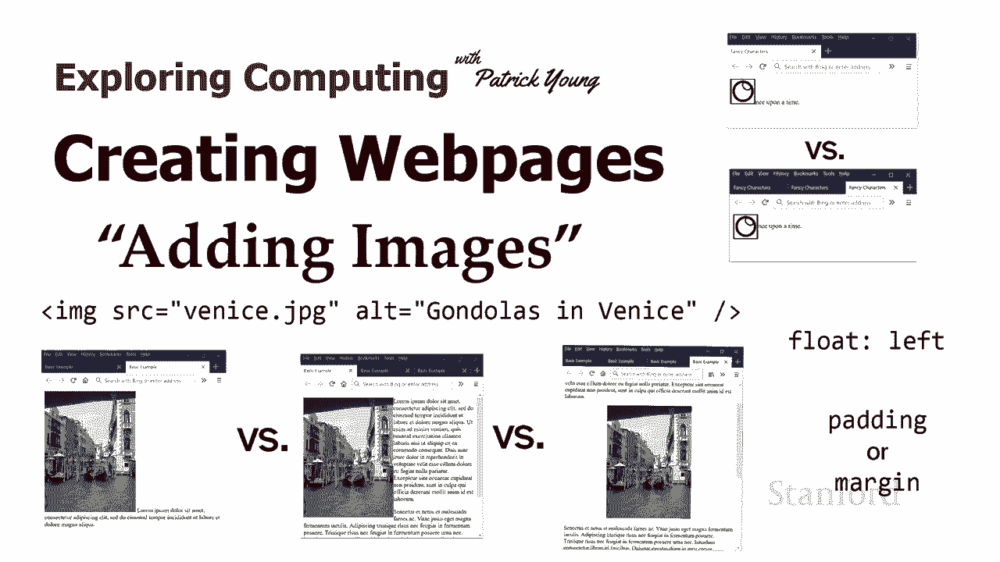
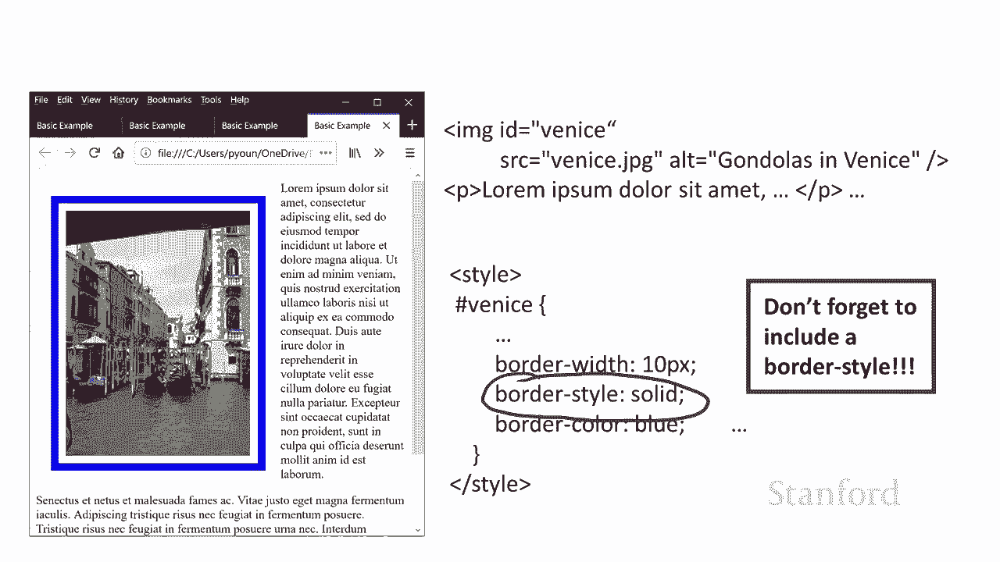
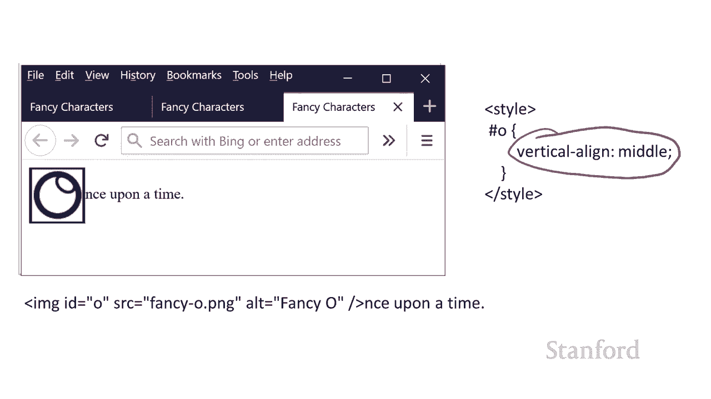

# 斯坦福CS105：L9.1：创建网页：图像 🖼️

在本节课中，我们将学习如何向网页中添加图像。图像是网页设计的重要组成部分，它们能让网页内容更加生动和吸引人。我们将从最基本的图像标签开始，逐步探讨如何控制图像在页面上的位置、大小以及与其他元素的交互方式。



## 概述

在之前的课程中，我们学习了如何创建网页和添加超链接。虽然链接很重要，但如果网页只有文本会显得单调。因此，本节课程将重点介绍如何向网页中添加图像。我们将学习使用 `` 标签，并探讨如何通过CSS样式来控制图像的布局和外观。

## 添加图像的基本方法

向网页中添加图像需要使用 `` 标签。这是一个独立的标签，没有对应的结束标签。

以下是添加图像的基本语法：

```html

```

*   **`src` 属性**：这是“source”（源）的缩写，用于指定图像文件的路径。路径可以是相对路径（如 `venice.jpg`），也可以是绝对URL。
*   **`alt` 属性**：这是“alternative text”（替代文本）的缩写。它有两个主要作用：一是为使用屏幕阅读器的视障用户描述图像内容，提升网页可访问性；二是当图像无法加载时，会显示这段文本。为图像提供 `alt` 属性是编写合法HTML的要求。

## 图像与文本的默认布局

当我们简单地将 `` 标签放入一段文本中时，图像会像一个大号的字符一样嵌入在行内。

例如，以下代码：

```html
<p>从前有一个...</p>
```

在浏览器中，图像会与文本的基线对齐，并占据一行中的空间，就像文本的一部分。这通常不是我们想要的布局效果。

## 使用浮动控制图像位置

为了使文本能够环绕在图像周围，我们可以使用CSS的 `float` 属性。

以下是实现文本环绕图像的关键步骤：

1.  为图像标签添加一个 `id` 或 `class`，以便通过CSS选择它。
2.  在CSS中为该选择器设置 `float: left;` 或 `float: right;` 属性。

例如，要让一张威尼斯图片浮动在左侧，CSS规则如下：

```css
#venice {
    float: left;
}
```

**重要提示**：在HTML源代码中，`` 标签必须放在你希望环绕它的**文本内容之前**。浏览器会按照源代码顺序处理元素，浮动元素之后的文本才会环绕它。

## 使用边距、边框和内边距

为了让图像与周围文本之间有适当的空间，或者为图像添加装饰，我们可以使用CSS的盒模型属性。

盒模型主要包括三个属性，它们围绕在元素内容周围：
*   **`margin` (外边距)**：元素边框外部的透明区域，用于控制与其他元素的距离。
*   **`border` (边框)**：围绕元素内容和内边距的线。
*   **`padding` (内边距)**：元素内容与边框之间的透明区域。

我们可以为图像统一设置这些属性，也可以分别控制四个方向（上、右、下、左）。

例如，为图像添加一个蓝色边框和周围的空间：

```css
#venice {
    float: left;
    margin: 15px; /* 四周的外边距均为15像素 */
    border: 10px solid blue; /* 10像素宽的实心蓝色边框 */
    padding: 10px; /* 边框与图片内容之间的内边距为10像素 */
}
```

**关于边框的注意事项**：设置边框时，必须指定 `border-style`（边框样式，如 `solid`、`dashed`）。如果只设置了 `border-width` 和 `border-color` 而没有设置 `border-style`，边框将不会显示，因为默认样式是 `none`。

## 将图像作为独立块级元素显示

有时，你可能不希望文本环绕图像，而是希望图像单独占据一行，显示在段落之间。默认情况下，单独的 `` 标签是行内元素，这可能会带来一些布局限制。

一个更好的方法是将图像包裹在一个 `<div>` 块级元素中，然后对这个 `<div>` 进行样式控制。



例如，要使图像在页面中居中显示：

```html
<div id="venice-container">
    
</div>
```

```css
#venice-container {
    text-align: center; /* 使div内的行内内容（如图像）居中 */
}
```

直接对 `` 标签使用 `text-align: center;` 是无效的，因为该属性通常只对块级容器内的内容起作用。

## 图像的垂直对齐

当图像作为行内元素与文本混排时，我们可以使用 `vertical-align` 属性来调整图像相对于文本行的垂直位置。

常见的值包括：
*   `baseline`：默认值，与文本基线对齐。
*   `middle`：与文本的中线对齐。
*   `top`：与行中最高元素的顶部对齐。
*   `bottom`：与行中最低元素的底部对齐。

例如，将图像与文本垂直居中对齐：

```css
#big-o {
    vertical-align: middle;
}
```

## 总结




在本节课中，我们一起学习了如何向网页中添加和美化图像。我们从最基本的 `` 标签及其必要属性 (`src`, `alt`) 开始。接着，我们探讨了如何使用 `float` 属性实现文本环绕图像的经典布局，并学习了如何用 `margin`、`border` 和 `padding` 来控制图像周围的间距和外观。我们还了解了将图像放入 `<div>` 中以实现更灵活布局（如居中）的方法，以及使用 `vertical-align` 微调图像与文本的垂直对齐方式。掌握这些技巧，你就能创建出图文并茂、布局美观的网页了。