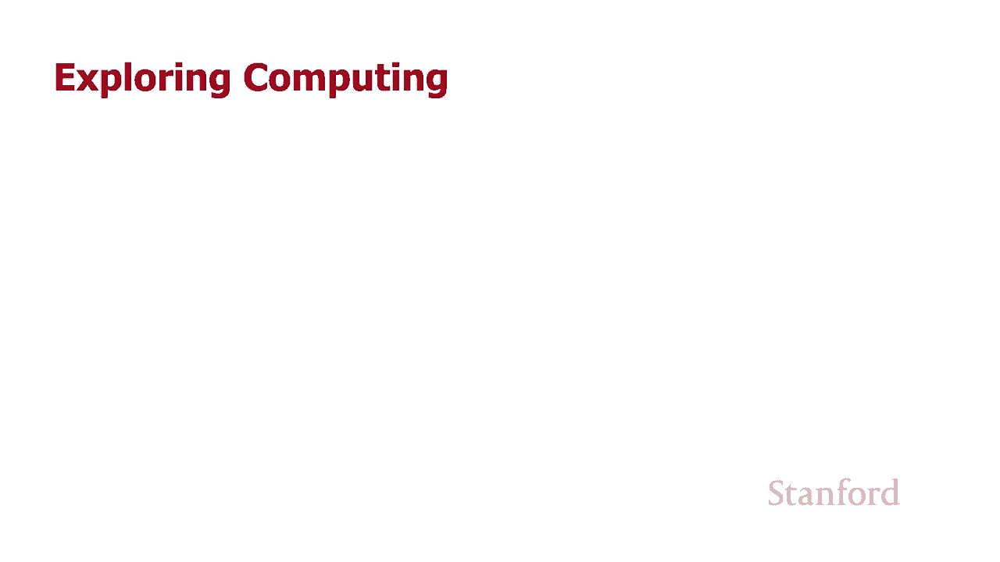
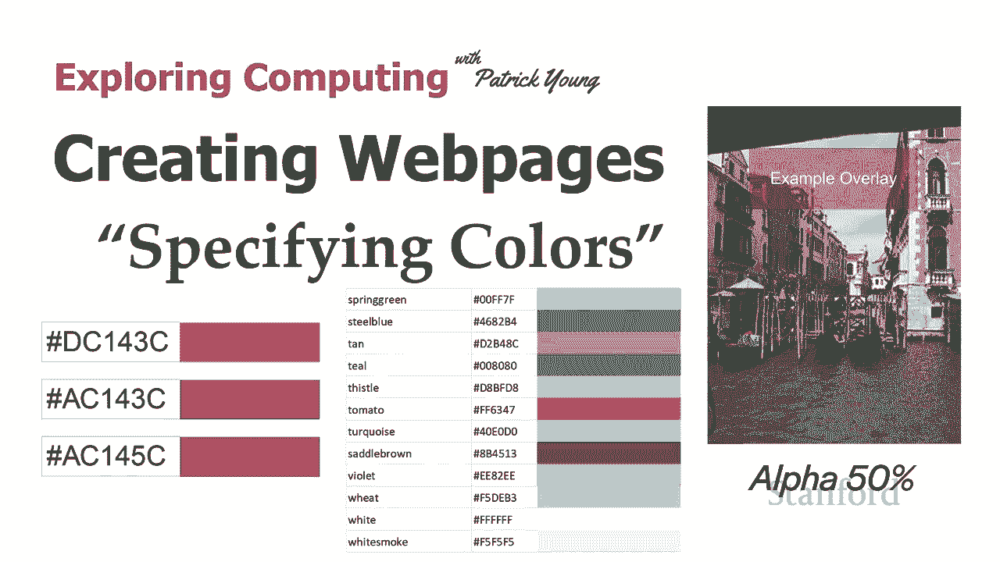
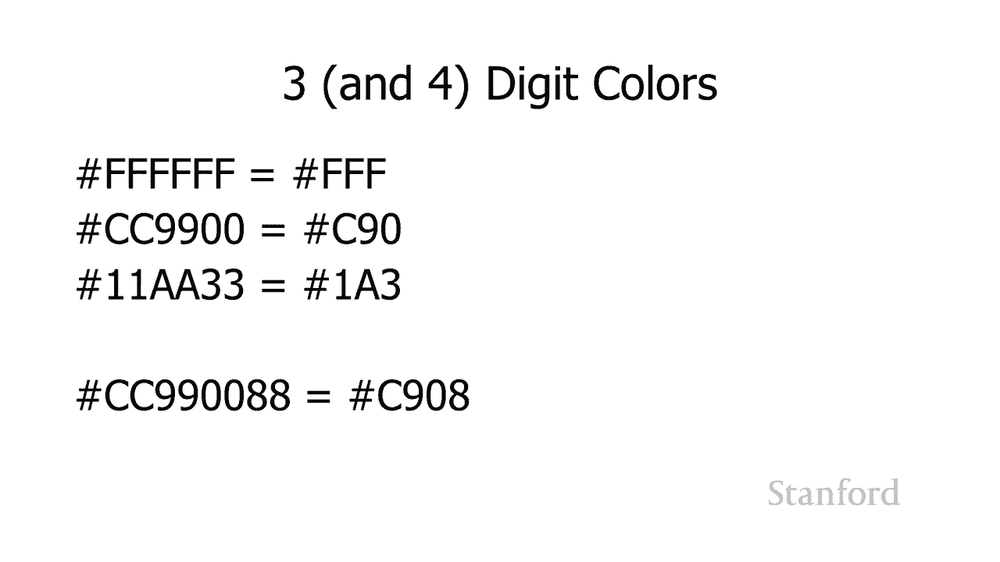
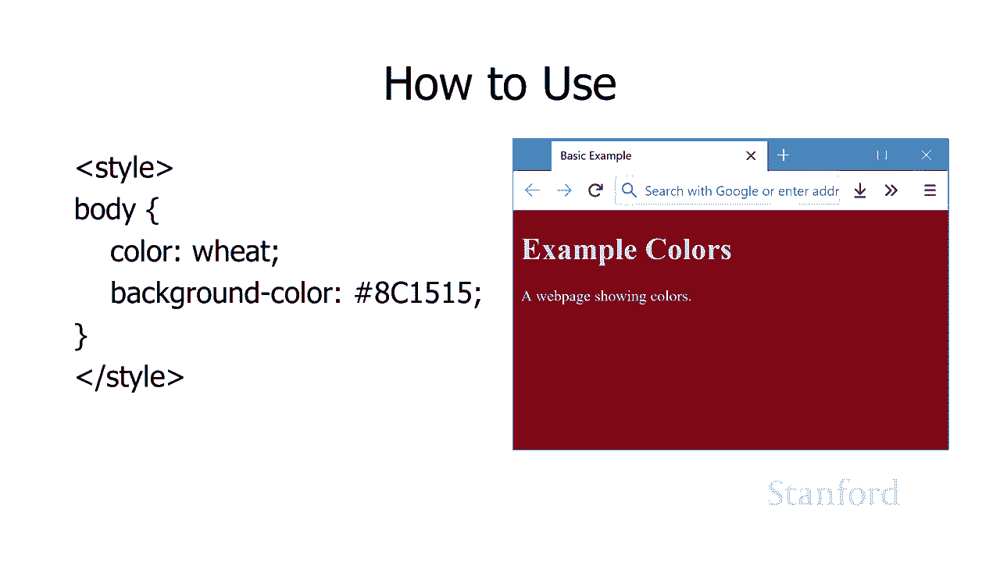
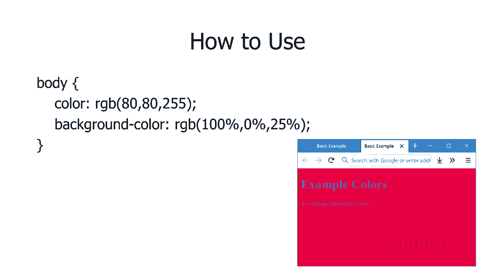

# 斯坦福CS105：计算机科学导论：L9.2：创建网页：指定颜色 🎨

在本节课中，我们将学习如何在网页上指定颜色。我们将回顾颜色的基本原理，了解不同的颜色表示方法，并学习如何在HTML和CSS中实际应用它们。

## 概述

在网页设计中，颜色是至关重要的元素。本节课程将介绍如何在网页上指定颜色，包括使用十六进制、RGB、命名颜色以及透明度（Alpha）等不同方式。理解这些概念将帮助你创建更美观、更具吸引力的网页。

## 颜色的历史与基础

上一节我们介绍了十六进制数字，这对于在网页上使用颜色至关重要。计算机通过混合红、绿、蓝（RGB）三种颜色的光来生成屏幕上每个像素的颜色。当我们指定颜色时，实际上是在指定红、绿、蓝三种颜色的强度。

早期，网页设计面临颜色显示不一致的问题。当时，计算机显示器可能只支持256种颜色，而不同制造商无法就这256种颜色达成一致。最终，所有制造商都同意的只有211种颜色，这些颜色被称为“网络安全色”。不过，对于现代计算机显示器或移动设备而言，这已不再是问题，因为它们通常能显示1670万种或更多颜色。

## 命名颜色与CSS3

目前，我们有148种预定义的命名颜色。这些颜色有时被称为CSS3颜色，因为它们是级联样式表3（CSS3）标准的一部分。CSS3是CSS的一个扩展版本，包含了一套扩展的颜色关键字。此外，还有基于标量矢量图形（SVG）的颜色标准。

虽然命名颜色使用方便，但它们只提供了148种选择，远不及完整的1670万色调色板。因此，它们更适合快速原型设计或当需要特定知名颜色时使用。

## 十六进制颜色表示法

在网页上，颜色传统上使用十六进制数表示。回忆我们之前关于计算机使用24位或32位颜色表示法的讨论：颜色通过混合红、绿、蓝光来表示，每种颜色对应一个字节（8位），其十进制值范围是0到255，十六进制值范围是00到FF。

在网页代码中，颜色通常表示为以`#`开头的六位十六进制数。例如，深红色可以表示为 `#DC143C`。这六位数字中，前两位代表红色分量，中间两位代表绿色分量，最后两位代表蓝色分量。

理解十六进制表示法的关键在于能够调整这些数字。例如，如果你觉得 `#DC143C` 中的红色太多，你可以减少红色分量的值，比如改为 `#AC143C`，这样就会得到一个更暗的红色。同样，你可以调整绿色或蓝色的值来微调颜色。

## 透明度（Alpha通道）

除了红、绿、蓝，我们还可以指定第四个值来控制透明度，在计算机科学中通常称为Alpha通道。它表示不透明度（阻挡光线的程度）或透明度（允许光线通过的程度）。

在八位十六进制颜色表示中（如 `#8C1515FF`），最后两位 `FF` 代表Alpha值。`FF` 表示完全不透明，而 `00` 表示完全透明。通过调整这个值，例如从 `FF` 降到 `80`（大约50%不透明度），你可以让背景元素透过颜色显示出来，从而实现叠加效果。

## 简写的十六进制表示

为了书写简便，CSS也支持三位或四位十六进制颜色表示法。

*   **三位表示法**：当六位十六进制数的每两位都相同时，可以简写为三位。例如，`#FFCC00` 可以简写为 `#FC0`。但请注意，这会将颜色精度从24位（1670万色）降低到12位（4096色）。
*   **四位表示法**：在三位简写的基础上加上一位Alpha值。例如，`#FFCC0080`（50%不透明的橙色）可以简写为 `#FC08`。

## 在网页中使用颜色

现在，我们来看看如何在网页中实际应用这些颜色规范。以下是在CSS样式表中指定颜色的几种常见方式。

以下是几种在CSS中指定颜色的方法示例：

1.  **使用命名颜色**：直接使用预定义的颜色名称，如 `wheat`。
2.  **使用十六进制**：最传统的方式，如 `#8c1515`。
3.  **使用RGB函数**：可以避免直接使用十六进制。
    *   使用百分比：`rgb(50%, 20%, 80%)`
    *   使用0-255的十进制数：`rgb(128, 0, 255)`
4.  **使用RGBA函数（包含Alpha）**：在RGB基础上增加透明度，如 `rgba(128, 0, 255, 0.5)` 表示50%不透明度。
5.  **使用HSL/HSLA函数**：使用色相、饱和度、亮度来定义颜色，这在选择配色方案时非常有用，我们将在后续课程中详细讨论。

## 总结

本节课中，我们一起学习了在网页上指定颜色的多种方法。我们从颜色的历史与计算机显示原理出发，了解了命名颜色、十六进制表示法、RGB表示法以及透明度（Alpha通道）的应用。掌握这些知识，特别是理解如何通过调整十六进制值来微调颜色，将使你能够更自信地在网页设计中运用色彩，创造出更丰富、更专业的视觉效果。