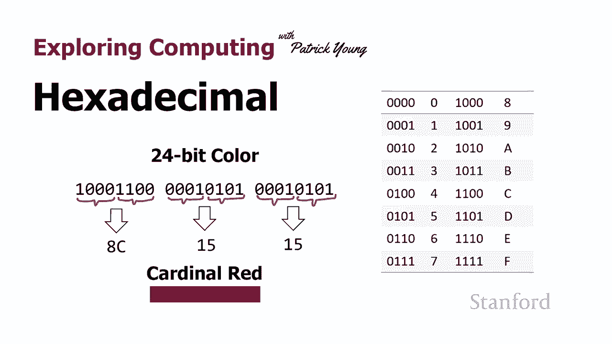
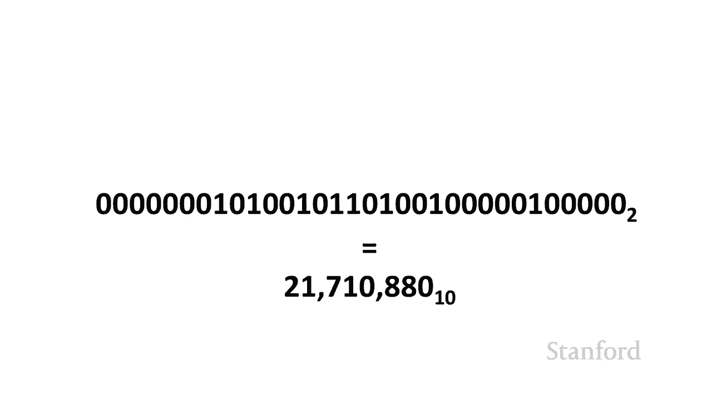
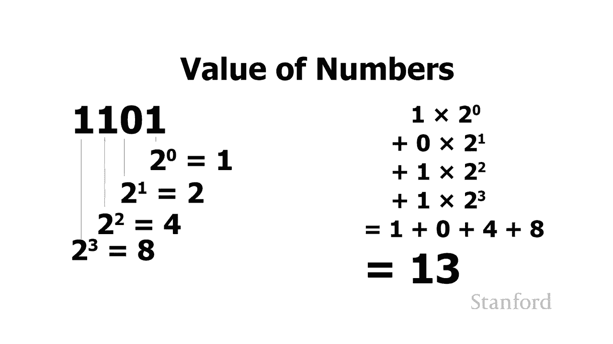
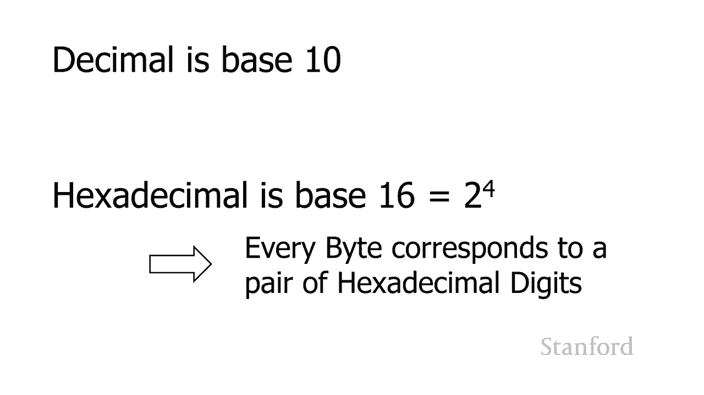
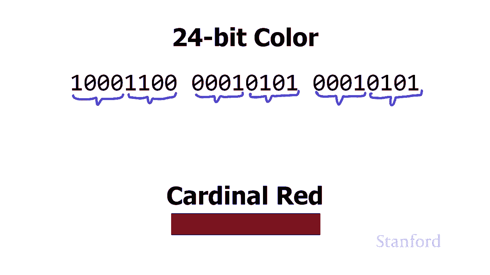
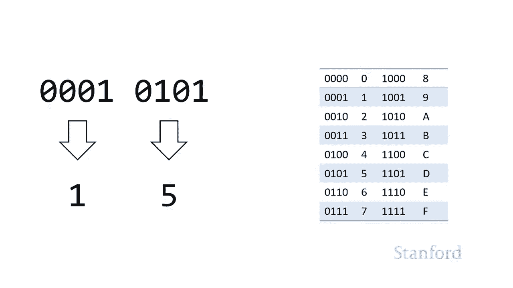
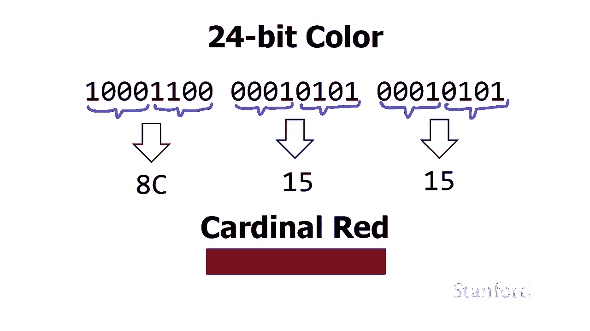
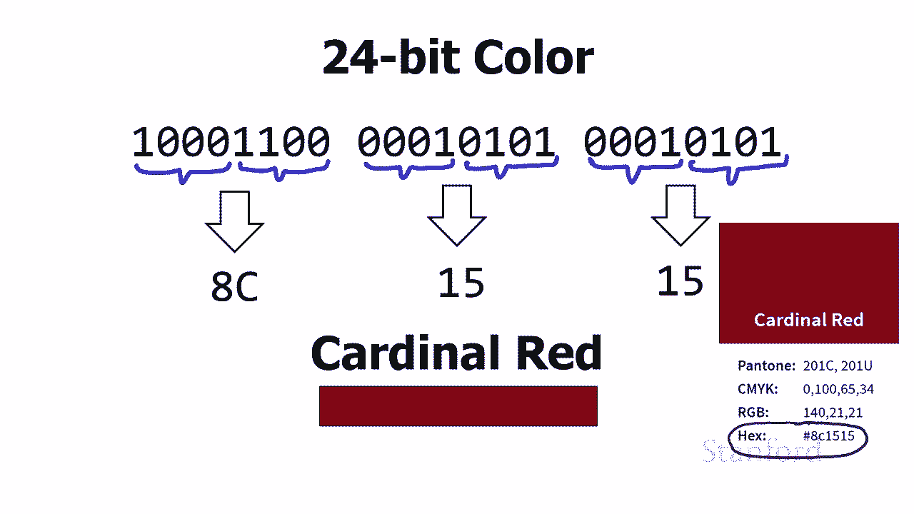
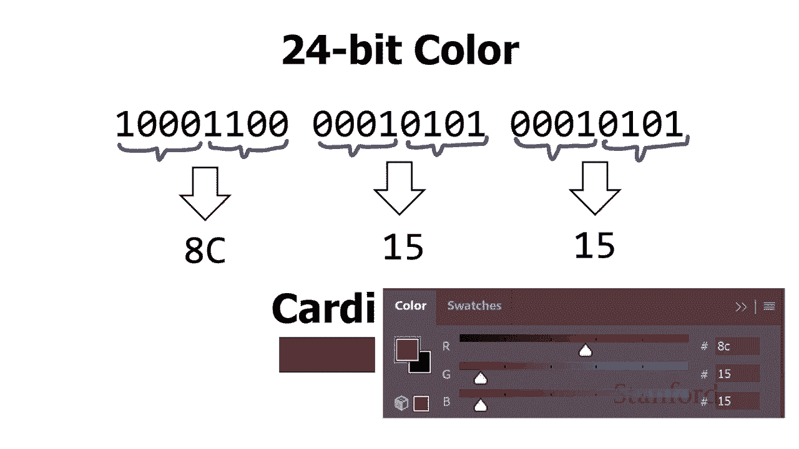

# 计算机科学导论：L9.3：十六进制 🔢

在本节课中，我们将要学习十六进制数字系统。我们将了解为什么计算机科学中广泛使用十六进制，它与二进制和十进制的关系，以及如何在不同进制之间进行转换。

## 概述

计算机内部的一切操作都是使用二进制完成的。然而，二进制表示法有时显得冗长且容易出错。因此，除了二进制和十进制，计算机还经常使用十六进制数字系统。在实际使用计算机时，你更可能看到十六进制而不是二进制，因为二进制真的很难直接阅读和使用。

## 什么是十六进制？

上一节我们介绍了二进制和十进制，本节中我们来看看十六进制。十六进制是基数为16的数字系统。我们之前已经看到，二进制是基数2，因此只有两个数字：0和1。十进制是基数10，所以有0到9这十个数字。十六进制则需要十六个数字，但我们没有现成的十六个独立数字符号。

为了解决这个问题，我们借用了字母A到F。

以下是十六进制中使用的所有数字：
*   0, 1, 2, 3, 4, 5, 6, 7, 8, 9
*   A (代表十进制10)
*   B (代表十进制11)
*   C (代表十进制12)
*   D (代表十进制13)
*   E (代表十进制14)
*   F (代表十进制15)

## 为什么使用十六进制？

考虑一个二进制数字序列，例如MIPS CPU的一条指令：`00001000110011001100110011001100`。将其视为二进制存在一些问题：它很长、笨拙，并且很容易在阅读或抄写时出错，例如意外地混淆0和1，或者漏掉某一位。

我们想要一种更紧凑的表示方式。当然，我们可以将其转换为十进制，这个二进制数等价于十进制数 **21,710,880**。这相当紧凑，但从二进制转换到十进制很麻烦，从十进制转换回二进制更是如此。

有许多与二进制相关的数字系统比十进制工作得更好，例如八进制和十六进制。它们之所以更好，是因为它们的基数是2的幂次方。

*   八进制的基数是8，而 **2³ = 8**。
*   十六进制的基数是16，而 **2⁴ = 16**。

基数8、16与基数2之间存在自然的数学关系，而基数10和2之间则没有。因为16是2的四次方，所以**每4位二进制数恰好对应一个十六进制数字**。这提供了一个自然的转换断点。相比之下，我们无法用十进制做到这一点，因为10不是2的整数次幂。

## 二进制到十六进制的转换

现在，让我们看看如何将二进制数转换为十六进制。这个过程比转换为十进制要简单快捷得多。

以下是将二进制数分解为四位一组并转换为十六进制数字的方法：

1.  从右向左，将二进制数每四位分成一组。如果最左边一组不足四位，可以在前面补零。
2.  参照转换表（或心算），将每一组四位二进制数转换为对应的十六进制数字。
3.  将这些十六进制数字组合起来，就得到了最终的十六进制数。

为了方便转换，你可以使用下面这个表格：

| 四位二进制 | 十进制值 | 十六进制数字 |
| :--- | :--- | :--- |
| 0000 | 0 | 0 |
| 0001 | 1 | 1 |
| 0010 | 2 | 2 |
| 0011 | 3 | 3 |
| 0100 | 4 | 4 |
| 0101 | 5 | 5 |
| 0110 | 6 | 6 |
| 0111 | 7 | 7 |
| 1000 | 8 | 8 |
| 1001 | 9 | 9 |
| 1010 | 10 | A |
| 1011 | 11 | B |
| 1100 | 12 | C |
| 1101 | 13 | D |
| 1110 | 14 | E |
| 1111 | 15 | F |

### 实践示例：颜色代码

让我们用一个24位颜色值的例子来实践一下。斯坦福大学官方的主色调红色（Cardinal Red）的二进制表示如下：

`10001100` `00010101` `00010101`
(红色分量) (绿色分量) (蓝色分量)

我们将每个字节（8位）拆分成两个四位组：

1.  红色分量 `10001100`：
    *   第一组 `1000` -> 查表为 **8**
    *   第二组 `1100` -> 查表为 **C**
    *   所以红色分量的十六进制是 **8C**。

2.  绿色分量 `00010101`：
    *   第一组 `0001` -> 查表为 **1**
    *   第二组 `0101` -> 查表为 **5**
    *   所以绿色分量的十六进制是 **15**。

3.  蓝色分量 `00010101`：
    *   与绿色分量相同，所以是 **15**。

因此，斯坦福红的十六进制颜色代码是 **#8C1515**。这正是你在网页设计或Photoshop等工具中会看到的表示方式。每个字节（8位）对应一对十六进制数字，这使得表示非常紧凑和规整。

## 十六进制的应用与识别

十六进制在计算机领域应用广泛。除了颜色代码，你还会在以下场景中遇到它：

*   **网络物理地址（MAC地址）**：形如 `00-1A-2B-3C-4D-5E`，用于唯一标识网络设备。
*   **内存地址**：在调试或系统错误信息中，内存地址常以十六进制显示。
*   **机器码与调试信息**：程序崩溃时产生的错误代码或内存转储经常包含十六进制数字。

如何识别一个数字是十六进制呢？有两个常见线索：

1.  数字中包含了字母 **A到F**（大小写均可）。例如：`1F3A`、`c0ffee`。
2.  在编程和系统表示中，十六进制数常以前缀 **`0x`** 开头。例如：`0x1F3A`、`0xC0FFEE`。

需要注意的是，有时以单个 **`0`** 开头的数字表示八进制数（基数为8）。例如，`012`在八进制中代表十进制的10。

## 总结

本节课中我们一起学习了十六进制数字系统。我们了解到，由于二进制表示冗长易错，而十进制与二进制转换不便，因此计算机科学中引入了十六进制。十六进制基数为16，使用数字0-9和字母A-F表示。它的核心优势在于与二进制的天然对应关系：**每四位二进制数可以直接转换为一位十六进制数**。我们学习了通过“四位一组”查表法进行二进制到十六进制的转换，并探讨了十六进制在颜色代码、网络地址、内存寻址等领域的实际应用，以及如何通过包含A-F字母或`0x`前缀来识别十六进制数。掌握十六进制将帮助你更轻松地理解计算机底层的数据表示。