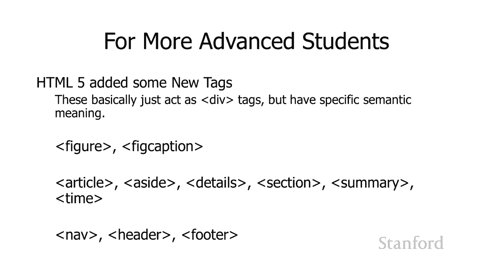

# L9.4：网页示例教程

## 概述

在本节课中，我们将通过一个综合性的网页示例，将之前学到的HTML与CSS知识整合在一起。我们将探讨如何选择合适的选择器、决定样式表的位置、使用`<div>`进行布局，并学习如何让网页在浏览器中居中显示。

---

## 核心概念与样式设置

我们将首先介绍本示例涉及的关键主题。您可能会疑惑如何决定使用类型选择器、类选择器还是ID选择器。我们将在实际操作中看到它们的应用。

您可能还想知道应该使用外部样式表还是内部样式表。我们将看到两者的示例。

在实际操作中，我们还将了解如何以各种不同的方式使用`<div>`元素。

您会注意到此特定网页位于Web浏览器的中心，我们将向您展示如何实现这一点。

### 设置标题字体

我们要做的第一件事是将所有标题的字体设置为无衬线体（sans-serif）。

我们将在本季度晚些时候讨论网页设计时详细讨论无衬线体，但目前您可以看到顶部有衬线的标准外观和底部无衬线外观之间的区别。底部看起来更干净一些。

我们想要应用到所有标题的设计选择，这意味着我们需要使用类型选择器。

以下是我们使用的类型选择器代码，它将字体系列设置为无衬线体：
```css
h1, h2, h3 {
  font-family: sans-serif;
}
```

### 内部与外部样式表的选择

接下来的问题是，这个样式应该放在内部还是外部样式表中？

考虑内部与外部的方式是：这是一种您可能希望在整个网站中为所有网页使用的特定样式，还是仅针对当前这个网页的特定样式？

现在，我们可能希望网站上的所有标题看起来都一样，所以这应该放在一个外部样式表中。

---

## 具体元素样式设计

### 主标题（h1）样式

如果您看那个`<h1>`，您会注意到`<h1>`是页面顶部的最大尺寸标题，通常位于页面顶部。您会看到它居中，我已经更改了颜色。它原本是灰色的，但很单调。我已经更改了颜色，它们现在都是灰色的。

我是这样做的：我将背景颜色设置为灰色，将前景（文字）颜色设置为白色。我还将文本对齐设置为居中。这就是居中的方式。我已将字体大小设置为我选择的特定值，而不是使用Web浏览器的默认设置。我还将内边距（padding）设置为10像素。

让我们仔细看看此处的10像素。将`padding`设置为10像素与将`margin`设置为10像素有什么区别？

这里我们只关注该标题的中心，我们可以看到差异。请注意顶部，我们实际注意到文字上方和下方有很多灰色。而底部设置只是将`margin`设置为10像素，而不是10像素的`padding`，结果是一个更薄的灰色边框。

这里发生的事情是：背景颜色基于`padding`。所以当我们将`padding`设置为10像素时，背景颜色包含并覆盖了那10个像素。如果我们将`margin`设置为10像素，这是边框外的内容，我们实际上并没有在这里绘制边框，但基本上背景颜色不会覆盖边框外的任何内容，包括`margin`。这就是为什么它看起来不同。

假设我们希望这个`<h1>`样式应用于我们网站上的所有网页，我们可能会这样做，将它放在一个外部样式表中。

### 其他标题样式

我们已经完成了这里的标题设置。`<h2>`在它们的上方和下方都有线条，所以我们用`text-decoration`来设置它。我们已经将`<h3>`设置为斜体。我们再次希望在我们所有的网页上都这样，所以使用外部样式表。

### 署名部分样式

如果您看左下角，您会看到一个很小的文本，在实际的网页上有点难以阅读。它仍然很小，但如果我们放大它是可读的。

这归功于我实际获取文本的地方。照片是我的，但该文本是从维基百科中获取的。

首先有几个问题要问：我应该为此使用`<div>`，还是应该使用一个段落（`<p>`），还是应该使用其他东西？我应该为此使用一个类还是一个ID？

在这种特殊情况下，我认为没有正确的答案。我使用了一个段落，但是如果您想使用一个`<div>`，也可以。

我给它一个ID，因为我假设网页上只有一个署名。但如果您认为可能想在其他地方也使用这个署名样式设置，也许您想在照片上加上署名，那么设置这个为一个类可能是有意义的。

您可以看到，对于这个特定的ID，我将字体大小设置为超小，并且我还将字体系列设置为无衬线体。

因此，正文的文本除了标题和其他一些地方是衬线体，但特别是标题和此署名部分是无衬线体。

---

## 图像与标题的组合处理

让我们回到这里的大局。正如我提到的，主要内容我们将要讨论的主要主题是这些图像。所以让我们仔细看看在这些图像中。

如果您查看图像，您会注意到实际上有图像，并且在其下方有一个标题。图像和标题周围有一个边框。标题居中且为斜体。所以我们想要弄清楚如何实现所有这些。

### 创建图像与标题组合

我要做的第一件事是，我想将图像和标题视为一个组。所以我将继续创建一个`<div>`，并将``标签和该标题放在那个`<div>`中。

我希望这些样式元素对于所有图像都是相同的，所以我将继续创建一个类。如果我们只希望样式应用于单个图像，我们可以给它一个ID。但是如果我们认为这将是我们想要应用于多张图像的东西，请继续并给它一个类。

这是我在这里的初步方案。您可以看到我已经创建了一个`<div>`，我已经给了一个类`photo`。然后我也想在标题上做一些额外的样式，所以我给了一个类`caption`。我想对所有不同的标题使用相同的样式信息，所以我想给它一个类。我也在每个图像的``标签中设置了高度和宽度。

实际上是这样：当网页加载时，这里将要发生的是，HTML文件将首先被接收。HTML文件可能会很好地引用外部样式表，它也会引用一堆图像。在Web浏览器等待样式表下载时，特别是在等待这些图像下载时，它不一定知道图像有多大。因此会发生的情况是，您会得到一个邮票大小的图标，显示图像应该出现的位置，然后当它弄清楚这些图像实际上有多大时，它会调整网页的大小。

通过在``标签上放置一个特定的宽度，我告诉网络浏览器继续并为该图像保留空间。所以我们会提前为图像创建一个与我指定的空间一样大的空白区域。当图像最终下载时，它将继续并将其填充到该空间中。

您不必在``上指定，您可以在样式表上指定它。即在下载级联样式表之前，无论如何它不会知道如何布置网页。我们将在讲座中广泛讨论如何布置网页。

### 图像样式规则

以下是我将用于照片和标题的规则。您可以看到我在照片周围放置了边框并添加了一些内边距（`padding`）。然后我告诉标题它应该文本居中（`text-align: center`）并且字体样式应该是斜体（`font-style: italic`）。

这适用于我们这里的小图像。这是我的老狗Karen Terry Molly，这是在宿舍员工会议的中间，没人注意她正试图偷偷摸摸在我们都在说话时把零食放在桌子上。所以这对那个完全没问题。

### 处理标题宽度问题

但是在另一个图像上，这是我们希望另一个图像显示的样子，但事实证明它实际上不起作用。这就是发生的事情。所以，发生在这里为什么它在一个图像上起作用而在另一个上不起作用？

这里发生的是图像具有特定的宽度，但文本没有。发生的事情是，因为文本没有自然宽度，除了您知道的句子或段落长度，它将扩大以占据尽可能多的可用空间。所以“两个月的凯伦特里小狗从刚刚展开的外壳中逃脱”这段文字说，我将占用尽可能多的空间，直到我可以出现在一行上，或直到我填满整个网络浏览器窗口。这是一个问题。

所以我们的解决方案是我们将在该标题上提供特定的宽度。

### 类、ID与样式表位置的选择

所以让我们回到我们的问题：这里是否应该将其指定为类或ID，以及这应该是内部还是外部样式表？

我认为这里的每个图像可能有不同的宽度，所以这不是我所有图像的共同点。现在您可能正在运行某种报纸，并且您只有几个标准宽度的图像，所以在这种情况下，您可能会使用一个类。但在这种特殊情况下，我认为我的所有图像可能是一个随机宽度。

所以，我将继续为这个图像创建一个规则，所以这意味着我给它一个ID。然后就内部与外部而言，如果这是多个网页中的共同点，正如我所说的，我假设我的宽度将从一个图像到另一个不同，并且仅针对此图像，因此没有理由将其放在外部样式表中，该样式表将被我网站上的所有其他网页下载。这是特定于该图像的。

所以，我要继续并提供一个宽度。我将把它放在内部样式表中。所以您知道有我的样式开始/停止标签，这是在内部样式表中。

您可以看到我实际上将把宽度放在标题上，但我将把ID放在周围的`<div>`上。这里的想法是，您知道可能会有其他一些特定于这个、这个特定的图像标题的设置，所以通过在整个`<div>`上放置ID，我获得更多的灵活性。

这个特殊的规则结合了：它需要在转义照片中的ID，然后是空格，然后是`.caption`。您记得这实际上是一个后代选择器，它说：这将适用于任何包含在带有ID `escape-photo`的元素中，并且在该`escape-photo` `<div>`中的某个位置，如果该`escape-photo` `<div>`中还有其他一些元素，该元素具有类`caption`，这将适用于它。

所以我继续说，适合它的标题，或者如果有任何其他符合此特定规则的标题，在这种情况下没有。宽度为200像素。

然后我想您知道我们可能想在某个时候更改另一张照片上的标题，所以我也可以继续并为此指定宽度。这是很常见的做法，因为您是网站设计师，您是网页设计师，其他人可能会更改网页的内容，在另一个时间。所以您现在应该考虑更长远的想法。

现在下面的图像，另一张照片下面的标题不够长，不足以引起问题，但稍后可以由文本编辑器更改，他们可能不明白如何修复HTML/CSS问题，以便更好地继续并立即指定两个。

---

## 页面布局与浮动

我们在左侧和右侧都有照片。这似乎是我们希望在所有网页上都有的东西，因此建议它应该是一个类。

所以我已经继续并在我的`<div>`上指定它。在这里我有一张`right-photo`和一张`left-photo`类。注意该类实际上指定它既是我们之前看到的规则的`photo`，也是`right-photo`或`left-photo`。

我之前并没有真正提到这一点，但是您可以在标签中的`class`属性值对中列出多个类。所以我认为这有点奇怪，我认为它们应该用逗号分隔，但是您没有列出您想要的尽可能多的类，只是用空格分隔它们。

以下是`left-photo`和`right-photo`的规则：
```css
.left-photo {
  float: left;
  margin-right: 10px;
}

.right-photo {
  float: right;
  margin-left: 10px;
}
```

基本上我向左浮动或向右浮动，然后我专门设置左边或右边的边距。基本上边距位于它浮动位置的另一侧。

所以这里的想法是：如果向左浮动，它会向左对齐，然后文本在右侧流动。我想要一点照片和文字之间的边距。或者，如果照片向右浮动，我希望它在网页的右侧对齐，在左侧文字与文字并排流动的地方之间有一点边距。

### 使网页居中

您还会注意到网页在网络浏览器中居中，这是很常见的。通常您要做的是添加一个额外的`<div>`，将绝对包围正文中的所有内容。

所以您可以看到我有外部`<body>`标签，然后在`<body>`标签里面我有一个`<div>`，我已经给了它ID。网页中的所有内容都在那个内部`<div>`中。

然后我要做的是，我要为那个内部`<div>`写一个规则。这里是我说，哦，这是所有人，我给了它一个特定的宽度。我说整个内容应该填充一千像素，然后我将边距设置为自动（`margin: auto`）。

`margin: auto`允许网络浏览器选择边距。就其本身而言，通常对左边距和右边距所做的，就是将左右边距平均化，并将项目放在中心。这样就可以给我们这个很好的效果。

另一个有时用于这些外部`<div>`的东西是，如果您想在整个网页周围放一个框，您可以继续并在它周围放一个边框，您会得到一个漂亮的小框。

---

## HTML5语义元素简介

这就是最后一个我想提的是，这种`<div>`的使用是超级灵活的。我们将在下一节课再看一遍，您可以在下一个家庭作业中玩一点儿。

但我确实想为更高级的学生提一下，那些计划真正开始创建真实的学生网站，特别是如果您打算在专业环境中执行此操作，您应该知道HTML5添加了一些新标签，可以用来代替这些`<div>`。这些几乎与我在这里创建的`<div>`做同样的事情。

`<div>`用于标题，用于图像和标题的`<div>`，它们本身通常没有任何样式信息，但它们用于告诉Web浏览器有关此标签应该是什么的语义信息。这些对于支持有可访问性问题的观众非常有帮助。

特别是如果有人看不到，他们正在使用的称为屏幕阅读器的工具，网络浏览器正在阅读内容。这些语义标签对于让那些读者知道发生了什么非常有帮助。

所以在这种特殊情况下，有一个`<figure>`和一个`<figcaption>`标签。所以这些可以替换我的两个`<div>`：标题的`<div>`（显然我说`class="caption"`）可以用`<figcaption>`替换，然后用图片替换外面的照片`<div>`可以用`<figure>`替换。

然后这里是其他一些语义元素的列表，我之前提到过一些。我认为所以有一篇文章（`<article>`）、一个方面（`<aside>`）有点像，如果您看过那些教科书，那里有一种蓝色盒子。您可以在CS105课程阅读器的一些章节中看到我的蹩脚版本，我只是标记“嘿，这是应该去网站”，但我实际上并没有将它放在外部框。

`<details>`、`<summary>`和`<time>`。然后这些实际上可能会为网络浏览器做一些事情，比如这里的导航（`<nav>`）底部。这对那些无法直接阅读您的网页，或让网页阅读给他们的人非常有帮助。

因此，`<nav>`指示一个部分实际上是导航部分。因此，如果您了解那些我们稍后会讨论的通用设计，在您有侧边栏或顶部导航栏的地方，您可以说：“嘿，这里有一些其他元素，这里是我网站上的其他一些网页，您可以通过将导航放在那里点击。”您可以让网络浏览器知道：“嘿，在访问我的网页的人之前，不要向访问我的网页的人阅读此部分，直到他们明确说‘好的，我已经听完了网页的内容是什么，我的导航选项’。”然后网络浏览器可以像“哦，我看到你有那个导航部分，现在是我要继续向我的观众阅读导航部分的地方。”

然后有一个页眉（`<header>`）和一个页脚（`<footer>`）。由于顶部和底部的某些特殊内容，我可能不会使用这些页眉和页脚，认为它实际上用于任何事情。现在，它只是一个您可以使用的另一个标签，您可以用同样的方式给样式规则，我给我的`<div>`加上`class="photo"`和我的`<div>`加上`caption`。

所以这些都是不同的选项。再次通过提供多一点语义信息，您会让网络浏览器更容易告诉您您想要做什么。您也可能让人们更容易理解，就像您创建一个网页设计。让我们说您，这实际上发生在我的一些学生，您去一些公司，让我们看看您和一群朋友开始一个新的非营利组织，没有人知道如何制作网页，您就是那个会做的人。所以您去制作网页，但您可能希望其他人能够修改该网页。因此通过使用这些特殊标签，您可以让人们知道您的HTML文件的不同部分将用于什么，为您为他们提供的更多内容提供指导，而不仅仅是有一堆`<div>`。

---



## 总结


在本节课中，我们一起学习了一个综合性网页示例的实现。我们探讨了选择器的应用（类型、类、ID）、内部与外部样式表的决策、使用`<div>`进行分组和布局的技巧，以及如何使网页内容在浏览器中居中。我们还简要介绍了HTML5的语义化标签及其在可访问性和代码可维护性方面的优势。这些知识将帮助我们创建结构更清晰、更易于维护的网页。