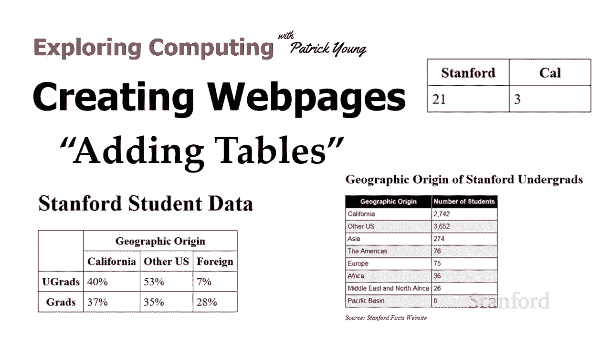
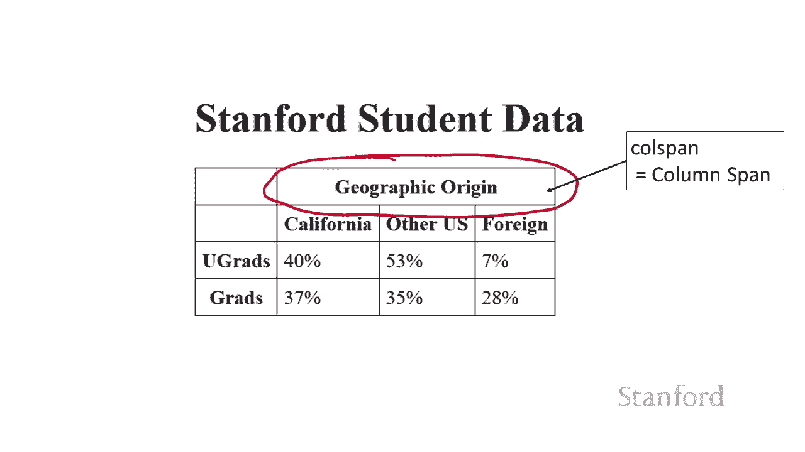
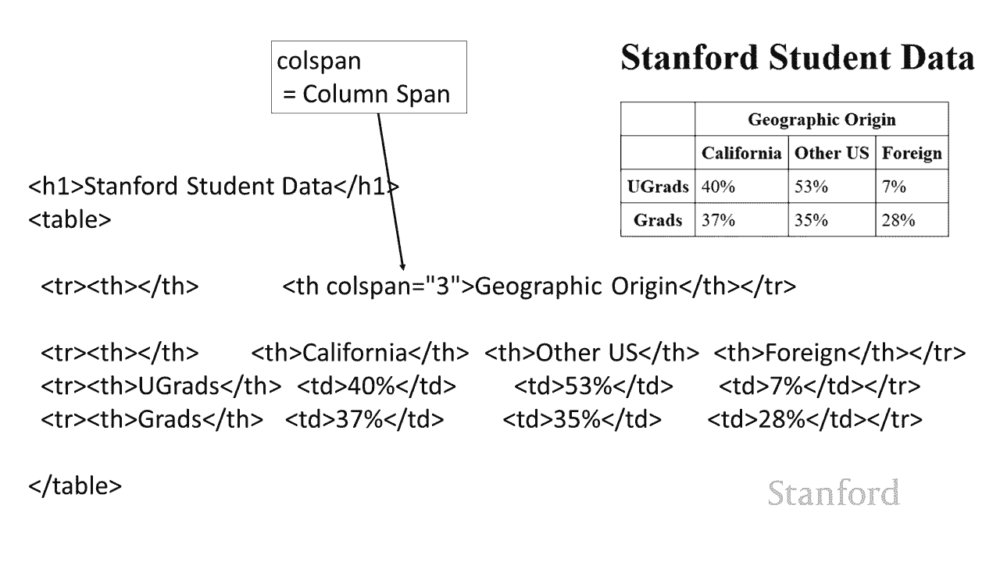
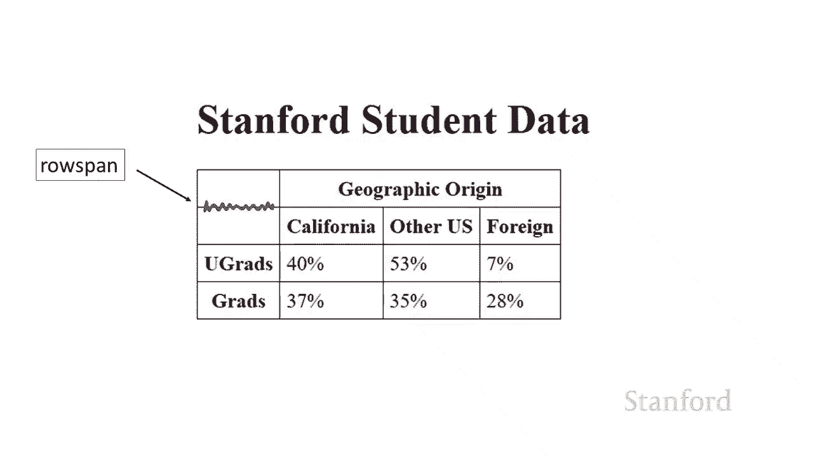
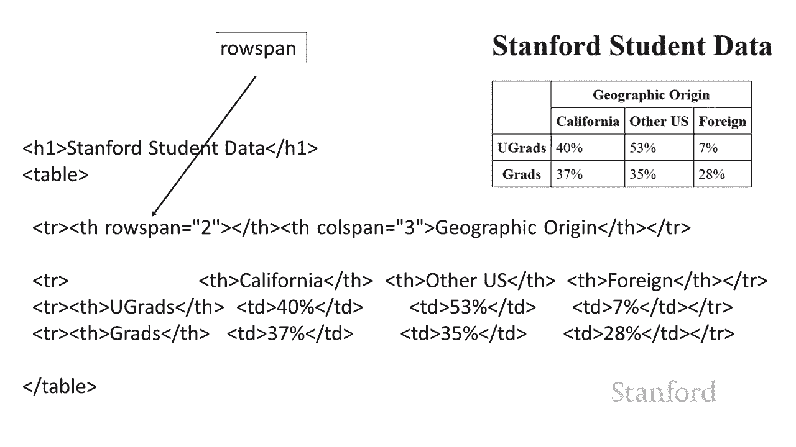
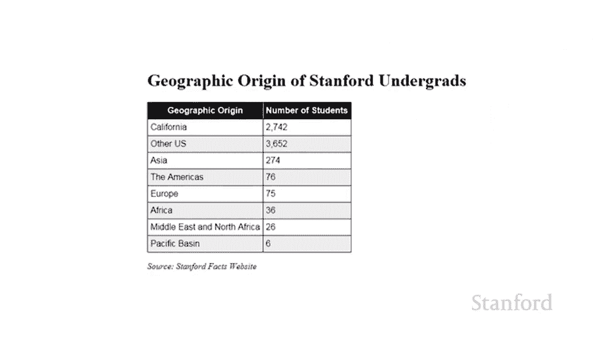
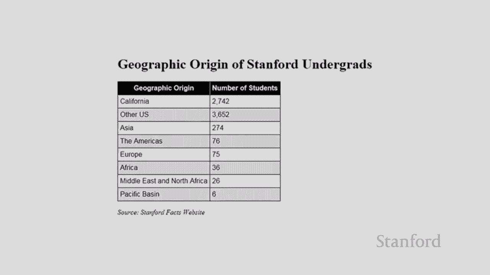

# 斯坦福CS105：计算机科学导论：L10.1：创建网页：添加表格 📊


在本节课中，我们将学习如何在网页中添加表格。表格是组织和展示数据（如时间表、目录或得分表）的强大工具。我们将从基础的HTML表格标签开始，逐步学习如何通过CSS样式美化表格，并掌握一些高级技巧，如合并单元格。



## 概述 📋

表格在网页设计中应用广泛，例如展示表演时间表、志愿者目录或比赛得分。HTML提供了专门的标签来创建表格结构，而CSS则用于控制其外观。本节将详细介绍如何使用`<table>`、`<tr>`、`<td>`和`<th>`标签构建表格，并通过CSS添加边框、调整对齐方式和实现斑马条纹等效果。

## 创建基础表格结构

上一节我们介绍了网页的基本结构，本节中我们来看看如何创建表格。HTML使用特定的标签来定义表格，其核心思想是按行输入数据。

以下是创建表格所需的基本HTML标签：
*   **`<table>`**：定义整个表格的容器。
*   **`<tr>`**：定义表格中的一行。
*   **`<td>`**：定义表格中的一个标准单元格，用于存放数据。
*   **`<th>`**：定义表格中的一个标题单元格，通常用于列或行的标题。浏览器默认会将其内容加粗并居中显示。

例如，一个简单的比赛得分表格的HTML结构如下：
```html
<table>
  <tr>
    <th>Stanford</th>
    <th>California</th>
  </tr>
  <tr>
    <td>21</td>
    <td>3</td>
  </tr>
</table>
```

## 使用CSS为表格添加样式

仅使用HTML创建的表格缺乏视觉区分，看起来并不美观。因此，我们需要使用CSS来为其添加样式，例如边框和间距。

以下是常用的表格样式属性：
*   **`border`**：为单元格添加边框。需要同时指定宽度、样式和颜色，例如 `border: 1px solid black;`。
*   **`padding`**：在单元格内容与边框之间添加内边距，使内容更易读，例如 `padding: 5px;`。
*   **`border-collapse`**：这是一个应用于`<table>`元素的属性。将其值设置为`collapse`可以合并相邻单元格的边框，使表格看起来更整洁。

为之前的基础表格添加样式的CSS规则如下：
```css
table {
  border-collapse: collapse;
}
td, th {
  border: 1px solid black;
  padding: 5px;
}
```

## 调整单元格对齐与尺寸

为了使表格布局更符合需求，我们经常需要调整单元格内文本的对齐方式以及单元格本身的宽度和高度。

以下是控制单元格外观的CSS属性：
*   **`text-align`**：控制单元格内文本的水平对齐方式，可选值有 `left`、`center`、`right`。
*   **`vertical-align`**：控制单元格内文本的垂直对齐方式，可选值有 `top`、`middle`、`bottom`。
*   **`width`** 与 **`height`**：直接设置单元格的宽度和高度。

例如，我们可以让“Stanford”标题左对齐，并设置特定的列宽：
```css
th.stanford {
  text-align: left;
  width: 100px;
}
```

## 合并单元格：`colspan` 与 `rowspan`

有时，一个单元格需要横跨多列或多行，这时就需要使用`colspan`和`rowspan`属性。这两个是HTML属性，直接写在`<td>`或`<th>`标签内。



以下是合并单元格的方法：
*   **`colspan=”数值”`**：让一个单元格跨越指定的列数。
*   **`rowspan=”数值”`**：让一个单元格跨越指定的行数。



例如，一个标题需要横跨三列：
```html
<th colspan=”3”>地理起源</th>
```
再例如，一个单元格需要纵跨两行，以消除多余的边框线：
```html
<th rowspan=”2”>类别</th>
<!-- 注意：下一行的对应位置不需要再写单元格 -->
```

## 高级美化技巧：斑马条纹



为了让长表格更易阅读，一种常见的技巧是交替改变行的背景色，即“斑马条纹”效果。这可以通过CSS的伪类选择器 `:nth-child()` 轻松实现。

以下是实现斑马条纹的CSS代码：
```css
tr:nth-child(even) {
  background-color: #f2f2f2;
}
```
这段代码会为所有偶数行（`even`）添加一个浅灰色的背景。你也可以使用 `odd` 来选中奇数行。



## 总结 🎯






本节课中我们一起学习了如何在网页中创建和美化表格。我们首先使用`<table>`、`<tr>`、`<td>`和`<th>`标签构建了表格的基本骨架。接着，我们通过CSS添加边框、内边距并合并边框，使表格结构清晰。然后，我们学习了如何调整文本对齐和单元格尺寸以优化布局，并利用`colspan`和`rowspan`属性合并单元格。最后，我们还介绍了使用`:nth-child()`伪类创建斑马条纹的高级技巧。掌握这些知识，你将能够创建出功能清晰、视觉美观的网页表格。