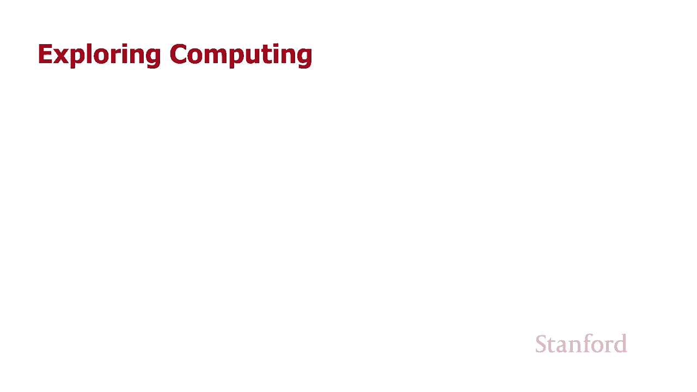
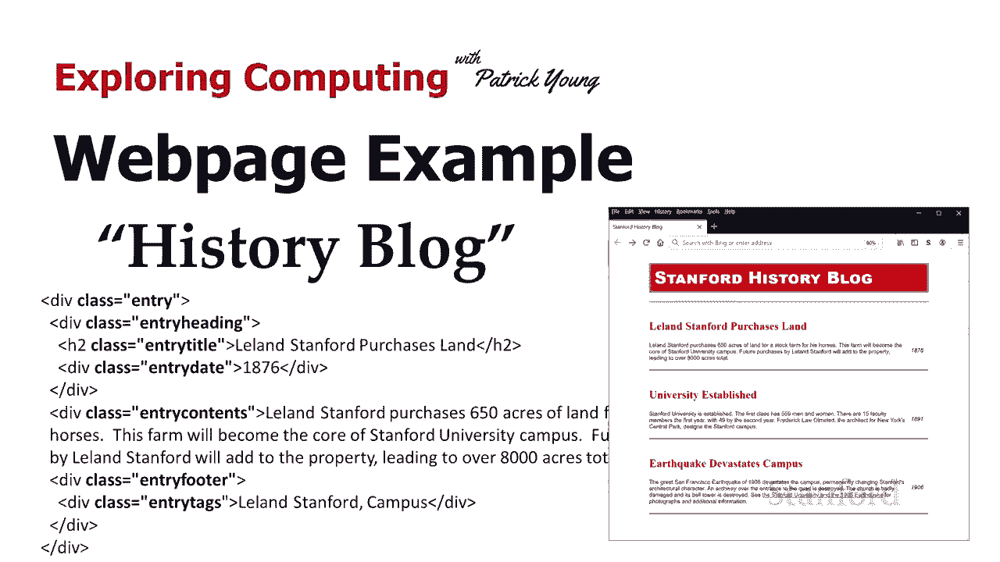
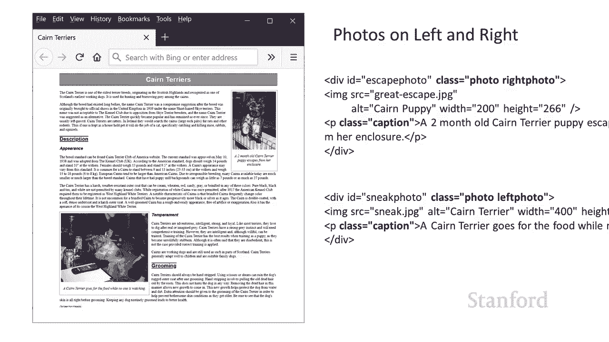
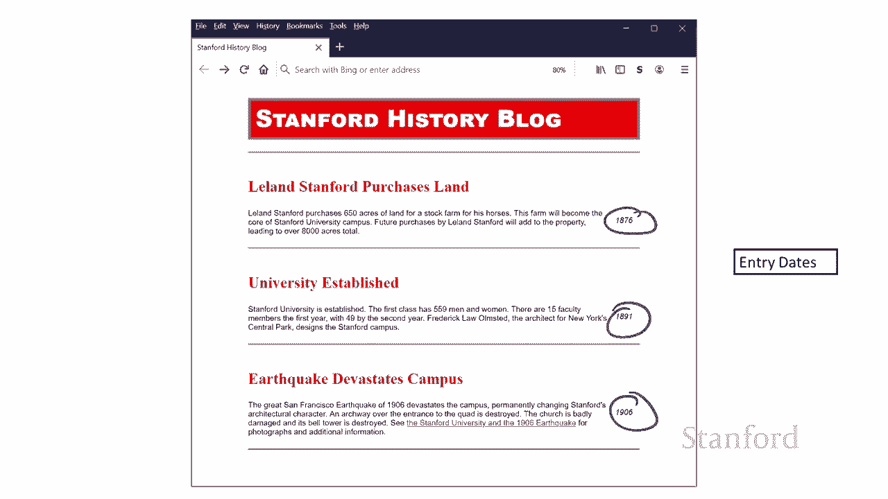
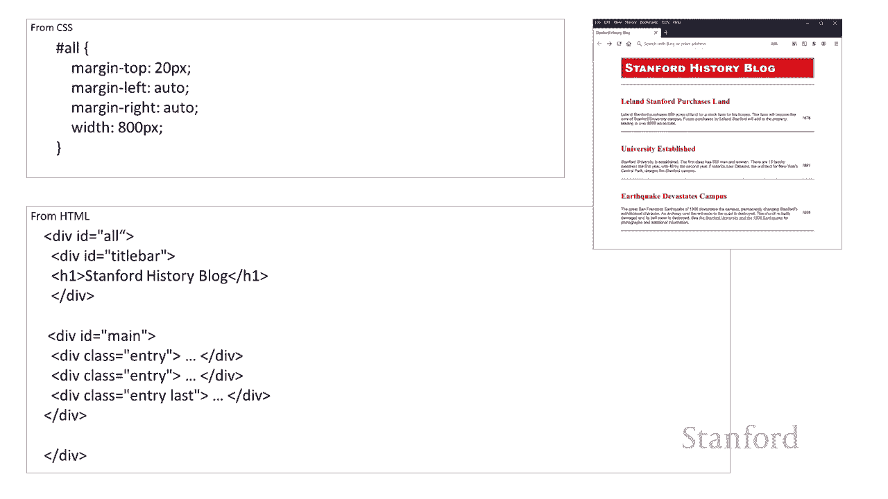
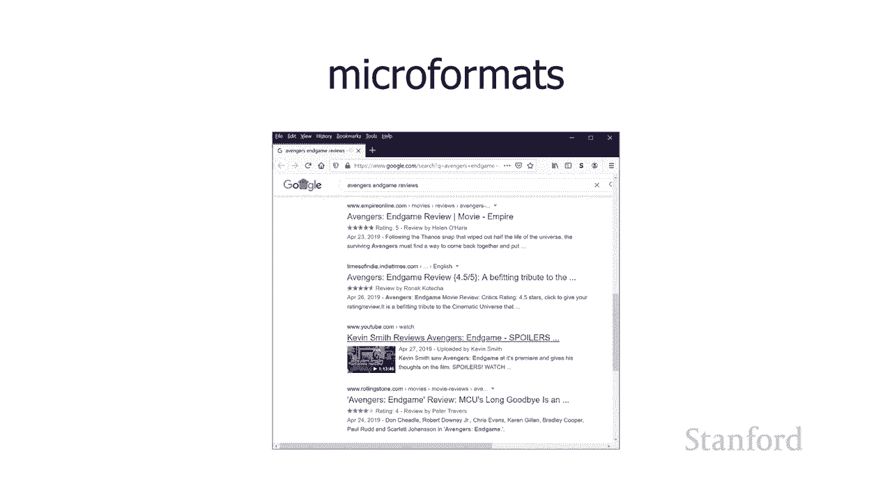
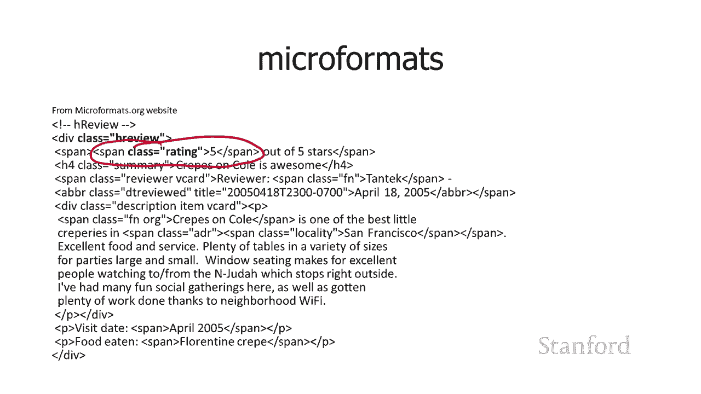

# 斯坦福CS105：计算机科学导论：L10.2- 网页示例：博客 📝







## 概述
在本节课中，我们将学习如何构建一个博客网页。我们将通过一个具体的示例，了解如何使用HTML和CSS来结构化内容、应用样式，并探索“类”在网页设计中的强大作用。我们还将简要介绍“微格式”的概念，看看如何通过添加特定的类来为网页内容赋予额外的语义信息。

---



## 历史博客示例
在上一节中，我们看到了“类”在多个地方的使用。我们创建了用于标题的类、用于照片的类，以及一个单独的用于照片描述的类。这种为`div`或其他元素提供“类”的想法非常强大，并且经常出现在博客设计中。

以下是我构建的一个关于斯坦福历史的博客示例。我已经对其进行了初步的格式化。实际上，在接下来的作业中，你将有机会对这个文件进行一些格式化练习。

我们将为你提供此文件的HTML代码，但不提供CSS。我们希望你能从头开始创建CSS。现在，让我们回顾一下我使用的CSS，以便获得当前的外观。

### 博客的结构
在博客上，通常有一系列条目。每个条目都包含以下部分：
*   一个带有标题的标题区域。
*   一个日期。
*   内容主体（我这里没有显示页脚，但我们会在源代码中看到实际上有一个页脚）。
*   可以为每个博客条目显示的一系列标签。

这些都是博客中常见的不同元素。如果你经常查看博客的源代码，你会发现他们完成了一些类似的项目：其中一些可能是`<p>`段落，一些可能是`<div>`，一些实际上可能是标题`<h2>`。他们通常会为这些元素添加“类”。

### 源代码结构
我的博客源代码看起来是这样的：每个条目都有一个类为`entry`的`div`。在这个`div`内部，有：
*   一个类为`entry-title`的标题（包含标题和日期）。
*   一个类为`content`的内容区域。
*   一个类为`entry-footer`的页脚。
*   一个类为`tags`的标签区域。

在标题示例的结尾，我们提到了一些新的HTML5元素（如`<article>`、`<figure>`、`<figcaption>`）。这些元素本身不提供任何格式，但可用于提供语义信息。例如，你可以用`<article>`这个HTML5元素替换这里的`class="entry"`。

然而，当我查看一些实际在线的博客时，并没有看到它们使用这些新技术。可能是因为这些是较旧的博客，或者现代博客软件尚未更新以使用这些元素。但无论如何，我查看的博客看起来都非常接近我们在这里看到的内容。因此，我们将继续使用这种基于“类”的结构。

---

## 如何格式化博客
我认为需要记住的核心思想是：我们有一堆`<div>`元素（在一种情况下我们实际上有一个`<h2>`），我们通过为它们添加`class`属性来对它们进行分类。正如我所说，这种做法一直出现。接下来，在我们完成对每个元素的格式设置时，我会指出各种不同的格式功能，这些可能对你自己工作有用。

### 格式化条目标题
让我们从条目标题开始。你可以看到标题是“Leland Stanford Purchases Land”或“University Founded”等。这些是我的`<h2>`元素，但我同时也给了它们`class="entry-title"`。

我选择为`.entry-title`类编写CSS规则，而不是直接为`h2`选择器编写。这是因为网页上可能还有其他`h2`元素（例如侧边栏或广告中的`h2`），我不希望样式影响到它们。

以下是我应用的CSS规则：
```css
.entry-title {
    font-size: 24px;
    font-weight: bold;
    color: #333;
    font-family: "Times New Roman", Times, serif;
}
```
这里有一个我们之前没详细讨论的有趣属性：`font-family`。注意我实际上列出了三个字体系列。当你列出多个字体时，浏览器会按顺序查找每个字体，一旦找到用户计算机上安装的字体，就会使用它。因此，你可以从你最希望使用的字体开始列出，最后以通用字体族（如`serif`或`sans-serif`）结束，以确保总有可用的字体。

### 格式化条目日期
如果你查看右侧的图像，可以看到日期显示在最右侧，紧挨着实际的博客条目。我是通过使用`float`属性来实现这一点的。
```css
.entry-date {
    float: right;
}
```
在标题示例中，我提到过在浮动文本时应小心设置宽度。但在这个例子中，由于日期实际上是年份，永远不会超过四个字符，所以这不是问题。如果浮动的元素是较长的文本，你通常需要为其设置一个宽度，以防止它扩展到整个网页的宽度。

### 添加入口间的分隔线
你可以看到每个条目的上方和下方都有红线穿过。我是如何做到的呢？
1.  我为每个`.entry`元素添加了一个顶部边框：`border-top: 2px solid red;`。
2.  我在每个元素上方添加了一点额外的填充和边距。注意，`padding`和`margin`可以接受多个值。例如，`margin: 10px 5px;`表示上下边距为10px，左右边距为5px。
3.  我只设置了顶部边框，那么如何获得底部边框呢？有几种方法可以做到这一点。最常见的技术是：为最后一个项目添加一个类（例如`last`），然后编写一个仅适用于具有`last`类的项目的规则，为其添加底部边框。
```css
.last {
    border-bottom: 2px solid red;
}
```
这样，所有条目都有顶部边框，只有最后一个条目有底部边框，从而得到了我们看到的四行效果（条目之间的三行，以及最下面的第四行）。

还有其他方法可以实现，例如使用伪类。我们在谈论伪类时简要提到过，比如`:last-child`和`:last-of-type`。例如，我可以写一个规则`.entry:last-of-type { border-bottom: ... }`来达到类似效果。

### 处理页脚和标签
最初我没有页脚，但当我决定把它变成作业时，我想添加一些更有趣的东西供你们练习。所以我添加了一个页脚，但我不太确定如何处理它，所以我“作弊”了。我想向你展示这个使元素“消失”的小技巧。

有两种不同的技术可以使项目消失：
1.  **`display: none;`**：这会完全从文档流中移除该元素，就像它不存在一样。
    ```css
    .entry-footer {
        display: none;
    }
    ```
2.  **`visibility: hidden;`**：这做了一些不同的事情。元素所在的空间仍然保留，但元素本身不会显示。

在这个例子中，我使用了`display: none;`来隐藏页脚，这样你们在作业中就可以自由发挥。如果使用`visibility: hidden;`，你会在每个条目的底部看到为这些`entry-footer` div保留的空白区域。

### 居中整个内容区域
我用一个`<div>`包围了整个博客内容，并给了它一个`id`（例如`#main`）。然后我使用`margin: 0 auto;`来使其水平居中。
```css
#main {
    margin: 0 auto;
    width: 800px; /* 通常需要指定一个宽度 */
}
```
这个想法是：将一堆元素添加到一个容器中，然后设置容器的左右外边距为`auto`，这被证明是实现居中的一种非常强大的方法。

---



## 微格式简介
这里的核心思想是：HTML不一定有我们认为可能有趣的所有东西的标签。如果没有可用的特定标签，我们可以继续使用`<div>`或其他标签之一，并给它一个特定的“类”，从而添加我们自己的语义标签。有一群人推广并运行这种想法，那就是“微格式”。

我们要看两种微格式。

### 1. hReview（评论微格式）
假设我想去看电影（遗憾的是现在不能），我听说《复仇者联盟：终局之战》上映了。我在谷歌搜索“Avengers Endgame review”，可以看到一些评论在谷歌结果中显示了星级评分。谷歌是怎么知道这些是评论并且能显示星级的呢？



谷歌支持一种叫做 **hReview** 的微格式。网站可以在其HTML中使用特定的类（如`class="hreview"`和`class="rating"`）来标记评论内容和评分。谷歌等工具可以识别这些类，从而提取信息并在搜索结果中显示星级。

### 2. hCard（电子名片微格式）
另一种经常出现的微格式是 **vCard** 或 **hCard** 格式，用于虚拟名片。人们经常有名片，而hCard背后的想法是，你可以将此类联系信息放在你的网站上。



但是，如果你希望人们能够提取该信息并将其存储在单独的程序（如通讯录）中，仅仅将信息放在网站上是不够的。如果你在网站上使用这种特定技术（即添加特定的类，如`class="street-address"`、`class="tel"`），那么旨在读取电子名片的工具就可以通过搜索HTML寻找这些特定类，来提取信息并填入数据库。

例如，虽然没有`<street-address>`这个HTML标签，但通过在一个`<span>`上放置`class="street-address"`，我就让任何使用电子名片的工具知道：“这是我的街道地址”，它可以继续从那个标签中提取信息“169 University Ave”。

类似地，可以有`class="postal-code"`（邮政编码）、`class="country-name"`（国家名称）、`class="tel"`（电话）、`class="email"`（电子邮件）。这些都是没有直接关联的HTML标签的信息，但通过在上面放置类，我可以提供分类信息。一个旨在阅读网页的程序可以继续选择该信息并处理它。

---


## 总结
本节课中，我们一起学习了如何构建和格式化一个博客网页。我们深入探讨了使用“类”来组织和样式化HTML元素，包括设置标题、日期、边框以及实现布局技巧如浮动和居中。我们还初步了解了“微格式”的概念，看到了如何通过添加特定的类（如`hreview`和`hcard`相关的类）来为网页内容赋予额外的语义，从而使机器能够更好地理解和处理信息。这些技术是构建现代、结构化、语义化网页的基础。