# L10.3：创建网页：使用 Web 服务器 🚀

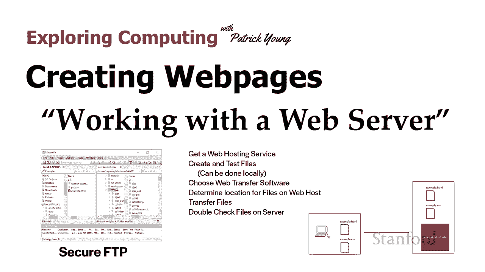

在本节课中，我们将学习如何将本地创建的网页文件部署到真正的 Web 服务器上，使其能够被互联网上的其他人访问。我们将介绍从选择托管服务到文件传输、测试及问题排查的完整流程。

---

## 概述

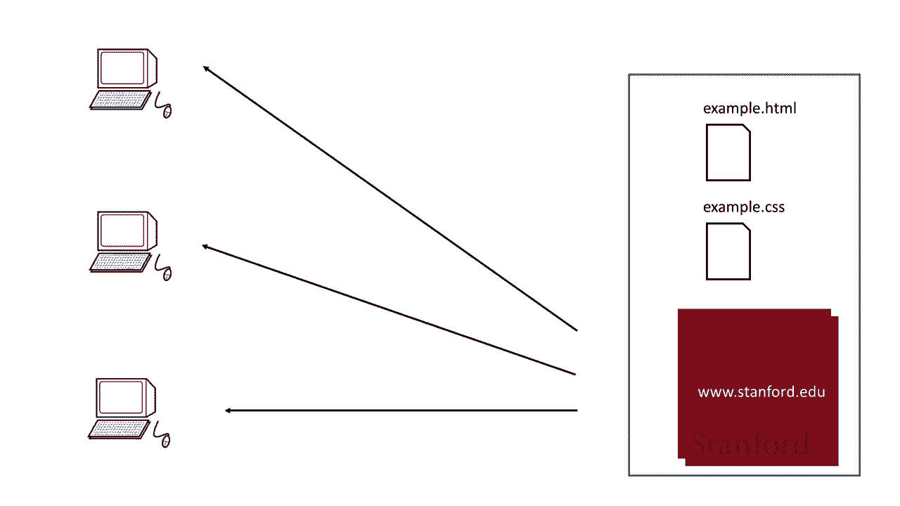

到目前为止，我们已经讨论了如何编写 HTML 和 CSS 文件。然而，我们尚未讨论如何将这些文件发布到 Web 上。虽然本课程作业通常不需要此步骤，但了解如何创建真正的网页至关重要。

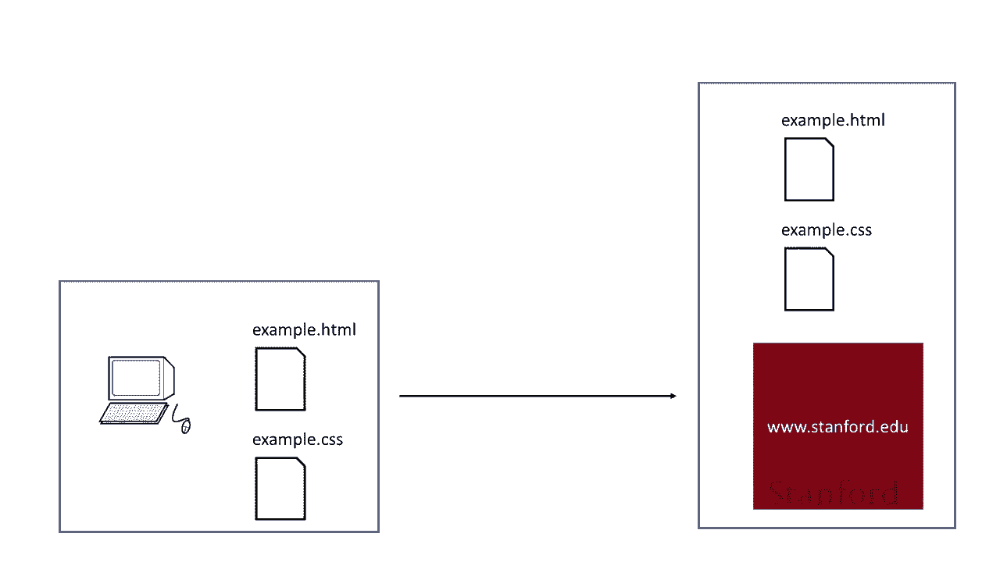

---

## 本地开发与 Web 服务器的区别

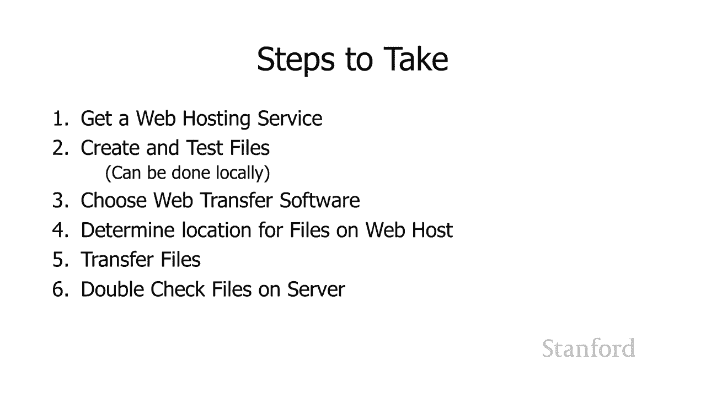

上一节我们介绍了如何编写和测试网页文件。本节中我们来看看如何将它们发布到互联网上。

在课程作业中，我们一直在本地笔记本电脑上创建文件，并直接在本地浏览器中打开它们。这利用了 Web 浏览器的**渲染和显示**功能，但跳过了**从服务器请求文件**的过程。

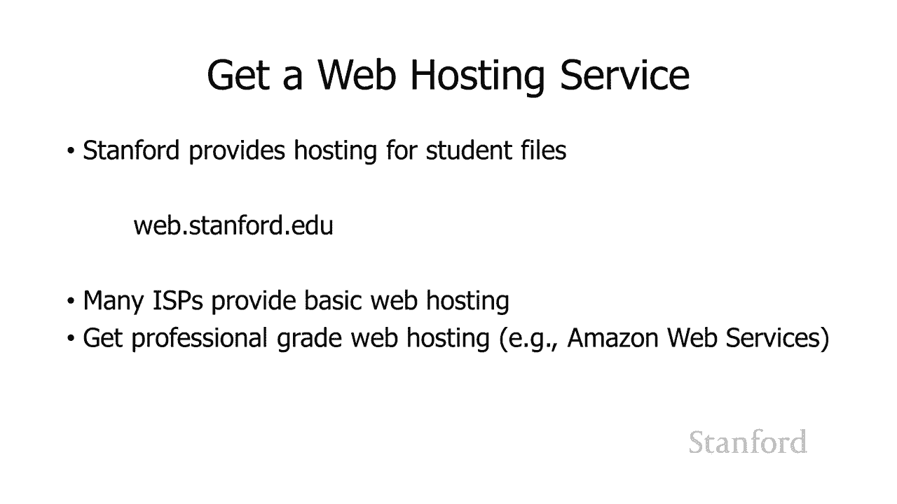

为了让其他人能够访问我们的网页，我们需要将文件放置在 Web 服务器上。服务器可以将这些文件发送给许多不同的访问者。

因此，我们需要逆转之前的过程：将 HTML、CSS、图像等所有与网页相关的文件，从本地开发环境转移到 Web 服务器上。

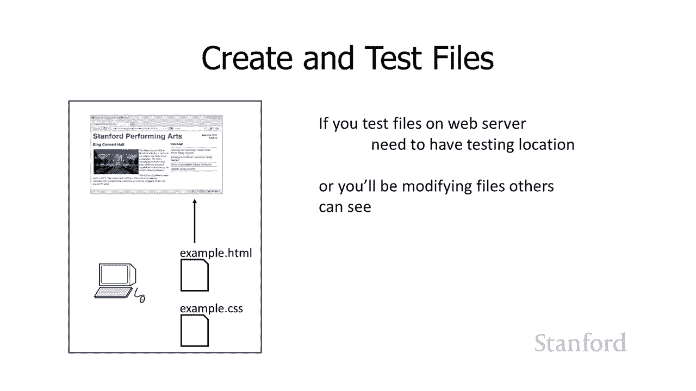

---

## 部署网页的核心步骤

以下是部署网页到 Web 服务器需要完成的主要步骤：

1.  **获取网络托管服务**：需要一个实际的服务器来存放文件。
2.  **在本地创建和测试文件**：确保所有文件在本地运行正常。
3.  **选择文件传输软件**：使用工具将文件上传到服务器。
4.  **确定服务器上的文件位置**：知道文件应该放在服务器的哪个目录。
5.  **传输文件**：执行上传操作。
6.  **在线验证**：确保所有文件在线上正常工作。

---

## 步骤一：选择网络托管服务

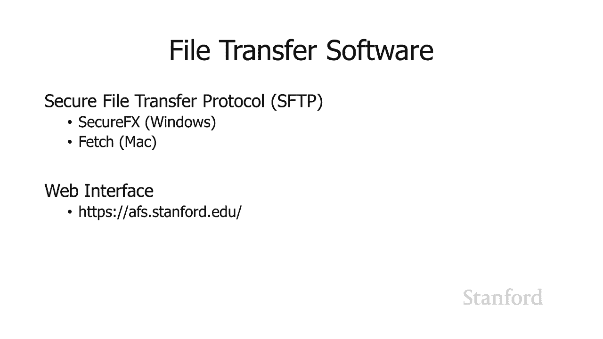

首先，你需要一个网络托管服务。例如：
*   斯坦福大学为学生提供托管服务，每个学生都有一个可通过 `web.stanford.edu` 访问的目录。
*   许多互联网服务提供商也提供基本的网络托管。
*   此外，还有众多公司提供网络托管服务，以及像亚马逊 AWS 这样的专业级服务。

---

## 步骤二：本地测试文件

在将文件上传到公共服务器之前，务必在本地进行充分测试。直接在线上服务器测试可能导致访问者看到错误的内容。

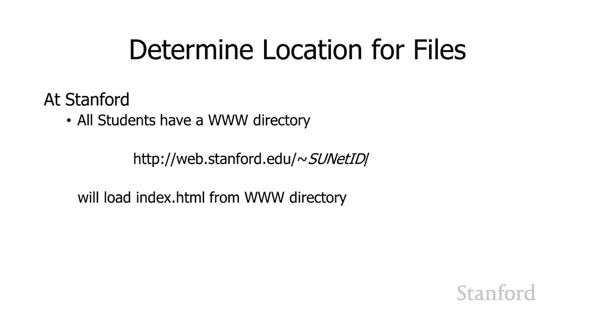

更专业的做法是使用单独的测试服务器或服务器上的测试目录进行预发布检查。

---

## 步骤三：选择文件传输软件

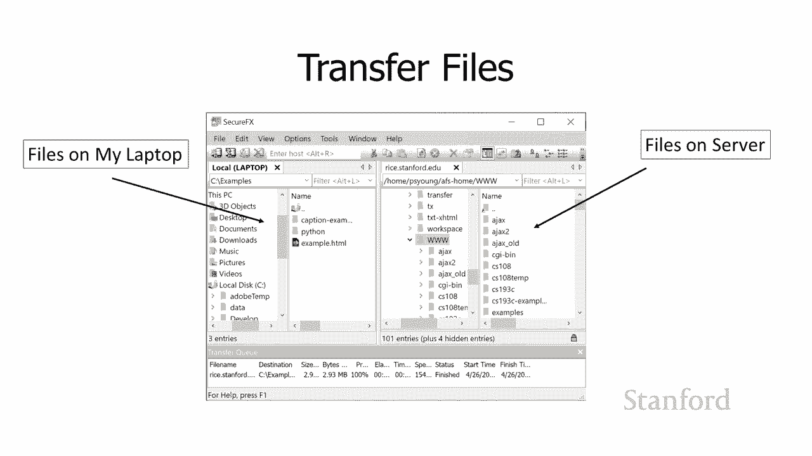

通常，你需要一个支持 **SFTP** 的文件传输程序。FTP 是其早期版本，但建议使用更安全的 SFTP。

以下是几个 SFTP 客户端示例：
*   SecureFX（适用于 Windows）
*   Fetch（适用于 Mac）

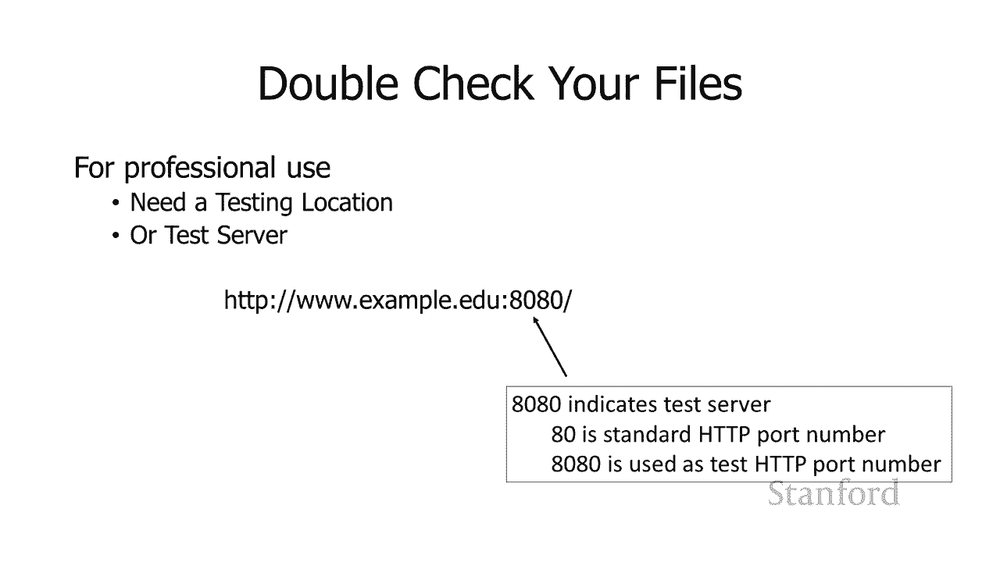

斯坦福大学的学生和教职工可以免费获取这些软件。你也可以使用 Web 界面（如 `afs.stanford.edu`）上传文件，这对于简单任务可能更方便。

---

## 步骤四：确定服务器文件位置

你需要知道将文件上传到服务器的哪个目录。

以斯坦福的托管服务为例：
*   每个学生都有一个名为 `www` 的目录。
*   放在 `www` 目录中的文件是公开可访问的。
*   访问网址格式为：`http://web.stanford.edu/~你的SUNetID/`
*   默认会加载 `index.html` 文件。

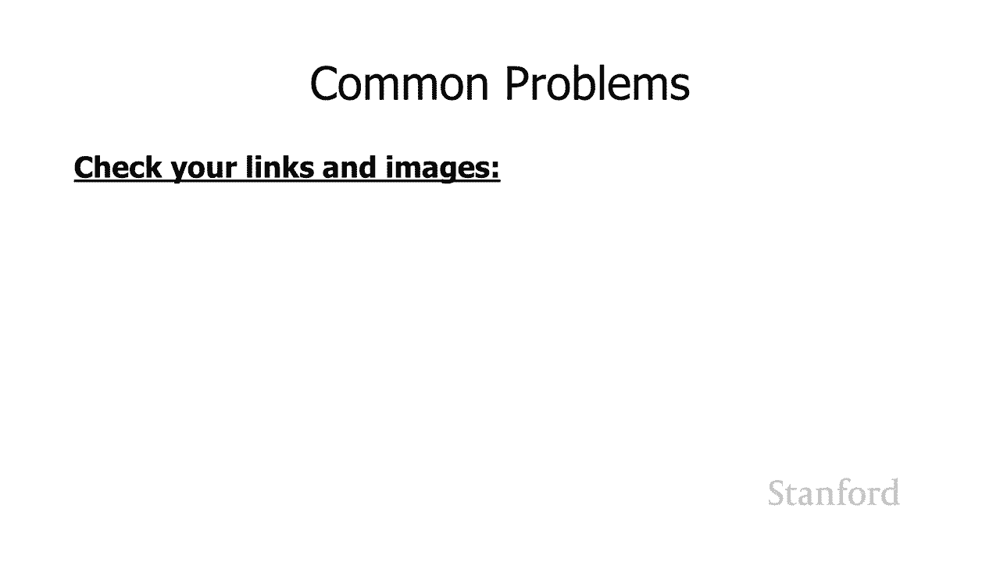

如果你使用其他托管服务，服务提供商会告知你应使用的目录。

---

## 步骤五：传输文件

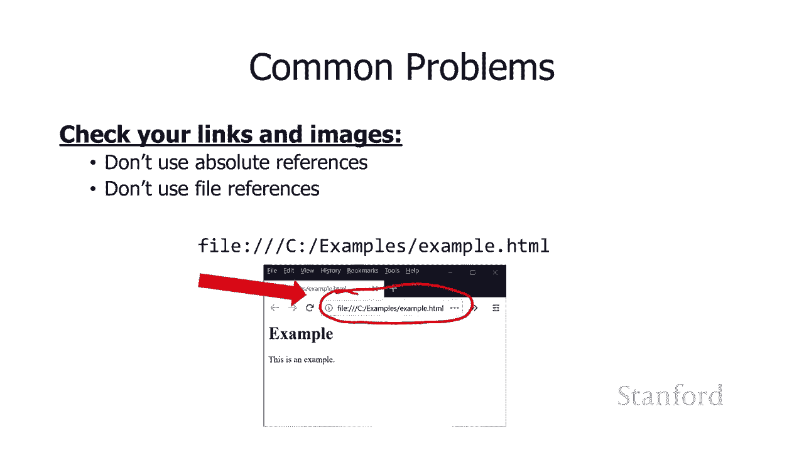

使用 SFTP 客户端连接服务器后，界面通常会分为左右两栏，分别显示本地和服务器端的文件。

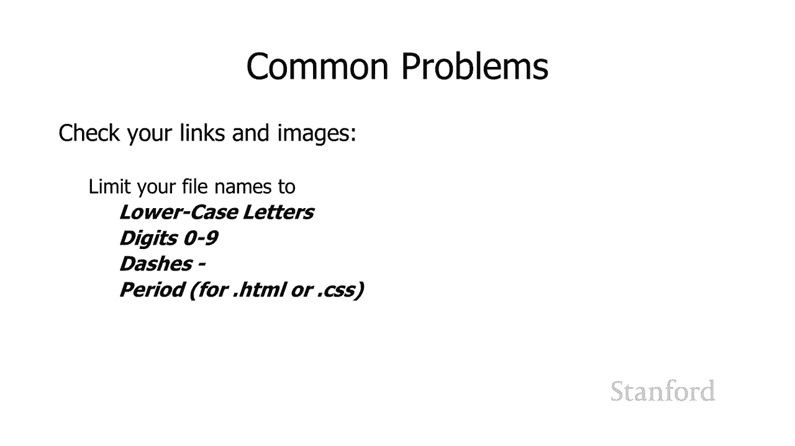

传输文件的方法通常很简单：
*   将文件或文件夹从本地（左侧）拖拽到服务器目录（右侧）。
*   你可以传输单个文件，也可以传输整个包含嵌套结构的文件夹。

---

## 步骤六：在线检查与问题排查

文件传输完成后，必须仔细检查网站在线状态是否正常。以下是一些常见问题及解决方法：

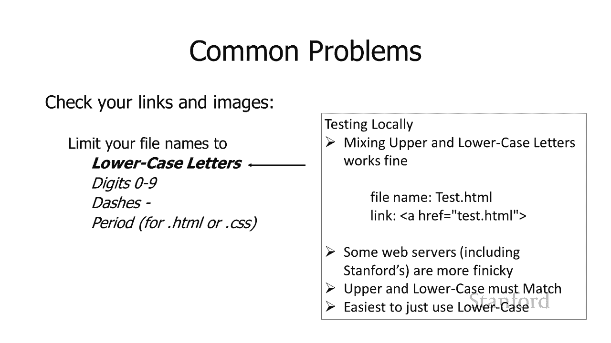

### 常见 HTTP 错误
*   **404 错误**：文件未找到。可能原因是文件路径错误或文件名拼写错误。
*   **403 错误**：权限禁止。通常是因为目录权限设置不正确。

### 文件引用问题
*   **避免使用绝对路径**：在链接网站内部的页面或资源（如图片）时，应使用**相对路径**，而非指向本地硬盘的绝对路径（如 `C:\Users\...`）。
*   **正确使用相对路径**：确保站内链接使用相对于当前文件的路径。

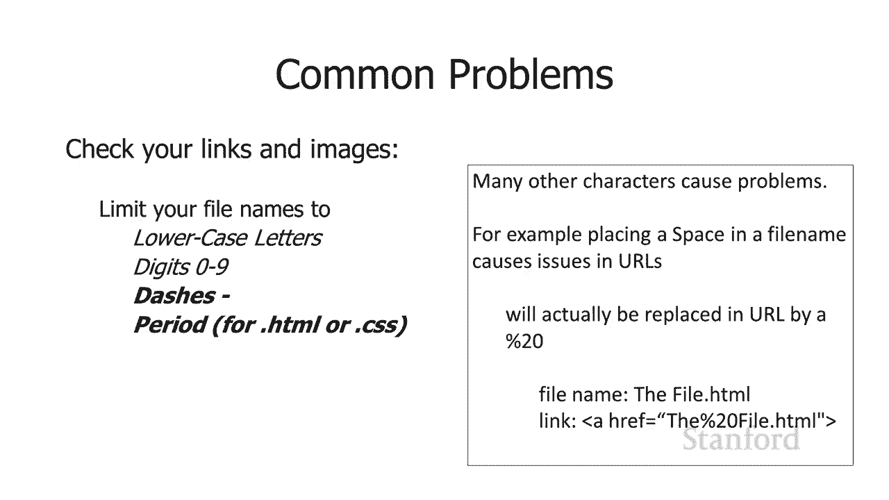

### 文件命名规范
为避免大小写和字符引发的问题，请遵循以下命名约定：
*   使用**全小写**字母。
*   可以使用数字 `0-9`。
*   可以使用连字符 `-`。
*   扩展名使用 `.html` 或 `.css`。
*   **避免使用空格**和特殊字符。空格在 URL 中会被转换为 `%20`，容易导致错误。

### 图像格式兼容性
为确保图像在所有浏览器中正常显示，请使用以下广泛支持的格式：
*   JPEG
*   PNG
*   GIF
*   SVG（用于矢量图形）

避免使用以下可能不兼容的格式：
*   HEIC（苹果设备格式）：需要转换为 JPEG 或 PNG。
*   WebP/WebM：部分浏览器（如 Safari）尚未完全支持。

**注意**：转换图像格式需要使用图像编辑软件（如 Photoshop），仅重命名文件扩展名是无效的。

### 隐私与安全提醒
发布到网络上的信息是公开的，请谨慎处理个人敏感信息：
*   慎重考虑是否发布个人姓名、电话号码、家庭地址。
*   电子邮件地址容易被自动化程序收集，用于发送垃圾邮件。

---

## 总结

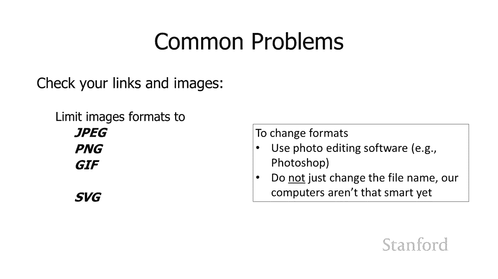

本节课我们一起学习了将网页部署到 Web 服务器的完整流程。我们了解了从选择托管服务、本地测试、使用 SFTP 传输文件，到在线验证和排查常见问题（如 404/403 错误、路径问题、命名规范和图像格式）的每一步。记住在发布前充分测试，并始终注意线上内容的隐私与安全。现在，你已经掌握了让网页在互联网上“活”起来的关键技能。