# 计算机科学导论：L11.1：网页布局技术概述 🧭

在本节课中，我们将学习四种不同的网页布局技术。我们将了解每种技术的基本概念、优缺点，并明确推荐当前及未来最值得使用的技术。通过对比，你将理解为何应将内容（HTML）与表现（CSS）分离，以及现代布局技术如何实现这一目标。

## 概述

网页布局技术决定了网页上各元素的排列方式。本节将概述四种主要技术：基于表格的布局、基于浮动的布局、Flexbox布局和基于网格的布局。我们将通过三个示例布局来探讨每种技术的实现思路，并重点分析为何基于网格的布局是未来的发展方向。

## 四种布局技术简介

以下是四种我们将要探讨的网页布局方式。

1.  **基于表格的布局**：这种方法已不再使用，但通过与网格布局对比，能帮助我们理解CSS的优势。
2.  **基于浮动的布局**：这是多年来使用最广泛的技术。
3.  **Flexbox布局**：在过去大约三年里逐渐流行，但它最初并非为整体网页布局而设计。
4.  **基于网格的布局**：这是网页布局的未来，提供了最大的灵活性，但目前可能不如前两种技术使用广泛。

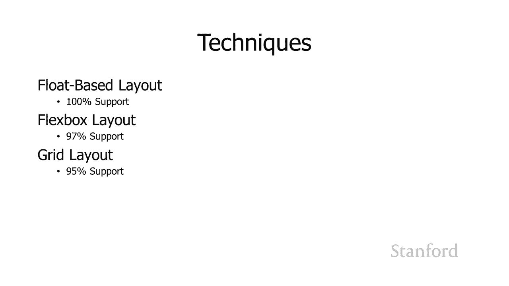

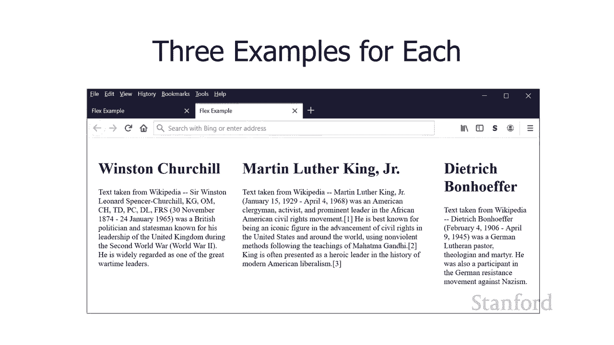

除非有充分理由，否则建议使用第四种技术。接下来，让我们逐一审视这些技术。

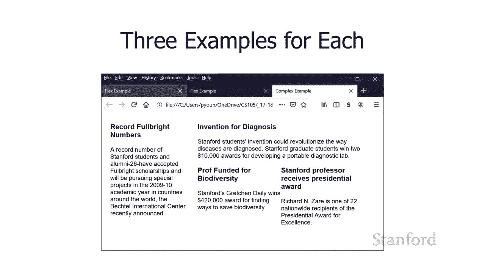

## 示例布局

在深入每种技术之前，我们先定义三个将用于演示的示例布局。

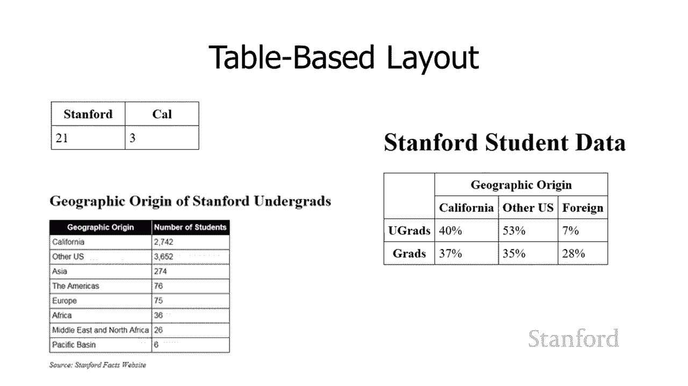

1.  **简单的三列网页**：一个包含三列的基本布局。
2.  **混合列格式网页**：顶部有三列，底部有两列的布局。
3.  **复杂混合布局**：一种更不规则、包含嵌套结构的布局。

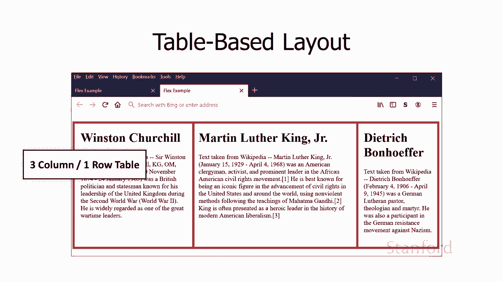

我们将看到每种布局技术如何处理这三种情况。

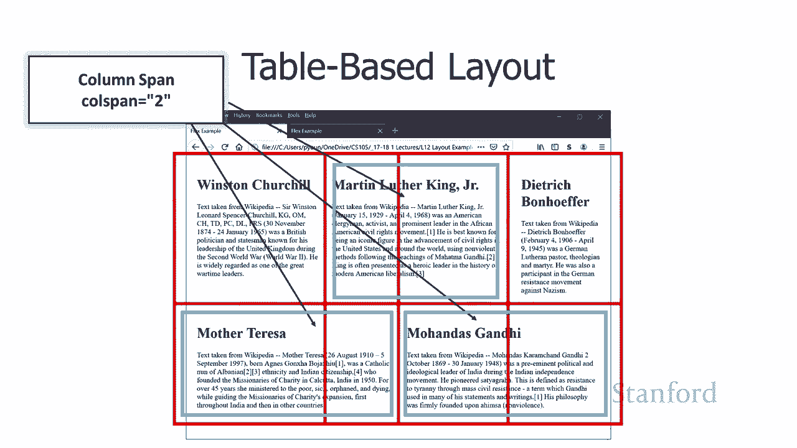

## 1. 基于表格的布局 📊

基于表格的布局利用HTML表格的概念来排列元素。HTML早期就支持表格，因此曾有一段时间人们普遍使用表格来布局网页。

### 实现思路

对于**简单的三列布局**，可以创建一个包含一行三列的表格。

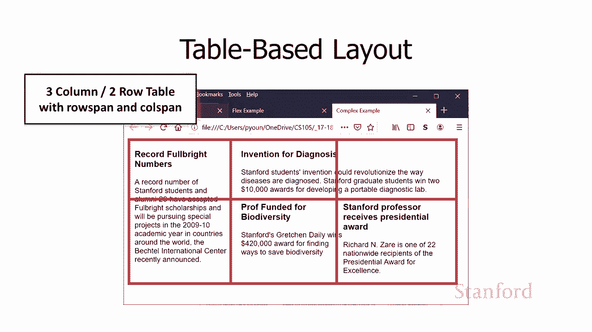

对于**顶部三列、底部两列的布局**，有两种方法：
*   嵌套表格：创建一个两行一列的外层表格，其第一行单元格内嵌套一个三列表格，第二行单元格内嵌套一个两列表格。
*   使用`colspan`属性：创建一个两行四列的表格，并通过`colspan`让某些单元格跨越多列。

对于**复杂混合布局**，通常需要多层表格嵌套。例如，可以先创建一个两列表格作为主框架，然后在右侧列内再嵌套其他表格来实现更复杂的结构。

### 存在的问题

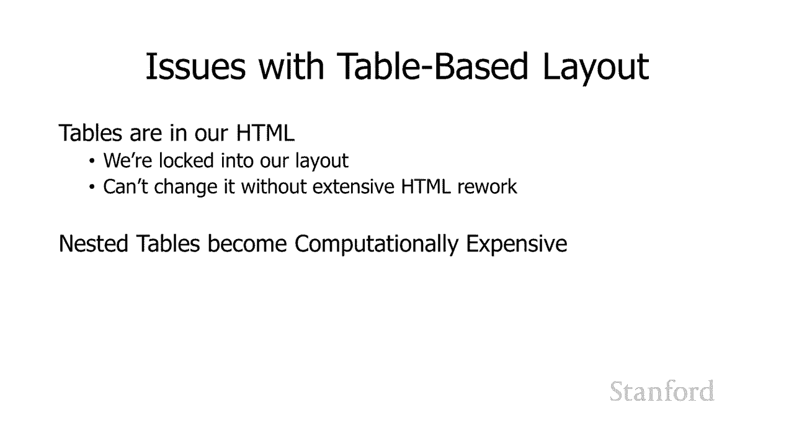

基于表格的布局存在几个主要问题：
*   **布局与HTML紧耦合**：布局信息直接写在HTML的`<table>`标签中。若想更改整个网站的布局，必须修改每一个HTML文件，无法通过单独修改CSS来实现。
*   **计算成本高**：当表格嵌套层级过深（如四层、五层或六层）时，浏览器渲染会变慢，代码也变得混乱。

因此，我们不再使用基于表格的布局。

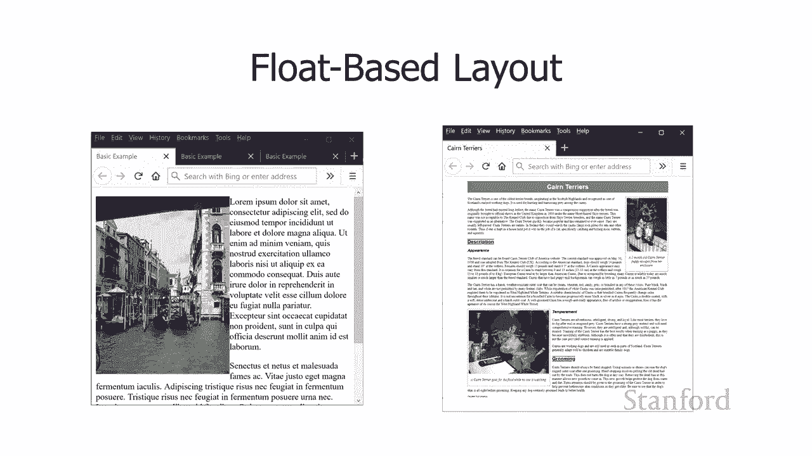

## 2. 基于浮动的布局 🎈

随着CSS的普及，基于浮动的布局技术出现了，并且至今仍被广泛使用。

### 实现思路

浮动（`float`）属性原本用于让文本环绕图片。实际上，任何块级元素都可以被浮动。如果将多个`
`元素都设置为`float: left`，它们就会水平排列，形成列的效果。

对于**简单的三列布局**，创建三个`
`并全部设置为`float: left`即可。

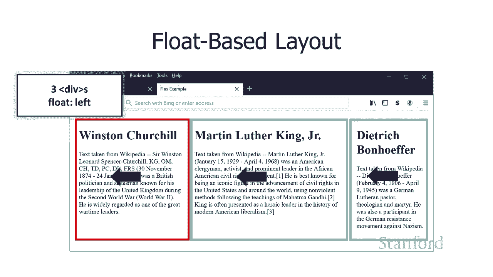

对于**顶部三列、底部两列的布局**：
1.  创建两个主要的`
`，它们会默认上下堆叠。
2.  在第一个`
`内放置三个子`
`，并全部设置为`float: left`。
3.  在第二个`
`内放置两个子`
`，也全部设置为`float: left`。

对于**复杂混合布局**，同样采用嵌套思路：
1.  创建两个浮动到左侧的`
`，形成左右两列。
2.  在右侧列的`
`内，再创建两个子`
`，它们默认上下堆叠。
3.  在下方子`
`内，再创建两个孙`
`并设置为`float: left`。

### 优点与缺点

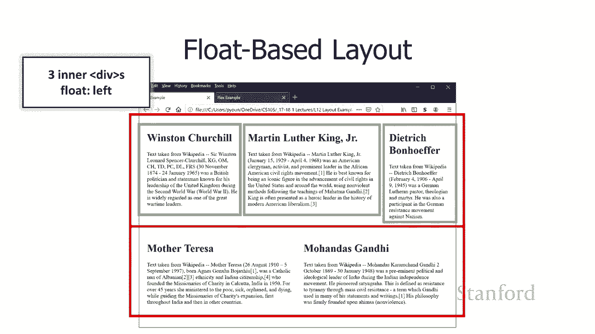

**优点**：兼容性极佳，几乎支持所有浏览器。

**缺点**：
*   **布局仍与HTML结构紧密相关**：为了实现浮动效果，必须创建特定结构的`
`，HTML的编写方式在很大程度上决定了最终的布局。仅通过修改CSS来实现完全不同的布局仍然很困难。
*   **需要处理“清除浮动”等额外问题**：为了确保布局稳定，通常需要额外的CSS技巧（本讨论中未深入），这使得代码不够简洁。

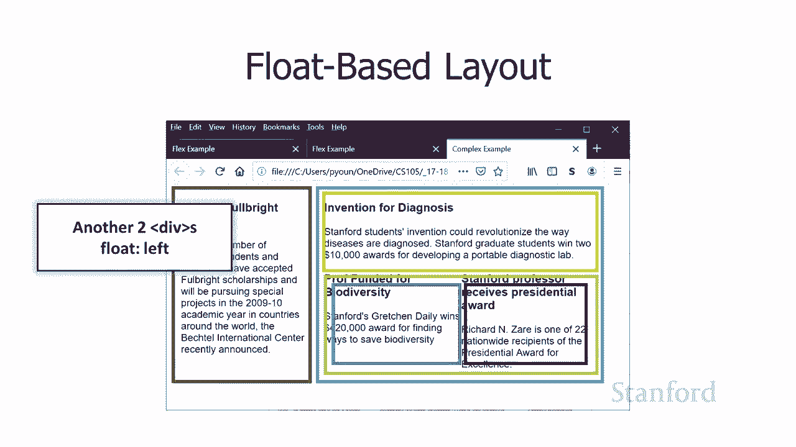

## 3. Flexbox布局 🧩

Flexbox（弹性盒子）布局旨在为容器内的子元素提供更高效的对齐与空间分配方式。

### 核心概念与设计初衷

Flexbox的核心是控制**一维**（行或列）上子元素的排列。通过设置容器的`display: flex`，可以轻松改变子元素的排列方向（`flex-direction`）、对齐方式（`justify-content`, `align-items`）和伸缩比例（`flex-grow`）。

**重要提示**：Flexbox最初并非为整个网页的宏观布局而设计。它与网格布局几乎是同时被定义的，其设想的分工是：
*   **网格布局**：用于规划网页的整体宏观结构（主要组件的位置）。
*   **Flexbox布局**：用于控制微观、局部容器内子元素的排列（例如导航栏、卡片列表）。

然而，由于人们厌倦了浮动布局的繁琐，Flexbox也被“借用”来进行整体网页布局。

### 实现思路（用于整体布局时）

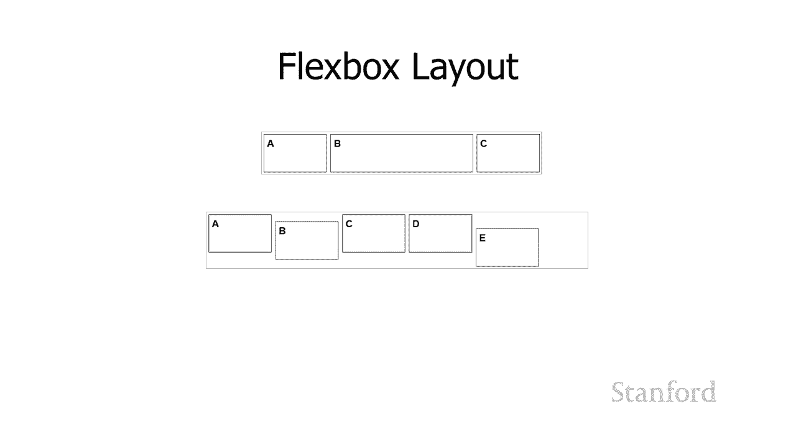

对于**简单的三列布局**：
1.  创建一个父`
`作为Flex容器（`display: flex`）。
2.  在容器内放置三个子`
`。
3.  设置`flex-direction: row`（默认值），使子元素排成一行。

对于**顶部三列、底部两列的布局**：
1.  创建一个外层Flex容器，设置`flex-direction: column`，使其子元素垂直堆叠。
2.  在这个容器内有两个子`
`。
3.  第一个子`
`本身也是一个Flex容器（`display: flex; flex-direction: row`），里面包含三个孙`
`。
4.  第二个子`
`同样是Flex容器（`display: flex; flex-direction: row`），里面包含两个孙`
`。

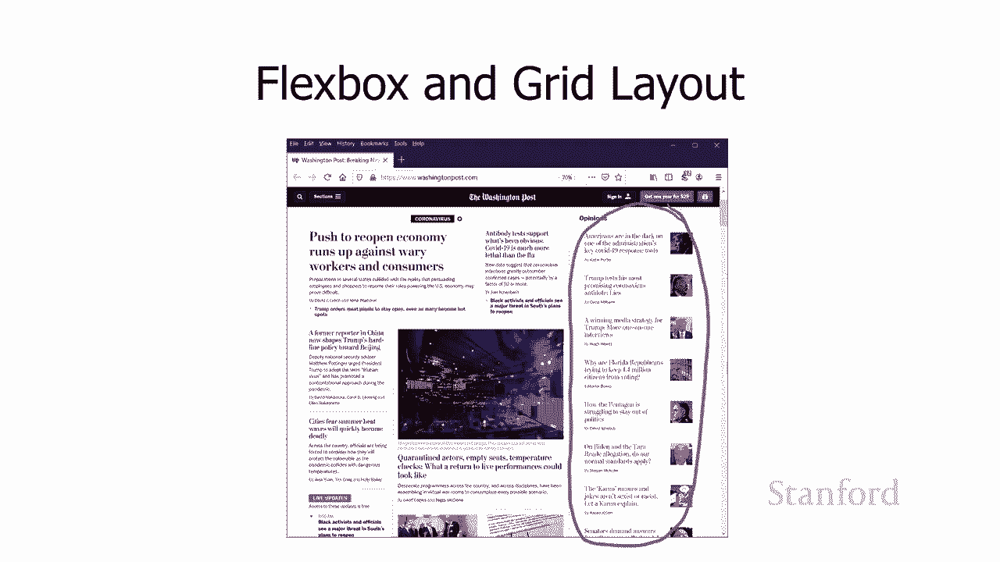

对于**复杂混合布局**，嵌套逻辑类似：
1.  外层Flex容器方向为行（`row`），包含左右两列。
2.  右列本身是一个Flex容器，方向为列（`column`），包含上下两部分。
3.  下部分又是一个Flex容器，方向为行（`row`），包含两个元素。

### 优点与缺点

**优点**：非常适合组件内部的微观布局，可以轻松实现元素顺序重排、对齐和空间分配。

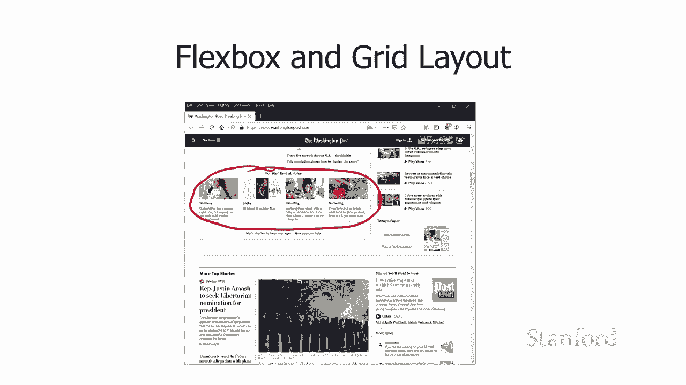

**缺点**（用于整体网页布局时）：
*   **仍受HTML结构限制**：布局能力很大程度上取决于HTML中元素的嵌套关系。虽然可以通过CSS改变排列方向（例如为移动端将行改为列），但整体结构变换的灵活性有限。

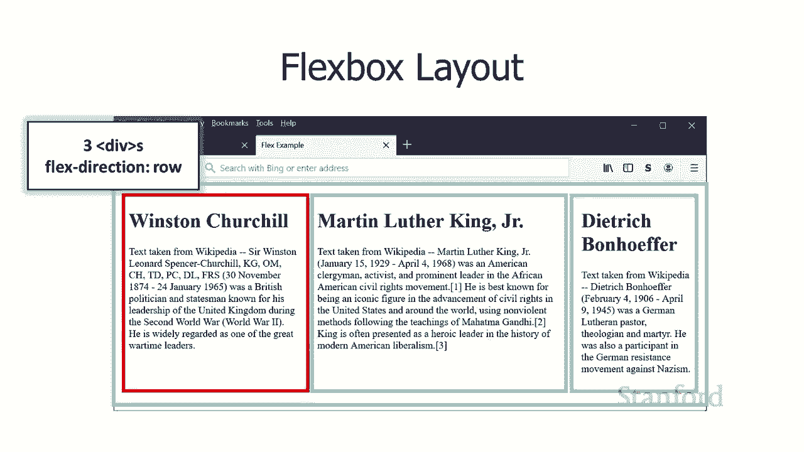

## 4. 基于网格的布局 🌐

基于网格的布局将网页视为一个二维网格系统，允许将元素精确放置在任何网格区域中。

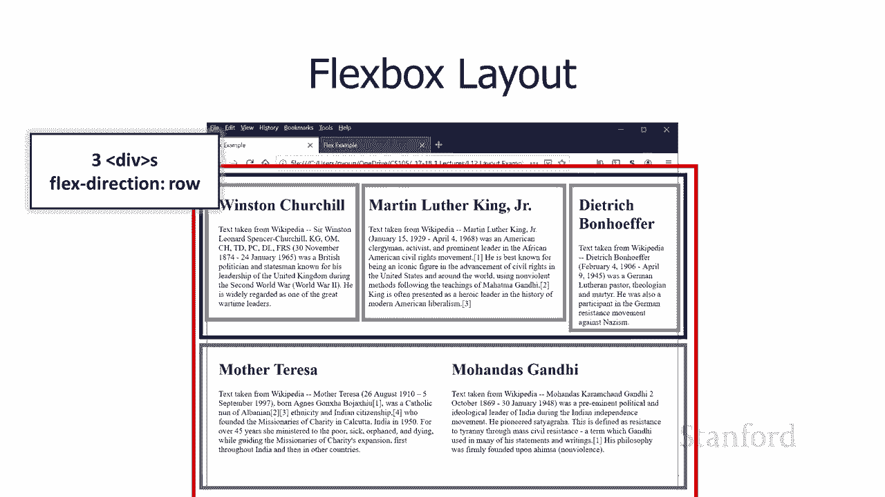

### 核心概念

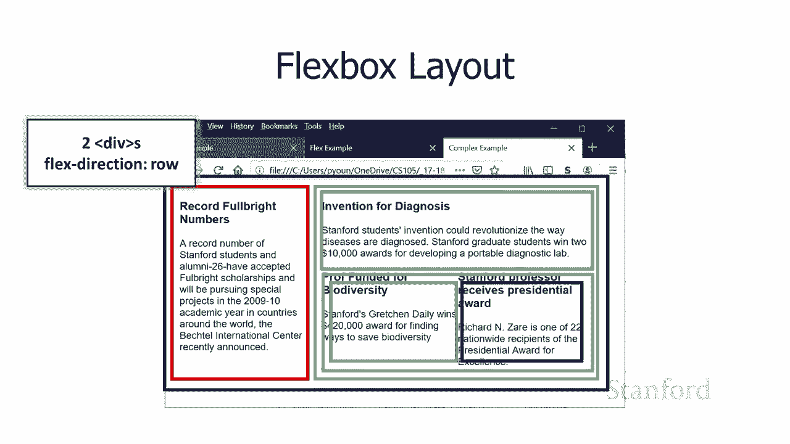

你可以将网页划分为任意行和列的网格，然后通过CSS直接将元素放置到特定的网格单元格中。元素甚至可以跨越多行或多列（使用`grid-row`和`grid-column`属性）。

### 实现思路

对于**简单的三列布局**：定义一个一行三列的网格。

对于**顶部三列、底部两列的布局**：
*   方法一：定义一个两行一列的网格，然后在两个网格单元格内分别嵌套一个三列网格和一个两列网格。
*   方法二：直接定义一个两行四列的网格，并使用`grid-column`属性让元素跨列。

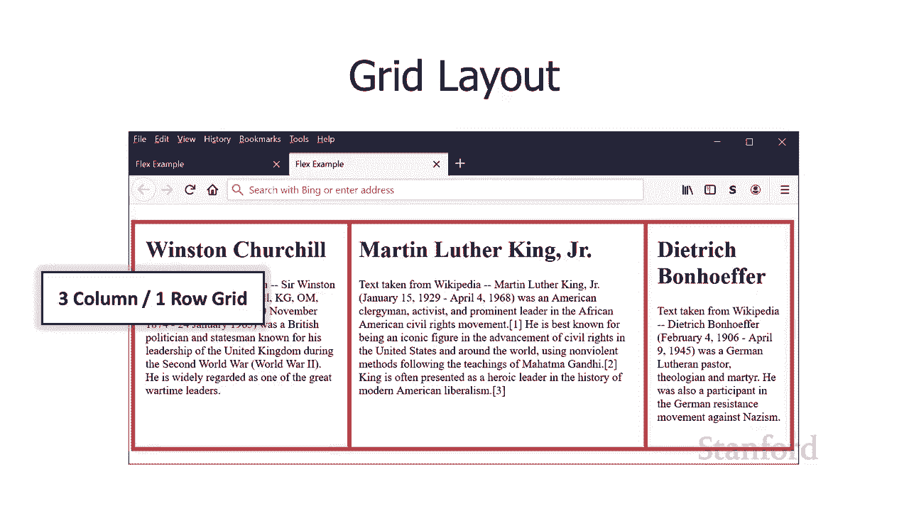

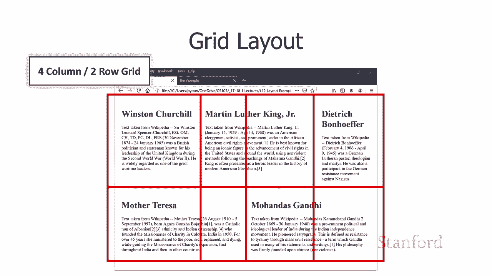

对于**复杂混合布局**：同样可以采用嵌套网格，或者直接定义一个三行两列的外层网格，并通过指定每个元素占据的网格区域来实现布局。

### 革命性优势

网格布局的图示与表格布局非常相似，但其根本区别在于**实现位置**。

*   **表格/浮动/Flexbox**：布局逻辑与HTML结构深度绑定。改变布局通常需要改动HTML。
*   **网格布局**：**布局定义完全在CSS中**。只要HTML中的元素有ID或类名，你就可以在CSS的网格定义中，自由决定将它们放置在任何位置。

这意味着你可以为桌面（大屏幕）、平板（中屏幕）和手机（小屏幕）在CSS中定义**完全不同的网格布局**，而**无需修改一行HTML代码**。这真正实现了内容与表现的彻底分离，提供了无与伦比的灵活性。

### 现状与推荐

**优点**：
*   **完全灵活**：CSS完全控制布局，与HTML解耦。
*   **易于理解**：二维网格模型比浮动的“hack”方式更直观，也比用Flexbox做宏观布局更清晰。
*   **强大能力**：轻松实现复杂、响应式的布局。

**唯一的缺点（正在减弱）**：浏览器兼容性。目前约95%的浏览器支持网格布局（Flexbox约97%，浮动接近100%）。对于绝大多数现代网站受众而言，这已不是问题。

**强烈推荐**：除非你的目标用户群体大量使用非常陈旧的浏览器（如某些特定环境下的旧版IE），否则**基于网格的布局绝对是应该采用的技术**。它代表了网页布局的未来。

## 总结

本节课我们一起学习了四种网页布局技术：
1.  **基于表格的布局**：已过时，将布局与内容混合在HTML中，难以维护。
2.  **基于浮动的布局**：曾是最主流的技术，兼容性好，但布局仍与HTML结构紧密相关，代码较混乱。
3.  **Flexbox布局**：擅长处理一维空间内子元素的排列，是微观布局的利器，但并非为整体网页布局设计。
4.  **基于网格的布局**：现代、强大的二维布局系统，将布局定义完全置于CSS中，实现了内容与表现的完美分离，是当前和未来构建复杂、响应式网页的首选技术。

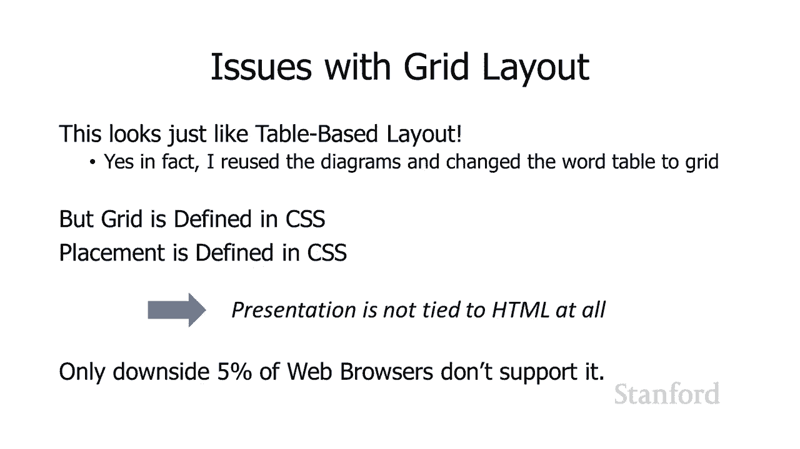

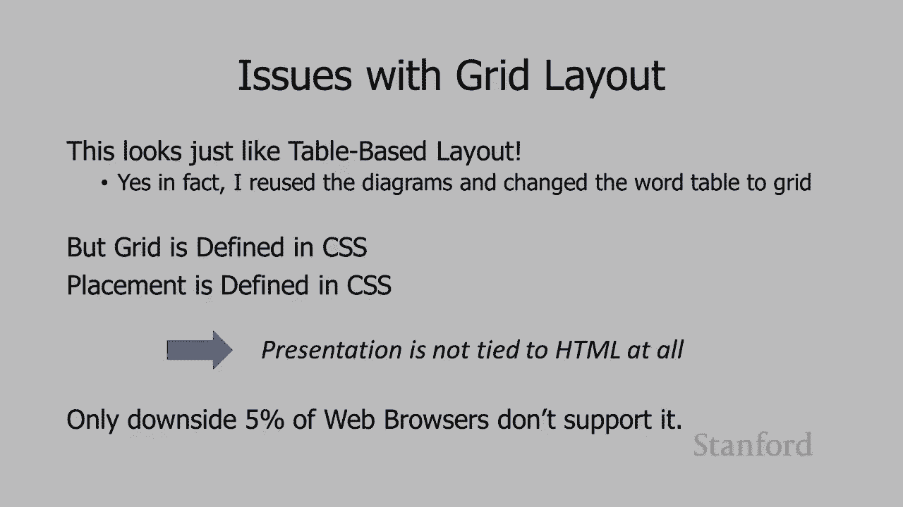

在下一讲中，我们将具体学习如何使用CSS Grid语法来创建网格并放置元素。