# 斯坦福CS105：计算机科学导论：L11.2：网页布局：基于网格的布局 📐


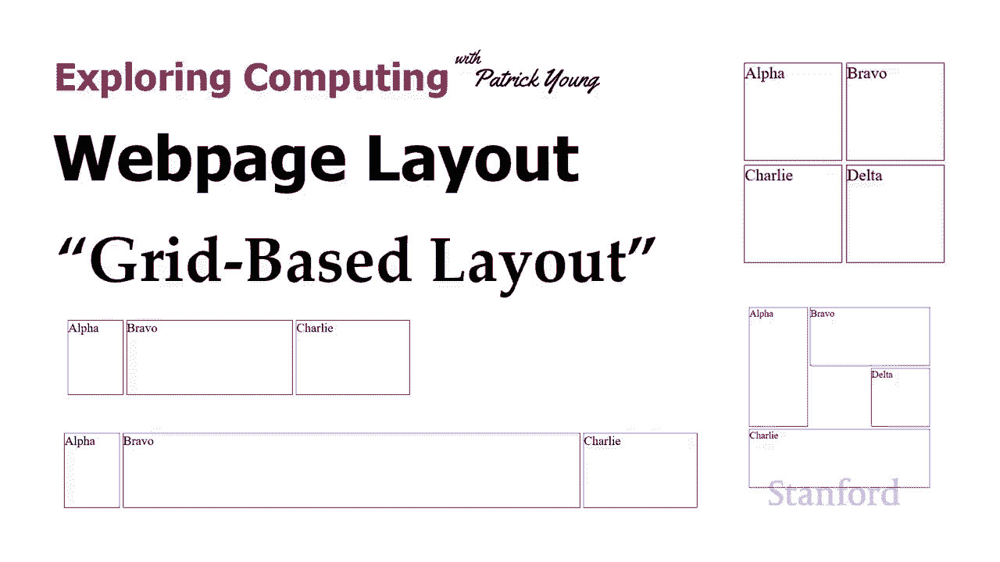

在本节课中，我们将要学习网页布局的核心技术之一：基于网格的布局。我们将了解如何定义网格、放置元素以及处理不同尺寸的内容，从而创建结构清晰、响应式的网页设计。

## 概述

基于网格的布局是一种强大的CSS技术，它允许开发者将网页内容组织在由行和列构成的网格中。与之前介绍的其他布局技术相比，网格布局提供了更直观和灵活的方式来控制元素在页面上的位置。

## 定义网格

要使用基于网格的布局，首先需要定义一个网格容器。这可以通过将父级元素的 `display` 属性设置为 `grid` 来实现。

```css
body {
  display: grid;
}
```

在上面的代码中，我们将整个网页的 `body` 元素定义为一个网格容器。如果你需要更复杂的嵌套结构，也可以将网格应用在任何其他父级元素上。

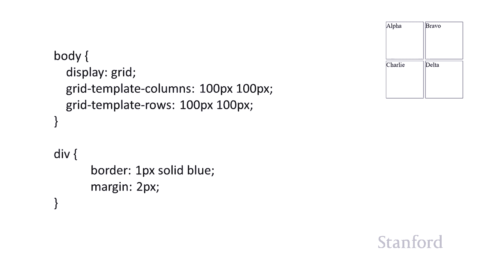

## 设置网格的行与列

定义了网格容器后，我们需要指定网格的行和列。这可以通过 `grid-template-columns` 和 `grid-template-rows` 属性来完成。

以下是一个创建2x2网格的示例：

```css
body {
  display: grid;
  grid-template-columns: 100px 100px; /* 两列，每列100像素 */
  grid-template-rows: 100px 100px;    /* 两行，每行100像素 */
}
```

这段代码创建了一个简单的正方形网格。每个网格单元格的尺寸是固定的。

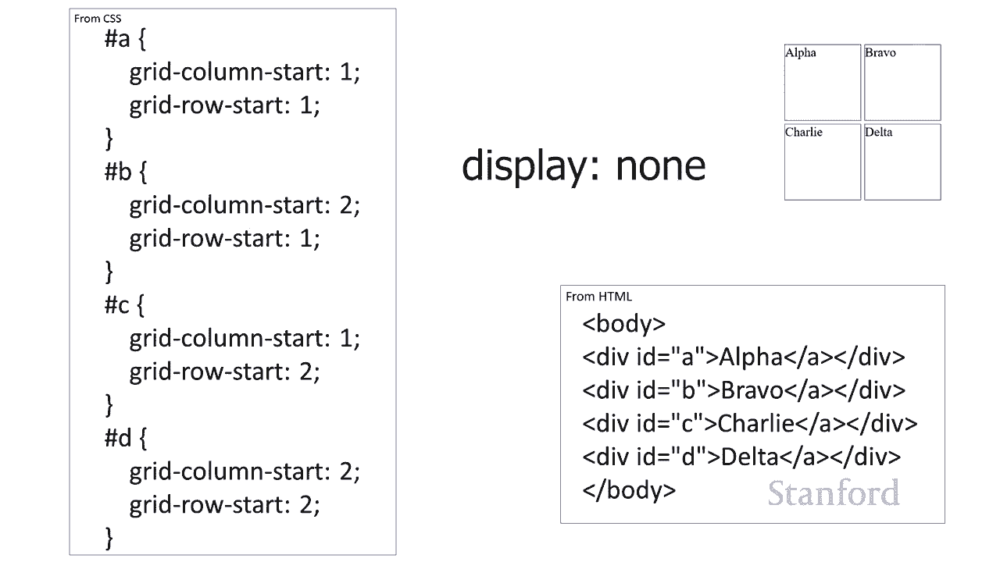

## 在网格中放置元素

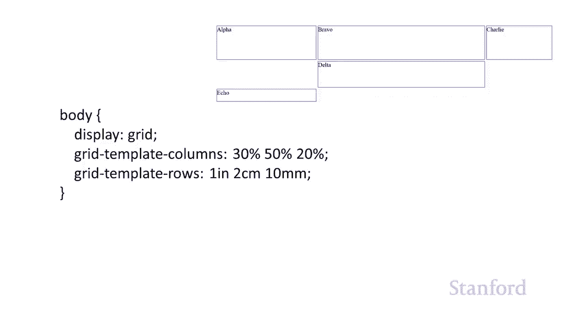

将网格容器设置好后，就可以将子元素放置到网格的特定位置上了。我们可以使用 `grid-column-start` 和 `grid-row-start` 属性来指定元素从哪一列、哪一行开始放置。

以下是将四个元素分别放置到2x2网格四个角上的示例：

```css
#a {
  grid-column-start: 1;
  grid-row-start: 1;
}
#b {
  grid-column-start: 2;
  grid-row-start: 1;
}
#c {
  grid-column-start: 1;
  grid-row-start: 2;
}
#d {
  grid-column-start: 2;
  grid-row-start: 2;
}
```

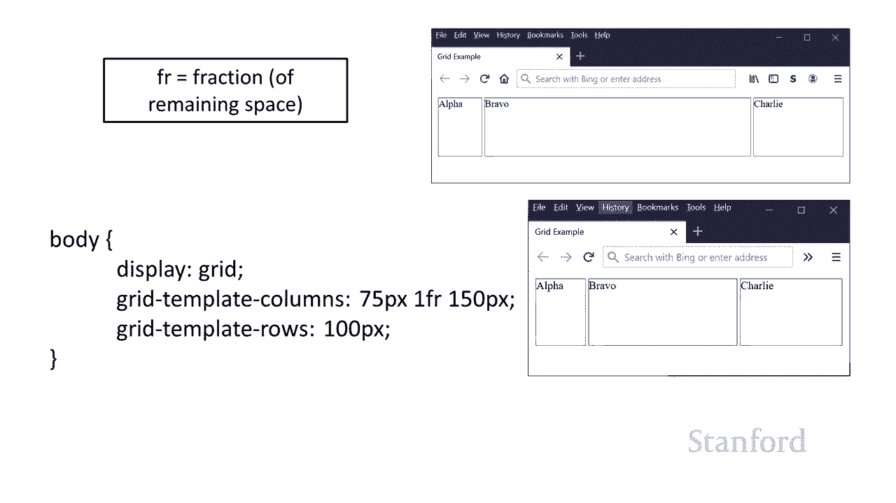

基于网格布局的一大优势是，元素的视觉位置可以完全独立于其在HTML文档中的顺序。这为我们提供了极大的布局灵活性。

## 网格的尺寸单位

在定义网格时，我们可以使用多种不同的单位来指定行和列的尺寸，这为创建响应式设计提供了便利。

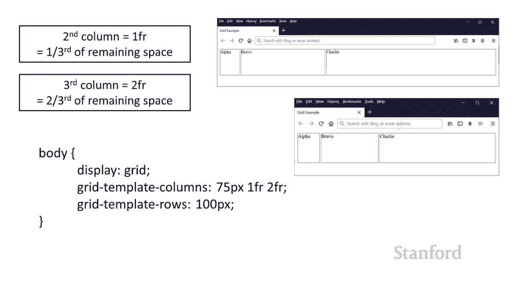

以下是几种常用的单位：
*   **固定单位**：如 `px`（像素）、`in`（英寸）、`cm`（厘米）。
*   **百分比**：如 `50%`，表示占据容器宽度的50%。
*   **分数单位 `fr`**：这是一个非常实用的单位，它表示在分配完所有固定尺寸后，剩余空间所占的份额。

`fr` 单位的使用示例如下：

```css
grid-template-columns: 75px 1fr 150px;
```

在这个例子中，第一列固定为75像素，第三列固定为150像素。中间的第二列则使用 `1fr`，这意味着它将占据扣除75px和150px后剩下的所有可用空间。

如果有多列使用 `fr` 单位，它们将按比例分配剩余空间。例如：

```css
grid-template-columns: 75px 1fr 2fr;
```

这里，剩余空间将被分成3份（1+2），第二列获得1/3，第三列获得2/3。

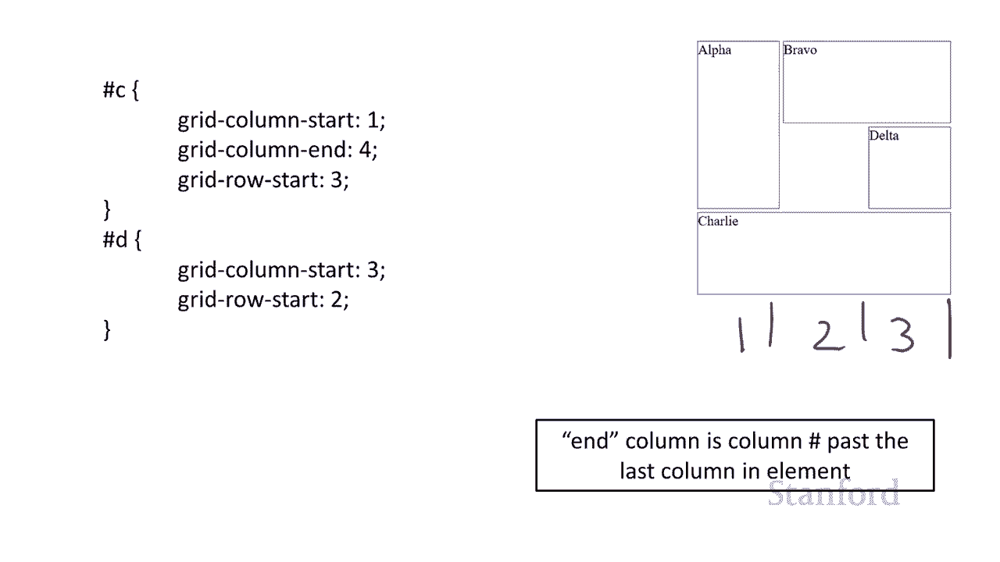

## 创建跨行或跨列的元素

有时我们需要让一个元素占据多个网格单元格。这可以通过同时指定 `start` 和 `end` 属性来实现。

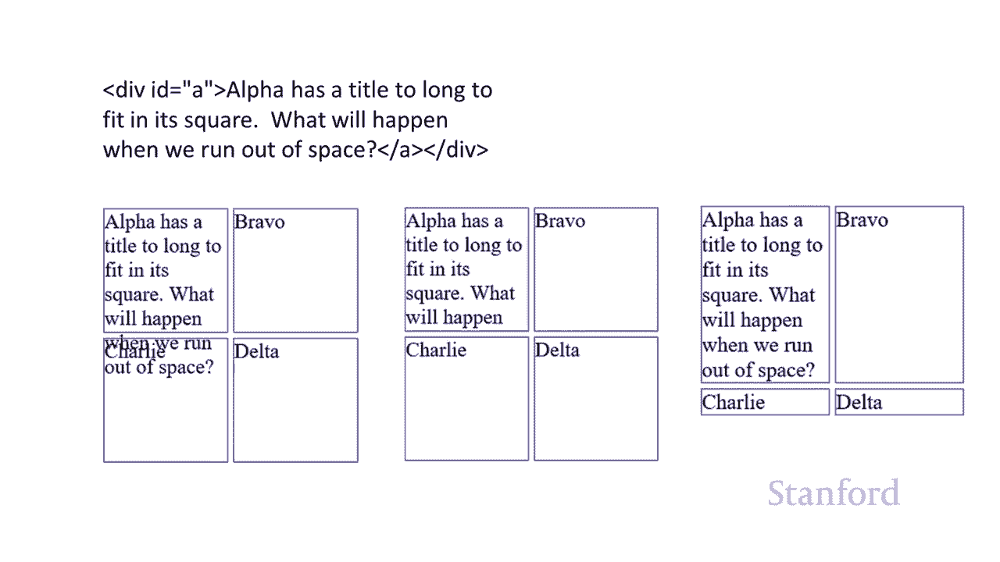

需要注意的是，`end` 的值指的是网格线编号，并且是“独占”的。例如，`grid-row-end: 3;` 意味着元素从开始行一直延伸到第3条网格线**之前**，即实际覆盖了第1行和第2行。

以下是一个元素跨两行、另一元素跨两列的示例：

```css
/* 元素A跨越第1行和第2行 */
#a {
  grid-column-start: 1;
  grid-row-start: 1;
  grid-row-end: 3; /* 结束于第3条行网格线前 */
}

/* 元素B跨越第2列和第3列 */
#b {
  grid-column-start: 2;
  grid-column-end: 4; /* 结束于第4条列网格线前 */
  grid-row-start: 1;
}
```

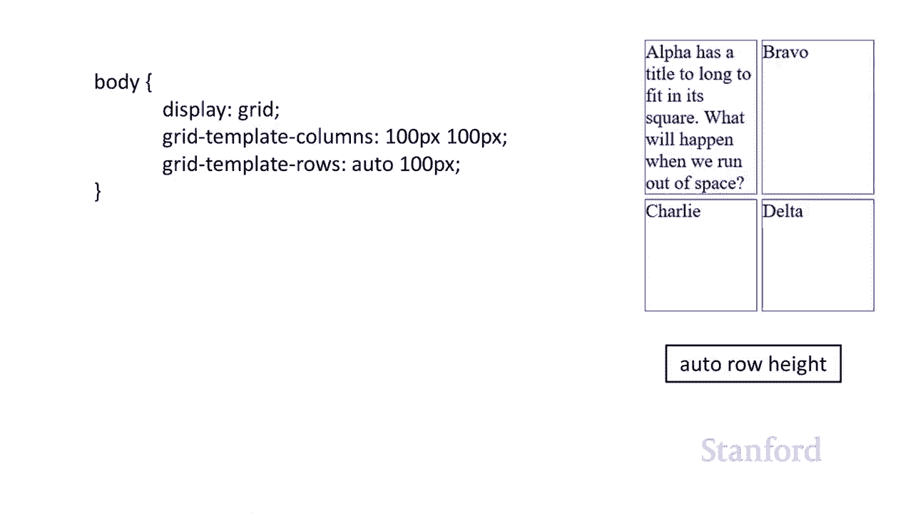

## 处理内容尺寸与自动行高

在实际应用中，网格单元格内的内容高度往往是未知的。我们可以通过将行高设置为 `auto` 来让行高根据内容自动调整。

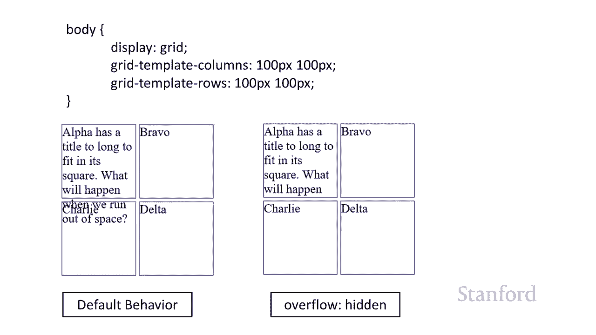

```css
body {
  display: grid;
  grid-template-columns: 100px 100px;
  grid-template-rows: auto 100px; /* 第一行自动调整，第二行固定100像素 */
}
```

这样，第一行的高度会扩展到足以容纳该行中最高的元素，而第二行则保持固定高度。

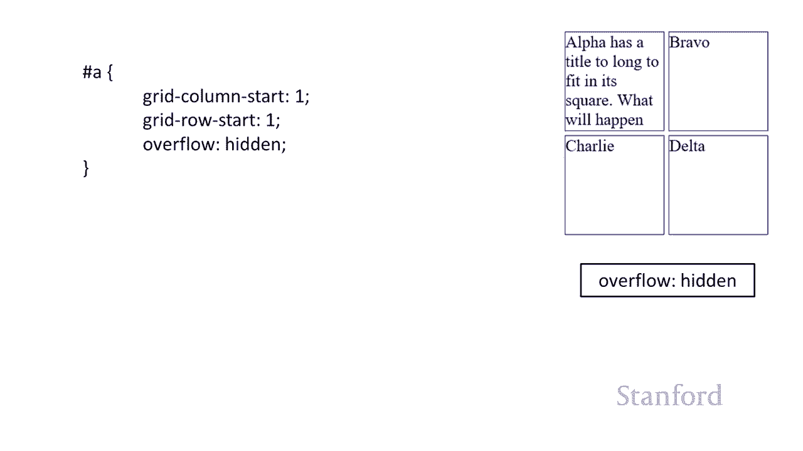

如果内容超出了固定高度的单元格，默认行为是内容溢出。我们可以使用 `overflow` 属性来控制这一行为。

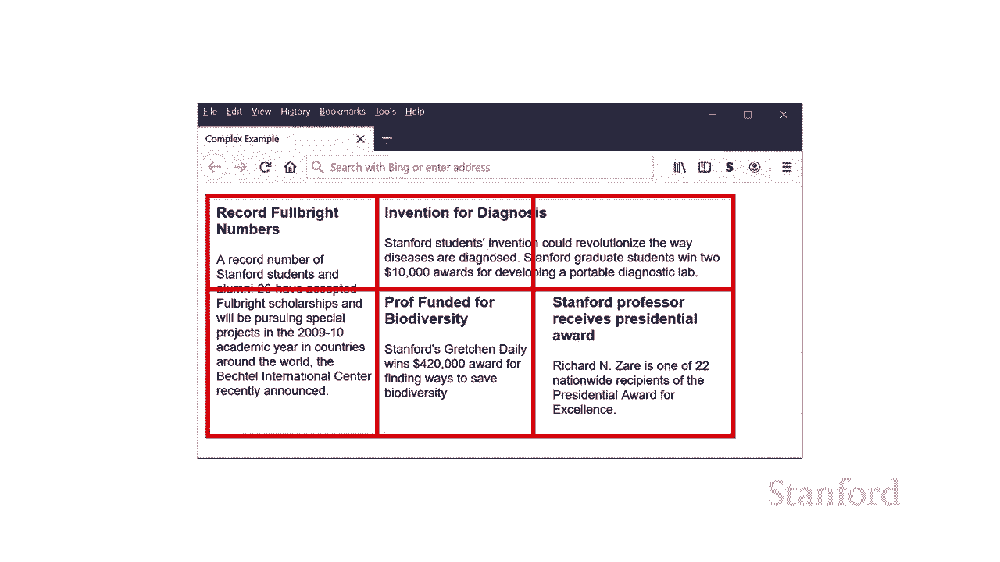

```css
.grid-item {
  overflow: hidden; /* 超出部分将被隐藏 */
}
```

## 实战示例：新闻布局

让我们看一个更接近实际网站的例子：一个简单的新闻主页布局。

**HTML结构：**
```html
<div id="main">
  <div id="story1">...</div>
  <div id="story2">...</div>
  <div id="story3">...</div>
  <div id="story4">...</div>
</div>
```

**CSS网格布局：**
```css
#main {
  display: grid;
  grid-template-columns: 1fr 1fr 1fr; /* 三列等宽 */
  grid-template-rows: auto; /* 行高自动 */
  gap: 10px; /* 网格间隙 */
}

#story1 {
  grid-column-start: 1;
  grid-column-end: 4; /* 横跨三列 */
  grid-row-start: 1;
}
#story2 {
  grid-column-start: 1;
  grid-row-start: 2;
}
/* ... 其他故事元素的定位 */
```

在这个布局中，头条新闻（`#story1`）横跨所有三列，而其他新闻则排列在下方的网格中。通过只修改CSS，我们就可以轻松调整各个新闻块的位置和大小，而无需改动HTML结构，这充分体现了网格布局的灵活性。

## 总结

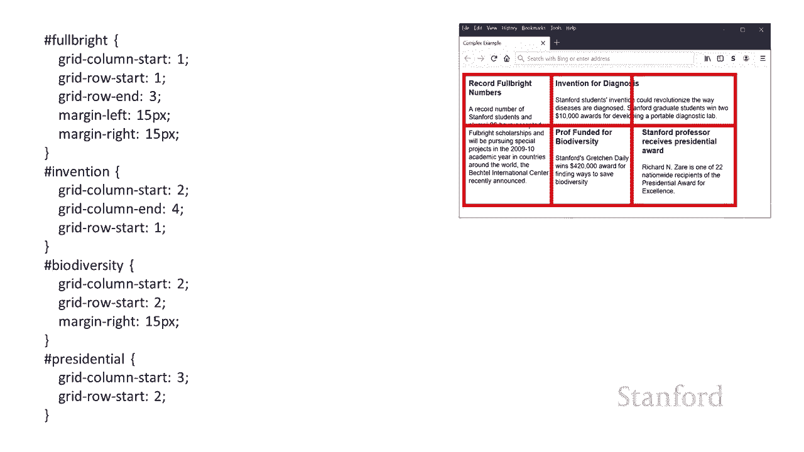


本节课中我们一起学习了基于网格的CSS布局。我们从如何定义一个网格开始，学习了设置行与列、使用不同的尺寸单位（特别是灵活的 `fr` 单位），以及如何将元素精确地放置到网格中，包括创建跨行跨列的元素。我们还探讨了如何处理动态内容的高度和内容溢出问题。最后，通过一个新闻布局的实战示例，我们看到了网格布局在创建复杂、灵活且结构清晰的网页设计中的强大能力。掌握网格布局是迈向专业前端开发的关键一步。