# L12：网页重现：《纽约时报》 🗞️

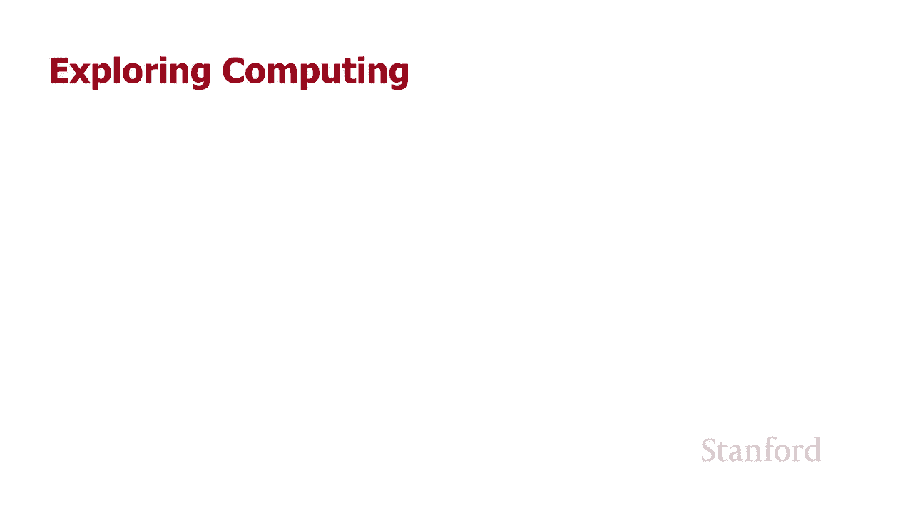

在本节课中，我们将学习如何使用基于网格的CSS布局，从头开始复制《纽约时报》首页。我们将看到网格布局如何简化复杂网页的构建过程，并探索处理页面中特殊区域的技巧。

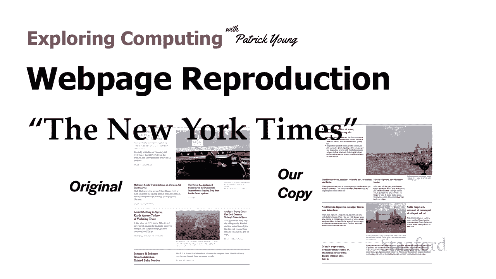

## 概述

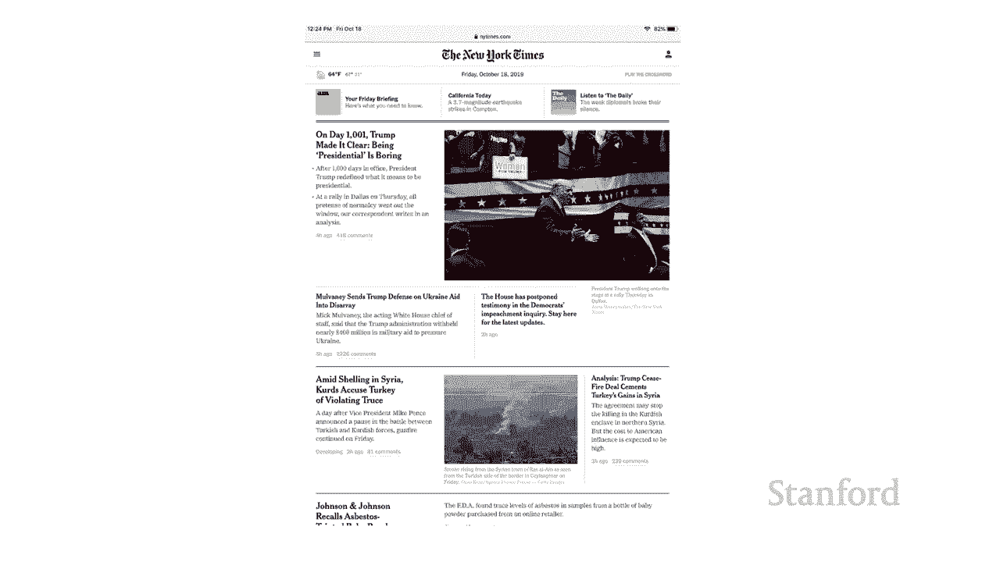

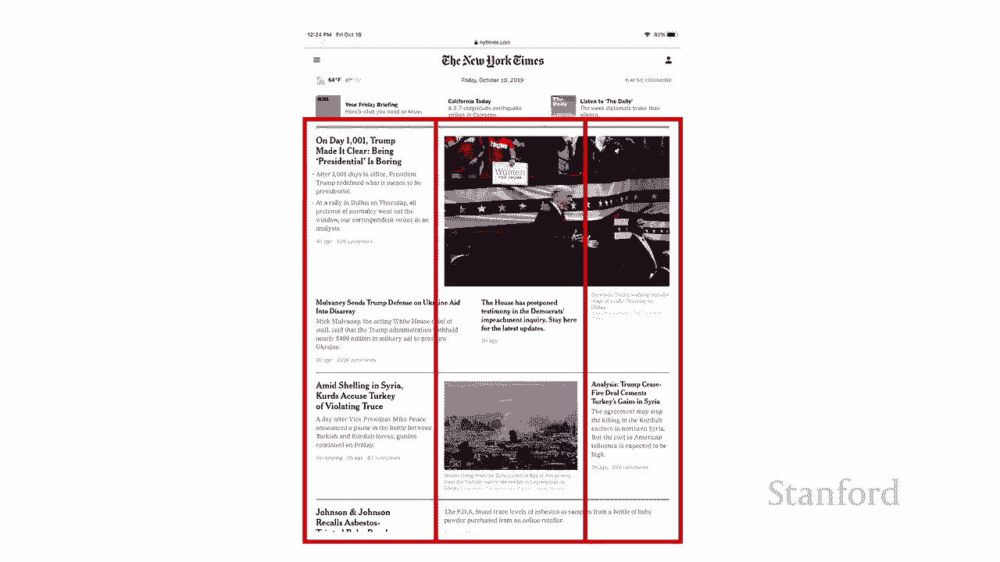

我们将使用基于网格的布局来重现《纽约时报》首页。网格布局允许我们轻松创建复杂的多列设计，而无需依赖浮动或Flexbox等传统方法。本节将展示网格布局的强大灵活性，并逐步构建页面。

## 页面结构分析

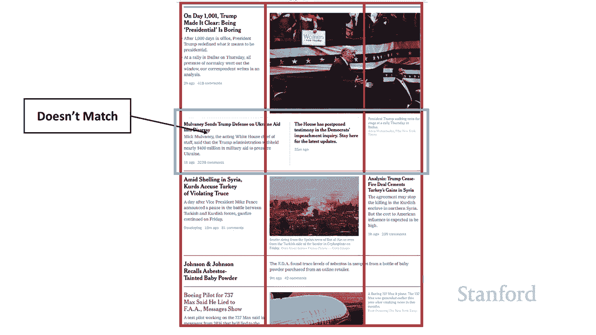

首先，我们来分析《纽约时报》首页的结构。页面主要分为三列，但某些区域并不严格遵循这个规则。


以下是需要注意的几个关键点：
*   页面主体由三列构成。
*   底部有一个区域横跨了两列，这使用了**列跨度**功能。
*   顶部的照片也横跨了多列。
*   中间有一行内容的结构比较特殊，我们稍后会处理它。

目前，我们暂时忽略中间的特殊行，假设所有内容要么遵循主要的三列布局，要么是在这三列上的一个简单跨度。

## 初始布局与网格设置

现在，我们开始构建页面。左边是我们将要创建的副本，右边是《纽约时报》的实际截图作为参考。


我们使用“lorem ipsum”拉丁文假文本作为文章内容。首先，查看基础的HTML结构。

```html
<body>
  <div id="a1">...</div>
  <div id="a2">...</div>
  <div id="b1">...</div>
  <div id="b2">...</div>
  <div id="b3">...</div>
  <div id="c1">...</div>
  <div id="c2">...</div>
</body>
```

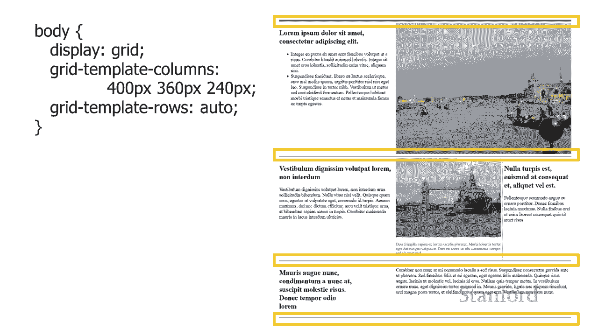

HTML中创建了许多`<div>`，并按照布局的行（A、B、C）进行标记。**网格布局的优势之一**是，我们不受HTML元素顺序的限制，可以在CSS中任意放置它们。这种灵活性是浮动或Flexbox布局难以实现的。

接下来，我们将网格应用到`<body>`上。

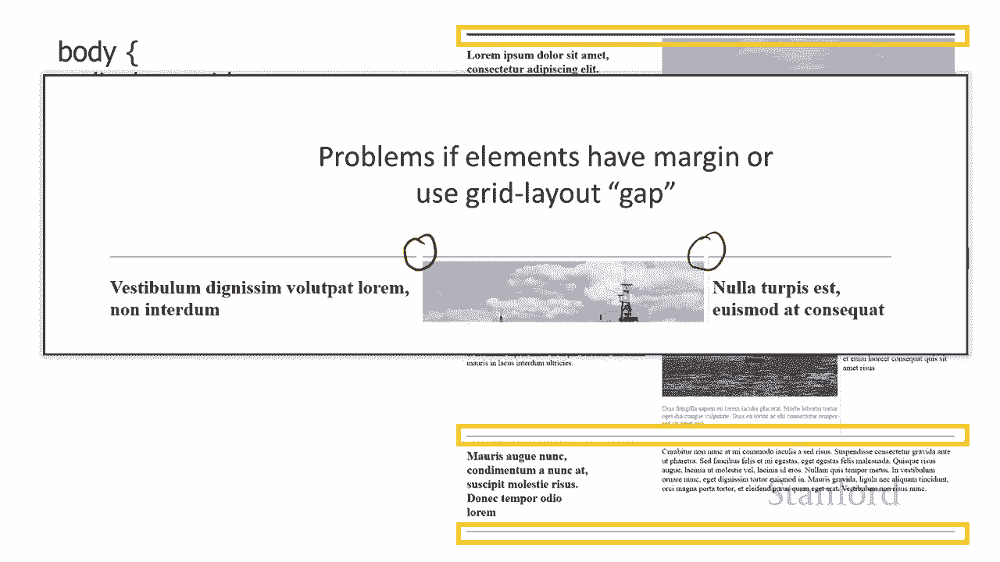

```css
body {
  display: grid;
  grid-template-columns: 400px 360px 240px;
  grid-template-rows: auto;
}
```

这里将列宽设置为400像素、360像素和240像素，行高设置为`auto`，意味着行高会根据内容自动调整。

## 创建分隔线

观察原版页面，各版块之间有清晰的分隔线。


有多种方法可以创建这些线。最初尝试在每个内容元素上添加`border-top`，但元素之间的`margin`或`gap`会导致线条出现中断。


因此，我们选择创建独立的`<div>`来专门绘制这些线条。由于顶部的线更粗，我们为它们设置不同的类名。

```html
<body>
  <div class="line-top"></div>
  <div id="a1">...</div>
  ...
  <div class="line-middle"></div>
  ...
  <div class="line-bottom"></div>
</body>
```

这些线条`<div>`是`<body>`的直接子元素，因此可以被放置在我们为`<body>`设置的网格中的任何位置。我们通过CSS为它们添加边框。

```css
.line-top, .line-middle, .line-bottom {
  border-top: 1px solid #ccc;
  margin: 5px 0;
}
.line-top {
  border-top-width: 2px; /* 顶部线条更粗 */
}
```

这些线条`<div>`将横跨所有三列（从第1列到第4列），因此不会因为列间隙而中断，完美地形成了贯穿页面的水平线。

## 放置内容元素

设置好网格和线条后，我们开始放置具体的内容元素。

第一个元素（A1）是左上角的文章。我们将其放置在网格的第2行、第1列。

```css
#a1 {
  grid-row: 2;
  grid-column: 1;
  margin-right: 8px;
}
```

`div`中可以包含任何可渲染的元素，如标题、列表、图片等。

接下来是威尼斯图片（A2），它需要横跨两列。

```css
#a2 {
  grid-row: 2;
  grid-column: 2 / 4; /* 从第2列开始，到第4列结束（即跨越第2、3列） */
  width: 600px;
}
```

**图片宽度的计算**很重要：由于它横跨了第2列（360px）和第3列（240px），所以总宽度设置为600px。如果图片位置改变，宽度也需要相应调整。

然后我们放置B部分的内容。B2区域包含一张图片及其下方的标题。

```html
<div id="b2">
  
  <p>Image caption here...</p>
</div>
```

```css
#b2 {
  grid-row: 4;
  grid-column: 2;
  width: 360px; /* 与列宽一致 */
}
#b2 p {
  font-size: 0.9em;
  color: #555;
}
```

B3区域是右侧的新闻文章，我们为其添加一个浅灰色的左边框，以模拟原版页面中的垂直分隔线。

```css
#b3 {
  grid-row: 4;
  grid-column: 3;
  border-left: 1px solid #eee;
  padding-left: 10px;
  margin-left: 10px;
}
```

最后是C部分底部的元素，它也是一个列跨度元素。

```css
#c2 {
  grid-row: 6;
  grid-column: 2 / 4; /* 横跨第2、3列 */
}
```

## 实现页面居中

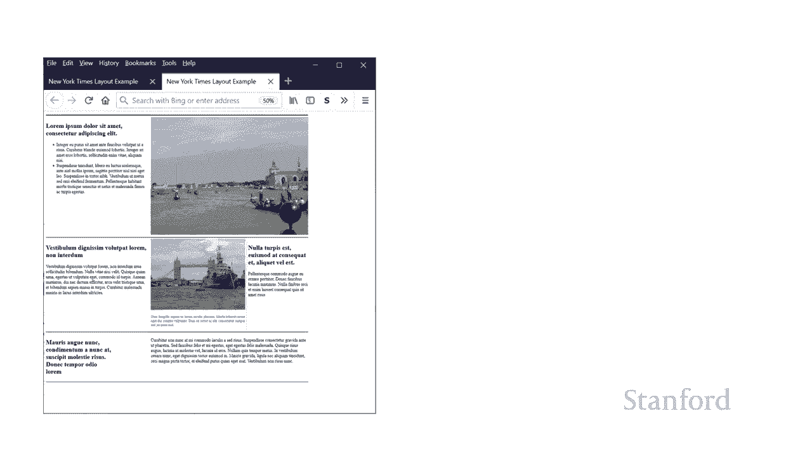

目前，我们的页面紧贴浏览器窗口左上角。当窗口变宽时，右侧会出现大片空白。


我们希望页面能像原版一样始终居中。解决方法是：将所有内容包裹在一个`<div id="main">`中，然后让这个容器在页面中居中。

```html
<body>
  <div id="main">
    <!-- 所有之前的内容都放在这里 -->
  </div>
</body>
```

我们修改`<body>`的网格，创建三个新列：左右两边是弹性空间（`1fr`），中间是固定宽度（1000px）的内容区。

```css
body {
  display: grid;
  grid-template-columns: 1fr 1000px 1fr;
}
#main {
  grid-row: 1;
  grid-column: 2; /* 将主要内容放在中间列 */
}
```

然后，在`#main`内部，我们重新定义之前用于内容布局的三列网格。

```css
#main {
  display: grid;
  grid-template-columns: 400px 360px 240px;
  grid-template-rows: auto;
}
/* 之前所有内容元素（#a1, #a2, .line-top等）现在都是 #main 的子元素，其网格位置规则不变 */
```

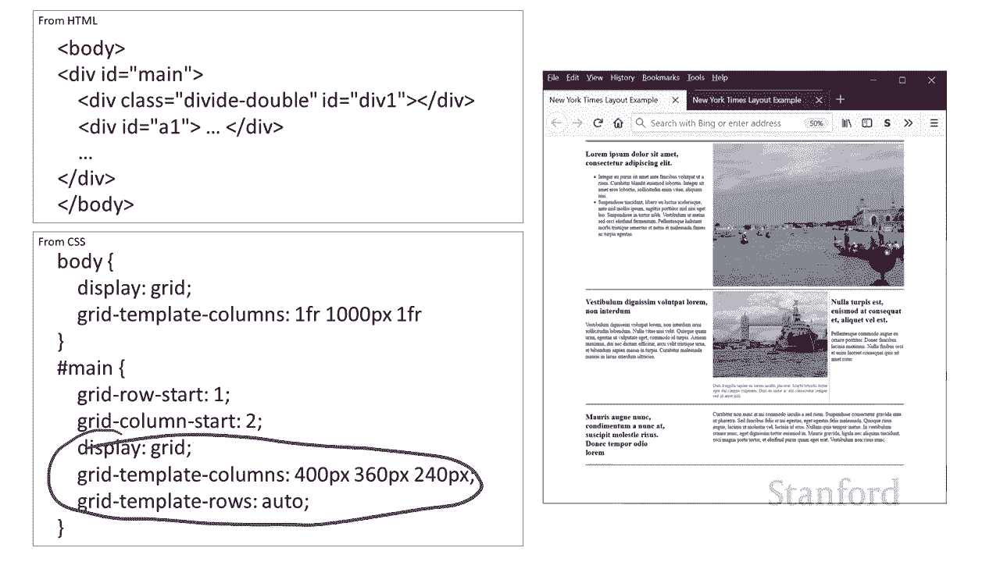

这样，`#main`本身在页面中居中，其内部再使用原来的网格进行精细布局。

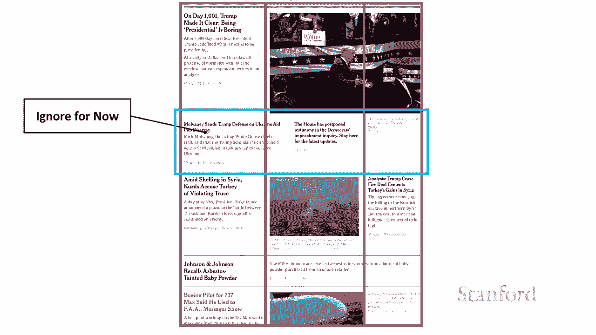

## 处理特殊布局区域

现在，我们来处理之前忽略的那个特殊区域。这个区域没有遵循通用的三列规则。

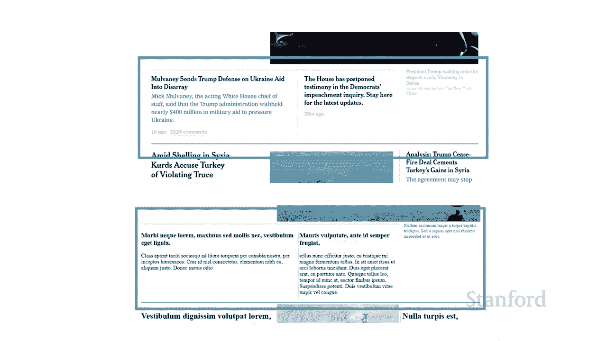


这个区域包含多个元素，横跨了所有三列，并且内部还有自己的结构和边框。

一种方法是为主网格添加第四列，但这会迫使其他所有元素都需要调整列跨度。我们选择另一种方法：**创建一个横跨两列的容器`<div>`，然后在这个容器内部再建立一个独立的网格**。

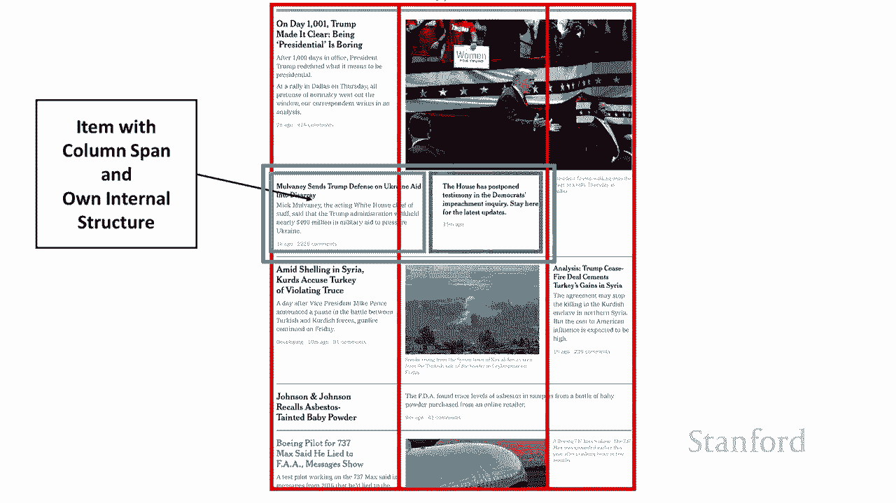


HTML结构如下：

```html
<div id="x1">
  <div id="xy1">Story 1</div>
  <div id="xy2">Story 2</div>
</div>
<div id="x2">Right-side caption</div>
```

CSS布局如下：

```css
/* 主网格中放置这个特殊容器 */
#x1 {
  grid-row: 3; /* 假设放在第3行 */
  grid-column: 1 / 3; /* 横跨第1、2列 */
  border-top: 1px solid #ccc;
  padding-top: 10px;
  display: grid; /* 内部再建一个网格 */
  grid-template-columns: 460px 300px;
  gap: 15px; /* 内部两个故事之间的间隙 */
}
#xy1 { grid-row: 1; grid-column: 1; }
#xy2 { grid-row: 1; grid-column: 2; }

/* 右侧的标题单独放置 */
#x2 {
  grid-row: 3;
  grid-column: 3;
}
```

通过这种方式，我们成功地在主网格中嵌入了一个具有独立结构的复杂区域。

## 最终成果与总结

完成所有步骤后，我们的复制品与原版《纽约时报》首页已经非常接近。

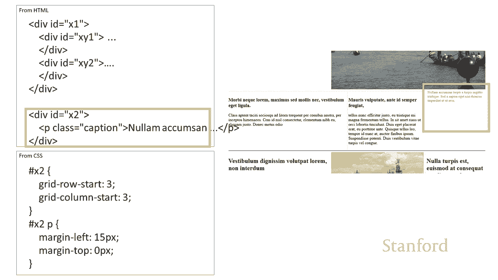


本节课中，我们一起学习了如何使用CSS网格布局来重现一个复杂的网页。我们掌握了以下核心技能：
1.  **分析页面结构**并将其分解为网格。
2.  **定义网格容器**（`display: grid`）并设置列与行（`grid-template-columns/rows`）。
3.  **使用列跨度**（`grid-column: start / end`）来创建横跨多列的区域。
4.  **实现页面居中**，通过在外层创建带有弹性空间的网格。
5.  **处理嵌套布局**，在网格项目内部创建新的网格来处理特殊结构。
6.  **创建视觉分隔线**，使用独立的网格项目或边框。

网格布局提供了强大的灵活性和控制力，使得创建如《纽约时报》这样复杂的版面变得清晰且易于管理。希望本教程能帮助你理解并开始运用这一强大的CSS工具。


