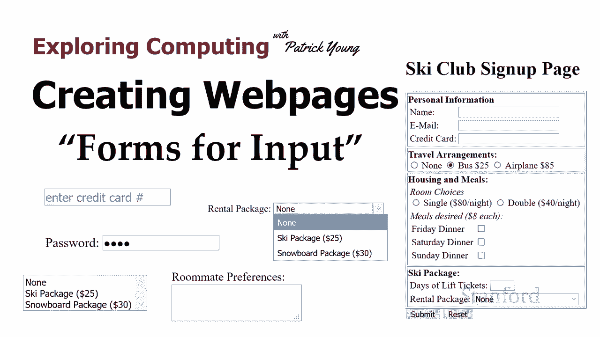
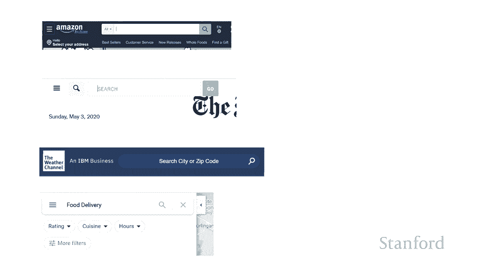
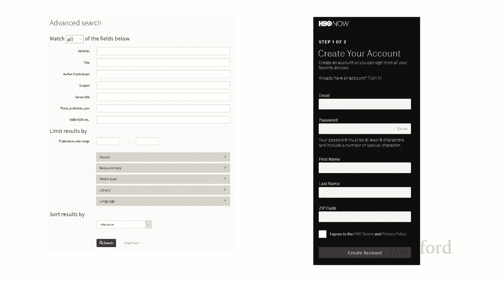
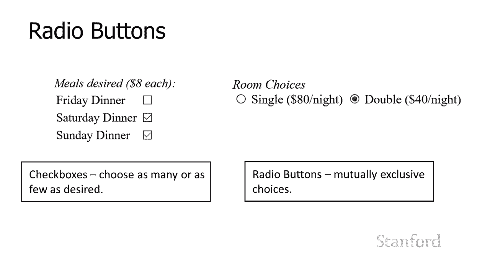
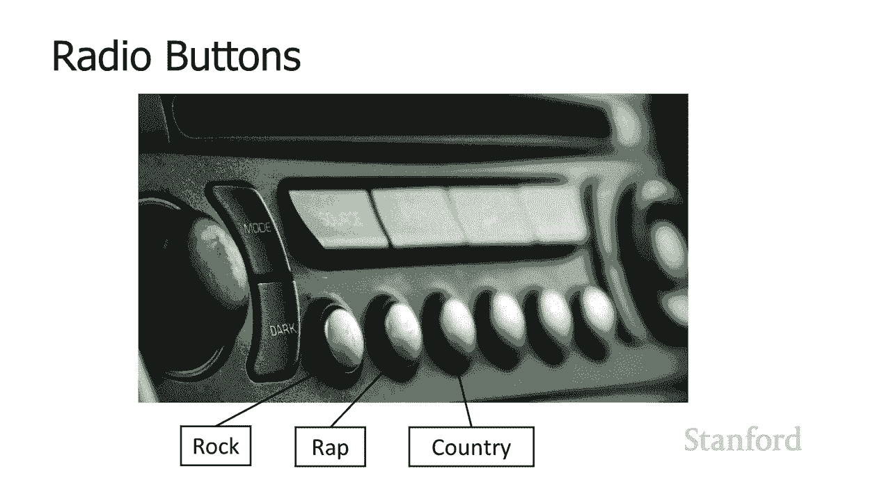
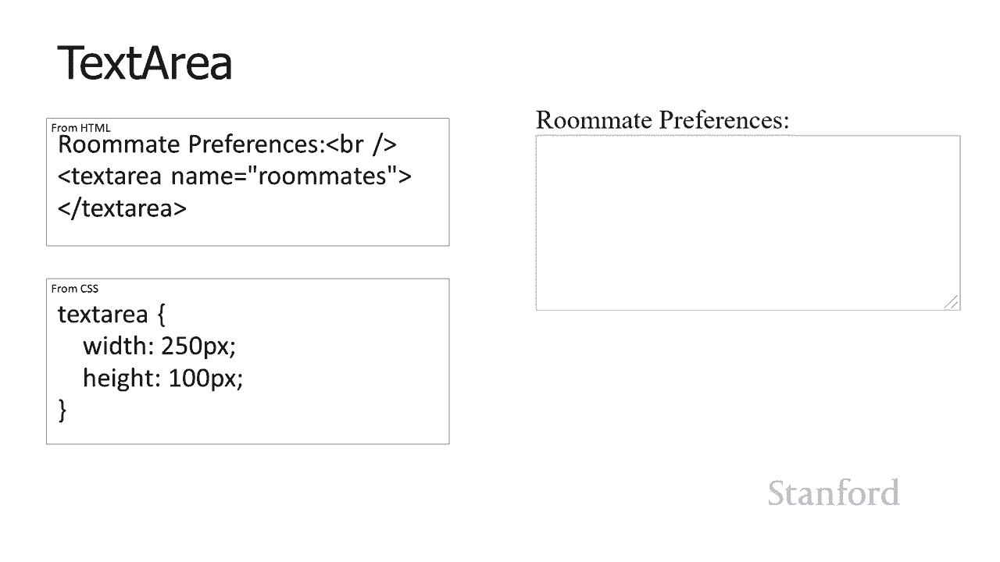
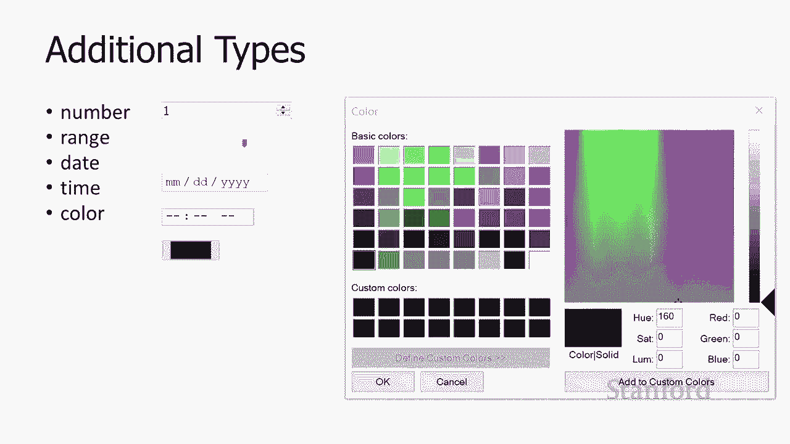

# 斯坦福CS105：计算机科学导论：L13.1：创建网页：输入表单 📝





在本节课中，我们将要学习如何创建网页表单。表单是网页与用户进行交互的核心工具，它允许用户输入信息并提交给服务器。我们将从基础开始，了解各种表单元素及其用途。



到目前为止，我们一直在研究如何在网页上呈现信息。但网站所做的不仅仅是允许呈现信息，它们实际上允许查看者和网站之间进行交互。因此，为了做到这一点，我们需要使用表单。在本视频中，我们将向您展示如何创建表单的基础知识。

## 表单概述

以下是表单在网页上的常见应用示例：
*   **亚马逊搜索**：允许用户输入搜索关键词。
*   **纽约时报搜索文章**：提供搜索框以查找新闻。
*   **天气频道**：让用户输入地点以查询天气。
*   **谷歌地图**：提供复杂的表单，包含下拉菜单等元素，用于筛选餐厅等。

表单可以变得非常复杂。例如，斯坦福图书馆的高级搜索表单包含多种可勾选的选项；HBO的账户创建页面也是一个典型的表单应用。

在本课程中，我们将重点关注如何实际创建网页以提交信息，而不是服务器本身将如何响应该信息。CS106E的学生将会更深入地学习服务器端如何处理提交的信息。

## 表单与表单元素

现在，让我们来看看我们的示例表单。这个表单允许滑雪俱乐部的成员提交旅行信息。您可以看到有各种不同的元素允许用户输入信息。

在HTML术语中，允许用户提交信息的整个项目被称为 **`<form>`**。而用户在其中输入信息的具体元素（如文本框、按钮）被称为 **表单元素**。在计算机科学中，这些类型的项目通常被称为“控件”或“小部件”。所以，一个HTML表单元素本质上是一个出现在网页上的控件。

我们将把我们所有的控件或我们的表单元素放在一个`<form>`标签中。现在，我只想放一个`id`以便我们可以识别它，方便后续添加样式或以某种方式使用它。`id`实际上并不是必需的，这里可能会出现一堆其他属性。例如，如果用户要将表单信息提交给Web服务器，服务器需要知道处理这些信息的程序在哪里，因此还会有其他属性。但现在，我们将专注于表单标签本身和出现在其中的元素。

## 输入元素：文本框与密码框

使用`<input>`标签可以创建多种表单元素。`<input>`标签是一个多用途标签，它创建了一堆我们在这个网页上看到的不同元素，以及其他一些元素。输入元素的确切用途由它的`type`属性来确定。

以下是常见的输入元素类型：

### 文本输入框
当`type`属性设置为`text`时，它创建一个单行文本字段。
```html
<input type="text" name="creditcard" value="1234-1234-1234-1234" placeholder="输入信用卡号">
```
*   **`name`**：当信息被发送到网络服务器时，`name`决定了如何识别该字段。服务器将收到“名称-值”对。
*   **`value`**：这是将提交给Web服务器的内容。如果用户没有在该字段中输入任何内容，则提交这个初始值。用户可以编辑它。
*   **`placeholder`**：给出预期内容的提示（浅灰色显示）。它不是实际值，用户点击时它会消失。

### 密码输入框
`type`属性为`password`时，其工作方式与文本类型非常相似，不同之处在于用户输入的内容会显示为圆点或星号。
```html
<input type="password" name="userpass">
```
**请注意**：此密码字段仅能防止旁人偷看屏幕，并不能保护信息在互联网上传输的安全。要实现真正的密码保护，需要使用HTTPS协议。

## 输入元素：复选框与单选按钮



上一节我们介绍了用于文本输入的控件，本节中我们来看看用于进行选择的控件。



### 复选框
`type`属性为`checkbox`时，创建复选框，允许用户选择多个独立选项。
```html
<input type="checkbox" name="friday_dinner" checked> 周五晚餐
```
*   **`checked`**：此属性使复选框初始状态为选中。
*   与输入元素关联的标签需要手动添加，放在`<input>`标签之外。

### 单选按钮
`type`属性为`radio`时，创建单选按钮，用于在一组**互斥**的选项中进行选择。
```html
<input type="radio" name="travel" value="bus" checked> 巴士
<input type="radio" name="travel" value="plane"> 飞机
<input type="radio" name="travel" value="car"> 自驾
```
*   **互斥性**：同一`name`属性下的所有单选按钮构成一组，只能选择其中一个。
*   **`value`**：指定当该选项被选中时，提交给服务器的值。
*   **`checked`**：指定组中的默认选中项。

**重要区别**：复选框用于可以多选或全不选的场景；单选按钮用于必须且只能从一组中选择其一的场景。请根据目的正确使用。

## 按钮元素

表单中通常需要按钮来触发提交或重置操作。

### 提交与重置按钮
使用`<input>`标签，`type`属性设置为`submit`或`reset`。
```html
<input type="submit" value="提交表单">
<input type="reset" value="重置信息">
```
*   **`type=”submit”`**：单击后，收集表单中所有信息（名称-值对）并发送到Web服务器。
*   **`type=”reset”`**：单击后，丢弃用户输入的所有信息，所有表单元素恢复其初始值。
*   **`value`**：此属性定义了显示在按钮上的文本。不同浏览器可能有不同的默认文本，因此建议明确设置。

### 通用按钮
`type`属性为`button`时，创建一个通用按钮，通常用于客户端脚本处理（如JavaScript），而不是提交信息到服务器。
```html
<input type="button" value="点击我">
```

## 下拉选择与文本区域

除了基本的输入框和按钮，表单还提供了更复杂的选择和多行文本输入方式。

### 下拉选择框
使用`<select>`和`<option>`标签创建下拉菜单。
```html
<select name="rental_package">
  <option value="none">无租赁套餐</option>
  <option value="ski" selected>滑雪套餐 $25</option>
  <option value="board">滑雪板套餐 $30</option>
</select>
```
*   **`<select>`**：定义整个选择框，`name`属性用于服务器识别。
*   **`<option>`**：定义每个选项。
*   **`value`**：指定提交给服务器的值，可以与显示文本不同，这能避免特殊字符（如`$`）传输问题。
*   **`selected`**：指定默认选中的选项。
*   **`size`**：设置此属性（如`size=”3″`）可将下拉菜单变为固定高度的列表框。

### 文本区域
使用`<textarea>`标签创建多行文本输入框，与单行文本字段（`<input type=”text”>`）相对。
```html
<textarea name="comments" rows="4" cols="50">请在此输入您的评论...</textarea>
```
*   它是一个双标签，必须有结束标签`</textarea>`。
*   初始文本必须放在开始标签和结束标签之间，而不是使用`value`属性。
*   可以使用`rows`和`cols`属性设置初始大小，但更推荐使用CSS进行样式控制。

## 其他输入类型

HTML5还引入了一些更专门的输入类型，用于特定类型的数据：

*   **数字**：`<input type=”number”>` 显示带增减箭头的数字输入框。
*   **范围滑块**：`<input type=”range”>` 创建一个滑块。
*   **日期**：`<input type=”date”>` 提供日期选择器。
*   **时间**：`<input type=”time”>` 提供时间选择器。
*   **颜色**：`<input type=”color”>` 打开颜色选择对话框。

这些输入类型在现代浏览器中能提供更好的用户体验和验证。



## 总结




本节课中我们一起学习了如何创建网页表单以实现用户交互。我们介绍了表单的基本结构`<form>`，并详细探讨了多种表单元素：用于文本输入的`text`和`password`；用于选择的`checkbox`和`radio`；用于提交的`submit`、`reset`和`button`；以及用于多选和长文本的`select`和`textarea`。我们还简要了解了HTML5新增的一些输入类型。理解这些元素及其属性是构建交互式网页的基础。