# L13.2：网页重现：华盛顿邮报 🗞️

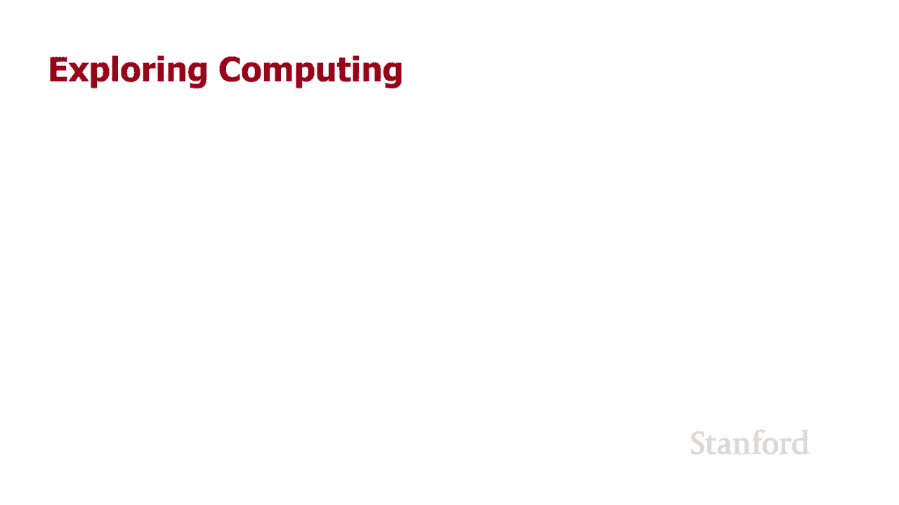

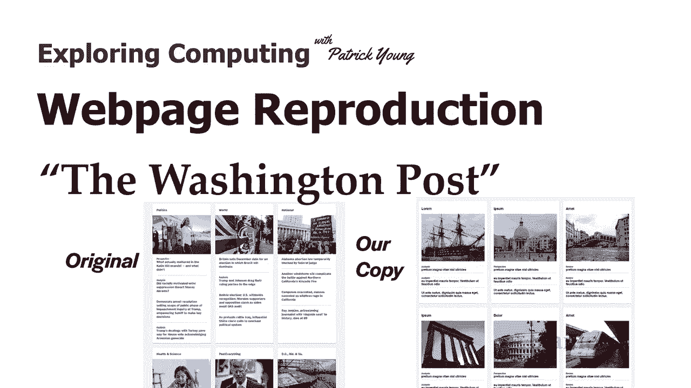

在本节课中，我们将学习如何利用HTML和CSS技术，复制《华盛顿邮报》网站底部的一个专业版块。我们将重点关注网格布局、边框样式、间距控制以及如何通过CSS精确地控制视觉呈现。

## 概述

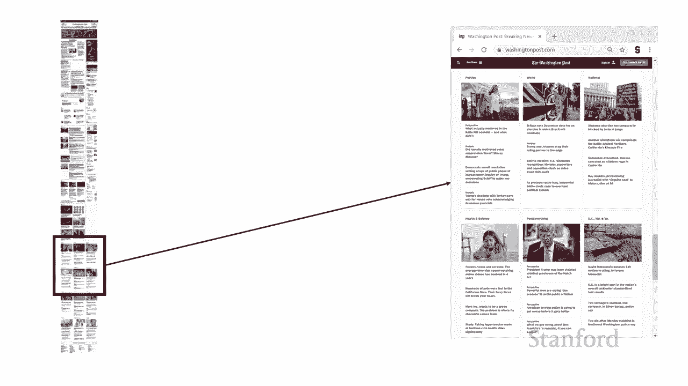

我们将分析目标网页的结构，并使用HTML进行语义化标记，然后通过CSS（特别是网格布局）来精确控制元素的排列和样式。核心在于理解如何将设计稿转化为代码，并掌握CSS中边框、边距、填充等属性的细微调整。

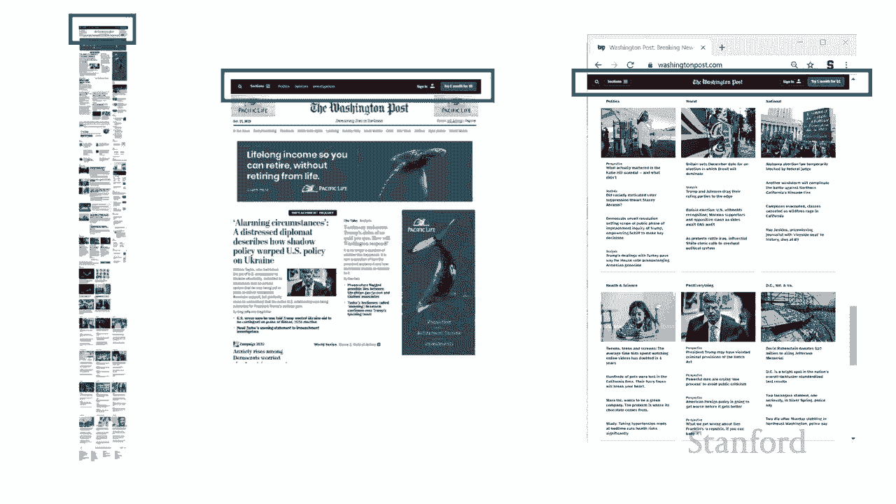

---

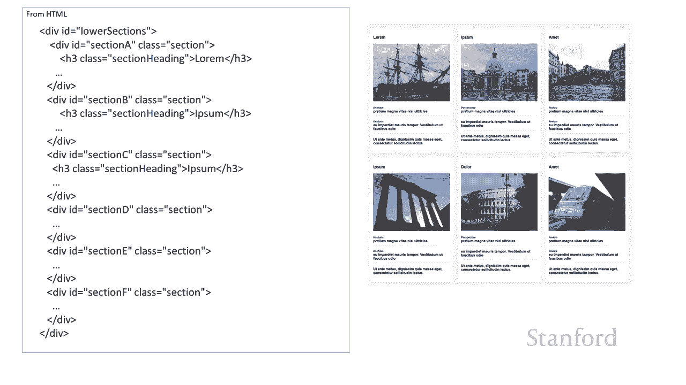

## 网页结构与目标

在左侧是整个《华盛顿邮报》网页，它非常长。我们本次要复制的部分是页面底部用红色框标出的区域。虽然原版页面可能已经更新，但这个练习能帮助我们学习处理边框和一些微妙的细节，使元素看起来更专业。

这个练习也强调了我们在整个课程中一直贯彻的理念：**使用级联样式表（CSS）来控制演示文稿**。特别是在基于网格的布局中，将表现信息放在CSS中，而将语义信息（如标题、各部分名称）留在HTML里，能带来极大的灵活性。

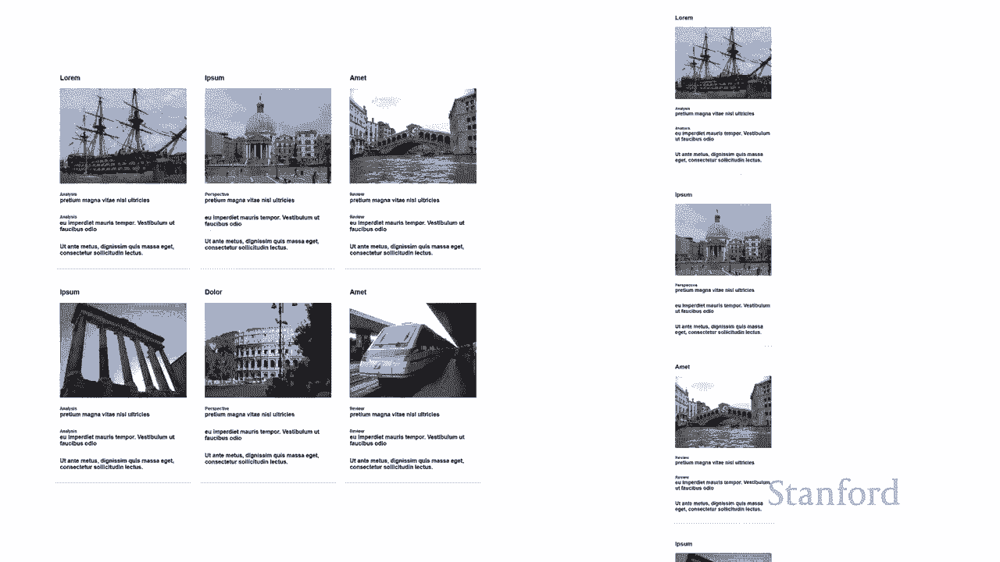

---

## 整体布局与网格设置

首先，我们可能会注意到网页顶部有一个横穿的黑条。在我们的复制练习中，我们将专注于底部区域，而不会讨论这个固定导航栏的实现。

我们在左边是我们要复制的部分，右边是实际的网页截图。我使用了之前讲座中见过的“Lorem Ipsum”文本，并没有使用《华盛顿邮报》的实际标题和图片。

观察HTML结构，我把内容分成了A、B、C、D、E、F几个部分，它们与网页上显示的不同区域相对应。无论它们在HTML中出现的顺序如何，也无论我给它们起什么名字，我都可以通过CSS网格布局完全打乱它们的显示顺序。这体现了CSS布局的强大之处。

通过使用网格，我们有很大的灵活性。例如，如果在手机上显示，我们可以轻松地将布局从三列两行改为一列。

---

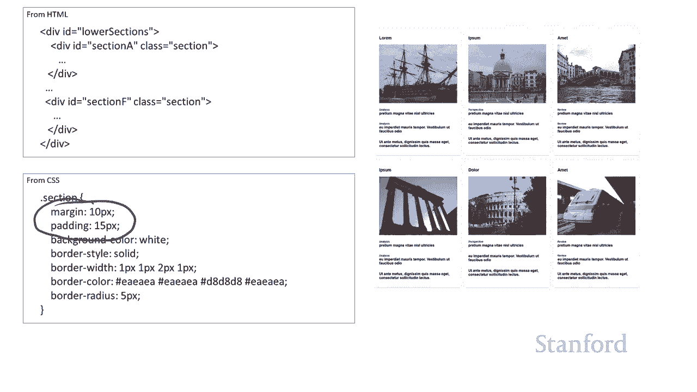

## CSS基础样式设置

现在，让我们来看看实际的CSS代码。

首先，观察右侧截图，可以看到实际的内容区块有白色背景，而它们周围的区域是浅灰色背景。因此，我将`body`的背景色设置为`#f7f7f7`。这是一个十六进制颜色值，其中红、绿、蓝三个通道的值相同（`f7`），因此它呈现为一种灰色阴影。《华盛顿邮报》的整体设计就围绕不同深浅的灰色展开。

此外，我将字体系列设置为`sans-serif`。我没有深究他们使用的具体字体，只是知道他们使用的是无衬线字体。

我们复制的所有内容都包含在一个id为`lower-section`的`div`中，它代表《华盛顿邮报》的底部区域。我将其设置为网格布局：
```css
display: grid;
grid-template-columns: 1fr 1fr 1fr;
```
`fr`代表分数单位，`1fr 1fr 1fr`意味着将可用空间平均分为三列。行高设置为`auto`，意味着行的高度会根据其中的内容自动调整。

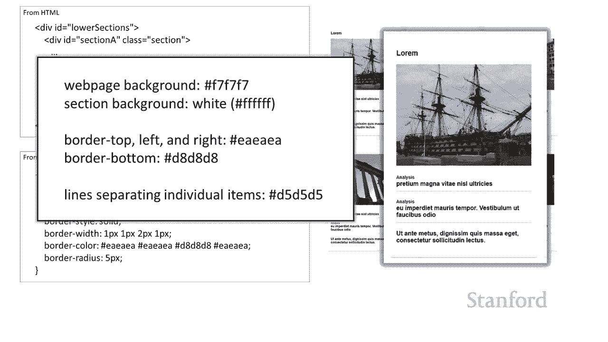

---

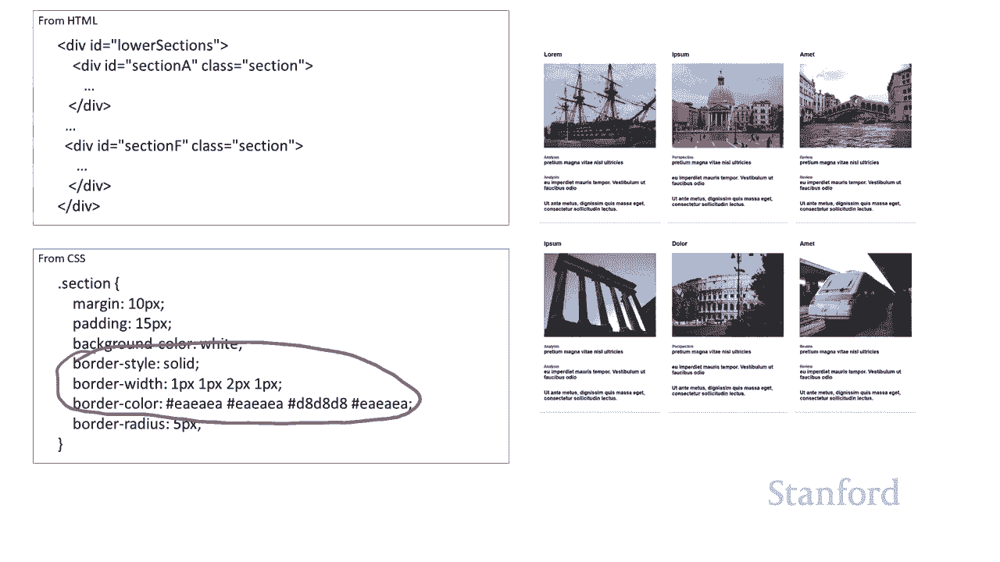

## 内容区块的样式

接下来，我们要查看每个独立部分（A到F部分）的样式。

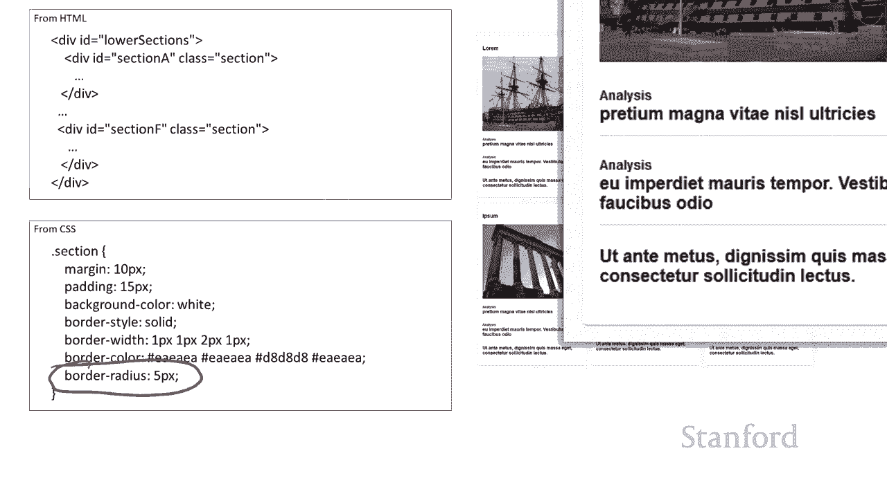

我为每个部分设置了`padding`（内边距）和`margin`（外边距）。记住，`padding`是元素内容与边框之间的空间，而`margin`是边框之外的空间。如果不设置`padding`，文本就会紧贴边框；如果不控制`margin`，所有元素就会紧贴在一起。

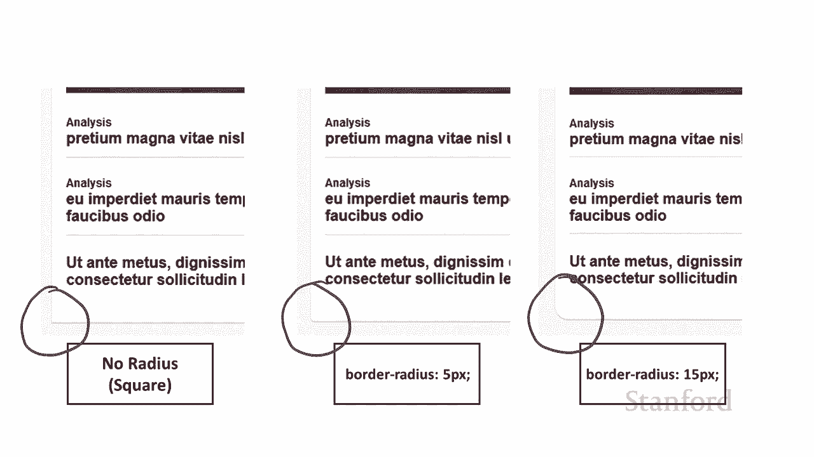

每个部分有白色背景，并且我使用了从原网页通过取色工具获取的精确颜色来设置边框，以还原其微妙的3D外观。如果你仔细观察，会发现每个区块的左上角和右上角边框颜色与底部边框略有不同，且底部边框更粗一些。

以下是我为部分区块设置的边框样式示例：
```css
border-width: 1px 1px 2px 1px; /* 上、右、下、左 */
border-style: solid;
border-color: #eaeaea #eaeaea #d5d5d5 #eaeaea;
```
这里，底部边框是2像素，颜色`#d5d5d5`也比其他边略深。同时，我使用`border-radius`为某些角落添加了圆角效果。

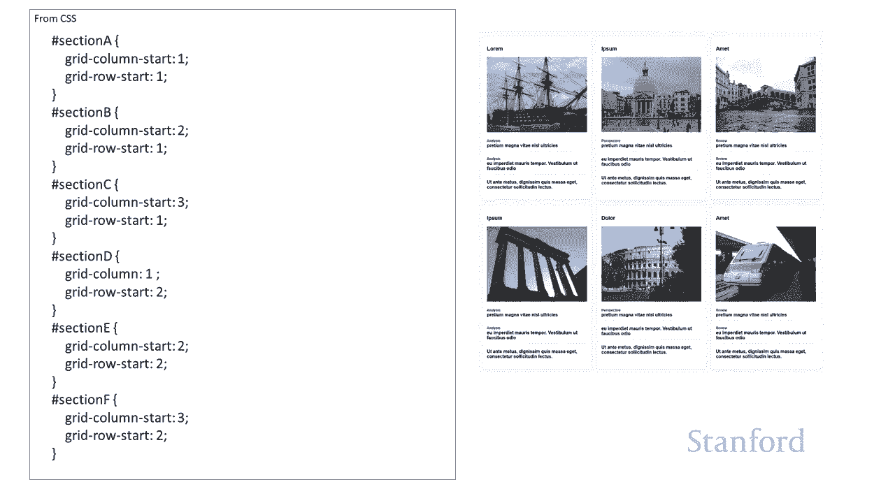

---

## 区块内部元素详解

现在，我们深入看看每个部分内部的构成。

首先，有一个`<h3>`标签作为部分的标题。我假设整个网页顶部的主标题会用`<h1>`，其他重要标题会用`<h2>`，因此这里使用`<h3>`是合适的。我并没有为`<h3>`或`.section-title`类添加额外样式，保留了其默认的大小、粗细和边距。

接着是图片。我给图片添加了`.section-image`类，并将其宽度设置为`100%`：
```css
width: 100%;
```
这样做的原因是，我们的列宽是使用`fr`单位定义的，会随着浏览器窗口变宽而增加。将图片宽度设为100%，可以确保图片随着所在列的宽度同步缩放，高度则会按比例自动调整。

然后，有一些子部分（`div`），它们可能包含多个元素。例如，第一个子部分包含了一个标有“分析”的小标签和实际的标题。我将这些组合在一个`div`中，并为其设置`margin`和`padding`，以控制间距。

为了在每个文章条目之间添加分隔线，我为这些子部分设置了底部边框：
```css
border-bottom: 1px solid #d5d5d5;
```
但我不希望最后一个条目下面也有这条线。因此，我使用`:last-child`这个伪类选择器来覆盖最后一个子元素的样式：
```css
.last-child {
    border-bottom: 0;
}
```

---

## 字体与细节调整

最后，我们来设置字体大小和粗细等细节。

对于每个子部分的主要文本（`<h4>`），我将其样式设置为：
```css
margin: 0;
padding: 0;
font-size: 12pt;
```
网页中的许多元素（特别是标题）都有预设的上下边距。通过明确将`margin`和`padding`设为0，我们可以精确控制间距，让“分析”这个词紧贴其下方的标题，还原原设计。

`<h4>`的默认样式已经是粗体，这正好符合我们的需求。

而对于“分析”、“评论”或“视角”这类小标签（只是一个`div`），我需要手动为其提供样式：
```css
font-size: 9pt;
font-weight: bold;
```

---

## 总结

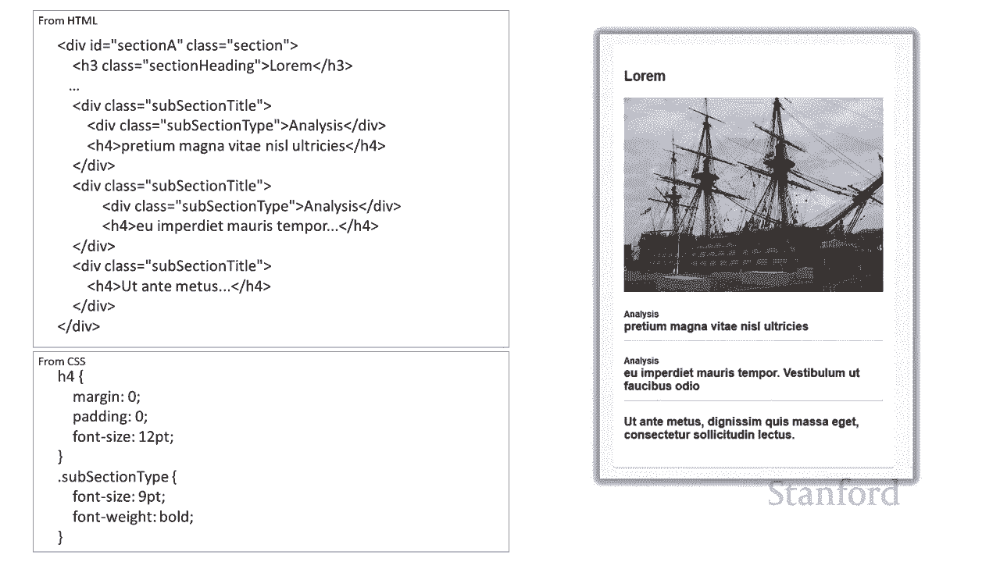

本节课中，我们一起学习了如何复制《华盛顿邮报》网页的一个专业版块。主要收获包括：

1.  **使用CSS网格布局**（`display: grid`）创建灵活的多列结构，并能轻松调整元素顺序和响应式布局。
2.  **精确控制样式细节**：通过设置`padding`、`margin`、`border`（包括宽度、样式、颜色和圆角）以及背景色，来还原设计的视觉层次和空间感。
3.  **利用选择器**：使用类（`.class`）为多个相似元素定义通用样式，使用ID（`#id`）为特定定位元素定义样式，并使用伪类（如`:last-child`）进行特殊处理。
4.  **控制字体呈现**：通过`font-size`、`font-weight`等属性，并重置元素的默认边距，来实现精确的排版。


希望这个练习带给你的主要启示是：**利用我们所教授的技术，你完全可以制作出与专业网站相媲美的网页**。这需要一些时间进行分析和微调，以使尺寸和间距都恰到好处。如果你具备一定的艺术和图形设计技能，你完全可以先构思出自己的设计，然后运用层叠样式表将你的愿景变为现实。