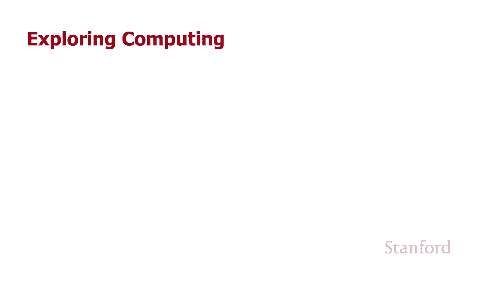
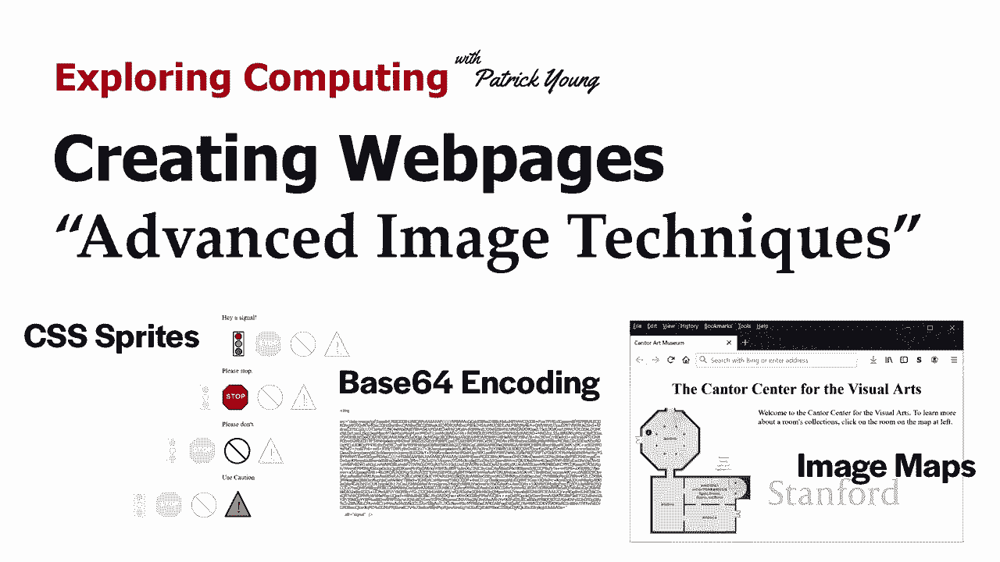
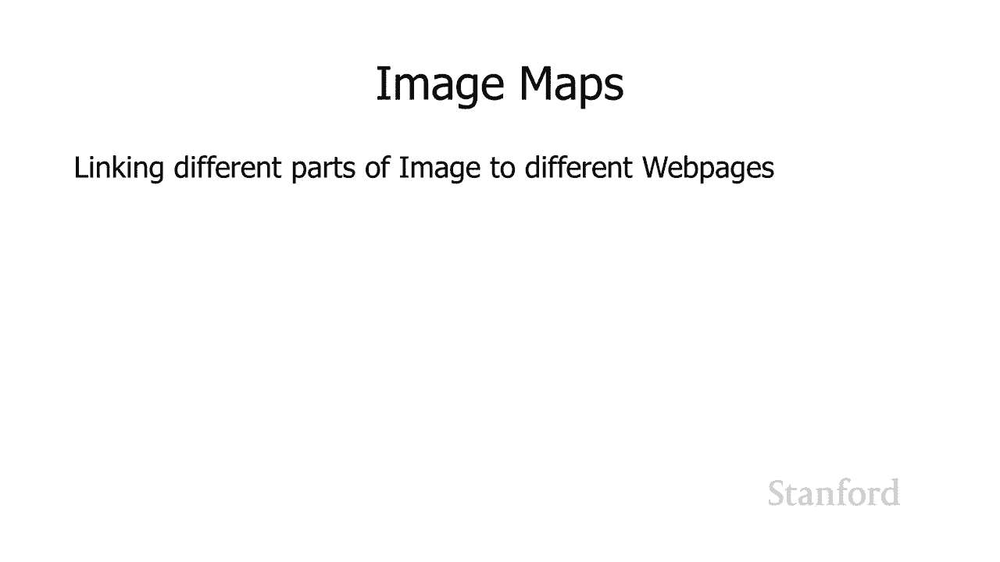
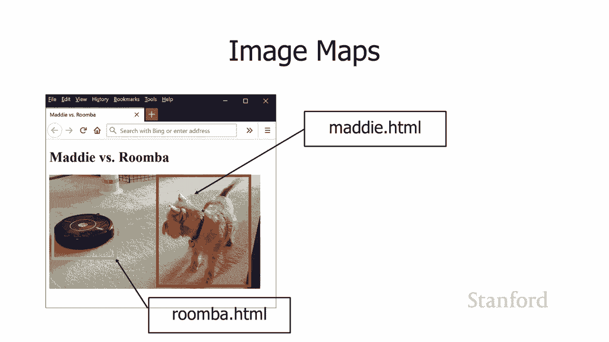
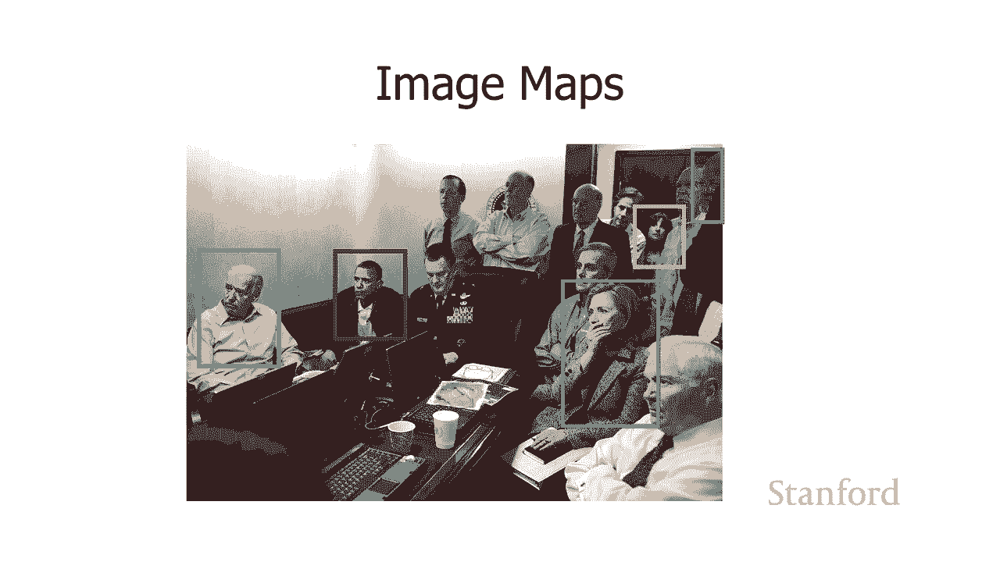
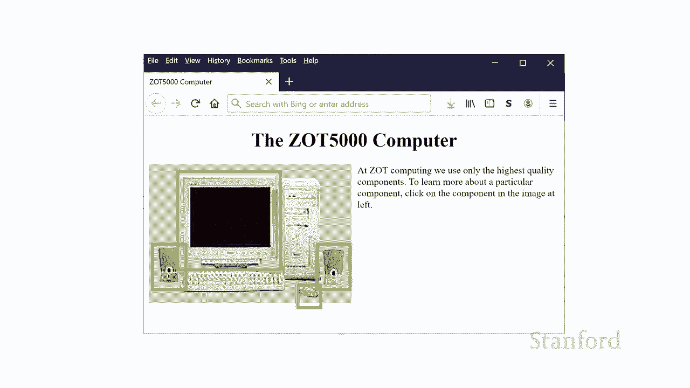
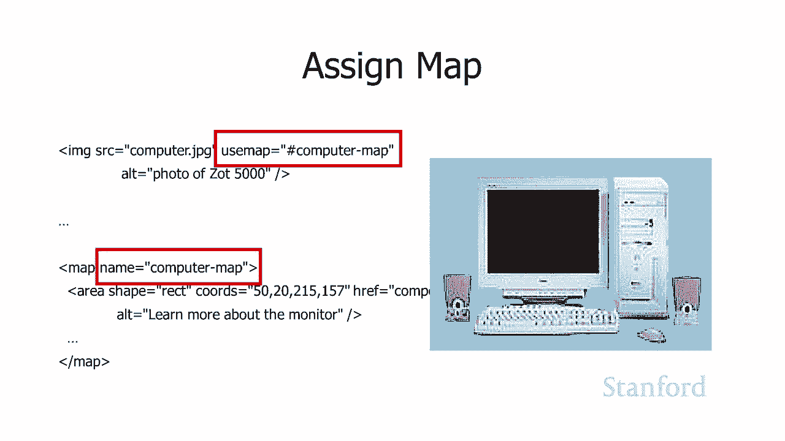
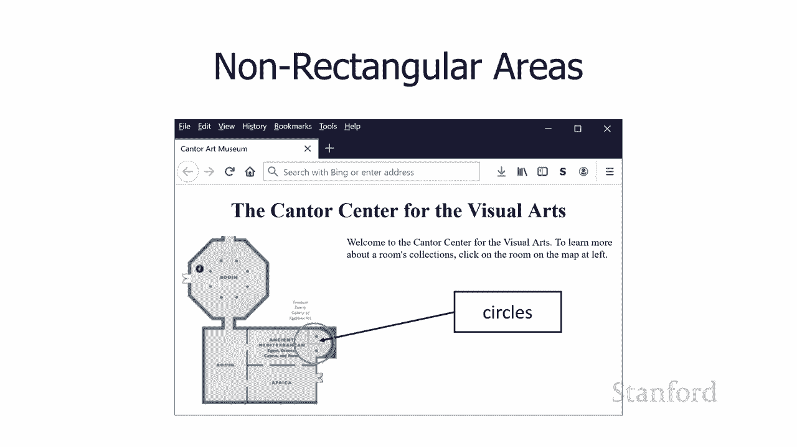
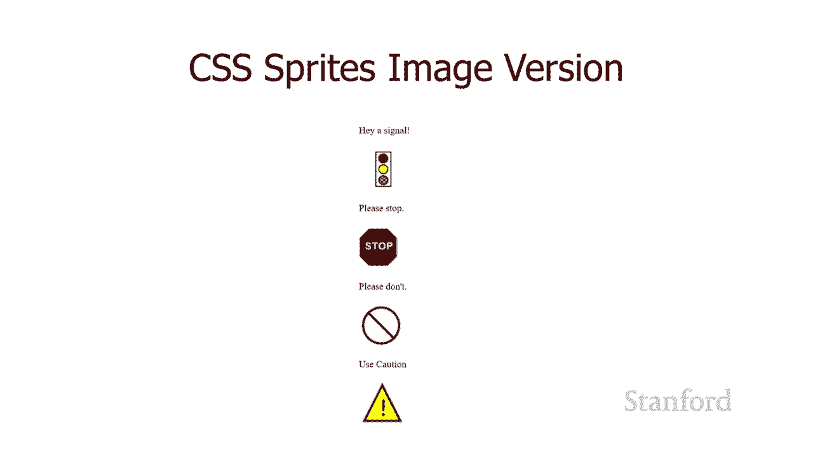
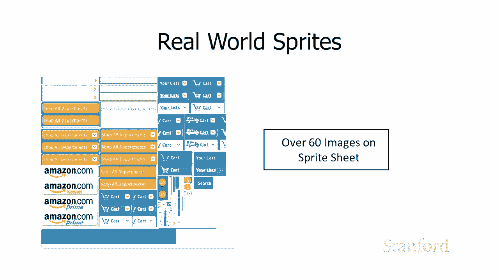

# L14.1：高级图像技术 🖼️







在本节课中，我们将要学习一些关于图像的更高级的网页技术。我们将探讨如何让一张图片的不同部分链接到不同的网页，以及如何通过优化图像加载方式来提升网页性能。

## 图像映射



上一节我们介绍了图像的基本使用，本节中我们来看看如何让一张图片的特定区域变得可交互。图像映射背后的基本思想是，将图像的不同部分链接到不同的网页。

例如，假设我们有一张包含Maddie和Roomba的图片。我们想要实现的效果是：如果用户点击图片中Maddie的部分，就跳转到 `maddie.html` 页面；如果点击Roomba的部分，就跳转到 `roomba.html` 页面。这种技术在很多场景下都很有用，比如在地图上点击不同区域跳转到对应介绍，或者在合影中点击不同人物跳转到其个人主页。

### 如何创建图像映射



以下是创建一个图像映射的步骤：

1.  **定义地图区域**：使用 `<map>` 标签定义一个地图，并为其指定一个唯一的名称。
2.  **定义可点击区域**：在 `<map>` 标签内部，使用 `<area>` 标签定义图像上的可点击区域。每个区域需要指定形状（如矩形 `rect`）、坐标和链接目标。
3.  **关联图像与地图**：在 `` 标签中使用 `usemap` 属性，将其值设置为 `#` 加上地图的名称，从而将图像与定义好的地图关联起来。



以下是一个具体的代码示例，展示了如何为一张电脑图片的显示器和扬声器部分分别设置链接：

```html
<!-- 1. 定义地图，名称为“computermap” -->
<map name="computermap">
    <!-- 2. 定义一个矩形区域，对应显示器部分 -->
    <area shape="rect" coords="50,20,215,157" href="monitor.html" alt="Computer Monitor">
    <!-- 定义另一个矩形区域，对应扬声器部分 -->
    <area shape="rect" coords="其他坐标" href="speaker.html" alt="Computer Speaker">
</map>

<!-- 3. 关联图像与地图 -->

```

**坐标说明**：`coords="50,20,215,157"` 定义了矩形的左上角 `(50, 20)` 和右下角 `(215, 157)` 坐标。你可以使用像 Adobe Photoshop 或 Windows 画图这样的图像处理软件来获取特定区域的精确坐标。

### 支持多种形状

图像映射不仅支持矩形区域，还支持圆形和多边形区域，以适应更复杂的形状。

*   **圆形**：使用 `shape="circle"`，坐标格式为 `coords="x, y, r"`，其中 `(x, y)` 是圆心，`r` 是半径。
*   **多边形**：使用 `shape="poly"`，坐标格式为 `coords="x1,y1,x2,y2,x3,y3,..."`，按顺序列出多边形的各个顶点坐标。



## CSS Sprites（CSS精灵）



上一节我们学习了如何让图像的不同区域响应点击，本节中我们来看看如何优化网页上多张图像的加载速度。如果你的网页包含很多小图像（比如图标），每个图像都需要向服务器发起一次独立的下载请求，这可能会拖慢页面加载速度。

CSS Sprites 技术通过将多个小图像合并到一张大图中来解决这个问题。网页加载时，只需下载这一张大图，然后通过 CSS 背景定位技术，在每个需要显示图标的地方，只显示这张大图中对应的部分。

### 传统方式 vs. Sprites方式

**传统方式（多个图像文件）**：
网页包含多个 `` 标签，每个标签指向一个独立的小图像文件。这会导致多次 HTTP 请求。

**Sprites方式（单个图像文件）**：
1.  将多个小图标合并成一张大图（例如 `combined.gif`）。
2.  在 HTML 中，使用 `<div>` 等元素来预留图标的位置。
3.  在 CSS 中，为每个 `<div>` 设置相同的背景图像（即那张大图），但通过 `background-position` 属性调整背景图的位置，使得每个 `<div>` 只显示大图中自己对应的那个图标。

以下是使用 CSS Sprites 的代码示例：

```html
<style>
    .sprite {
        width: 50px; /* 图标容器的宽度 */
        height: 50px; /* 图标容器的高度 */
        background-image: url('combined.gif'); /* 引用合并后的大图 */
        background-repeat: no-repeat; /* 防止背景图重复 */
    }
    #traffic-light {
        background-position: 0 0; /* 显示大图中第一个图标（红绿灯） */
    }
    #stop-sign {
        background-position: -50px 0; /* 将背景图左移50px，显示第二个图标（停止标志） */
    }
</style>

<div class="sprite" id="traffic-light"></div>
<div class="sprite" id="stop-sign"></div>
```

**优势**：这种方法显著减少了 HTTP 请求次数，对于图标众多的网页（如亚马逊、谷歌等大型网站）能有效提升加载性能。

## Base64 内联图像

我们刚刚介绍了通过合并图像来减少请求次数的方法。还有一种更彻底的技术，可以完全消除对图像文件的独立请求，那就是 Base64 编码。

Base64 是一种将二进制数据（如图像文件）编码成 ASCII 字符串的方法。你可以将图像转换成一段很长的 Base64 字符串，然后直接将其嵌入到 HTML 或 CSS 文件中。



### 如何使用 Base64 图像



在 `` 标签的 `src` 属性中，你可以不使用文件路径，而使用以 `data:image/[格式];base64,` 开头的字符串，后面跟上图像的 Base64 编码数据。

```html

```

**如何获取 Base64 字符串**：你可以使用在线的 “Base64 图像编码器” 工具，将你的图像文件上传，工具会自动生成对应的 Base64 编码字符串，然后你将其复制粘贴到代码中即可。

**优缺点**：
*   **优点**：完全消除了额外的图像文件请求，对于极小的图像（如1x1像素的跟踪像素）或必须确保与页面同时加载的图标非常有用。
*   **缺点**：Base64 字符串会使 HTML 或 CSS 文件体积显著增大（通常比原图像文件大33%左右），且不利于浏览器缓存。因此，它更适合用于非常小的、不常变化的图像。

## 总结

本节课中我们一起学习了三种高级图像处理技术：
1.  **图像映射**：允许我们将一张图片的不同区域定义为可点击的热点，并链接到不同的目标。核心是使用 `<map>` 和 `<area>` 标签。
2.  **CSS Sprites**：通过将多个小图标合并到一张大图中，并使用 CSS 背景定位来显示特定部分，从而减少 HTTP 请求数量，提升网页加载性能。
3.  **Base64 内联图像**：将图像数据直接编码为文本字符串并嵌入到 HTML 或 CSS 中，彻底消除了对图像文件的独立请求，适用于微小且需确保加载的图像。


掌握这些技术，能让你在网页设计中更灵活地使用图像，并优化用户体验。