# L14.2：表单：GET与POST 📝

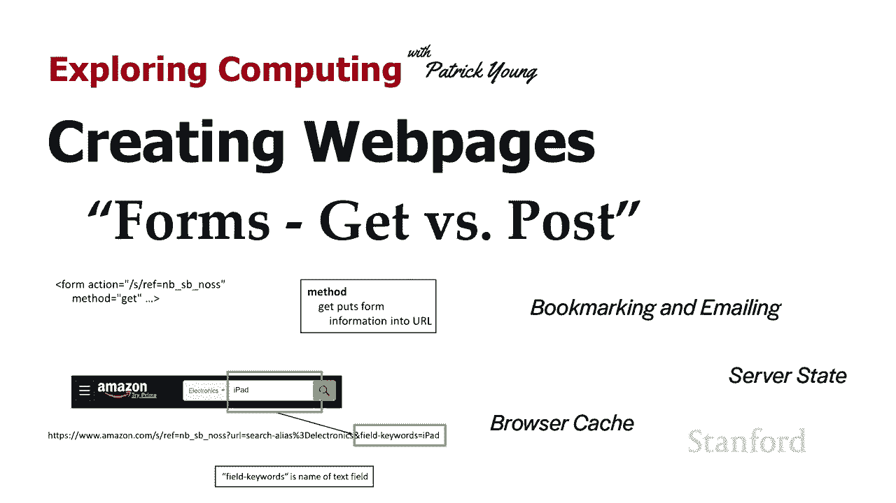

在本节课中，我们将学习网页表单中两种提交数据的方法：**GET** 和 **POST**。我们将探讨它们的工作原理、区别以及在实际应用中的选择依据。

## 概述

表单是网页与用户交互的重要工具，它允许用户输入信息并提交到服务器。表单的 `method` 属性决定了数据如何被发送到服务器，主要分为 **GET** 和 **POST** 两种方式。理解它们的差异对于构建功能正确、用户体验良好的网页至关重要。

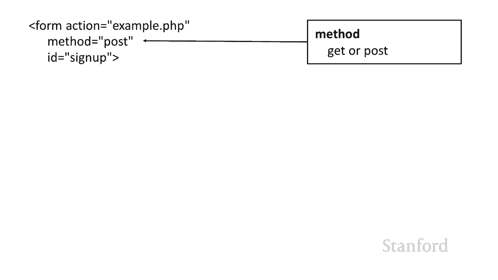

## 表单基础回顾

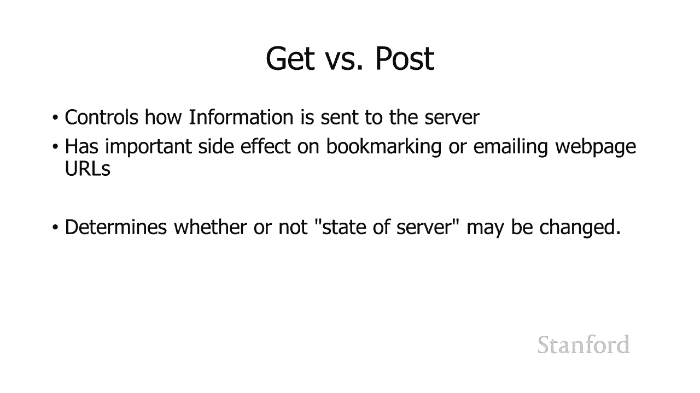

上一节我们介绍了如何在网页上创建表单。表单允许用户输入信息，并将其提交到网络服务器。表单标签中有许多属性，其中 `action` 属性决定了服务器上处理表单数据的程序位置。

例如，`action="example.php"` 意味着服务器上有一个名为 `example.php` 的程序来处理表单数据。如果开发者没有使用服务器端程序，也可以使用 `mailto:` 链接，将表单数据通过电子邮件发送。

## 方法（Method）属性

除了 `action`，表单的 `method` 属性也至关重要。它控制着信息如何被发送到网络服务器，并对用户体验和服务器状态有深远影响。

以下是 `method` 属性的两种主要值：

*   **GET**：数据作为URL的一部分发送。
*   **POST**：数据在HTTP请求主体中发送，不显示在URL中。

## GET方法详解

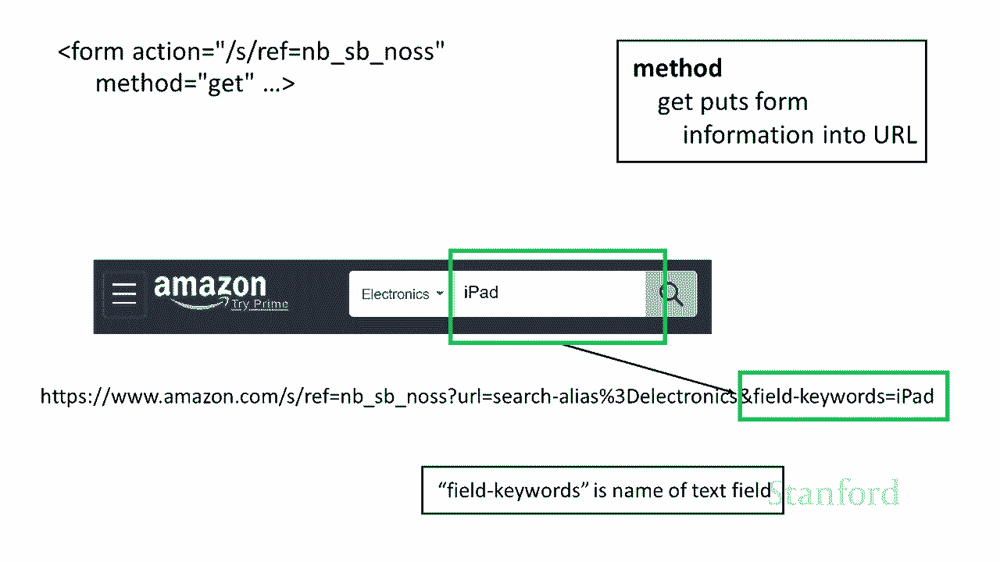

当表单使用 `method="get"` 时，用户输入的信息会被编码并附加到 `action` 指定的URL之后。

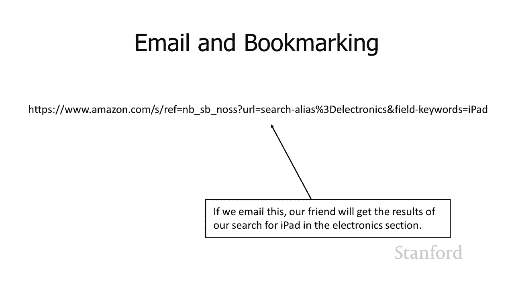

例如，在亚马逊的搜索表单中，如果你在“电子产品”分类下搜索“iPad”，提交后生成的URL可能类似于：
`https://www.amazon.com/s?url=search-alias%3Delectronics&field-keywords=iPad`

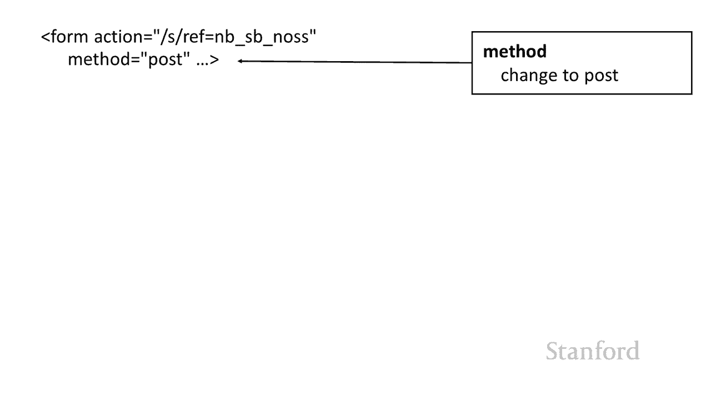

在这个URL中：
*   `url=search-alias%3Delectronics` 对应下拉菜单的选择。
*   `field-keywords=iPad` 对应文本输入框的内容。
*   `%3D` 是等号 `=` 的URL编码形式。

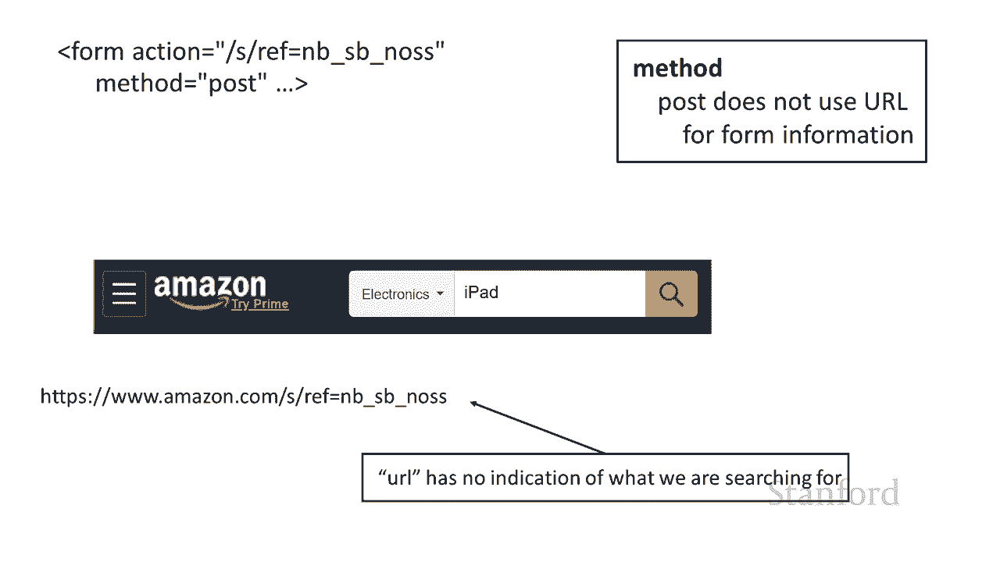

**GET请求的核心特点是：数据直接暴露在URL中。**

### GET方法的影响

由于数据包含在URL里，GET请求会带来以下影响：

*   **可书签化**：用户可以为此结果页面添加书签，书签包含了所有搜索条件，再次打开时会得到相同的结果。
*   **可分享**：用户可以将这个完整的URL通过邮件发送给朋友，朋友点击链接会看到完全相同的搜索结果。
*   **幂等性**：GET请求被认为是“幂等”的，意味着多次执行相同的GET请求不会改变服务器状态，应该返回相同的结果。因此，浏览器可以放心地缓存GET请求的结果。

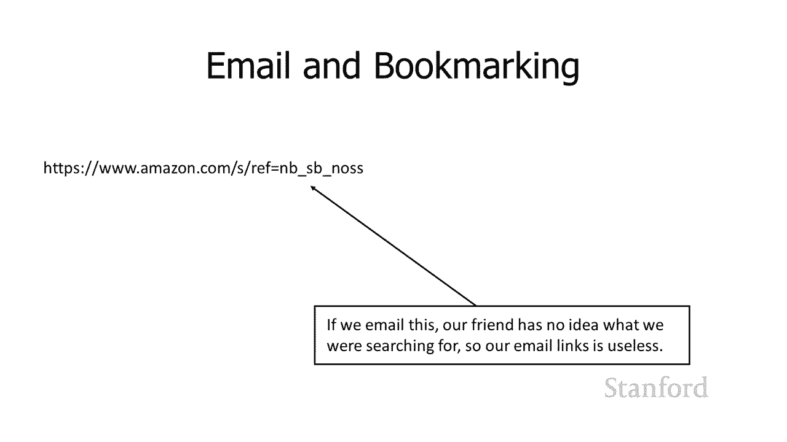

## POST方法详解

当表单使用 `method="post"` 时，用户输入的信息会被放在HTTP请求的内部（请求体）中发送，而不会显示在浏览器的地址栏里。

如果我们将亚马逊的表单方法改为POST，那么提交后，浏览器的地址栏只会显示：
`https://www.amazon.com/s/`
而不会包含 `url=...` 和 `field-keywords=...` 这些参数。

**POST请求的核心特点是：数据在后台发送，对用户不可见。**

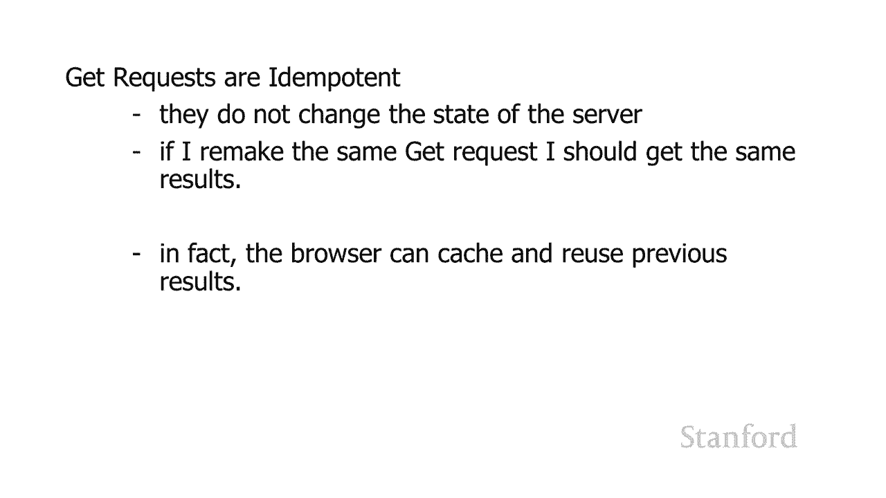

### POST方法的影响

由于数据不包含在URL里，POST请求会带来以下影响：

*   **不可书签化**：用户为结果页面添加书签时，只会保存基础的URL（如 `https://www.amazon.com/s/`），丢失了具体的搜索条件。再次打开书签时，无法重现之前的搜索结果。
*   **不可直接分享**：通过邮件发送URL给他人，他人无法看到你之前提交的表单数据所产生的结果。
*   **非幂等性**：POST请求通常用于改变服务器状态（如提交订单、发布帖子）。因此，它不是幂等的，重复提交可能会导致重复操作（例如重复下单）。浏览器在刷新一个由POST请求生成的页面时，通常会弹出对话框询问“是否要重新提交表单信息”。

## 如何选择GET与POST

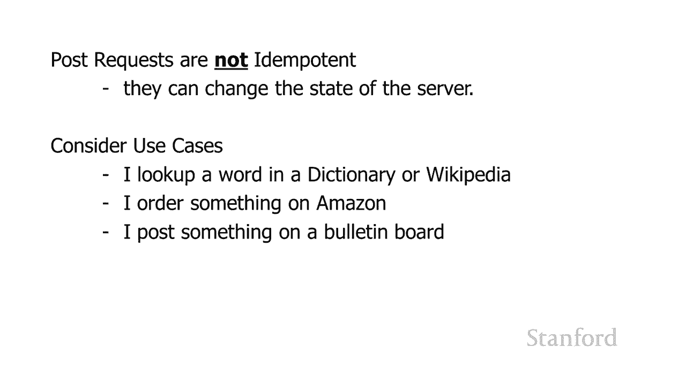

选择哪种方法取决于表单的用途。以下是一些指导原则：

*   **使用GET请求的场景**：适用于**获取信息**且不改变服务器状态的查询操作。例如：
    *   搜索引擎查询
    *   字典或维基百科的词条查找
    *   任何希望结果可以被收藏或分享的查询页面

*   **使用POST请求的场景**：适用于**改变服务器状态**或包含敏感信息的操作。例如：
    *   用户登录（包含密码）
    *   在线购物下单
    *   在论坛或社交媒体发布新内容
    *   修改服务器上的用户资料或数据

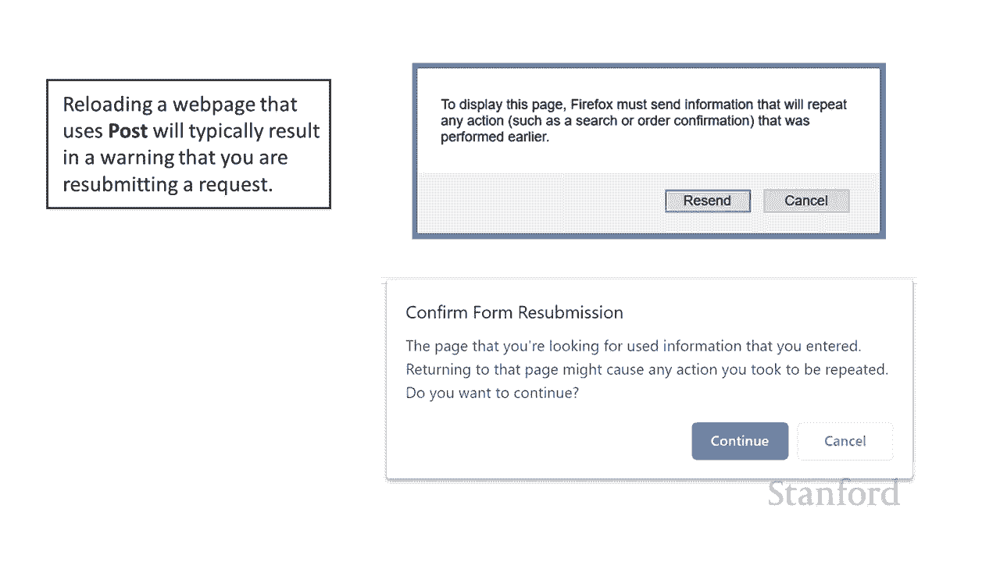

**核心原则**：如果表单提交会改变服务器上的某些东西（数据库、文件、状态），请务必使用POST。如果只是查询并展示信息，使用GET可以为用户提供更好的便利性（书签、分享），但需注意URL长度限制和隐私信息泄露问题。

## 总结

本节课中我们一起学习了网页表单中GET与POST两种提交方法的奥秘。

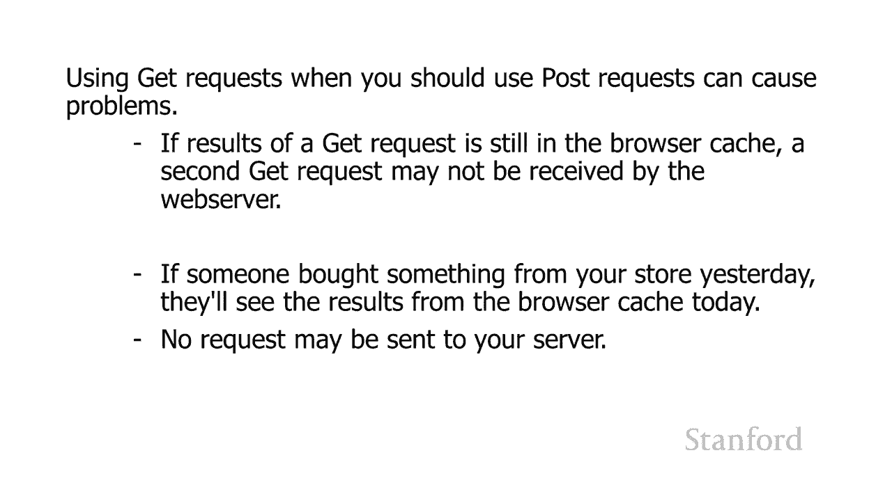

*   **GET** 方法将数据编码在URL中，适合用于不改变服务器状态的查询，其结果可被收藏和分享。
*   **POST** 方法将数据隐藏在HTTP请求体内，适合用于会改变服务器状态的操作（如提交订单、发布信息），能更好地保证操作的安全性和准确性。

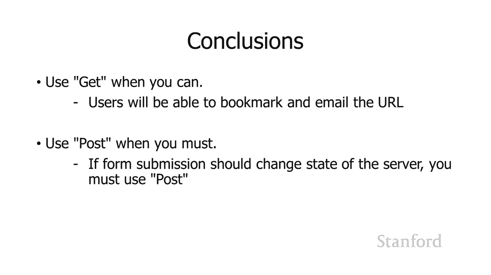

正确选择 `method` 属性，是构建一个既符合HTTP规范，又拥有良好用户体验的网页表单的关键。