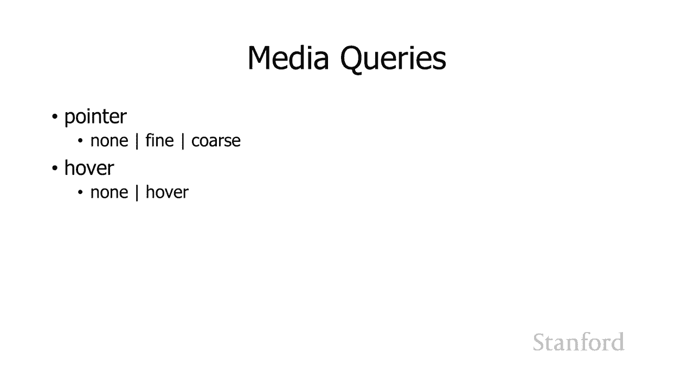

# 计算机科学导论：L14.3：响应式网页设计 🖥️📱

在本节课中，我们将要学习响应式网页设计。这是一种创建网页的技术，旨在让网页能够根据用户所使用的设备（如手机、平板电脑或桌面电脑）自动调整其布局和样式，以提供最佳的浏览体验。

## 网页与印刷页面的关键区别

上一节我们介绍了网页设计的基本概念，本节中我们来看看网页设计与传统印刷设计的一个核心区别。

使用网页与使用印刷页面的主要区别之一在于，设计者无法控制输出设备。当我们使用 Microsoft Word 时，我们是在为打印的页面设计。我们可以指定纸张尺寸，例如 8.5 x 11 英寸或 17 x 11 英寸。

然而，在使用网络浏览器时，我们没有这种控制权。我们的网站可能在一个小手机上显示，也可能在一个大平板电脑、巨大的桌面计算机甚至某人的高清电视上显示。我们无法控制输出设备，因此需要创建适用于所有这些不同设备的网页。

## 响应式设计的必要性

这是一个问题，因为网页设计的吸引力和实用性会因设备尺寸而异。在手机上看起来很棒的布局，在高清电视上可能看起来很糟糕，并且无法很好地工作。

此外，各种用户界面元素在某些设备上运行良好，但在其他设备上可能不行。以下是几个例子：

*   **工具提示**：许多网站使用工具提示。你将鼠标移到某个元素上，停留一会儿，就会得到关于该元素的信息。但手机无法使用这个功能，因为你不能将手指悬停在特定元素上以调出工具提示。
*   **操作精度**：在手机上工作时，你的手指与鼠标指针相比非常大。使用鼠标或触控笔，你可以获得精细的控制，可以小心地点击屏幕上的小元素。但在手机上，要达到同样的精度则困难得多。

因此，取决于我们正在使用的实际设备，有些设计会很好地工作，而有些设计会很糟糕。所以问题是我们将如何应对。

## 早期的解决方案及其局限性

在响应式设计出现之前，主要有两种方法，但它们都有局限性。

**第一种方法是设定最小标准尺寸**。多年来，网站设计者会设定一个目标尺寸。例如，网站最初为640像素宽的设备设计，然后提升到800像素，再到1024像素。网站每隔几年就会为此重新设计。如果你用一个较小的显示器访问该网站，就会出现水平滚动条，因为网站内容不适合你拥有的空间。如果你用一个更大的显示器访问，网站仍然卡在特定的尺寸上，无法充分利用屏幕空间。

**第二种方法是为不同设备创建不同的网站**。最显著的是通常有桌面版本和移动版本。其原理是，当你的浏览器向网站发出HTTP请求时，会发送一个“用户代理”信息。网络服务器可以查看该用户代理，并决定将用户引导到桌面版本或移动版本。

这种方法效果也不佳。你必须维护所有不同用户代理的更新列表以及它们应被引导到的位置。这意味着你需要维护多个不同的网站（例如一个用于桌面，一个用于移动），这增加了开发和维护成本。此外，还存在设备识别不准确的问题。例如，iPad经常被识别为移动设备，从而被引导到为小手机设计的移动版网站，无法充分利用其大屏幕的优势。

## 响应式网页设计方法

所以，实际上有一个更好的方法，即**响应式网页设计**。

响应式网页设计要做的是：获取有关用户正在使用的实际设备的信息，询问该设备的特征是什么，然后在此基础上应用不同的样式规则。

这与级联样式表协同工作，以便为不同的设备使用不同的CSS规则。正如我之前提到的，这对于基于网格的布局尤其好用。

## 响应式设计示例

让我们看看这可能如何工作。我将首先给出一个概述示例。

假设我们有一个网页，左侧是导航栏（例如斯坦福宿舍列表），中间是新闻文章，右侧是一个日历。在宽屏桌面设备上，三者并排显示。

但是，当网页在某些时候变得越来越窄时，将日历放在右侧实际上没有意义。我们可以这样做，但新闻文章将变得更小。所以我们要做的是将日历移动到新闻文章下方。如果屏幕变得更窄，我们不再将图像浮动在文章一侧，而是让图像占据网络浏览器窗口宽度的100%，然后把文章的文本放在它下面，最后把日历放在最下面。

这是一个三阶段的设计。你可以有任意多的阶段。

## 实现技术：媒体查询

现在，让我们仔细研究一个更具体的示例。在左边，我有一个所有斯坦福宿舍的列表。我们要做的是，随着网络浏览器窗口变得更窄，我们将完全**移除**宿舍列表。

那么我们将如何做到这一点？实际上非常简单，基本上我将介绍**媒体查询**这个概念。

左边的宿舍列表位于 `<nav>` 导航元素内。通常情况下，导航元素浮动到左侧。但我所做的是添加一个媒体查询：

```css
@media (max-width: 480px) {
  nav {
    display: none;
  }
}
```

换句话说，如果屏幕宽度是480像素或更少，那么只要去掉那个导航元素，就根本不显示它。

但在大多数情况下，你并不想完全摆脱导航元素，而是想**移动**它们。这就是我们下一个例子要做的。

我实际上要把它们放在屏幕顶部，当窗口变得非常狭窄时。这就是我再次这样做的方式：

```css
@media (max-width: 600px) {
  nav {
    float: none; /* 移除浮动 */
  }
  nav li {
    display: inline; /* 将列表项改为行内显示 */
  }
}
```

在这里，如果最大宽度为600像素或更小，我应用两个不同的规则：
1.  移除导航元素上的浮动。
2.  将所有列表项从它们的标准“块”显示转为“内联”显示。

列表项通常是块级元素，它们会创建文本块。通过将其改为 `display: inline`，它们的行为就像 `<span>` 标签一样，使列表从左到右水平排列，而不是从上到下垂直排列。

## 媒体查询的多种用法

你可以通过将媒体查询直接放入样式表来实现，如上例所示。实际上，你还可以做一些类似的事情，例如使用 `@import` 规则，或者为不同的级联样式表文件创建多个 `<link>` 标签。

```html
<!-- 为不同屏幕宽度链接不同的CSS文件 -->
<link rel="stylesheet" media="(max-width: 600px)" href="small.css">
<link rel="stylesheet" media="(min-width: 601px)" href="large.css">
```

## 可查询的设备特征

最后，我想让你了解一下我们可以询问哪些设备特征，以便确定使用哪组样式表或样式规则。

以下是你可以查询的一些重要特征：

*   **宽度和高度**：`width`, `height`, `min-width`, `max-width`, `min-height`, `max-height`。你可以确定用户设备的宽度和高度，或者他们浏览器窗口的尺寸。
*   **方向**：`orientation`。你可以确定他们的设备是处于横向模式还是纵向模式。
*   **纵横比**：`aspect-ratio`。屏幕的宽高比。
*   **颜色**：`color`, `monochrome`。有关设备能够显示多少种颜色的信息。
*   **分辨率**：`resolution`。屏幕的像素密度，即每英寸有多少点。

所有这些都将帮助你确定你的网页应该具有什么样的外观。

还有一些我认为真的很有趣的查询，例如：

*   **指针精度**：`pointer`。取决于用户是使用手指（粗指针）选择项目，还是使用更细粒度的指针，如鼠标或触控笔。你可以据此调整点击元素的大小。
*   **悬停能力**：`hover`。你可以查询用户是否有能力进行悬停操作（例如使用鼠标）。如果他们使用手机手指，则答案是否定的，因此你可以移除或改变依赖悬停的功能（如工具提示）。

因此，整个想法是**响应**有关用户设备的信息，并使用你的级联样式表来更改网页的显示方式。

## 总结




本节课中我们一起学习了响应式网页设计。我们了解了为何需要响应式设计（因为设备尺寸和交互方式的多样性），回顾了早期解决方案（固定尺寸和独立移动站）的局限性，并深入探讨了现代响应式设计的核心——**媒体查询**。我们学习了如何通过查询设备宽度、方向、指针类型等特征，来动态应用不同的CSS规则，从而创建出能自动适应手机、平板和桌面等各种设备的灵活网页布局。如果你打算进行专业的网页设计，掌握响应式设计是非常重要的。