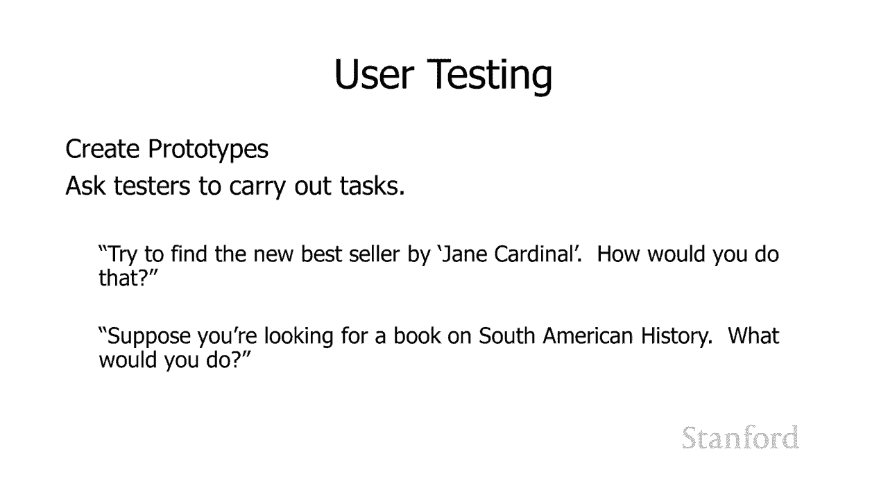

# L15.1：人机交互 👨‍💻

在本节课中，我们将要学习计算机科学中的一个重要研究领域——人机交互。我们将了解它的定义、重要性、相关学科以及设计用户界面的基本流程。

人机交互，或 **HCI**，是计算机科学中的一个重要研究领域。它专注于如何改善人与计算机之间的交互。您今天正在使用的计算机是一个好兆头。HCI的成功是因为HCI负责诸如我们都在使用的 **Windows图标、鼠标和指针**（或 **WIMP** 界面）之类的东西。以及事实上你们都在使用图形用户界面，而不是命令行界面（我们在其中键入计算机命令）。这显示HCI研究人员对我们的世界产生了巨大影响。

目前HCI的热门话题包括虚拟和增强现实、语音命令、手势（您可以用手与计算机进行交互）。HCI研究人员甚至正在研究脑机接口。我一直喜欢指出的一件事是，当我教我的课时（因为我教了很多非计算机科学的学生），是有很多不同的领域实际上对HCI工作非常重要。你们中的一些人现在可能正在研究这些领域。

## 与HCI相关的领域 🧠

上一节我们介绍了HCI的核心概念，本节中我们来看看哪些其他学科对HCI至关重要。

以下是几个对HCI工作非常重要的领域：

*   **心理学**：心理学在许多不同的方面与HCI直接相关。更好地理解人类认知的一件事可以带来更好的应用。因此，诸如人类如何感知颜色，或人类记忆的局限性，应该推动我们的应用。此外，心理学研究与计算机科学用户界面研究有很多相似之处。所以在心理学大楼的地下室里，有一堆房间，我们在那里介绍心理学学生，要求他们执行任务。在单向玻璃镜子的另一边，我们有心理学研究生正在观察他们如何执行这些任务。HCI研究人员在大型计算机科学公司做完全相同的事情。所以我们有相同的房间，带有单向玻璃，我们在那里安装了一台计算机。我们带来了一些测试对象，我们要求他们在我们的计算机上执行任务。我们看看他们实际上如何与计算机交互，他们是否能够以我们期望的方式使用计算机。通常对于大公司，我们实际上会有心理学家，他们了解如何正确运行这些实验。
*   **平面设计**：当我在工业界工作时，我们有一群来自艺术学校的人，专门为HCI工作而工作。
*   **人体工程学**：显然人体工程学非常重要。
*   **社会学和民族志**：社会学和民族志以及其他相关领域对HCI也非常重要。我认为，特别是现在，有这么多的应用程序是为多人使用而设计的。如何帮助群体互动，社会学家的重要性当然是显而易见的。但另一种方式社会学家和民族志学者真的很重要是，如果我们被要求进入并帮助改善特定的工作场所，我们需要社会学家和民族志学者进入并研究该工作场所，并在我们可以帮助自动化并将工作场所计算机化之前，很好地了解该工作场所发生的事情。

## 用户界面设计流程 🔄

了解了HCI的跨学科特性后，我们来看看专家在尝试设计新用户界面时通常会遵循的流程。

让我们快速浏览一下用户界面专家在尝试设计新用户界面时所做的`一些事情`。您应该做的第一件事是找到一些需求。我们要确定用户的实际需求是什么。所以我们将花一些时间观察工作场所、研究当前流程、并采访潜在用户。然后我们将确定该工作场所中的不同角色以及该工作场所中定期执行的不同任务。然后我们将进行一些原型设计。我们将对这些原型进行一些测试。然后我们将迭代。这最后一部分（迭代）是非常重要的，因为事实证明，我们并不是特别擅长提出对工作场所真正有帮助的计划。因此非常重要的是，我们不仅要采访人们，并根据他们的反馈提出想法，还要进行测试和迭代。在采访中给我们的只是初步想法。我们测试它们并再次尝试它们。实际上并不少见用户认为他们想要一个程序，然后当他们实际尝试该程序时意识到，“哦，这并不像我想象的那么有用。我想也许我们真正想要的是另一件事。”所以，你与潜在用户一起尝试不同的东西，并最终真正确定他们真正需要什么，而不是他们最初感知的担忧，是超级重要的迭代过程。

## 原型设计：从低保真到高保真 🎨

迭代过程的核心是原型设计。本节中我们来看看不同保真度的原型及其作用。

您可以构建的原型质量范围从低保真到高保真，或者有时会提到低保真到高保真。

以下是几种不同保真度原型的示例：

*   **低保真原型**：示例包括一张非常低保真度的纸草图。您现在只需在一张纸上绘制图表。这些草图仍可用于用户界面实验。因此您可以与人们讨论他们从一个显示特定窗口的图表开始的过程。而你知道，“嘿，你会在哪里点击这个窗口？你认为你应该使用哪些按钮？”
*   **中保真原型**：例如线框图。这是在计算机上完成的，但我们不关心实际应用程序中的细节，例如颜色和字体。但线框仍然让我们很好地了解该屏幕上可能有什么样的信息。我们可以制作一个更高质量的模型，其中包含字体和颜色以及其他实际有效的东西。
*   **高保真原型**：然后我们可以拥有更高保真度的原型，用户可以在其中实际与它们交互，并按下某些按钮。因此，这可能起作用的方式是假设我们在网上书店工作（一个例子，我们将在一分钟内更详细地使用）。我们可以告诉某人，“嘿，继续在这里与我们的高保真模型交互，并查找一本关于南美历史的书。”因此，用户希望找到正确的文本字段以输入他们的搜索词组，并输入“南美洲历史”，然后他们会按回车键。我们将移至另一个屏幕，显示查找“南美洲历史”的结果。但这里发生的关键是，您输入的内容并不重要。当您单击搜索按钮时，文本字段只会转到“南美历史”的结果，因为这是我们唯一将其硬连线的内容。因此在这里您有一个原型，它看起来真实并且有一些交互，但并不相同于一个真正的程序，它要简化得多。

所以这些更高保真度的原型可以提供更好的结果，但它们有些问题。因为事实证明，团队投入的时间和精力越多去创建这些原型，他们越难接受结果表明他们花费了所有时间的高保真原型实际上是错误的方法。如果你唯一做过的事情是在一张纸上画了一些图表，然后你开始与用户互动，然后发现你的想法是错误的，放弃它要容易得多。制作纸质图表的成本花费了很少时间。然而，拿出这些图表花费的时间要少得多，无论它们是在纸上完成的，或者在计算机上实际拥有交互式原型。

## 案例研究：在线书店 📚

我提到过我们将讨论一下书店。所以我想做一个小案例研究来帮助您了解，如果我们正在设计一个新程序，我们应该考虑一些事情。

所以在这种特殊情况下，我想我和助教们聚在一起，我们决定要做一个新的创业公司。我们认为最好的主意是创建一个在线书店（看起来是个好主意）。我认为没有人做对了，所以让我们看看我们如何完成创建这个在线书店的过程。

所以我们需要考虑我们的用户是谁。记住我之前说过的话，我们想考虑角色和任务。对于这个特定的视频，我将专注于我们与客户的互动。但如果我们真的要这样做，就会有与书店员工有关的另一组任务。但我们将只关注客户。

### 识别用户与任务

因此我们想考虑我们的网站访问者是谁，为什么他们访问该网站，他们的技术水平如何，他们拥有什么样的设备，以及他们的互联网连接看起来有多快、多可靠，像这样的事情。

然后我们想考虑他们可能想要与我们的网站进行交互的不同任务：

*   **寻找特定书籍**：显而易见的是，我正在寻找一本特定的书。
*   **探索特定主题**：但这并不是某人访问网站的唯一原因。他们可能对特定主题感兴趣，但对特定书籍不感兴趣，或对与该主题相关的特定书籍没有概念。这确实是一个关键区别。我认为斯坦福图书馆在这方面做得更好。但是很长一段时间内，当您寻找特定书籍时，他们有一个很棒的界面，它会告诉您这本书在哪个图书馆、我们有多少副本、该副本签出的时间、以及它接下来将可用的内容。所以这是超级有用的。但是当谈到我有一个我感兴趣的主题但我不知道该主题的特定书籍时，这是一个可怕的界面。因此您需要仔细考虑所有原因，为什么有人可能会来我们这里的小书店。你想仔细考虑如何满足这些需求。
*   **浏览与发现**：然后这是底部的第三个需求。你知道他们可能坐在课堂上，他们可能很无聊。他们每次参加探索性计算机课程时都想访问我们的网站。我们很乐意让他们这样做。我们希望找到新的和有趣的内容来向他们展示，他们每天对他们感兴趣的事物类型有所了解。你知道找到向他们展示这些书的漂亮的有光泽的方式，这样他们就会经常来，并希望对`我们展示给他们的东西感到兴奋，并最终购买它们。

所以这些是有人访问我们网站的`三个非常不同的原因`。我们可能需要在我们网站上做的事情来满足这三个不同的任务中的每一个，实际上是完全不同的。所以你需要仔细思考为什么人们在这里，而不仅仅是你知道什么是最低限度的事情有人可能需要来访问我们的网站，但尝试尽可能广泛，这将为您提供更广泛的受众范围，这将为您提供一个整体更好的网站。

### 创建用户角色

然后我们可能想要做的就是来获取关于潜在客户的信息，并记住有很多不同的人访问我们的网站，他们都有不同的特征。

所以，经常使用的一种策略实际上是针对用户角色的。这里有一些潜在的客户角色：

*   **Nikki（年轻专业人士）**：她用手机访问网站。她的手机网速适中，但她经常在回家的路上访问，在我们乘坐巴士回家时，工作和互联网连接通常有点不稳定。
*   **Patrick（老年人）**：他的技术专长较低，并且使用 Windows 95 笔记本电脑访问网站。所以您知道我们是否愿意为他提供支持，他的网络浏览器可能是很老了，他可能有一些安全问题，因为微软不再支持 Windows 95。这实际上是一个好点。所以你需要考虑你要支持的人范围。因为你支持的人越多，你在他们的网络浏览器中遇到问题的可能性越大，他们的网络浏览器的兼容性就越低，您将能够使用的酷CSS内容就越少。所以他有一台非常旧的笔记本电脑，但他确实有良好的互联网连接。
*   **Maddie（初中生）**：她有中等技术水平，她有一台低端平板电脑，但她确实有良好的互联网连接。

所以这里的想法是我们可以考虑我们确定客户可能在网站上做的不同任务。然后在我们讨论设计时，我们实际上可以提出这些角色。所以我们可以说，“好吧，这似乎是一个有趣的设计。我可以看到Nikki将如何弄清楚如何使用它。但是Patrick如何才能弄清楚这一点？”或者你知道，如果我们正在考虑我们网站上显示的各种信息，您可能会问，“Nikki是否能够在她上下班途中很好地看到网站的这一部分？如果我们占用了太多带宽，她无法这样做，我们将如何为她提供替代方案？”因此创建这些不同的角色并为他们命名，让我们可以在开会时谈论这些类型的用户。

### 用户测试与迭代

然后我们想要进行用户测试，就像我们之前讨论过的那样。您将拥有不同质量的不同原型，并且您可能想要从低保真原型开始，因为高保真原型需要花费大量时间和精力进入。所以你知道花一些时间在低保真原型上，如果看起来你在正确的方向上，你可以继续改进它们并提出越来越多的更高质量的原型。

你需要得到一群没有直接参与项目的用户。事实上你可能想尝试获得与你的角色匹配的用户。这样你就知道，我们是否认为我们会让使用 Windows 95 笔记本电脑的老年人访问我们的网站？找一些可能没有很多技术专长的老用户，把他们带到你的原型前，无论你在做什么级别的原型制作。然后问他们如何执行特定的任务。假设你说，“好，假设这里有一个屏幕，试图找到Jane Cardinal的新畅销书，你认为你会如何用这个屏幕来做这件事？”所以你知道，他们是否看到了纸质原型？希望如果它是一幅好画，他们可以看看它，说，“哦，我看到这将如何转化为一个真正的计算机程序。我想他们可以点击这张纸，然后说，‘哦，我想我会在这个文本字段中输入一些东西。’”或者如果它是一个高保真原型，他们实际上可以与它互动。他们看到那里的文本字段，他们可以在上面单击鼠标，然后他们可以继续在那里输入信息。我们可以问他们，“假设你正在寻找一本关于南美历史的书，你会怎么做？”他们可以看看你的原型，并确切地弄清楚他们将如何与它交互。

## 总结 📝

本节课中我们一起学习了人机交互。HCI就像我说的那样，是计算机科学中一个非常重要的领域。它专注于改善人与计算机之间的交互，涉及心理学、设计、社会学等多个学科。设计一个好的用户界面需要理解用户需求、创建用户角色、进行从低保真到高保真的原型设计，并通过用户测试不断迭代。对于可能没有很强计算机科学背景的人来说，这是一个很好的参与并帮助您开发技能的领域。