# L15.2：网站设计 🎨

在本节课中，我们将要学习网站设计，特别是如何通过品牌塑造使你的网站具有独特性和可识别性。我们将探讨品牌的核心要素，包括徽标、字体、配色方案以及布局与导航，帮助你打造一个既专业又吸引人的网站。

---

## 品牌塑造的核心要素

上一节我们介绍了网站设计的目标是建立独特的品牌。本节中，我们来看看构成品牌的四个关键要素。

以下是品牌塑造的四个要素：

1.  **徽标**：确保徽标清晰可辨，并出现在所有网页或至少某些版本上。你可以在内页使用简化版本，在主页面上使用精美版本。
2.  **排版**：为网站选择字体，主要考虑无衬线字体、衬线字体或等宽字体。
3.  **配色方案**：选择一套协调的颜色来定义网站的整体视觉风格。
4.  **布局与导航**：设计清晰的页面结构和导航路径，确保用户能轻松找到所需内容。

---

## 徽标设计

关于徽标，你需要确保它清晰可辨，并出现在你的所有网页或至少某些版本上。你可以选择在内页上使用简化版本，然后在主页面上使用精美版本。

这里要记住的是，如果你的网站很成功，人们会进行“深度链接”。这意味着人们会链接到你网站深处的单个页面。许多业余爱好者常犯的一个错误是只专注于主页上的品牌，因为他们认为每个人都会通过主页访问。但考虑到人们经常通过邮件或社交媒体分享特定页面的链接，你就知道这不是真的。用户可能直接访问一个产品页面或一篇电影评论，这些都是网站的内页。所以，请始终牢记深度链接的存在。

---

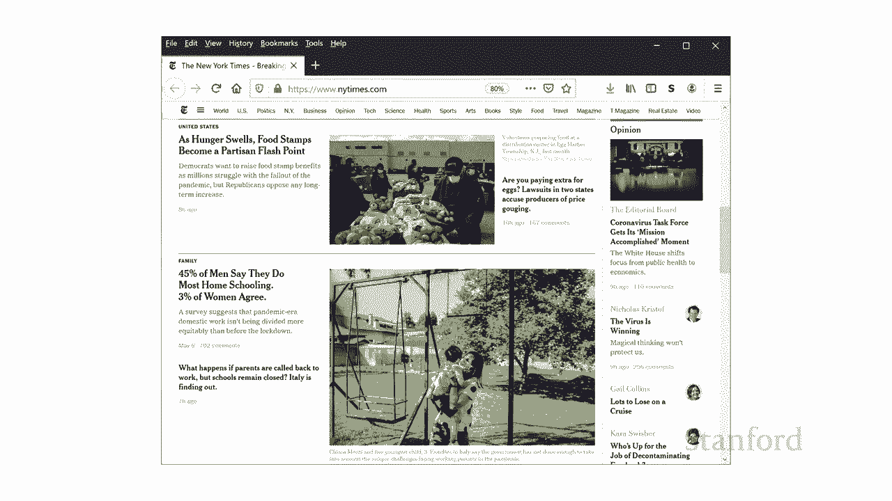

## 字体选择

为网站做出的关键设计选择之一是字体的使用。我们将讨论三种基本字体选择。

以下是三种基本字体类型：

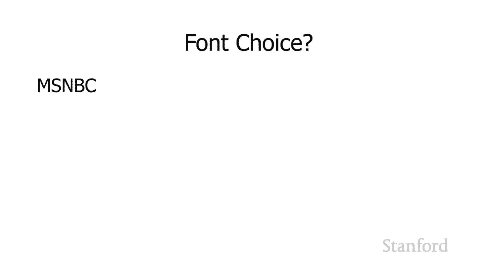

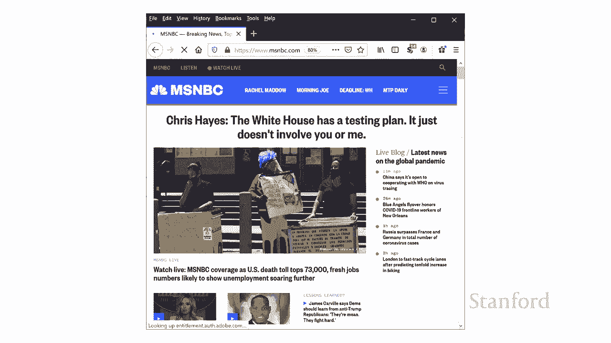

*   **无衬线字体**：例如 `Arial` 或 `Helvetica`。这种字体通常被认为是现代和乐观的。
*   **衬线字体**：例如 `Times New Roman` 或 `Georgia`。这种字体通常被认为是正式和权威的，有时也被视为老式。
*   **等宽字体**：例如 `Courier New`。这种字体中所有字符的宽度都相同。

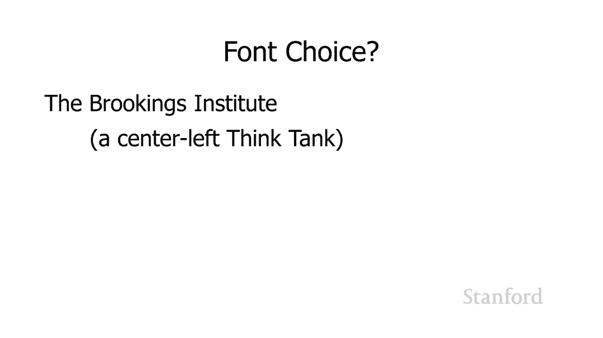

真实网页经常混合使用这些字体，但大多数网站主要使用无衬线或衬线字体，等宽字体则用于特殊目的。

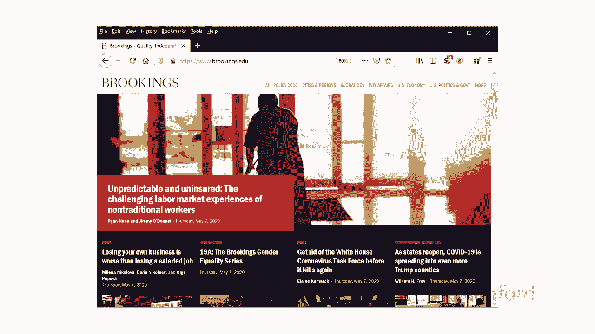

### 衬线字体 vs. 无衬线字体

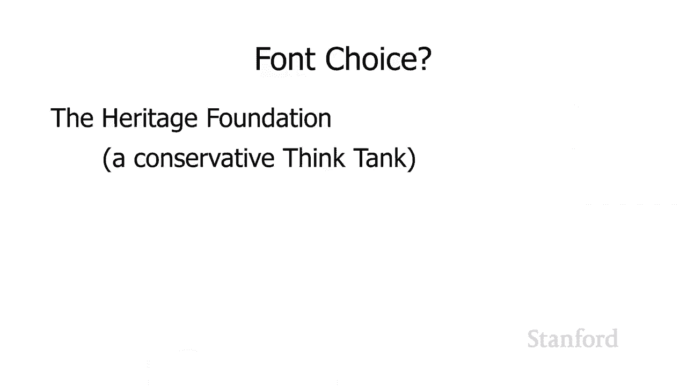

让我们确保每个人都了解衬线是什么以及无衬线是什么。在左边我有一个无衬线字体，在右边我有一个衬线字体。衬线是字母末端的小装饰线。

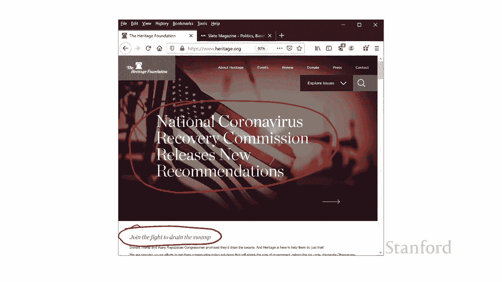

设计人员会告诉你，衬线字体是正式和权威的，尽管这种观点也认为衬线字体是老式的。而无衬线字体是乐观和现代的。你需要考虑你网站的目的是什么，以及在选择字体时你更喜欢现代感还是权威感。

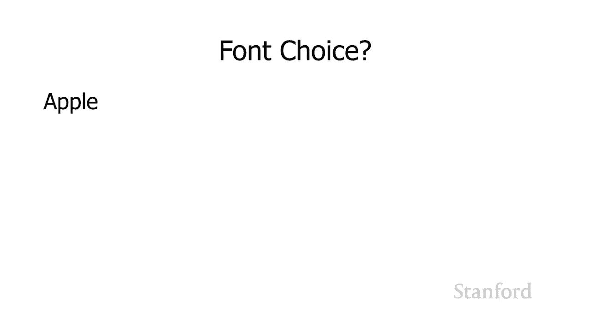

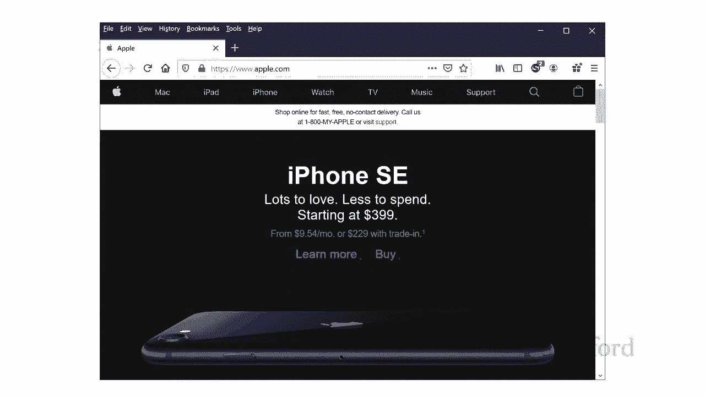

### 实际案例分析

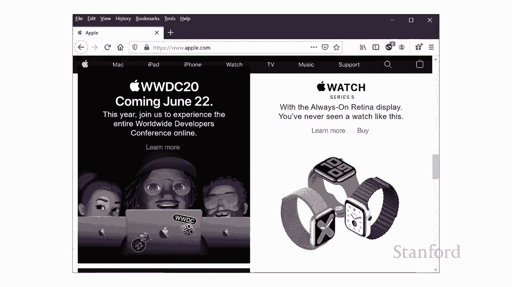

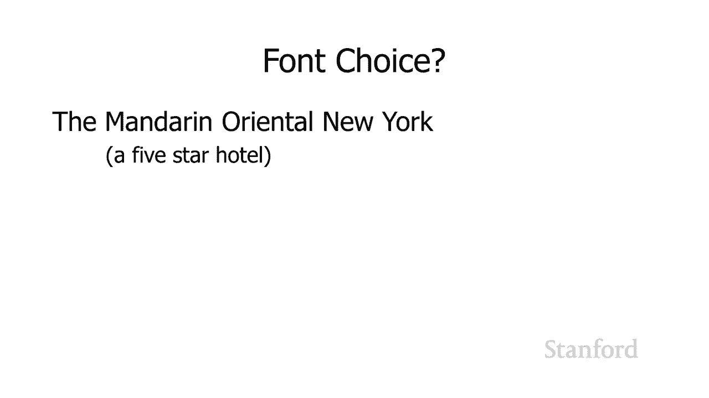

让我们看看一些实际的网站，看看他们选择了哪种字体。

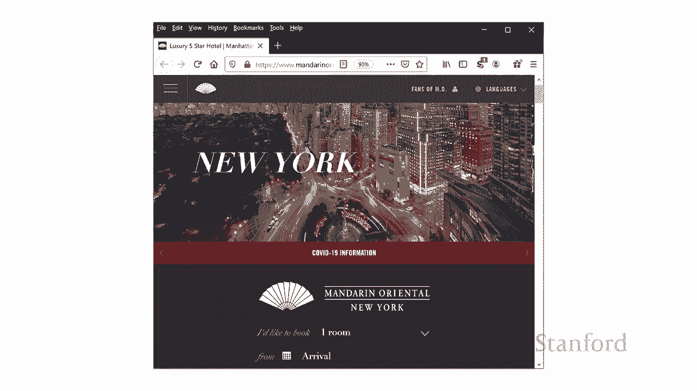

*   **《纽约时报》**：它可能更希望展现权威形象。观察其网站，标题和新闻报道主要使用衬线字体，而侧边栏和一些导航元素则使用无衬线字体。
*   **MSNBC**：它试图展现更现代的形象。其网页上可能完全没有衬线字体。
*   **苹果公司**：其页面完全没有衬线字体，他们想要当代、乐观的外观，对成为老派的权威正式形象不感兴趣。
*   **纽约 Mandarin Oriental 酒店**：作为一个五星级酒店，它主要使用衬线字体来体现正式和奢华感，尽管顶部导航栏使用了无衬线字体。

### 等宽字体

我提到了等宽字体，让我们谈谈等宽字体。因此，你的主要选择是衬线或无衬线字体。还有另一种字体叫等宽字体。实际上，等宽字体可以有衬线，也可以是等宽字体中的无衬线体。其特点是所有字符的宽度都相同。

这里我有一个非等宽字体，注意字母“i”比“m”窄得多，这被称为可变宽度或比例字体。相比之下，这是一个等宽字体，在底部有“miwim”，你可以看到那里的“i”比非等宽字体要宽得多。如果我们在这里反转字母，我们肯定可以看到这一点。

等宽字体背后的基本思想是所有字符的宽度都相同。等宽字体通常用于表示程序代码或计算机输出。例如，在 Visual Studio Code 等代码编辑器中，默认设置会使用某种等宽字体，这会让所有代码排列得更整齐。

---

## 配色方案

我们的下一个主题是选择配色方案。要选择配色方案，我们实际上需要更多地了解色彩理论。

### 色彩模型：RGB 与 HSB

我们一直在使用红色、绿色和蓝色（RGB）模型，而 RGB 是计算机显示器实际创建颜色的方式。但这是考虑颜色的其他方法，其中之一是色相、饱和度、亮度（HSB）方案，这就是我们将要使用的方案。

*   **色相**：你可以将色相视为彩虹的颜色，即色谱的颜色。
*   **饱和度**：除了选择色调，我还可以改变饱和度。左边是完全饱和，最右边几乎没有饱和度。如果我把饱和度降得足够低，最终会得到白色。
*   **亮度**：我还可以控制亮度。在最左边，我有最大亮度，然后光线越来越少，在最右边我没有亮度。

所以我建议，RGB 是电脑显示器实际生成颜色的方式，而 HSB 是人们经常用来确定他们的配色方案应该是什么的方案。

### 单色配色方案

基于我们目前所知，一种可能的配色方案是只需选择一种色调，然后通过降低饱和度或增加/降低亮度来改变颜色。这被称为**单色配色方案**。这当然有效，它看起来不会很糟糕，但也可能看起来不那么令人兴奋。

### 使用色轮

我们想了解一下如何选择色调。通常，我们会使用所谓的**色轮**来选择色调。让我们创建一个色轮。我将从我们的三基色开始。记住，在计算机上我们使用的是加色，所以三基色是红、绿、蓝。然后我要做的是混合颜色。我要把红色和蓝色混合得到紫色，将绿色与红色混合得到黄色，将绿色与蓝色混合得到青色。通过将每种颜色与其最近的邻居混合，我们得到了六种颜色的色轮。然后我可以再做一次，获得12色色轮。事实上，Adobe Photoshop 等绘画程序内置了色轮，通过不断混合颜色，我们可以得到连续的颜色范围。

### 创建配色方案

可以使用色轮创建多种不同的配色方案。

*   **互补色**：最简单的配色方案选择是互补色。我们在色轮的一侧取一种颜色，然后选择在色轮正对面的颜色。例如，蓝色和黄色。许多大学（如加州大学系统）就使用蓝色和黄色的变体作为校色。
*   **分裂互补色**：如果你想要两种以上的颜色，你可以使用分裂互补方案。在色轮的一侧取一种颜色，在另一侧选择两种相邻的颜色。
*   **三色系**：或者你可以使用三色配色方案，其中所有三种颜色在色轮上的距离相等。
*   **类似色**：或者你可以使用类似的配色方案，其中你选择的颜色在色轮上彼此接近。

---

## 布局与导航

我想提到的最后一件事是布局和导航问题。在创建网页时，尽量确保你对人们将如何浏览你的网站有一个清晰的想法。

### 提供清晰的导航

在任何一个页面上，提供一个关于网站上其他可用内容的清晰感。正如我之前提到的，如果你有一个成功的网站，你会让人们深度链接到你的网页。所以，你的任何一个网页都应该让访问那个特定页面的人清楚，你的网站上还有很多其他可用的东西。你应该让它非常清楚如何进入主页，并让他们了解你网站的其他部分。

### 保持一致性与避免死胡同

提供一致的导航方案。这样，用户从一个页面转到下一个页面时，不必每次都思考应该点击什么去下一个地方。而且，要确保没有“死胡同”页面——即用户离开该页面的唯一方法是点击浏览器的后退按钮。如果有人最终链接到该页面，他们将无法找到通往你网站其余部分的方法。在我评分过的许多业余网站中，经常看到有网页但不清楚如何访问它，或者存在无法导航出去的页面，这是非常无用的。

---

## 总结 🎯

本节课中，我们一起学习了网站设计的核心要素。我们探讨了如何通过独特的徽标、恰当的字体选择、协调的配色方案以及清晰的布局与导航来塑造网站品牌。记住，好的设计不仅能吸引用户，还能让他们轻松地在你的网站中找到所需信息，并留下深刻印象。避免创建无法访问或无法离开的页面，始终从用户的角度思考导航的便利性。